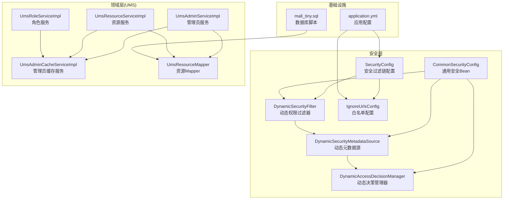
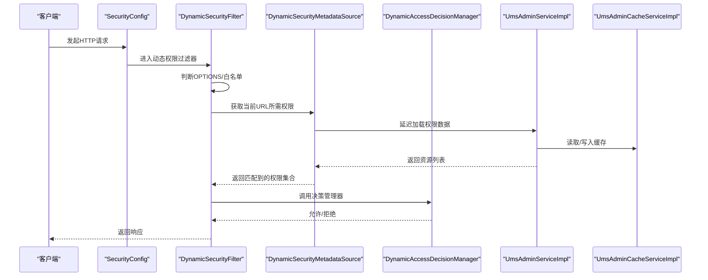
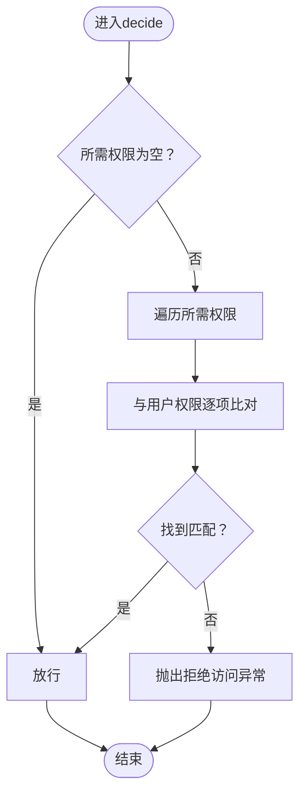
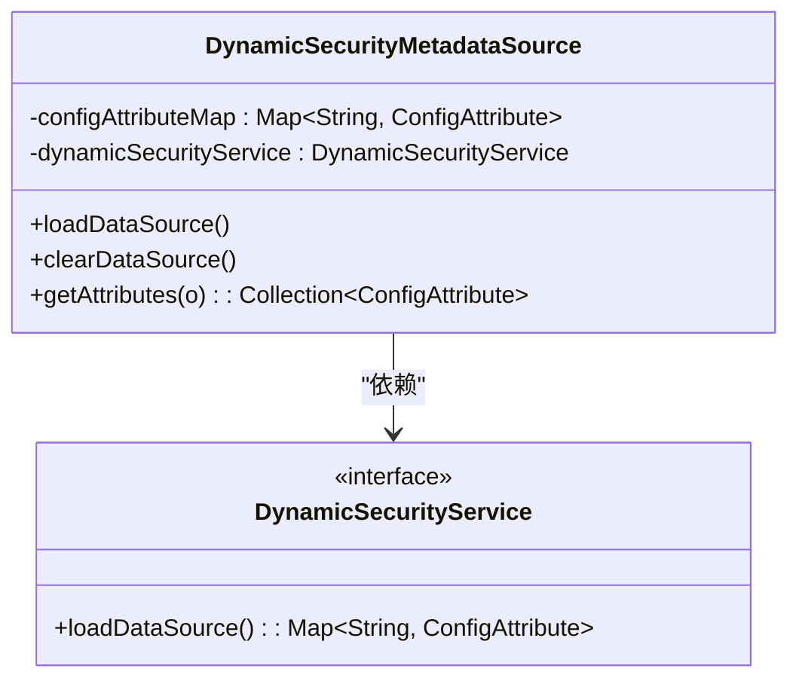
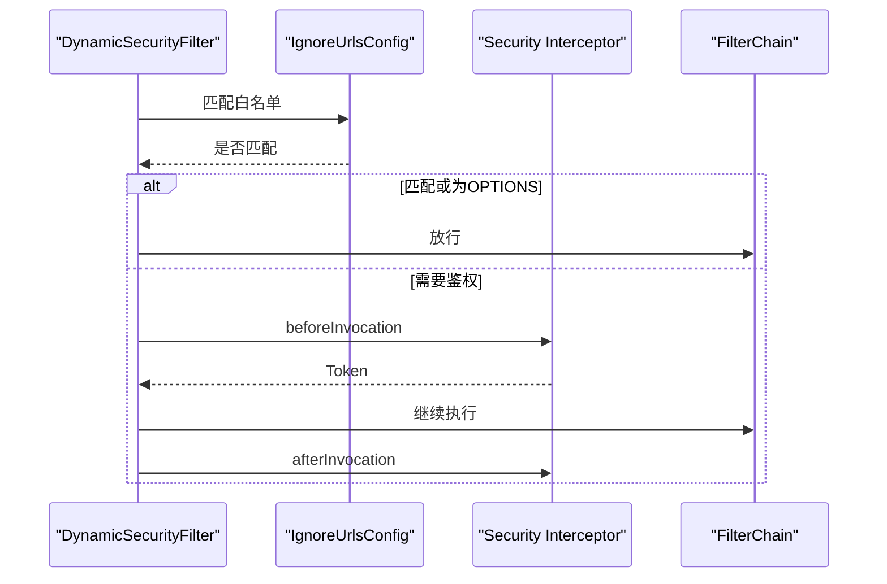
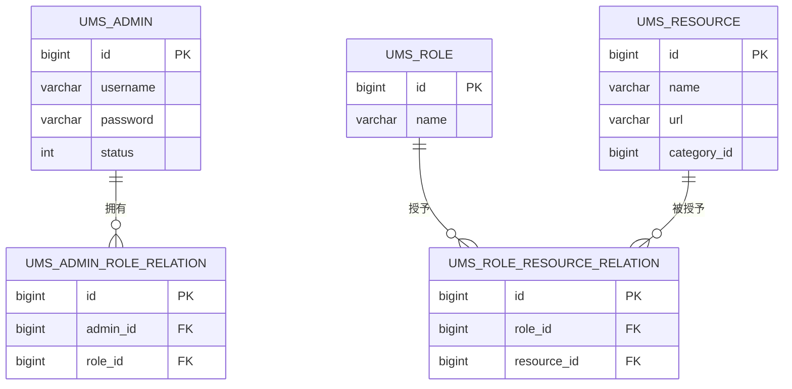
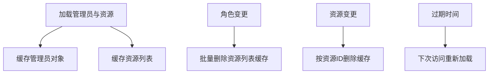
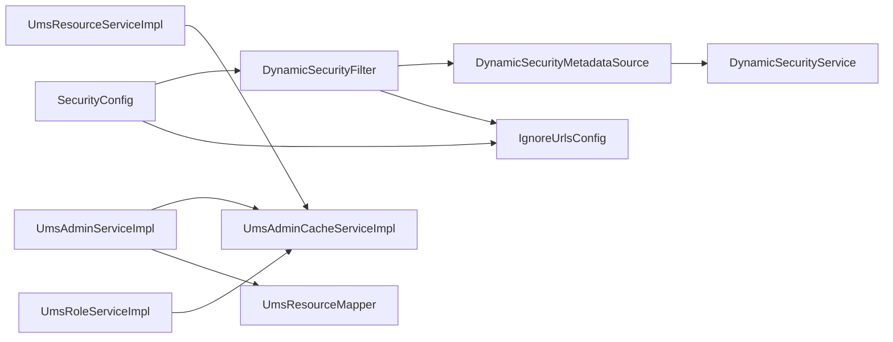

# 动态权限控制系统

<cite>
**本文引用的文件**
- [DynamicAccessDecisionManager.java](file://src/main/java/com/macro/mall/tiny/security/component/DynamicAccessDecisionManager.java)
- [DynamicSecurityMetadataSource.java](file://src/main/java/com/macro/mall/tiny/security/component/DynamicSecurityMetadataSource.java)
- [DynamicSecurityService.java](file://src/main/java/com/macro/mall/tiny/security/component/DynamicSecurityService.java)
- [DynamicSecurityFilter.java](file://src/main/java/com/macro/mall/tiny/security/component/DynamicSecurityFilter.java)
- [SecurityConfig.java](file://src/main/java/com/macro/mall/tiny/security/config/SecurityConfig.java)
- [CommonSecurityConfig.java](file://src/main/java/com/macro/mall/tiny/security/config/CommonSecurityConfig.java)
- [IgnoreUrlsConfig.java](file://src/main/java/com/macro/mall/tiny/security/config/IgnoreUrlsConfig.java)
- [UmsAdminCacheServiceImpl.java](file://src/main/java/com/macro/mall/tiny/modules/ums/service/impl/UmsAdminCacheServiceImpl.java)
- [UmsAdminServiceImpl.java](file://src/main/java/com/macro/mall/tiny/modules/ums/service/impl/UmsAdminServiceImpl.java)
- [UmsResourceServiceImpl.java](file://src/main/java/com/macro/mall/tiny/modules/ums/service/impl/UmsResourceServiceImpl.java)
- [UmsRoleServiceImpl.java](file://src/main/java/com/macro/mall/tiny/modules/ums/service/impl/UmsRoleServiceImpl.java)
- [UmsResourceMapper.java](file://src/main/java/com/macro/mall/tiny/modules/ums/mapper/UmsResourceMapper.java)
- [AdminUserDetails.java](file://src/main/java/com/macro/mall/tiny/domain/AdminUserDetails.java)
- [application.yml](file://src/main/resources/application.yml)
- [mall_tiny.sql](file://sql/mall_tiny.sql)
</cite>

## 目录
1. [引言](#引言)
2. [项目结构](#项目结构)
3. [核心组件](#核心组件)
4. [架构总览](#架构总览)
5. [详细组件分析](#详细组件分析)
6. [依赖分析](#依赖分析)
7. [性能考量](#性能考量)
8. [故障排查指南](#故障排查指南)
9. [结论](#结论)
10. [附录](#附录)

## 引言
本文件面向“动态权限控制系统”的设计与实现，围绕以下目标展开：  
- 动态权限决策管理器的工作原理与投票机制  
- 动态权限元数据源的实现与URL-权限映射、缓存策略  
- 动态安全服务在权限数据源配置、实时更新与变更通知中的作用  
- RBAC权限模型在系统中的具体实现（用户-角色-权限）  
- 动态权限配置流程、权限数据结构与评估示例  
- 权限缓存优化、性能考虑与权限冲突处理等高级主题  

## 项目结构
本项目采用分层+功能域划分的组织方式，安全相关能力集中在security包，权限数据与RBAC模型由ums模块承载，配置通过Spring Boot自动装配完成。

图表来源
- [SecurityConfig.java:46-84](file://src/main/java/com/macro/mall/tiny/security/config/SecurityConfig.java#L46-L84)
- [CommonSecurityConfig.java:49-61](file://src/main/java/com/macro/mall/tiny/security/config/CommonSecurityConfig.java#L49-L61)
- [DynamicSecurityFilter.java:23-82](file://src/main/java/com/macro/mall/tiny/security/component/DynamicSecurityFilter.java#L23-L82)
- [DynamicSecurityMetadataSource.java:18-64](file://src/main/java/com/macro/mall/tiny/security/component/DynamicSecurityMetadataSource.java#L18-L64)
- [DynamicAccessDecisionManager.java:18-51](file://src/main/java/com/macro/mall/tiny/security/component/DynamicAccessDecisionManager.java#L18-L51)
- [UmsAdminServiceImpl.java:257-271](file://src/main/java/com/macro/mall/tiny/modules/ums/service/impl/UmsAdminServiceImpl.java#L257-L271)
- [UmsAdminCacheServiceImpl.java:24-115](file://src/main/java/com/macro/mall/tiny/modules/ums/service/impl/UmsAdminCacheServiceImpl.java#L24-L115)
- [UmsResourceServiceImpl.java:27-100](file://src/main/java/com/macro/mall/tiny/modules/ums/service/impl/UmsResourceServiceImpl.java#L27-L100)
- [UmsRoleServiceImpl.java:27-116](file://src/main/java/com/macro/mall/tiny/modules/ums/service/impl/UmsRoleServiceImpl.java#L27-L116)
- [UmsResourceMapper.java:17-29](file://src/main/java/com/macro/mall/tiny/modules/ums/mapper/UmsResourceMapper.java#L17-L29)
- [application.yml:30-57](file://src/main/resources/application.yml#L30-L57)
- [mall_tiny.sql:136-200](file://sql/mall_tiny.sql#L136-L200)

章节来源
- [SecurityConfig.java:46-84](file://src/main/java/com/macro/mall/tiny/security/config/SecurityConfig.java#L46-L84)
- [application.yml:30-57](file://src/main/resources/application.yml#L30-L57)

## 核心组件
- 动态权限决策管理器：负责对访问请求进行权限判定，采用“存在性匹配”策略，只要用户权限集合中存在与所需权限一致的条目即放行。
- 动态权限元数据源：负责加载并维护“URL模式到权限标识”的映射，支持Ant风格路径匹配与懒加载。
- 动态安全过滤器：在请求进入时，先跳过OPTIONS与白名单，再委托给决策管理器进行鉴权。
- 安全配置：统一装配过滤链、白名单、JWT过滤器与动态权限过滤器。
- 管理员缓存服务：以Redis为后端，缓存管理员与资源列表，提供失效与批量失效能力。
- RBAC服务：管理员服务加载用户资源列表，资源服务与角色服务提供资源分配与角色-资源关系维护。

章节来源
- [DynamicAccessDecisionManager.java:18-51](file://src/main/java/com/macro/mall/tiny/security/component/DynamicAccessDecisionManager.java#L18-L51)
- [DynamicSecurityMetadataSource.java:18-64](file://src/main/java/com/macro/mall/tiny/security/component/DynamicSecurityMetadataSource.java#L18-L64)
- [DynamicSecurityFilter.java:23-82](file://src/main/java/com/macro/mall/tiny/security/component/DynamicSecurityFilter.java#L23-L82)
- [SecurityConfig.java:46-84](file://src/main/java/com/macro/mall/tiny/security/config/SecurityConfig.java#L46-L84)
- [UmsAdminCacheServiceImpl.java:24-115](file://src/main/java/com/macro/mall/tiny/modules/ums/service/impl/UmsAdminCacheServiceImpl.java#L24-L115)
- [UmsAdminServiceImpl.java:257-271](file://src/main/java/com/macro/mall/tiny/modules/ums/service/impl/UmsAdminServiceImpl.java#L257-L271)

## 架构总览
动态权限控制由“过滤链+元数据源+决策管理器+RBAC数据源”协同完成。请求到达时，先进行白名单与预检放行，随后根据URL匹配到所需权限，再与用户已授权权限集合进行比对，决定是否放行。

图表来源
- [SecurityConfig.java:79-82](file://src/main/java/com/macro/mall/tiny/security/config/SecurityConfig.java#L79-L82)
- [DynamicSecurityFilter.java:40-65](file://src/main/java/com/macro/mall/tiny/security/component/DynamicSecurityFilter.java#L40-L65)
- [DynamicSecurityMetadataSource.java:24-52](file://src/main/java/com/macro/mall/tiny/security/component/DynamicSecurityMetadataSource.java#L24-L52)
- [DynamicAccessDecisionManager.java:20-39](file://src/main/java/com/macro/mall/tiny/security/component/DynamicAccessDecisionManager.java#L20-L39)
- [UmsAdminServiceImpl.java:257-271](file://src/main/java/com/macro/mall/tiny/modules/ums/service/impl/UmsAdminServiceImpl.java#L257-L271)
- [UmsAdminCacheServiceImpl.java:93-114](file://src/main/java/com/macro/mall/tiny/modules/ums/service/impl/UmsAdminCacheServiceImpl.java#L93-L114)

## 详细组件分析

### 动态权限决策管理器
- 决策逻辑：当接口未配置资源时直接放行；否则遍历所需权限，与用户已授权权限逐一比对，若存在完全匹配则放行，否则抛出拒绝访问异常。
- 投票机制：采用“存在性投票”，无需计数或多数通过，简化了权限评估过程。
- 复杂度：对每个请求，最坏情况下需遍历所需权限集合与用户权限集合，整体复杂度O(m×n)，其中m为所需权限数，n为用户权限数。

图表来源
- [DynamicAccessDecisionManager.java:20-39](file://src/main/java/com/macro/mall/tiny/security/component/DynamicAccessDecisionManager.java#L20-L39)

章节来源
- [DynamicAccessDecisionManager.java:18-51](file://src/main/java/com/macro/mall/tiny/security/component/DynamicAccessDecisionManager.java#L18-L51)

### 动态权限元数据源
- 数据加载：首次使用时通过注入的动态安全服务加载“URL模式→权限标识”的映射表。
- URL匹配：使用Ant路径匹配器对当前请求路径进行模式匹配，收集所有匹配的权限。
- 缓存策略：在内存中维护静态映射表，首次访问时加载，后续请求直接命中；提供清理方法以便刷新。
- 复杂度：每次匹配需遍历映射表键集合并执行Ant匹配，复杂度近似O(k)，k为映射条目数。

图表来源
- [DynamicSecurityMetadataSource.java:18-64](file://src/main/java/com/macro/mall/tiny/security/component/DynamicSecurityMetadataSource.java#L18-L64)
- [DynamicSecurityService.java:11-16](file://src/main/java/com/macro/mall/tiny/security/component/DynamicSecurityService.java#L11-L16)

章节来源
- [DynamicSecurityMetadataSource.java:18-64](file://src/main/java/com/macro/mall/tiny/security/component/DynamicSecurityMetadataSource.java#L18-L64)

### 动态安全过滤器
- 白名单与预检：对OPTIONS请求与白名单路径直接放行。
- 过滤链集成：在JWT过滤器之后、安全拦截器之前加入动态权限过滤器。
- 调用流程：beforeInvocation前置处理，执行链路，finally后置处理，确保异常场景也能正确清理。

图表来源
- [DynamicSecurityFilter.java:40-65](file://src/main/java/com/macro/mall/tiny/security/component/DynamicSecurityFilter.java#L40-L65)
- [IgnoreUrlsConfig.java:17-21](file://src/main/java/com/macro/mall/tiny/security/config/IgnoreUrlsConfig.java#L17-L21)
- [SecurityConfig.java:79-82](file://src/main/java/com/macro/mall/tiny/security/config/SecurityConfig.java#L79-L82)

章节来源
- [DynamicSecurityFilter.java:23-82](file://src/main/java/com/macro/mall/tiny/security/component/DynamicSecurityFilter.java#L23-L82)
- [IgnoreUrlsConfig.java:17-21](file://src/main/java/com/macro/mall/tiny/security/config/IgnoreUrlsConfig.java#L17-L21)

### 安全配置与白名单
- 白名单配置：从配置文件读取，支持Ant风格路径。
- 过滤链：配置跨域、CSRF关闭、Session策略、异常处理器、JWT过滤器与动态权限过滤器。
- 动态权限开关：当存在动态安全服务时才启用动态权限过滤器。

章节来源
- [SecurityConfig.java:46-84](file://src/main/java/com/macro/mall/tiny/security/config/SecurityConfig.java#L46-L84)
- [application.yml:39-57](file://src/main/resources/application.yml#L39-L57)

### RBAC权限模型与数据流
- 用户-角色-权限：管理员通过角色间接获得资源权限；资源具备URL与名称等属性，最终形成权限标识集合。
- 权限来源：管理员服务加载资源列表，资源服务提供资源树与列表，角色服务维护角色-资源关系。
- 权限标识生成：用户详情类将资源的id:name、name、url转换为权限标识，供决策管理器比对。

图表来源
- [mall_tiny.sql:19-44](file://sql/mall_tiny.sql#L19-L44)
- [mall_tiny.sql:67-90](file://sql/mall_tiny.sql#L67-L90)
- [mall_tiny.sql:136-180](file://sql/mall_tiny.sql#L136-L180)

章节来源
- [UmsAdminServiceImpl.java:257-271](file://src/main/java/com/macro/mall/tiny/modules/ums/service/impl/UmsAdminServiceImpl.java#L257-L271)
- [UmsResourceServiceImpl.java:27-100](file://src/main/java/com/macro/mall/tiny/modules/ums/service/impl/UmsResourceServiceImpl.java#L27-L100)
- [UmsRoleServiceImpl.java:27-116](file://src/main/java/com/macro/mall/tiny/modules/ums/service/impl/UmsRoleServiceImpl.java#L27-L116)
- [AdminUserDetails.java:30-55](file://src/main/java/com/macro/mall/tiny/domain/AdminUserDetails.java#L30-L55)

### 权限数据加载与缓存策略
- 管理员缓存：以“数据库名:前缀:用户名”为键缓存管理员对象；以“数据库名:前缀:adminId”为键缓存资源列表。
- 批量失效：当角色、资源或角色ID集合发生变更时，按前缀批量删除相关缓存键，保证一致性。
- 缓存键与过期：配置文件定义Redis数据库、键前缀与通用过期时间。

图表来源
- [UmsAdminCacheServiceImpl.java:44-114](file://src/main/java/com/macro/mall/tiny/modules/ums/service/impl/UmsAdminCacheServiceImpl.java#L44-L114)
- [application.yml:30-37](file://src/main/resources/application.yml#L30-L37)

章节来源
- [UmsAdminCacheServiceImpl.java:24-115](file://src/main/java/com/macro/mall/tiny/modules/ums/service/impl/UmsAdminCacheServiceImpl.java#L24-L115)
- [application.yml:30-37](file://src/main/resources/application.yml#L30-L37)

### 动态权限配置流程与评估示例
- 配置流程
  - 在资源表中维护资源与URL映射，角色与资源建立关联，管理员与角色建立关联。
  - 系统启动或权限变更时，通过管理员服务加载资源列表，生成权限标识集合。
  - 动态元数据源将URL模式与权限标识映射，动态过滤器在请求阶段进行匹配与决策。
- 评估示例
  - 请求路径匹配到多个URL模式，收集到多个所需权限。
  - 用户权限集合包含与任一所需权限一致的条目，则放行；否则拒绝。

章节来源
- [UmsAdminServiceImpl.java:221-231](file://src/main/java/com/macro/mall/tiny/modules/ums/service/impl/UmsAdminServiceImpl.java#L221-L231)
- [UmsResourceMapper.java:19-29](file://src/main/java/com/macro/mall/tiny/modules/ums/mapper/UmsResourceMapper.java#L19-L29)
- [DynamicSecurityMetadataSource.java:34-52](file://src/main/java/com/macro/mall/tiny/security/component/DynamicSecurityMetadataSource.java#L34-L52)
- [DynamicAccessDecisionManager.java:20-39](file://src/main/java/com/macro/mall/tiny/security/component/DynamicAccessDecisionManager.java#L20-L39)

## 依赖分析
- 组件耦合
  - DynamicSecurityFilter依赖DynamicSecurityMetadataSource与IgnoreUrlsConfig。
  - DynamicSecurityMetadataSource依赖DynamicSecurityService。
  - SecurityConfig在运行时装配DynamicSecurityFilter与相关Bean。
  - UmsAdminServiceImpl依赖UmsAdminCacheService与UmsResourceMapper。
  - UmsResourceServiceImpl与UmsRoleServiceImpl依赖缓存服务以维持一致性。
- 外部依赖
  - Redis：用于管理员与资源列表缓存。
  - MyBatis-Plus：提供资源与角色-资源关系的查询能力。
  - Spring Security：提供决策管理器与过滤链框架。

图表来源
- [DynamicSecurityFilter.java:23-82](file://src/main/java/com/macro/mall/tiny/security/component/DynamicSecurityFilter.java#L23-L82)
- [DynamicSecurityMetadataSource.java:18-64](file://src/main/java/com/macro/mall/tiny/security/component/DynamicSecurityMetadataSource.java#L18-L64)
- [SecurityConfig.java:46-84](file://src/main/java/com/macro/mall/tiny/security/config/SecurityConfig.java#L46-L84)
- [UmsAdminServiceImpl.java:257-271](file://src/main/java/com/macro/mall/tiny/modules/ums/service/impl/UmsAdminServiceImpl.java#L257-L271)
- [UmsAdminCacheServiceImpl.java:24-115](file://src/main/java/com/macro/mall/tiny/modules/ums/service/impl/UmsAdminCacheServiceImpl.java#L24-L115)
- [UmsResourceServiceImpl.java:27-100](file://src/main/java/com/macro/mall/tiny/modules/ums/service/impl/UmsResourceServiceImpl.java#L27-L100)
- [UmsRoleServiceImpl.java:27-116](file://src/main/java/com/macro/mall/tiny/modules/ums/service/impl/UmsRoleServiceImpl.java#L27-L116)

## 性能考量
- 缓存命中率
  - 管理员与资源列表缓存显著降低数据库压力，建议合理设置过期时间与容量。
- 匹配复杂度
  - URL模式匹配与权限集合比对为线性复杂度，建议控制每请求所需权限数量与用户权限总数。
- 批量失效
  - 角色/资源变更时采用批量删除，避免单点删除带来的抖动。
- 并发与一致性
  - 缓存更新采用写后失效策略，结合幂等接口设计，减少并发冲突。

## 故障排查指南
- 无权限访问
  - 检查白名单配置与OPTIONS请求处理。
  - 确认动态权限过滤器是否正确加入过滤链。
  - 核对URL模式与资源URL是否匹配。
- 权限不生效
  - 确认管理员资源列表缓存是否被正确删除或过期。
  - 检查角色-资源关系是否正确维护。
- 登录后权限异常
  - 核对用户详情生成的权限标识（id:name、name、url）是否符合预期。
  - 检查密码编码与账户状态。

章节来源
- [DynamicSecurityFilter.java:40-65](file://src/main/java/com/macro/mall/tiny/security/component/DynamicSecurityFilter.java#L40-L65)
- [SecurityConfig.java:79-82](file://src/main/java/com/macro/mall/tiny/security/config/SecurityConfig.java#L79-L82)
- [UmsAdminCacheServiceImpl.java:44-114](file://src/main/java/com/macro/mall/tiny/modules/ums/service/impl/UmsAdminCacheServiceImpl.java#L44-L114)
- [UmsRoleServiceImpl.java:98-115](file://src/main/java/com/macro/mall/tiny/modules/ums/service/impl/UmsRoleServiceImpl.java#L98-L115)
- [AdminUserDetails.java:30-55](file://src/main/java/com/macro/mall/tiny/domain/AdminUserDetails.java#L30-L55)

## 结论
本系统通过“动态元数据源+决策管理器+RBAC数据源+缓存”的组合，实现了灵活、可扩展且高性能的动态权限控制。其核心优势在于：
- 动态加载与即时生效：权限变更后可通过缓存失效触发下一次加载，快速生效。
- 简洁高效的决策：采用存在性投票，避免复杂的计数与多数规则。
- 可观测与可维护：清晰的组件边界与配置化白名单，便于调试与运维。

## 附录
- 关键配置项
  - 白名单：secure.ignored.urls
  - JWT：jwt.tokenHeader、jwt.secret、jwt.expiration、jwt.tokenHead
  - Redis：redis.database、redis.key.admin、redis.key.resourceList、redis.expire.common
- 数据库表
  - ums_admin、ums_role、ums_resource、ums_admin_role_relation、ums_role_resource_relation

章节来源
- [application.yml:24-57](file://src/main/resources/application.yml#L24-L57)
- [mall_tiny.sql:19-44](file://sql/mall_tiny.sql#L19-L44)
- [mall_tiny.sql:67-90](file://sql/mall_tiny.sql#L67-L90)
- [mall_tiny.sql:136-180](file://sql/mall_tiny.sql#L136-L180)