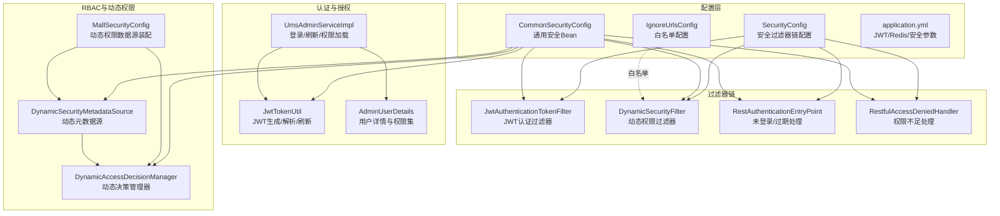
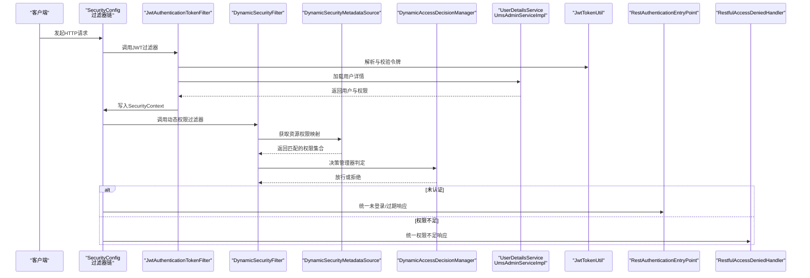
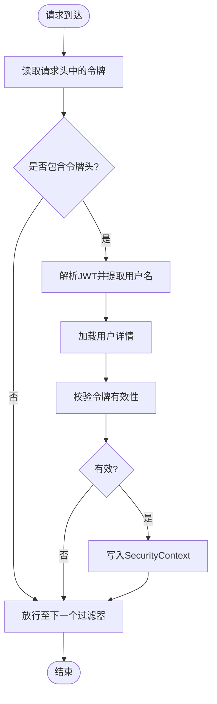
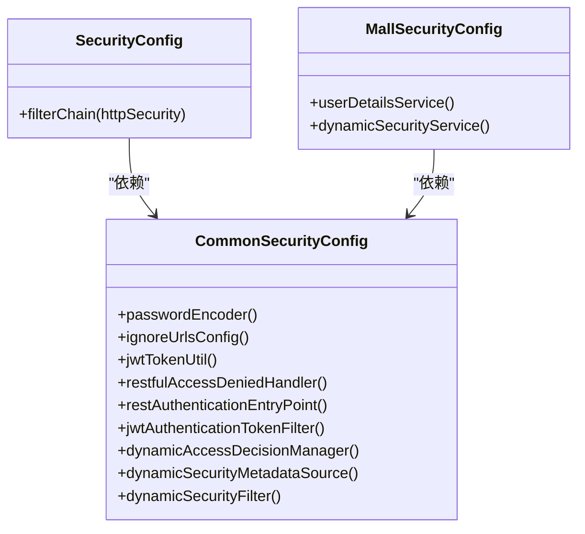
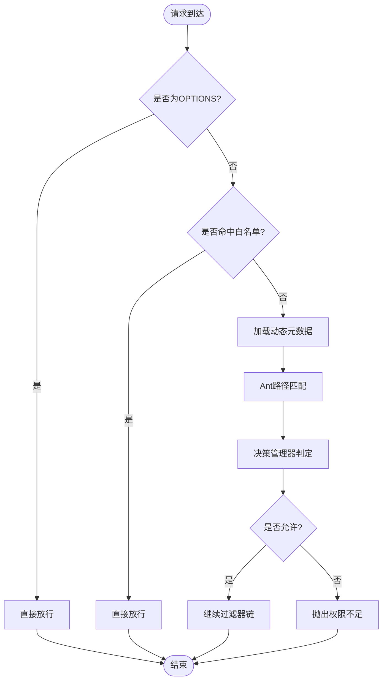
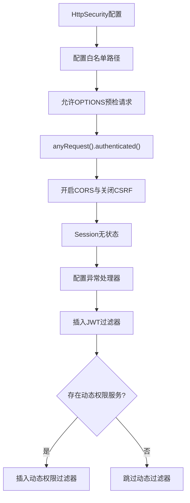
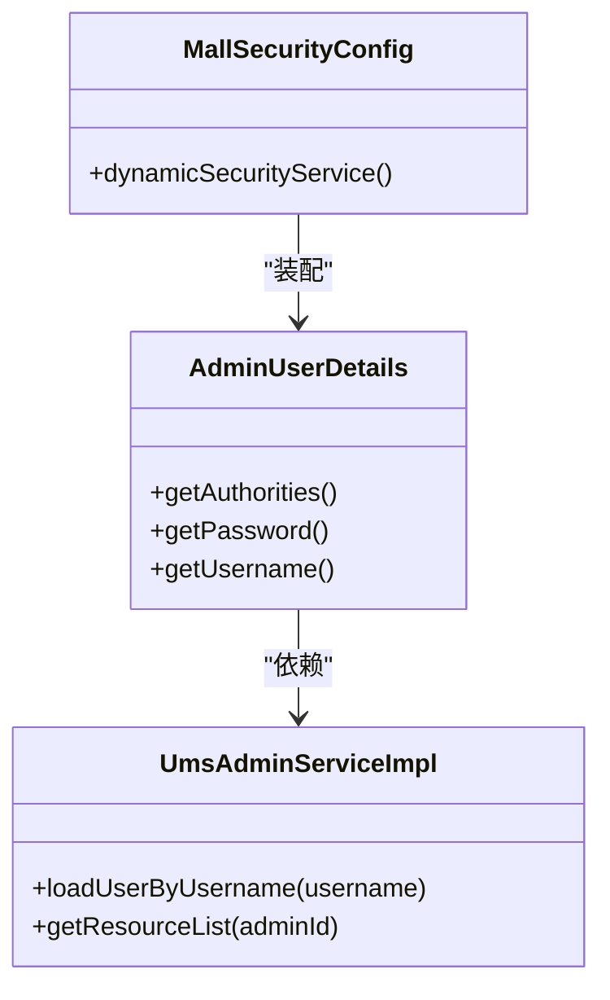
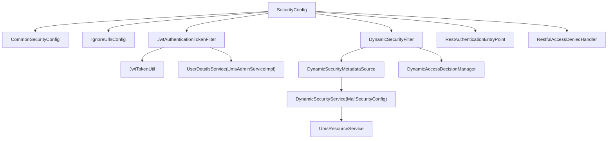

# 安全架构设计

<cite>
**本文引用的文件**
- [SecurityConfig.java](file://src/main/java/com/macro/mall/tiny/security/config/SecurityConfig.java)
- [CommonSecurityConfig.java](file://src/main/java/com/macro/mall/tiny/security/config/CommonSecurityConfig.java)
- [IgnoreUrlsConfig.java](file://src/main/java/com/macro/mall/tiny/security/config/IgnoreUrlsConfig.java)
- [JwtTokenUtil.java](file://src/main/java/com/macro/mall/tiny/security/util/JwtTokenUtil.java)
- [JwtAuthenticationTokenFilter.java](file://src/main/java/com/macro/mall/tiny/security/component/JwtAuthenticationTokenFilter.java)
- [DynamicSecurityFilter.java](file://src/main/java/com/macro/mall/tiny/security/component/DynamicSecurityFilter.java)
- [DynamicSecurityMetadataSource.java](file://src/main/java/com/macro/mall/tiny/security/component/DynamicSecurityMetadataSource.java)
- [DynamicAccessDecisionManager.java](file://src/main/java/com/macro/mall/tiny/security/component/DynamicAccessDecisionManager.java)
- [RestAuthenticationEntryPoint.java](file://src/main/java/com/macro/mall/tiny/security/component/RestAuthenticationEntryPoint.java)
- [RestfulAccessDeniedHandler.java](file://src/main/java/com/macro/mall/tiny/security/component/RestfulAccessDeniedHandler.java)
- [AdminUserDetails.java](file://src/main/java/com/macro/mall/tiny/domain/AdminUserDetails.java)
- [UmsAdminServiceImpl.java](file://src/main/java/com/macro/mall/tiny/modules/ums/service/impl/UmsAdminServiceImpl.java)
- [MallSecurityConfig.java](file://src/main/java/com/macro/mall/tiny/config/MallSecurityConfig.java)
- [application.yml](file://src/main/resources/application.yml)
</cite>

## 目录
1. [引言](#引言)
2. [项目结构](#项目结构)
3. [核心组件](#核心组件)
4. [架构总览](#架构总览)
5. [详细组件分析](#详细组件分析)
6. [依赖分析](#依赖分析)
7. [性能考虑](#性能考虑)
8. [故障排查指南](#故障排查指南)
9. [结论](#结论)
10. [附录](#附录)

## 引言
本文件面向Mall-Tiny项目的安全架构设计，系统化阐述基于JWT的认证授权机制、Spring Security集成方案、动态权限决策与元数据源实现、安全过滤器链配置（含跨域、静态资源放行、URL权限拦截）、RBAC权限模型的实现与动态分配、缓存策略、安全异常处理机制，并配套提供安全架构图、认证流程图与权限控制流程图，帮助开发者与运维人员快速理解与落地。

## 项目结构
Mall-Tiny的安全子系统主要由以下层次构成：
- 配置层：全局安全配置、通用安全Bean、忽略URL白名单配置
- 过滤器链：JWT认证过滤器、动态权限过滤器、异常处理器
- 认证与授权：JWT工具类、用户详情模型、管理员服务实现
- RBAC与动态权限：动态权限元数据源、决策管理器、动态权限服务

**图表来源**
- [SecurityConfig.java:46-84](file://src/main/java/com/macro/mall/tiny/security/config/SecurityConfig.java#L46-L84)
- [CommonSecurityConfig.java:18-61](file://src/main/java/com/macro/mall/tiny/security/config/CommonSecurityConfig.java#L18-L61)
- [IgnoreUrlsConfig.java:19](file://src/main/java/com/macro/mall/tiny/security/config/IgnoreUrlsConfig.java#L19)
- [application.yml:24-57](file://src/main/resources/application.yml#L24-L57)
- [JwtAuthenticationTokenFilter.java:26-58](file://src/main/java/com/macro/mall/tiny/security/component/JwtAuthenticationTokenFilter.java#L26-L58)
- [DynamicSecurityFilter.java:23-82](file://src/main/java/com/macro/mall/tiny/security/component/DynamicSecurityFilter.java#L23-L82)
- [RestAuthenticationEntryPoint.java:17-27](file://src/main/java/com/macro/mall/tiny/security/component/RestAuthenticationEntryPoint.java#L17-L27)
- [RestfulAccessDeniedHandler.java:17-29](file://src/main/java/com/macro/mall/tiny/security/component/RestfulAccessDeniedHandler.java#L17-L29)
- [JwtTokenUtil.java:28-171](file://src/main/java/com/macro/mall/tiny/security/util/JwtTokenUtil.java#L28-L171)
- [AdminUserDetails.java:17-87](file://src/main/java/com/macro/mall/tiny/domain/AdminUserDetails.java#L17-L87)
- [UmsAdminServiceImpl.java:48-272](file://src/main/java/com/macro/mall/tiny/modules/ums/service/impl/UmsAdminServiceImpl.java#L48-L272)
- [MallSecurityConfig.java:25-53](file://src/main/java/com/macro/mall/tiny/config/MallSecurityConfig.java#L25-L53)

**章节来源**
- [SecurityConfig.java:29-84](file://src/main/java/com/macro/mall/tiny/security/config/SecurityConfig.java#L29-L84)
- [CommonSecurityConfig.java:15-62](file://src/main/java/com/macro/mall/tiny/security/config/CommonSecurityConfig.java#L15-L62)
- [application.yml:1-57](file://src/main/resources/application.yml#L1-L57)

## 核心组件
- 安全过滤器链配置：集中定义白名单、跨域、CSRF关闭、Session无状态、异常处理器、JWT过滤器与动态权限过滤器的插入点。
- JWT认证过滤器：从请求头读取JWT，解析用户名，委托UserDetailsService加载用户，校验令牌有效性后写入SecurityContext。
- 动态权限过滤器：在每次请求前根据白名单与忽略路径放行，否则调用动态元数据源与决策管理器进行鉴权。
- 动态权限元数据源：按Ant风格路径匹配，从动态权限服务加载资源-权限映射。
- 动态决策管理器：对比访问所需权限与用户权限集合，决定放行或拒绝。
- JWT工具类：生成、解析、校验、刷新令牌，支持头部截取与过期判断。
- 用户详情模型：将资源列表转换为多种格式的权限标识，供授权使用。
- 管理员服务实现：登录、刷新令牌、角色与资源缓存维护、权限加载。
- 全局安全配置：装配UserDetailsService与动态权限服务，构建动态资源映射。
- 白名单配置：通过配置文件声明无需认证的路径集合。

**章节来源**
- [SecurityConfig.java:46-84](file://src/main/java/com/macro/mall/tiny/security/config/SecurityConfig.java#L46-L84)
- [JwtAuthenticationTokenFilter.java:26-58](file://src/main/java/com/macro/mall/tiny/security/component/JwtAuthenticationTokenFilter.java#L26-L58)
- [DynamicSecurityFilter.java:23-82](file://src/main/java/com/macro/mall/tiny/security/component/DynamicSecurityFilter.java#L23-L82)
- [DynamicSecurityMetadataSource.java:18-64](file://src/main/java/com/macro/mall/tiny/security/component/DynamicSecurityMetadataSource.java#L18-L64)
- [DynamicAccessDecisionManager.java:18-51](file://src/main/java/com/macro/mall/tiny/security/component/DynamicAccessDecisionManager.java#L18-L51)
- [JwtTokenUtil.java:28-171](file://src/main/java/com/macro/mall/tiny/security/util/JwtTokenUtil.java#L28-L171)
- [AdminUserDetails.java:17-87](file://src/main/java/com/macro/mall/tiny/domain/AdminUserDetails.java#L17-L87)
- [UmsAdminServiceImpl.java:48-272](file://src/main/java/com/macro/mall/tiny/modules/ums/service/impl/UmsAdminServiceImpl.java#L48-L272)
- [MallSecurityConfig.java:25-53](file://src/main/java/com/macro/mall/tiny/config/MallSecurityConfig.java#L25-L53)
- [IgnoreUrlsConfig.java:14-21](file://src/main/java/com/macro/mall/tiny/security/config/IgnoreUrlsConfig.java#L14-L21)

## 架构总览
下图展示Mall-Tiny安全架构的整体交互：请求进入过滤器链，先进行JWT认证，再进行动态权限校验，最后由异常处理器统一输出REST响应。

**图表来源**
- [SecurityConfig.java:46-84](file://src/main/java/com/macro/mall/tiny/security/config/SecurityConfig.java#L46-L84)
- [JwtAuthenticationTokenFilter.java:37-57](file://src/main/java/com/macro/mall/tiny/security/component/JwtAuthenticationTokenFilter.java#L37-L57)
- [DynamicSecurityFilter.java:39-66](file://src/main/java/com/macro/mall/tiny/security/component/DynamicSecurityFilter.java#L39-L66)
- [DynamicSecurityMetadataSource.java:34-52](file://src/main/java/com/macro/mall/tiny/security/component/DynamicSecurityMetadataSource.java#L34-L52)
- [DynamicAccessDecisionManager.java:20-39](file://src/main/java/com/macro/mall/tiny/security/component/DynamicAccessDecisionManager.java#L20-L39)
- [UmsAdminServiceImpl.java:257-265](file://src/main/java/com/macro/mall/tiny/modules/ums/service/impl/UmsAdminServiceImpl.java#L257-L265)
- [JwtTokenUtil.java:76-96](file://src/main/java/com/macro/mall/tiny/security/util/JwtTokenUtil.java#L76-L96)
- [RestAuthenticationEntryPoint.java:18-26](file://src/main/java/com/macro/mall/tiny/security/component/RestAuthenticationEntryPoint.java#L18-L26)
- [RestfulAccessDeniedHandler.java:18-28](file://src/main/java/com/macro/mall/tiny/security/component/RestfulAccessDeniedHandler.java#L18-L28)

## 详细组件分析

### JWT认证与授权机制
- 令牌生成：基于用户详情生成JWT，包含用户名与签发时间，使用对称密钥签名，设定过期时间。
- 令牌验证：解析JWT负载，校验签名与过期时间，确认用户名与UserDetails一致。
- 令牌刷新：在未过期且未频繁刷新的前提下，更新签发时间并重新生成令牌；过期或非法则拒绝刷新。
- 认证流程：JWT过滤器从请求头读取令牌，解析用户名，加载用户详情并校验，成功后将认证信息写入SecurityContext，后续授权可直接使用。

**图表来源**
- [JwtAuthenticationTokenFilter.java:37-57](file://src/main/java/com/macro/mall/tiny/security/component/JwtAuthenticationTokenFilter.java#L37-L57)
- [JwtTokenUtil.java:76-96](file://src/main/java/com/macro/mall/tiny/security/util/JwtTokenUtil.java#L76-L96)
- [UmsAdminServiceImpl.java:99-119](file://src/main/java/com/macro/mall/tiny/modules/ums/service/impl/UmsAdminServiceImpl.java#L99-L119)

**章节来源**
- [JwtTokenUtil.java:28-171](file://src/main/java/com/macro/mall/tiny/security/util/JwtTokenUtil.java#L28-L171)
- [JwtAuthenticationTokenFilter.java:26-58](file://src/main/java/com/macro/mall/tiny/security/component/JwtAuthenticationTokenFilter.java#L26-L58)
- [UmsAdminServiceImpl.java:99-151](file://src/main/java/com/macro/mall/tiny/modules/ums/service/impl/UmsAdminServiceImpl.java#L99-L151)

### Spring Security集成方案
- 过滤器链配置：通过SecurityFilterChain集中配置白名单、跨域、CSRF关闭、Session无状态、异常处理器与JWT过滤器插入点。
- 方法级安全：启用@PreAuthorize等注解，结合动态权限实现细粒度控制。
- 用户详情服务：通过MallSecurityConfig装配UserDetailsService，实现按用户名加载AdminUserDetails。

**图表来源**
- [SecurityConfig.java:29-84](file://src/main/java/com/macro/mall/tiny/security/config/SecurityConfig.java#L29-L84)
- [CommonSecurityConfig.java:18-61](file://src/main/java/com/macro/mall/tiny/security/config/CommonSecurityConfig.java#L18-L61)
- [MallSecurityConfig.java:25-53](file://src/main/java/com/macro/mall/tiny/config/MallSecurityConfig.java#L25-L53)

**章节来源**
- [SecurityConfig.java:46-84](file://src/main/java/com/macro/mall/tiny/security/config/SecurityConfig.java#L46-L84)
- [CommonSecurityConfig.java:18-61](file://src/main/java/com/macro/mall/tiny/security/config/CommonSecurityConfig.java#L18-L61)
- [MallSecurityConfig.java:33-52](file://src/main/java/com/macro/mall/tiny/config/MallSecurityConfig.java#L33-L52)

### 动态权限决策管理器与元数据源
- 动态权限元数据源：启动时加载所有资源到内存映射，请求到来时按Ant路径匹配返回所需权限集合。
- 动态决策管理器：遍历所需权限，若与用户任一权限匹配即放行，否则抛出权限不足异常。
- 动态权限过滤器：在每个请求前执行白名单与忽略路径放行逻辑，随后调用beforeInvocation触发鉴权。

**图表来源**
- [DynamicSecurityFilter.java:39-66](file://src/main/java/com/macro/mall/tiny/security/component/DynamicSecurityFilter.java#L39-L66)
- [DynamicSecurityMetadataSource.java:24-52](file://src/main/java/com/macro/mall/tiny/security/component/DynamicSecurityMetadataSource.java#L24-L52)
- [DynamicAccessDecisionManager.java:20-39](file://src/main/java/com/macro/mall/tiny/security/component/DynamicAccessDecisionManager.java#L20-L39)

**章节来源**
- [DynamicSecurityFilter.java:19-82](file://src/main/java/com/macro/mall/tiny/security/component/DynamicSecurityFilter.java#L19-L82)
- [DynamicSecurityMetadataSource.java:14-64](file://src/main/java/com/macro/mall/tiny/security/component/DynamicSecurityMetadataSource.java#L14-L64)
- [DynamicAccessDecisionManager.java:14-51](file://src/main/java/com/macro/mall/tiny/security/component/DynamicAccessDecisionManager.java#L14-L51)

### 安全过滤器链配置
- 白名单资源路径：通过配置文件声明无需认证的路径集合，如Swagger、静态资源、登录注册等。
- 跨域与预检：允许OPTIONS预检请求直接放行，启用CORS支持。
- CSRF关闭与Session无状态：关闭CSRF，设置SessionCreationPolicy.STATELESS以适配JWT。
- 异常处理：未登录/过期与权限不足分别由自定义EntryPoint与AccessDeniedHandler统一输出JSON响应。

**图表来源**
- [SecurityConfig.java:46-84](file://src/main/java/com/macro/mall/tiny/security/config/SecurityConfig.java#L46-L84)
- [application.yml:38-57](file://src/main/resources/application.yml#L38-L57)

**章节来源**
- [SecurityConfig.java:46-84](file://src/main/java/com/macro/mall/tiny/security/config/SecurityConfig.java#L46-L84)
- [application.yml:38-57](file://src/main/resources/application.yml#L38-L57)

### RBAC权限模型与动态分配
- 角色-资源关系：管理员通过角色关联资源，资源具备URL与名称属性。
- 权限表示：AdminUserDetails将资源转换为多种权限标识（id:name、name、url），满足不同场景需求。
- 动态权限映射：MallSecurityConfig从资源服务加载所有资源，构建“URL->资源标识”的映射，供动态元数据源使用。
- 缓存策略：管理员与资源列表缓存于Redis，降低数据库压力并提升响应速度。

**图表来源**
- [AdminUserDetails.java:29-55](file://src/main/java/com/macro/mall/tiny/domain/AdminUserDetails.java#L29-L55)
- [UmsAdminServiceImpl.java:257-265](file://src/main/java/com/macro/mall/tiny/modules/ums/service/impl/UmsAdminServiceImpl.java#L257-L265)
- [MallSecurityConfig.java:40-52](file://src/main/java/com/macro/mall/tiny/config/MallSecurityConfig.java#L40-L52)

**章节来源**
- [AdminUserDetails.java:17-87](file://src/main/java/com/macro/mall/tiny/domain/AdminUserDetails.java#L17-L87)
- [UmsAdminServiceImpl.java:220-231](file://src/main/java/com/macro/mall/tiny/modules/ums/service/impl/UmsAdminServiceImpl.java#L220-L231)
- [MallSecurityConfig.java:40-52](file://src/main/java/com/macro/mall/tiny/config/MallSecurityConfig.java#L40-L52)

### 安全异常处理机制
- 未登录/登录过期：统一返回JSON，包含未授权提示与异常消息。
- 权限不足：统一返回JSON，包含禁止访问提示与异常消息。
- 处理器注入：通过SecurityConfig与CommonSecurityConfig装配，确保异常发生时统一拦截与输出。

**章节来源**
- [RestAuthenticationEntryPoint.java:17-27](file://src/main/java/com/macro/mall/tiny/security/component/RestAuthenticationEntryPoint.java#L17-L27)
- [RestfulAccessDeniedHandler.java:17-29](file://src/main/java/com/macro/mall/tiny/security/component/RestfulAccessDeniedHandler.java#L17-L29)
- [SecurityConfig.java:36-44](file://src/main/java/com/macro/mall/tiny/security/config/SecurityConfig.java#L36-L44)
- [CommonSecurityConfig.java:33-41](file://src/main/java/com/macro/mall/tiny/security/config/CommonSecurityConfig.java#L33-L41)

## 依赖分析
- 组件耦合：SecurityConfig依赖IgnoreUrlsConfig、异常处理器与过滤器；JwtAuthenticationTokenFilter依赖JwtTokenUtil与UserDetailsService；动态权限链路依赖DynamicSecurityService与MallSecurityConfig。
- 外部依赖：JWT工具依赖对称密钥与过期时间配置；动态权限依赖资源服务与Redis缓存。
- 循环依赖规避：通过分层配置与条件化装配避免循环依赖问题。

**图表来源**
- [SecurityConfig.java:33-44](file://src/main/java/com/macro/mall/tiny/security/config/SecurityConfig.java#L33-L44)
- [CommonSecurityConfig.java:18-61](file://src/main/java/com/macro/mall/tiny/security/config/CommonSecurityConfig.java#L18-L61)
- [JwtAuthenticationTokenFilter.java:28-35](file://src/main/java/com/macro/mall/tiny/security/component/JwtAuthenticationTokenFilter.java#L28-L35)
- [DynamicSecurityFilter.java:25-33](file://src/main/java/com/macro/mall/tiny/security/component/DynamicSecurityFilter.java#L25-L33)
- [DynamicSecurityMetadataSource.java:21-27](file://src/main/java/com/macro/mall/tiny/security/component/DynamicSecurityMetadataSource.java#L21-L27)
- [MallSecurityConfig.java:40-52](file://src/main/java/com/macro/mall/tiny/config/MallSecurityConfig.java#L40-L52)

**章节来源**
- [SecurityConfig.java:33-44](file://src/main/java/com/macro/mall/tiny/security/config/SecurityConfig.java#L33-L44)
- [MallSecurityConfig.java:40-52](file://src/main/java/com/macro/mall/tiny/config/MallSecurityConfig.java#L40-L52)

## 性能考虑
- 无状态会话：关闭Session并采用JWT，减少服务器端状态存储开销。
- 缓存策略：管理员与资源列表缓存于Redis，降低数据库访问频率；动态权限映射加载于启动阶段，运行时按需匹配。
- 过滤器链优化：白名单与OPTIONS预检快速放行，减少不必要的鉴权开销。
- 密钥与过期时间：合理设置JWT过期时间与刷新窗口，平衡安全性与用户体验。

## 故障排查指南
- 登录失败：检查密码编码器匹配与账户状态；查看登录日志记录。
- 令牌无效：确认请求头中携带正确的令牌头与格式；检查密钥与过期时间配置。
- 权限不足：核对资源URL与权限映射；确认用户角色与资源绑定关系。
- 动态权限不生效：检查动态权限服务是否正确加载资源映射；确认路径匹配规则与Ant风格表达式。

**章节来源**
- [UmsAdminServiceImpl.java:99-119](file://src/main/java/com/macro/mall/tiny/modules/ums/service/impl/UmsAdminServiceImpl.java#L99-L119)
- [JwtTokenUtil.java:93-96](file://src/main/java/com/macro/mall/tiny/security/util/JwtTokenUtil.java#L93-L96)
- [DynamicAccessDecisionManager.java:20-39](file://src/main/java/com/macro/mall/tiny/security/component/DynamicAccessDecisionManager.java#L20-L39)
- [MallSecurityConfig.java:40-52](file://src/main/java/com/macro/mall/tiny/config/MallSecurityConfig.java#L40-L52)

## 结论
Mall-Tiny的安全架构以JWT为核心，结合Spring Security的过滤器链与动态权限机制，实现了灵活、可扩展的认证授权体系。通过RBAC模型与资源-权限映射，配合Redis缓存与白名单策略，既保证了系统的安全性，又兼顾了性能与可维护性。建议在生产环境中进一步完善令牌刷新策略、审计日志与动态权限变更的热更新机制。

## 附录
- 配置要点：JWT密钥、过期时间、令牌头、白名单路径、Redis键空间与过期时间。
- 接口规范：登录返回JWT，请求携带Authorization头；权限不足与未登录统一JSON响应。

**章节来源**
- [application.yml:24-57](file://src/main/resources/application.yml#L24-L57)
- [RestAuthenticationEntryPoint.java:18-26](file://src/main/java/com/macro/mall/tiny/security/component/RestAuthenticationEntryPoint.java#L18-L26)
- [RestfulAccessDeniedHandler.java:18-28](file://src/main/java/com/macro/mall/tiny/security/component/RestfulAccessDeniedHandler.java#L18-L28)