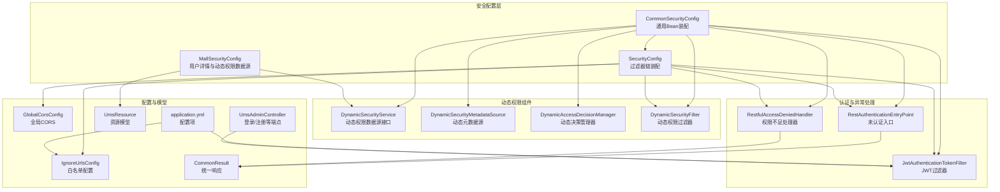
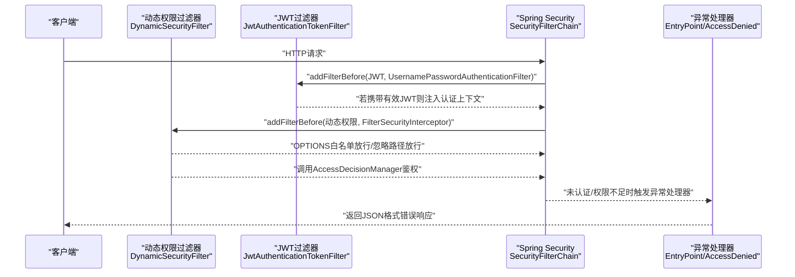
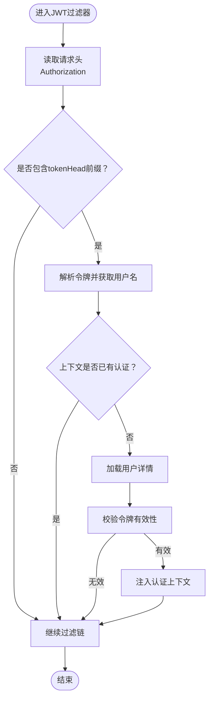
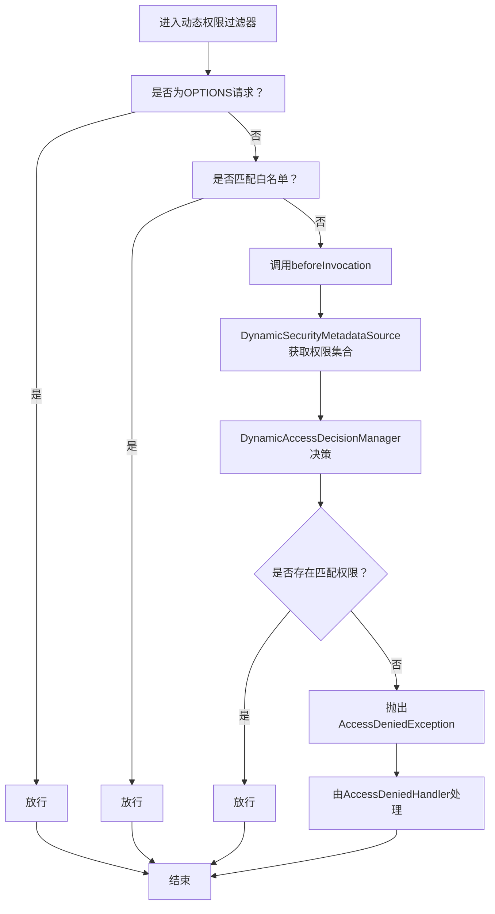
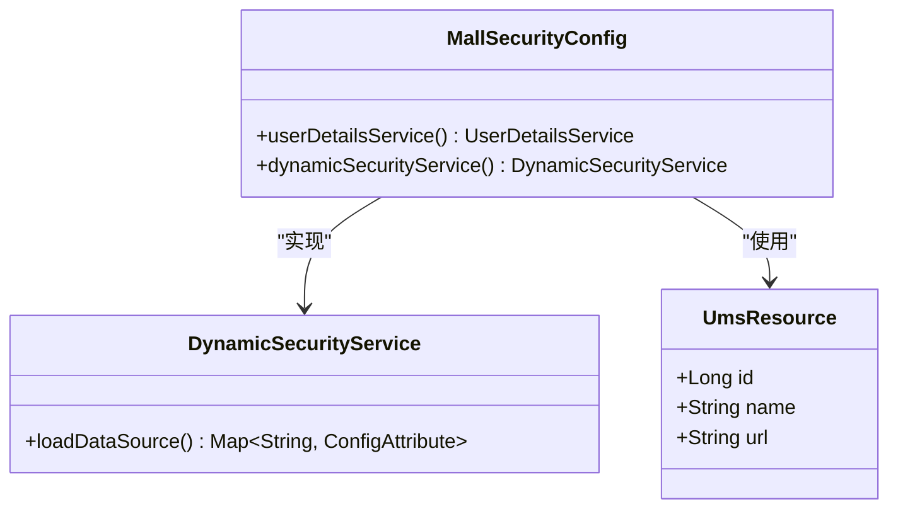
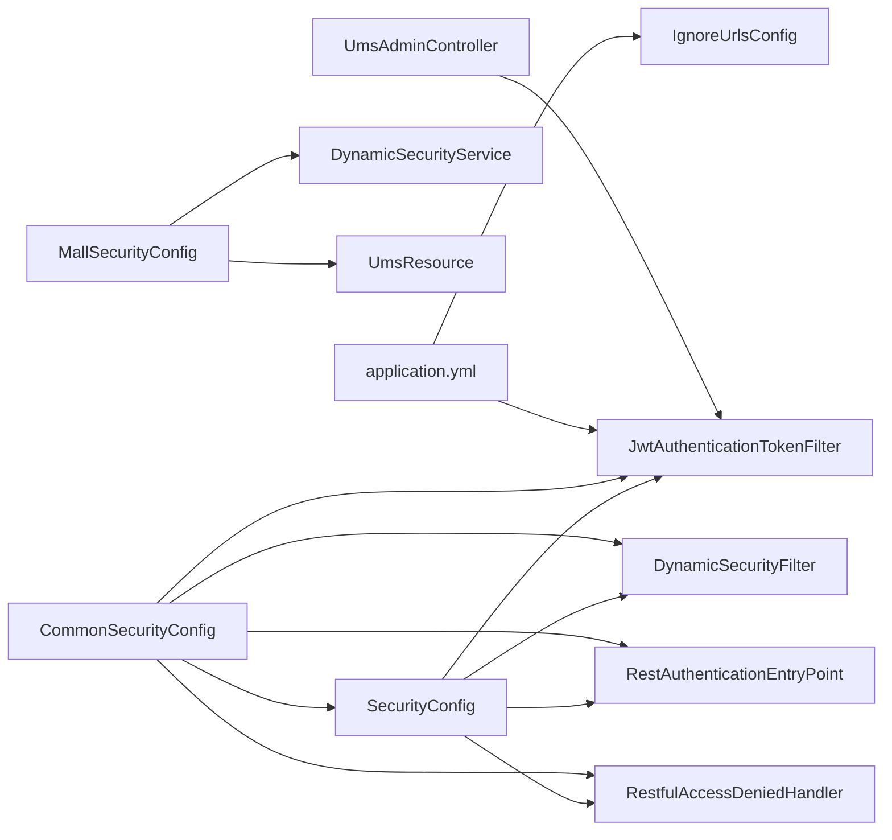

# 安全过滤器链配置

<cite>
**本文引用的文件**
- [MallSecurityConfig.java](file://src/main/java/com/macro/mall/tiny/config/MallSecurityConfig.java)
- [SecurityConfig.java](file://src/main/java/com/macro/mall/tiny/security/config/SecurityConfig.java)
- [CommonSecurityConfig.java](file://src/main/java/com/macro/mall/tiny/security/config/CommonSecurityConfig.java)
- [IgnoreUrlsConfig.java](file://src/main/java/com/macro/mall/tiny/security/config/IgnoreUrlsConfig.java)
- [DynamicSecurityFilter.java](file://src/main/java/com/macro/mall/tiny/security/component/DynamicSecurityFilter.java)
- [JwtAuthenticationTokenFilter.java](file://src/main/java/com/macro/mall/tiny/security/component/JwtAuthenticationTokenFilter.java)
- [RestAuthenticationEntryPoint.java](file://src/main/java/com/macro/mall/tiny/security/component/RestAuthenticationEntryPoint.java)
- [RestfulAccessDeniedHandler.java](file://src/main/java/com/macro/mall/tiny/security/component/RestfulAccessDeniedHandler.java)
- [DynamicSecurityService.java](file://src/main/java/com/macro/mall/tiny/security/component/DynamicSecurityService.java)
- [DynamicSecurityMetadataSource.java](file://src/main/java/com/macro/mall/tiny/security/component/DynamicSecurityMetadataSource.java)
- [DynamicAccessDecisionManager.java](file://src/main/java/com/macro/mall/tiny/security/component/DynamicAccessDecisionManager.java)
- [GlobalCorsConfig.java](file://src/main/java/com/macro/mall/tiny/config/GlobalCorsConfig.java)
- [application.yml](file://src/main/resources/application.yml)
- [UmsAdminController.java](file://src/main/java/com/macro/mall/tiny/modules/ums/controller/UmsAdminController.java)
- [UmsResource.java](file://src/main/java/com/macro/mall/tiny/modules/ums/model/UmsResource.java)
- [CommonResult.java](file://src/main/java/com/macro/mall/tiny/common/api/CommonResult.java)
</cite>

## 目录
1. [简介](#简介)
2. [项目结构](#项目结构)
3. [核心组件](#核心组件)
4. [架构总览](#架构总览)
5. [详细组件分析](#详细组件分析)
6. [依赖分析](#依赖分析)
7. [性能考虑](#性能考虑)
8. [故障排查指南](#故障排查指南)
9. [结论](#结论)
10. [附录](#附录)

## 简介
本文件系统性梳理并解释本项目的Spring Security过滤器链配置与工作机制，重点覆盖以下方面：
- 过滤器执行顺序与拦截规则
- 动态安全过滤器的URL匹配、权限检查与异常处理
- RESTful认证入口点与访问拒绝处理器的行为
- 跨域配置（含CORS头、预检请求处理与安全策略）
- 静态资源放行、敏感URL保护与自定义过滤器添加
- 提供过滤器链配置示例、URL权限映射表与安全策略配置清单

## 项目结构
围绕安全配置的关键目录与文件如下：
- 安全配置层：SecurityConfig、CommonSecurityConfig、MallSecurityConfig
- 动态权限组件：DynamicSecurityService、DynamicSecurityMetadataSource、DynamicAccessDecisionManager、DynamicSecurityFilter
- 认证与异常处理：JwtAuthenticationTokenFilter、RestAuthenticationEntryPoint、RestfulAccessDeniedHandler
- 白名单与跨域：IgnoreUrlsConfig、GlobalCorsConfig
- 配置与模型：application.yml、UmsResource、UmsAdminController、CommonResult

图表来源
- [SecurityConfig.java:46-84](file://src/main/java/com/macro/mall/tiny/security/config/SecurityConfig.java#L46-L84)
- [CommonSecurityConfig.java:15-62](file://src/main/java/com/macro/mall/tiny/security/config/CommonSecurityConfig.java#L15-L62)
- [MallSecurityConfig.java:25-52](file://src/main/java/com/macro/mall/tiny/config/MallSecurityConfig.java#L25-L52)
- [DynamicSecurityFilter.java:23-82](file://src/main/java/com/macro/mall/tiny/security/component/DynamicSecurityFilter.java#L23-L82)
- [JwtAuthenticationTokenFilter.java:26-58](file://src/main/java/com/macro/mall/tiny/security/component/JwtAuthenticationTokenFilter.java#L26-L58)
- [RestAuthenticationEntryPoint.java:17-27](file://src/main/java/com/macro/mall/tiny/security/component/RestAuthenticationEntryPoint.java#L17-L27)
- [RestfulAccessDeniedHandler.java:17-29](file://src/main/java/com/macro/mall/tiny/security/component/RestfulAccessDeniedHandler.java#L17-L29)
- [IgnoreUrlsConfig.java:14-21](file://src/main/java/com/macro/mall/tiny/security/config/IgnoreUrlsConfig.java#L14-L21)
- [GlobalCorsConfig.java:14-36](file://src/main/java/com/macro/mall/tiny/config/GlobalCorsConfig.java#L14-L36)
- [application.yml:38-57](file://src/main/resources/application.yml#L38-L57)
- [UmsResource.java:21-49](file://src/main/java/com/macro/mall/tiny/modules/ums/model/UmsResource.java#L21-L49)
- [UmsAdminController.java:43-200](file://src/main/java/com/macro/mall/tiny/modules/ums/controller/UmsAdminController.java#L43-L200)
- [CommonResult.java:7-125](file://src/main/java/com/macro/mall/tiny/common/api/CommonResult.java#L7-L125)

章节来源
- [SecurityConfig.java:29-85](file://src/main/java/com/macro/mall/tiny/security/config/SecurityConfig.java#L29-L85)
- [CommonSecurityConfig.java:15-62](file://src/main/java/com/macro/mall/tiny/security/config/CommonSecurityConfig.java#L15-L62)
- [MallSecurityConfig.java:25-52](file://src/main/java/com/macro/mall/tiny/config/MallSecurityConfig.java#L25-L52)
- [application.yml:38-57](file://src/main/resources/application.yml#L38-L57)

## 核心组件
- 过滤器链装配：通过SecurityConfig集中配置白名单、CORS、CSRF、会话策略、异常处理器与过滤器顺序。
- JWT认证过滤器：JwtAuthenticationTokenFilter负责从请求头解析JWT并注入认证上下文。
- 动态权限过滤器：DynamicSecurityFilter结合DynamicSecurityMetadataSource与DynamicAccessDecisionManager实现基于URL的动态权限控制。
- 异常处理器：RestAuthenticationEntryPoint与RestfulAccessDeniedHandler分别处理未认证与权限不足的REST响应。
- 白名单配置：IgnoreUrlsConfig从配置文件加载无需保护的路径集合。
- 全局CORS：GlobalCorsConfig提供跨域头与预检请求处理。

章节来源
- [SecurityConfig.java:46-84](file://src/main/java/com/macro/mall/tiny/security/config/SecurityConfig.java#L46-L84)
- [JwtAuthenticationTokenFilter.java:26-58](file://src/main/java/com/macro/mall/tiny/security/component/JwtAuthenticationTokenFilter.java#L26-L58)
- [DynamicSecurityFilter.java:23-82](file://src/main/java/com/macro/mall/tiny/security/component/DynamicSecurityFilter.java#L23-L82)
- [RestAuthenticationEntryPoint.java:17-27](file://src/main/java/com/macro/mall/tiny/security/component/RestAuthenticationEntryPoint.java#L17-L27)
- [RestfulAccessDeniedHandler.java:17-29](file://src/main/java/com/macro/mall/tiny/security/component/RestfulAccessDeniedHandler.java#L17-L29)
- [IgnoreUrlsConfig.java:14-21](file://src/main/java/com/macro/mall/tiny/security/config/IgnoreUrlsConfig.java#L14-L21)
- [GlobalCorsConfig.java:14-36](file://src/main/java/com/macro/mall/tiny/config/GlobalCorsConfig.java#L14-L36)

## 架构总览
下图展示过滤器链在请求生命周期中的位置与交互：

图表来源
- [SecurityConfig.java:76-82](file://src/main/java/com/macro/mall/tiny/security/config/SecurityConfig.java#L76-L82)
- [JwtAuthenticationTokenFilter.java:38-57](file://src/main/java/com/macro/mall/tiny/security/component/JwtAuthenticationTokenFilter.java#L38-L57)
- [DynamicSecurityFilter.java:40-66](file://src/main/java/com/macro/mall/tiny/security/component/DynamicSecurityFilter.java#L40-L66)
- [RestAuthenticationEntryPoint.java:18-26](file://src/main/java/com/macro/mall/tiny/security/component/RestAuthenticationEntryPoint.java#L18-L26)
- [RestfulAccessDeniedHandler.java:18-28](file://src/main/java/com/macro/mall/tiny/security/component/RestfulAccessDeniedHandler.java#L18-L28)

## 详细组件分析

### 过滤器链装配与执行顺序
- 白名单与静态资源放行：通过IgnoreUrlsConfig读取配置文件中的urls列表，使用antMatchers逐条permitAll；同时显式允许OPTIONS预检请求。
- 会话策略：禁用CSRF，采用STATELESS无状态会话。
- CORS：启用CORS支持，结合全局CORS过滤器与HttpSecurity的cors()配置协同工作。
- 异常处理：配置authenticationEntryPoint与accessDeniedHandler，分别处理未认证与权限不足。
- 过滤器顺序：
  - 在UsernamePasswordAuthenticationFilter之前添加JWT过滤器，用于提前解析令牌并建立认证上下文。
  - 在FilterSecurityInterceptor之前添加动态权限过滤器，用于在进入权限表达式评估前做细粒度控制。

章节来源
- [SecurityConfig.java:46-84](file://src/main/java/com/macro/mall/tiny/security/config/SecurityConfig.java#L46-L84)
- [application.yml:38-57](file://src/main/resources/application.yml#L38-L57)

### JWT认证过滤器
- 请求头解析：从配置的tokenHeader中提取以tokenHead为前缀的令牌。
- 用户信息加载：通过UserDetailsService加载用户详情。
- 认证上下文注入：当令牌有效且上下文为空时，构造UsernamePasswordAuthenticationToken并写入SecurityContextHolder。
- 继续过滤链：无论是否认证成功，均继续执行后续过滤器。

图表来源
- [JwtAuthenticationTokenFilter.java:38-57](file://src/main/java/com/macro/mall/tiny/security/component/JwtAuthenticationTokenFilter.java#L38-L57)
- [application.yml:24-28](file://src/main/resources/application.yml#L24-L28)

章节来源
- [JwtAuthenticationTokenFilter.java:26-58](file://src/main/java/com/macro/mall/tiny/security/component/JwtAuthenticationTokenFilter.java#L26-L58)
- [application.yml:24-28](file://src/main/resources/application.yml#L24-L28)

### 动态安全过滤器与权限决策
- 白名单与预检放行：对OPTIONS请求与IgnoreUrlsConfig中配置的路径直接放行。
- 动态元数据源：DynamicSecurityMetadataSource根据当前访问路径匹配Ant风格的资源模式，返回所需权限集合。
- 决策管理器：DynamicAccessDecisionManager遍历所需权限与用户权限，若存在匹配则放行，否则抛出AccessDeniedException。
- 异常处理：由RestfulAccessDeniedHandler统一输出JSON格式的错误响应。

图表来源
- [DynamicSecurityFilter.java:40-66](file://src/main/java/com/macro/mall/tiny/security/component/DynamicSecurityFilter.java#L40-L66)
- [DynamicSecurityMetadataSource.java:34-52](file://src/main/java/com/macro/mall/tiny/security/component/DynamicSecurityMetadataSource.java#L34-L52)
- [DynamicAccessDecisionManager.java:20-39](file://src/main/java/com/macro/mall/tiny/security/component/DynamicAccessDecisionManager.java#L20-L39)
- [RestfulAccessDeniedHandler.java:18-28](file://src/main/java/com/macro/mall/tiny/security/component/RestfulAccessDeniedHandler.java#L18-L28)

章节来源
- [DynamicSecurityFilter.java:23-82](file://src/main/java/com/macro/mall/tiny/security/component/DynamicSecurityFilter.java#L23-L82)
- [DynamicSecurityMetadataSource.java:18-64](file://src/main/java/com/macro/mall/tiny/security/component/DynamicSecurityMetadataSource.java#L18-L64)
- [DynamicAccessDecisionManager.java:18-51](file://src/main/java/com/macro/mall/tiny/security/component/DynamicAccessDecisionManager.java#L18-L51)

### RESTful认证入口点与访问拒绝处理器
- 未认证入口点：RestAuthenticationEntryPoint在用户未认证或登录过期时，设置必要的CORS头并返回JSON格式的未认证响应。
- 权限不足处理器：RestfulAccessDeniedHandler在权限不足时返回JSON格式的禁止访问响应。

章节来源
- [RestAuthenticationEntryPoint.java:17-27](file://src/main/java/com/macro/mall/tiny/security/component/RestAuthenticationEntryPoint.java#L17-L27)
- [RestfulAccessDeniedHandler.java:17-29](file://src/main/java/com/macro/mall/tiny/security/component/RestfulAccessDeniedHandler.java#L17-L29)
- [CommonResult.java:89-99](file://src/main/java/com/macro/mall/tiny/common/api/CommonResult.java#L89-L99)

### 跨域配置
- 全局CORS：GlobalCorsConfig提供CORS过滤器，允许任意来源、头部与方法，并允许携带凭证。
- HttpSecurity CORS：SecurityConfig中启用.cors()以配合全局配置。
- 预检请求：通过白名单配置显式允许OPTIONS请求，避免重复处理。

章节来源
- [GlobalCorsConfig.java:19-35](file://src/main/java/com/macro/mall/tiny/config/GlobalCorsConfig.java#L19-L35)
- [SecurityConfig.java:62-64](file://src/main/java/com/macro/mall/tiny/security/config/SecurityConfig.java#L62-L64)
- [SecurityConfig.java:54-56](file://src/main/java/com/macro/mall/tiny/security/config/SecurityConfig.java#L54-L56)

### 静态资源放行、敏感URL保护与自定义过滤器添加
- 静态资源放行：IgnoreUrlsConfig从secure.ignored.urls读取白名单，包括Swagger、静态文件、favicon、监控与登录注册等端点。
- 敏感URL保护：除白名单外的所有请求均需认证；动态权限进一步限制到具体资源URL。
- 自定义过滤器：通过SecurityFilterChain在指定位置插入JWT过滤器与动态权限过滤器。

章节来源
- [application.yml:38-57](file://src/main/resources/application.yml#L38-L57)
- [SecurityConfig.java:50-56](file://src/main/java/com/macro/mall/tiny/security/config/SecurityConfig.java#L50-L56)
- [SecurityConfig.java:76-82](file://src/main/java/com/macro/mall/tiny/security/config/SecurityConfig.java#L76-L82)

### 动态权限数据源与URL映射
- 数据源接口：DynamicSecurityService定义loadDataSource方法，返回“资源ANT模式 -> 权限属性”的映射。
- 实现方式：MallSecurityConfig中通过UmsResourceService加载资源列表，构建URL到权限属性的映射。
- 权限属性格式：由资源ID与名称组合形成，供决策管理器比对。

图表来源
- [DynamicSecurityService.java:11-16](file://src/main/java/com/macro/mall/tiny/security/component/DynamicSecurityService.java#L11-L16)
- [MallSecurityConfig.java:40-52](file://src/main/java/com/macro/mall/tiny/config/MallSecurityConfig.java#L40-L52)
- [UmsResource.java:21-49](file://src/main/java/com/macro/mall/tiny/modules/ums/model/UmsResource.java#L21-L49)

章节来源
- [MallSecurityConfig.java:40-52](file://src/main/java/com/macro/mall/tiny/config/MallSecurityConfig.java#L40-L52)
- [UmsResource.java:21-49](file://src/main/java/com/macro/mall/tiny/modules/ums/model/UmsResource.java#L21-L49)

## 依赖分析
- 组件耦合与职责分离：
  - SecurityConfig集中装配过滤器链与异常处理，降低各组件间直接耦合。
  - CommonSecurityConfig提供通用Bean，便于复用与替换。
  - MallSecurityConfig专注于用户详情与动态权限数据源，保持领域内聚。
- 外部依赖：
  - JWT工具：JwtTokenUtil（在Bean定义中可见）。
  - 配置：application.yml中的jwt与secure.ignored.urls。
  - 控制器：UmsAdminController提供登录、注册等端点，受过滤器链保护。

图表来源
- [SecurityConfig.java:29-85](file://src/main/java/com/macro/mall/tiny/security/config/SecurityConfig.java#L29-L85)
- [CommonSecurityConfig.java:15-62](file://src/main/java/com/macro/mall/tiny/security/config/CommonSecurityConfig.java#L15-L62)
- [MallSecurityConfig.java:25-52](file://src/main/java/com/macro/mall/tiny/config/MallSecurityConfig.java#L25-L52)
- [application.yml:24-28](file://src/main/resources/application.yml#L24-L28)
- [UmsAdminController.java:43-200](file://src/main/java/com/macro/mall/tiny/modules/ums/controller/UmsAdminController.java#L43-L200)

章节来源
- [SecurityConfig.java:29-85](file://src/main/java/com/macro/mall/tiny/security/config/SecurityConfig.java#L29-L85)
- [CommonSecurityConfig.java:15-62](file://src/main/java/com/macro/mall/tiny/security/config/CommonSecurityConfig.java#L15-L62)
- [MallSecurityConfig.java:25-52](file://src/main/java/com/macro/mall/tiny/config/MallSecurityConfig.java#L25-L52)
- [application.yml:24-28](file://src/main/resources/application.yml#L24-L28)

## 性能考虑
- 动态权限元数据加载：DynamicSecurityMetadataSource在首次访问时加载数据源，建议在应用启动阶段预热或结合缓存策略减少运行时开销。
- 过滤器链顺序：将JWT过滤器置于UsernamePasswordAuthenticationFilter之前可尽早解析令牌，减少后续鉴权成本。
- 白名单命中：优先匹配白名单与OPTIONS请求，避免进入复杂鉴权逻辑。
- 无状态会话：STATELESS策略降低会话存储与并发问题。

## 故障排查指南
- 未认证返回JSON：
  - 确认请求头中Authorization是否包含正确的tokenHead前缀与有效令牌。
  - 检查RestAuthenticationEntryPoint是否被调用，查看响应头与JSON体。
- 权限不足返回JSON：
  - 确认用户角色与资源权限映射是否正确，检查DynamicAccessDecisionManager的决策逻辑。
  - 核对UmsResource.url与DynamicSecurityMetadataSource的匹配规则。
- CORS问题：
  - 确认GlobalCorsConfig与HttpSecurity的cors()均已启用。
  - 检查浏览器预检请求是否被白名单放行（OPTIONS）。
- 白名单不生效：
  - 检查application.yml中secure.ignored.urls配置是否正确，Ant路径是否匹配实际请求。

章节来源
- [RestAuthenticationEntryPoint.java:18-26](file://src/main/java/com/macro/mall/tiny/security/component/RestAuthenticationEntryPoint.java#L18-L26)
- [RestfulAccessDeniedHandler.java:18-28](file://src/main/java/com/macro/mall/tiny/security/component/RestfulAccessDeniedHandler.java#L18-L28)
- [application.yml:38-57](file://src/main/resources/application.yml#L38-L57)
- [GlobalCorsConfig.java:19-35](file://src/main/java/com/macro/mall/tiny/config/GlobalCorsConfig.java#L19-L35)

## 结论
本项目通过SecurityConfig集中装配过滤器链，结合JWT认证与动态权限控制，实现了RESTful场景下的细粒度安全策略。白名单与CORS配置保证了开发体验与跨域需求，异常处理器提供了统一的错误响应格式。整体设计遵循低耦合、高内聚原则，便于扩展与维护。

## 附录

### 过滤器链配置示例（步骤化）
- 启用CORS并禁用CSRF与会话：
  - 在SecurityConfig中启用.cors()与.disable() csrf与session。
- 添加JWT过滤器：
  - 使用.addFilterBefore(jwtAuthenticationTokenFilter, UsernamePasswordAuthenticationFilter.class)。
- 添加动态权限过滤器：
  - 使用.addFilterBefore(dynamicSecurityFilter, FilterSecurityInterceptor.class)。
- 配置白名单与OPTIONS：
  - 读取IgnoreUrlsConfig的urls列表并逐条permitAll；显式允许OPTIONS。
- 配置异常处理器：
  - 设置authenticationEntryPoint与accessDeniedHandler。

章节来源
- [SecurityConfig.java:62-82](file://src/main/java/com/macro/mall/tiny/security/config/SecurityConfig.java#L62-L82)
- [application.yml:38-57](file://src/main/resources/application.yml#L38-L57)

### URL权限映射表（示例）
- 登录/注册/忘记密码等公开端点：白名单放行
- Swagger静态资源：白名单放行
- 监控与运维端点：白名单放行
- 业务端点：需认证；动态权限进一步限制到具体资源URL

章节来源
- [application.yml:40-57](file://src/main/resources/application.yml#L40-L57)
- [UmsAdminController.java:167-196](file://src/main/java/com/macro/mall/tiny/modules/ums/controller/UmsAdminController.java#L167-L196)

### 安全策略配置清单
- JWT配置：
  - tokenHeader：请求头键名
  - tokenHead：令牌前缀
  - secret：密钥
  - expiration：过期时间
- 白名单配置：
  - secure.ignored.urls：无需保护的路径列表
- CORS配置：
  - 允许任意来源、头部、方法与凭证
- 会话与CSRF：
  - 禁用CSRF与STATELESS会话

章节来源
- [application.yml:24-28](file://src/main/resources/application.yml#L24-L28)
- [application.yml:38-57](file://src/main/resources/application.yml#L38-L57)
- [GlobalCorsConfig.java:19-35](file://src/main/java/com/macro/mall/tiny/config/GlobalCorsConfig.java#L19-L35)
- [SecurityConfig.java:66-70](file://src/main/java/com/macro/mall/tiny/security/config/SecurityConfig.java#L66-L70)