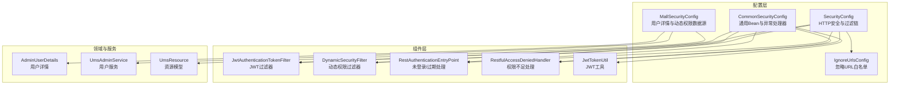
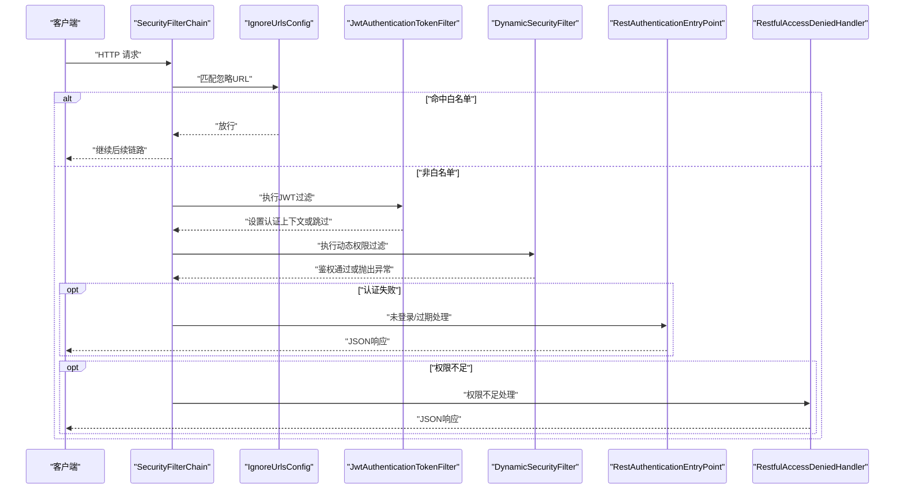
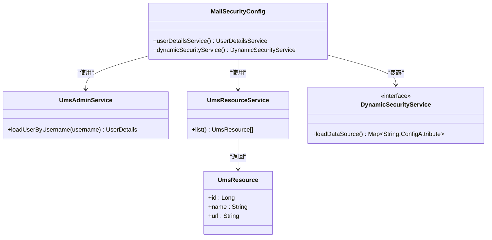
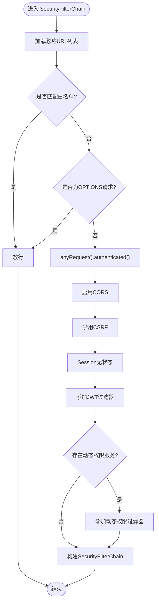
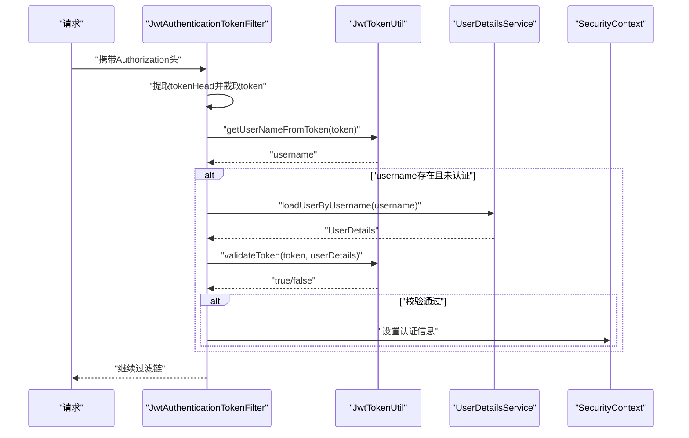
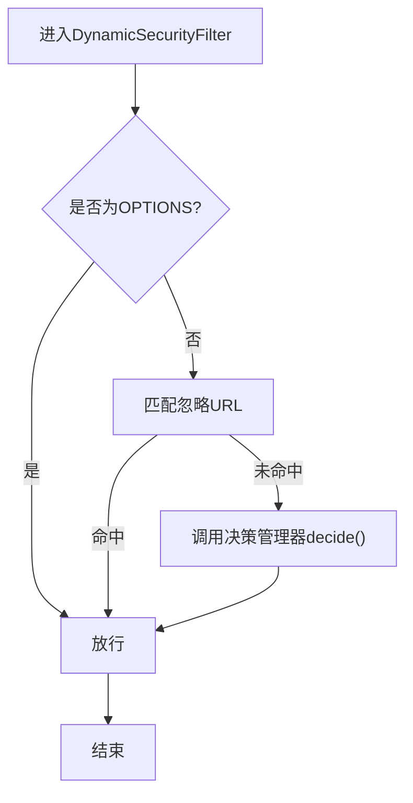
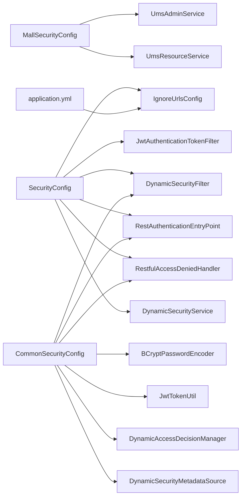

# 安全配置管理

<cite>
**本文引用的文件**
- [MallSecurityConfig.java](file://src/main/java/com/macro/mall/tiny/config/MallSecurityConfig.java)
- [SecurityConfig.java](file://src/main/java/com/macro/mall/tiny/security/config/SecurityConfig.java)
- [CommonSecurityConfig.java](file://src/main/java/com/macro/mall/tiny/security/config/CommonSecurityConfig.java)
- [IgnoreUrlsConfig.java](file://src/main/java/com/macro/mall/tiny/security/config/IgnoreUrlsConfig.java)
- [JwtAuthenticationTokenFilter.java](file://src/main/java/com/macro/mall/tiny/security/component/JwtAuthenticationTokenFilter.java)
- [DynamicSecurityService.java](file://src/main/java/com/macro/mall/tiny/security/component/DynamicSecurityService.java)
- [DynamicSecurityFilter.java](file://src/main/java/com/macro/mall/tiny/security/component/DynamicSecurityFilter.java)
- [RestAuthenticationEntryPoint.java](file://src/main/java/com/macro/mall/tiny/security/component/RestAuthenticationEntryPoint.java)
- [RestfulAccessDeniedHandler.java](file://src/main/java/com/macro/mall/tiny/security/component/RestfulAccessDeniedHandler.java)
- [JwtTokenUtil.java](file://src/main/java/com/macro/mall/tiny/security/util/JwtTokenUtil.java)
- [AdminUserDetails.java](file://src/main/java/com/macro/mall/tiny/domain/AdminUserDetails.java)
- [UmsAdminService.java](file://src/main/java/com/macro/mall/tiny/modules/ums/service/UmsAdminService.java)
- [UmsResource.java](file://src/main/java/com/macro/mall/tiny/modules/ums/model/UmsResource.java)
- [application.yml](file://src/main/resources/application.yml)
- [application-dev.yml](file://src/main/resources/application-dev.yml)
</cite>

## 目录
1. [简介](#简介)
2. [项目结构](#项目结构)
3. [核心组件](#核心组件)
4. [架构总览](#架构总览)
5. [详细组件分析](#详细组件分析)
6. [依赖分析](#依赖分析)
7. [性能考虑](#性能考虑)
8. [故障排查指南](#故障排查指南)
9. [结论](#结论)
10. [附录](#附录)

## 简介
本文件系统化梳理 Mall 的安全配置体系，围绕 MallSecurityConfig、SecurityConfig、CommonSecurityConfig、IgnoreUrlsConfig 四大配置类展开，详细说明用户详情服务、动态权限数据源、认证提供者、HTTP 安全策略、CSRF 与会话管理、密码编码器、CORS、忽略 URL 白名单等关键机制，并结合 JwtTokenUtil、JwtAuthenticationTokenFilter、动态权限过滤链路与异常处理器，形成从“配置—组件—流程—异常”的完整闭环。同时给出最佳实践、参数详解、常见问题与不同环境下的差异化配置建议。

## 项目结构
安全相关代码主要分布在以下位置：
- 配置层：config 下的 MallSecurityConfig、SecurityConfig、CommonSecurityConfig、IgnoreUrlsConfig
- 组件层：security/component 下的 JWT 过滤器、动态权限过滤器、异常处理器、工具类
- 领域模型与服务：domain 下的 AdminUserDetails，modules/ums 下的 UmsAdminService、UmsResource
- 配置文件：application.yml 及环境配置文件

图表来源
- [MallSecurityConfig.java:1-54](file://src/main/java/com/macro/mall/tiny/config/MallSecurityConfig.java#L1-L54)
- [SecurityConfig.java:1-86](file://src/main/java/com/macro/mall/tiny/security/config/SecurityConfig.java#L1-L86)
- [CommonSecurityConfig.java:1-63](file://src/main/java/com/macro/mall/tiny/security/config/CommonSecurityConfig.java#L1-L63)
- [IgnoreUrlsConfig.java:1-22](file://src/main/java/com/macro/mall/tiny/security/config/IgnoreUrlsConfig.java#L1-L22)
- [JwtAuthenticationTokenFilter.java:1-59](file://src/main/java/com/macro/mall/tiny/security/component/JwtAuthenticationTokenFilter.java#L1-L59)
- [DynamicSecurityFilter.java:1-83](file://src/main/java/com/macro/mall/tiny/security/component/DynamicSecurityFilter.java#L1-L83)
- [RestAuthenticationEntryPoint.java:1-28](file://src/main/java/com/macro/mall/tiny/security/component/RestAuthenticationEntryPoint.java#L1-L28)
- [RestfulAccessDeniedHandler.java:1-30](file://src/main/java/com/macro/mall/tiny/security/component/RestfulAccessDeniedHandler.java#L1-L30)
- [JwtTokenUtil.java:1-171](file://src/main/java/com/macro/mall/tiny/security/util/JwtTokenUtil.java#L1-L171)
- [AdminUserDetails.java:1-87](file://src/main/java/com/macro/mall/tiny/domain/AdminUserDetails.java#L1-L87)
- [UmsAdminService.java:1-90](file://src/main/java/com/macro/mall/tiny/modules/ums/service/UmsAdminService.java#L1-L90)
- [UmsResource.java:1-49](file://src/main/java/com/macro/mall/tiny/modules/ums/model/UmsResource.java#L1-L49)

章节来源
- [MallSecurityConfig.java:1-54](file://src/main/java/com/macro/mall/tiny/config/MallSecurityConfig.java#L1-L54)
- [SecurityConfig.java:1-86](file://src/main/java/com/macro/mall/tiny/security/config/SecurityConfig.java#L1-L86)
- [CommonSecurityConfig.java:1-63](file://src/main/java/com/macro/mall/tiny/security/config/CommonSecurityConfig.java#L1-L63)
- [IgnoreUrlsConfig.java:1-22](file://src/main/java/com/macro/mall/tiny/security/config/IgnoreUrlsConfig.java#L1-L22)

## 核心组件
- MallSecurityConfig：定义用户详情服务与动态权限数据源 Bean，将用户信息服务与资源数据源注入到 Spring Security。
- SecurityConfig：基于 SecurityFilterChain 的新式配置，统一管理 HTTP 安全策略、CORS、CSRF、会话策略、异常处理与过滤器链。
- CommonSecurityConfig：集中声明通用 Bean（密码编码器、JWT 工具、异常处理器、动态权限相关组件），降低重复配置。
- IgnoreUrlsConfig：通过配置前缀 secure.ignored.urls 提供忽略 URL 白名单，配合 SecurityConfig 与 DynamicSecurityFilter 实现放行逻辑。

章节来源
- [MallSecurityConfig.java:25-52](file://src/main/java/com/macro/mall/tiny/config/MallSecurityConfig.java#L25-L52)
- [SecurityConfig.java:29-84](file://src/main/java/com/macro/mall/tiny/security/config/SecurityConfig.java#L29-L84)
- [CommonSecurityConfig.java:15-62](file://src/main/java/com/macro/mall/tiny/security/config/CommonSecurityConfig.java#L15-L62)
- [IgnoreUrlsConfig.java:14-21](file://src/main/java/com/macro/mall/tiny/security/config/IgnoreUrlsConfig.java#L14-L21)

## 架构总览
下图展示从请求进入至鉴权完成的关键路径，涵盖 JWT 过滤器、动态权限过滤器、异常处理以及忽略 URL 放行逻辑。

图表来源
- [SecurityConfig.java:46-84](file://src/main/java/com/macro/mall/tiny/security/config/SecurityConfig.java#L46-L84)
- [IgnoreUrlsConfig.java:16-21](file://src/main/java/com/macro/mall/tiny/security/config/IgnoreUrlsConfig.java#L16-L21)
- [JwtAuthenticationTokenFilter.java:37-57](file://src/main/java/com/macro/mall/tiny/security/component/JwtAuthenticationTokenFilter.java#L37-L57)
- [DynamicSecurityFilter.java:39-66](file://src/main/java/com/macro/mall/tiny/security/component/DynamicSecurityFilter.java#L39-L66)
- [RestAuthenticationEntryPoint.java:17-27](file://src/main/java/com/macro/mall/tiny/security/component/RestAuthenticationEntryPoint.java#L17-L27)
- [RestfulAccessDeniedHandler.java:17-29](file://src/main/java/com/macro/mall/tiny/security/component/RestfulAccessDeniedHandler.java#L17-L29)

## 详细组件分析

### MallSecurityConfig：用户详情与动态权限数据源
- 用户详情服务 Bean：通过 UserDetailsService 接口注入 UmsAdminService 的加载方法，实现按用户名加载用户详情。
- 动态权限数据源 Bean：实现 DynamicSecurityService 接口，从 UmsResourceService 查询资源列表，构建“资源URL → 权限属性”的映射，供动态权限元数据源使用。

图表来源
- [MallSecurityConfig.java:33-52](file://src/main/java/com/macro/mall/tiny/config/MallSecurityConfig.java#L33-L52)
- [UmsAdminService.java:83](file://src/main/java/com/macro/mall/tiny/modules/ums/service/UmsAdminService.java#L83)
- [UmsResource.java:25-49](file://src/main/java/com/macro/mall/tiny/modules/ums/model/UmsResource.java#L25-L49)

章节来源
- [MallSecurityConfig.java:25-52](file://src/main/java/com/macro/mall/tiny/config/MallSecurityConfig.java#L25-L52)
- [UmsAdminService.java:19-89](file://src/main/java/com/macro/mall/tiny/modules/ums/service/UmsAdminService.java#L19-L89)
- [UmsResource.java:25-49](file://src/main/java/com/macro/mall/tiny/modules/ums/model/UmsResource.java#L25-L49)

### SecurityConfig：基础安全配置
- HTTP 安全策略：遍历 IgnoreUrlsConfig 中的 URL 白名单，对每个路径调用 permitAll；允许 OPTIONS 预检请求；其余请求需认证。
- CSRF 防护：显式禁用 CSRF。
- 会话管理：采用无状态 SessionCreationPolicy.STATELESS。
- CORS：启用 CORS 支持。
- 异常处理：配置未认证入口与权限不足处理器。
- 过滤器链：先添加 JWT 认证过滤器，再根据是否存在动态权限服务决定是否添加动态权限过滤器。

图表来源
- [SecurityConfig.java:46-84](file://src/main/java/com/macro/mall/tiny/security/config/SecurityConfig.java#L46-L84)
- [IgnoreUrlsConfig.java:16-21](file://src/main/java/com/macro/mall/tiny/security/config/IgnoreUrlsConfig.java#L16-L21)

章节来源
- [SecurityConfig.java:29-84](file://src/main/java/com/macro/mall/tiny/security/config/SecurityConfig.java#L29-L84)

### CommonSecurityConfig：通用安全配置
- 密码编码器：BCryptPasswordEncoder。
- 忽略 URL 配置：IgnoreUrlsConfig Bean。
- JWT 工具：JwtTokenUtil Bean。
- 异常处理器：RestAuthenticationEntryPoint、RestfulAccessDeniedHandler。
- 动态权限组件：DynamicAccessDecisionManager、DynamicSecurityMetadataSource、DynamicSecurityFilter。

章节来源
- [CommonSecurityConfig.java:15-62](file://src/main/java/com/macro/mall/tiny/security/config/CommonSecurityConfig.java#L15-L62)

### IgnoreUrlsConfig：忽略 URL 配置
- 使用配置前缀 secure.ignored.urls，提供一组无需保护的路径白名单，如 Swagger 文档、静态资源、健康检查、登录注册等。
- 在 SecurityConfig 中被遍历放行，在 DynamicSecurityFilter 中也用于快速放行。

章节来源
- [IgnoreUrlsConfig.java:14-21](file://src/main/java/com/macro/mall/tiny/security/config/IgnoreUrlsConfig.java#L14-L21)
- [application.yml:38-57](file://src/main/resources/application.yml#L38-L57)

### JwtAuthenticationTokenFilter：JWT 认证过滤器
- 从请求头读取 Authorization，去除 tokenHead 前缀后解析用户名。
- 若上下文未认证且用户名有效，则通过 UserDetailsService 加载用户并校验 token，成功则写入认证上下文。

图表来源
- [JwtAuthenticationTokenFilter.java:37-57](file://src/main/java/com/macro/mall/tiny/security/component/JwtAuthenticationTokenFilter.java#L37-L57)
- [JwtTokenUtil.java:76-96](file://src/main/java/com/macro/mall/tiny/security/util/JwtTokenUtil.java#L76-L96)
- [AdminUserDetails.java:17-87](file://src/main/java/com/macro/mall/tiny/domain/AdminUserDetails.java#L17-L87)

章节来源
- [JwtAuthenticationTokenFilter.java:1-59](file://src/main/java/com/macro/mall/tiny/security/component/JwtAuthenticationTokenFilter.java#L1-L59)
- [JwtTokenUtil.java:1-171](file://src/main/java/com/macro/mall/tiny/security/util/JwtTokenUtil.java#L1-L171)

### 动态权限过滤链：DynamicSecurityService 与 DynamicSecurityFilter
- DynamicSecurityService：加载资源 URL 与权限属性映射，供动态权限元数据源使用。
- DynamicSecurityFilter：在每次请求前判断是否为 OPTIONS 或匹配忽略 URL；否则调用决策管理器进行鉴权。

图表来源
- [DynamicSecurityFilter.java:39-66](file://src/main/java/com/macro/mall/tiny/security/component/DynamicSecurityFilter.java#L39-L66)
- [DynamicSecurityService.java:11-16](file://src/main/java/com/macro/mall/tiny/security/component/DynamicSecurityService.java#L11-L16)

章节来源
- [DynamicSecurityService.java:1-17](file://src/main/java/com/macro/mall/tiny/security/component/DynamicSecurityService.java#L1-L17)
- [DynamicSecurityFilter.java:1-83](file://src/main/java/com/macro/mall/tiny/security/component/DynamicSecurityFilter.java#L1-L83)

### 异常处理：未认证与权限不足
- 未登录/登录过期：RestAuthenticationEntryPoint 返回统一 JSON 结果。
- 权限不足：RestfulAccessDeniedHandler 返回统一 JSON 结果。

章节来源
- [RestAuthenticationEntryPoint.java:1-28](file://src/main/java/com/macro/mall/tiny/security/component/RestAuthenticationEntryPoint.java#L1-L28)
- [RestfulAccessDeniedHandler.java:1-30](file://src/main/java/com/macro/mall/tiny/security/component/RestfulAccessDeniedHandler.java#L1-L30)

### 用户详情与权限模型：AdminUserDetails
- 将 UmsAdmin 与用户资源列表封装为 UserDetails。
- 权限集合包含三类格式：id:name、name、url，以支持多种鉴权场景。

章节来源
- [AdminUserDetails.java:17-87](file://src/main/java/com/macro/mall/tiny/domain/AdminUserDetails.java#L17-L87)

### 资源模型：UmsResource
- 资源表包含 id、name、url 等字段，动态权限映射的关键来源。

章节来源
- [UmsResource.java:25-49](file://src/main/java/com/macro/mall/tiny/modules/ums/model/UmsResource.java#L25-L49)

## 依赖分析
- MallSecurityConfig 依赖 UmsAdminService、UmsResourceService，向 Spring Security 暴露用户详情与动态权限数据源。
- SecurityConfig 依赖 IgnoreUrlsConfig、JwtAuthenticationTokenFilter、DynamicSecurityFilter、RestAuthenticationEntryPoint、RestfulAccessDeniedHandler、DynamicSecurityService。
- CommonSecurityConfig 统一提供密码编码器、JWT 工具、异常处理器与动态权限组件 Bean。
- IgnoreUrlsConfig 由 application.yml 的 secure.ignored.urls 驱动。

图表来源
- [MallSecurityConfig.java:28-31](file://src/main/java/com/macro/mall/tiny/config/MallSecurityConfig.java#L28-L31)
- [SecurityConfig.java:33-44](file://src/main/java/com/macro/mall/tiny/security/config/SecurityConfig.java#L33-L44)
- [CommonSecurityConfig.java:18-61](file://src/main/java/com/macro/mall/tiny/security/config/CommonSecurityConfig.java#L18-L61)
- [application.yml:38-57](file://src/main/resources/application.yml#L38-L57)

章节来源
- [MallSecurityConfig.java:25-52](file://src/main/java/com/macro/mall/tiny/config/MallSecurityConfig.java#L25-L52)
- [SecurityConfig.java:29-84](file://src/main/java/com/macro/mall/tiny/security/config/SecurityConfig.java#L29-L84)
- [CommonSecurityConfig.java:15-62](file://src/main/java/com/macro/mall/tiny/security/config/CommonSecurityConfig.java#L15-L62)
- [application.yml:38-57](file://src/main/resources/application.yml#L38-L57)

## 性能考虑
- 无状态会话：STATELESS 减少服务器端会话开销，适合分布式与高并发场景。
- 动态权限缓存：建议在 DynamicSecurityService 的 loadDataSource 中增加缓存（如 Redis），避免频繁查询数据库。
- JWT 解析：JwtTokenUtil 对 token 的解析与校验应尽量避免重复计算，可在网关层或过滤器层复用。
- 白名单匹配：使用 AntPathMatcher 进行路径匹配，建议对高频放行路径进行预编译或缓存。
- 密码编码器：BCrypt 成本因子可根据硬件能力调整，兼顾安全性与性能。

## 故障排查指南
- 无法登录或频繁过期
  - 检查 jwt.tokenHeader、jwt.tokenHead 是否与前端一致。
  - 核对 jwt.secret 与 jwt.expiration 配置。
  - 参考：[application.yml:24-28](file://src/main/resources/application.yml#L24-L28)
- 403 权限不足
  - 确认用户资源权限是否正确绑定，AdminUserDetails 的权限集合是否包含目标资源。
  - 检查动态权限数据源是否正确加载。
  - 参考：[AdminUserDetails.java:30-54](file://src/main/java/com/macro/mall/tiny/domain/AdminUserDetails.java#L30-L54)
- 401 未认证
  - 检查请求头 Authorization 是否携带正确的 tokenHead 前缀。
  - 确认 JwtAuthenticationTokenFilter 是否正确解析与校验 token。
  - 参考：[JwtAuthenticationTokenFilter.java:37-57](file://src/main/java/com/macro/mall/tiny/security/component/JwtAuthenticationTokenFilter.java#L37-L57)
- 忽略 URL 未生效
  - 确认 application.yml 中 secure.ignored.urls 是否包含目标路径。
  - 检查 SecurityConfig 与 DynamicSecurityFilter 是否均参与匹配。
  - 参考：[application.yml:38-57](file://src/main/resources/application.yml#L38-L57)

章节来源
- [application.yml:24-28](file://src/main/resources/application.yml#L24-L28)
- [AdminUserDetails.java:30-54](file://src/main/java/com/macro/mall/tiny/domain/AdminUserDetails.java#L30-L54)
- [JwtAuthenticationTokenFilter.java:37-57](file://src/main/java/com/macro/mall/tiny/security/component/JwtAuthenticationTokenFilter.java#L37-L57)
- [application.yml:38-57](file://src/main/resources/application.yml#L38-L57)

## 结论
本安全配置体系通过 MallSecurityConfig、SecurityConfig、CommonSecurityConfig、IgnoreUrlsConfig 协同，实现了基于 JWT 的无状态认证、细粒度的动态权限控制与统一的异常处理。结合合理的缓存策略与白名单配置，可在保证安全的前提下提升系统性能与可维护性。生产环境建议进一步强化密钥管理、引入网关层鉴权与审计日志。

## 附录

### 配置参数详解
- JWT 相关
  - jwt.tokenHeader：请求头键名，默认值见配置文件。
  - jwt.tokenHead：令牌前缀，默认值见配置文件。
  - jwt.secret：签名密钥，默认值见配置文件。
  - jwt.expiration：过期时间（秒），默认值见配置文件。
- 安全忽略 URL
  - secure.ignored.urls：无需认证即可访问的路径列表，包含 Swagger、静态资源、登录注册、健康检查等。
- 数据源与环境
  - spring.datasource.url/username/password：开发环境数据库连接。
  - spring.redis.*：Redis 连接与键空间配置。

章节来源
- [application.yml:24-28](file://src/main/resources/application.yml#L24-L28)
- [application.yml:38-57](file://src/main/resources/application.yml#L38-L57)
- [application-dev.yml:1-16](file://src/main/resources/application-dev.yml#L1-L16)

### 不同环境下的安全配置差异
- 开发环境（application-dev.yml）
  - 默认激活 dev，数据库与 Redis 连接指向本地。
  - 建议开启较宽松的 CORS 与忽略 URL，便于联调。
- 生产环境（application-prod.yml）
  - 建议关闭敏感路径白名单，严格限制忽略 URL。
  - 强化 jwt.secret 管理与轮换，缩短 jwt.expiration 并启用刷新策略。
  - 引入网关层统一鉴权与限流，增强动态权限缓存与降级策略。

章节来源
- [application-dev.yml:1-16](file://src/main/resources/application-dev.yml#L1-L16)

### 安全加固建议
- 密钥与证书
  - 使用强随机密钥，定期轮换；生产环境使用硬件安全模块（HSM）或密钥管理系统。
- 传输安全
  - 强制 HTTPS，配置 HSTS；禁止明文传输。
- 权限最小化
  - 动态权限数据源与用户权限分离，避免硬编码权限。
- 日志与审计
  - 记录认证与鉴权事件，设置阈值告警。
- 速率限制与防护
  - 引入网关层限流与 WAF，防范暴力破解与越权尝试。
- 会话与令牌
  - 无状态 JWT 为主，必要时引入黑名单与刷新令牌机制。