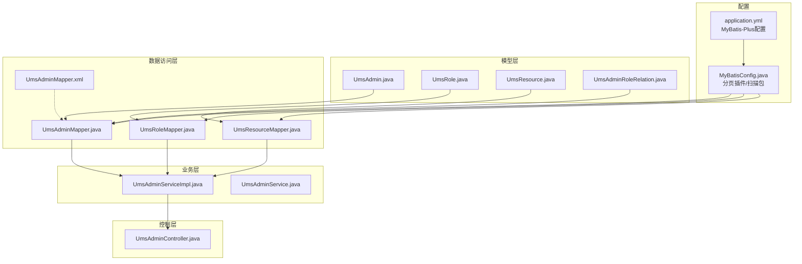
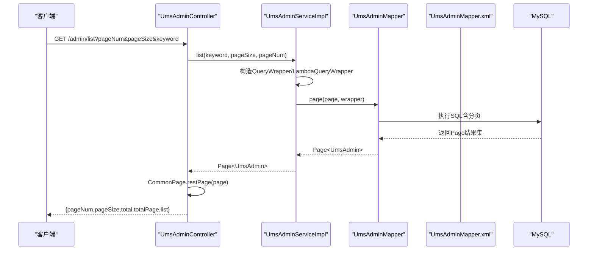
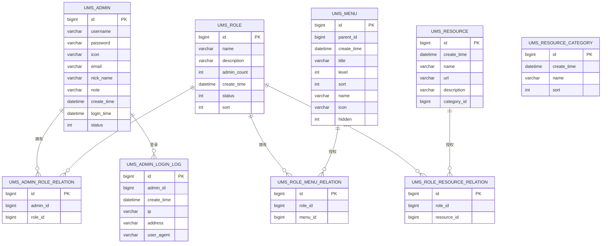
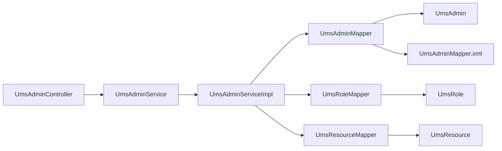

# 数据库设计

<cite>
**本文引用的文件**
- [mall_tiny.sql](file://sql/mall_tiny.sql)
- [MyBatisConfig.java](file://src/main/java/com/macro/mall/tiny/config/MyBatisConfig.java)
- [application.yml](file://src/main/resources/application.yml)
- [UmsAdmin.java](file://src/main/java/com/macro/mall/tiny/modules/ums/model/UmsAdmin.java)
- [UmsRole.java](file://src/main/java/com/macro/mall/tiny/modules/ums/model/UmsRole.java)
- [UmsResource.java](file://src/main/java/com/macro/mall/tiny/modules/ums/model/UmsResource.java)
- [UmsAdminRoleRelation.java](file://src/main/java/com/macro/mall/tiny/modules/ums/model/UmsAdminRoleRelation.java)
- [UmsAdminMapper.java](file://src/main/java/com/macro/mall/tiny/modules/ums/mapper/UmsAdminMapper.java)
- [UmsRoleMapper.java](file://src/main/java/com/macro/mall/tiny/modules/ums/mapper/UmsRoleMapper.java)
- [UmsResourceMapper.java](file://src/main/java/com/macro/mall/tiny/modules/ums/mapper/UmsResourceMapper.java)
- [UmsAdminMapper.xml](file://src/main/resources/mapper/ums/UmsAdminMapper.xml)
- [CommonPage.java](file://src/main/java/com/macro/mall/tiny/common/api/CommonPage.java)
- [UmsAdminServiceImpl.java](file://src/main/java/com/macro/mall/tiny/modules/ums/service/impl/UmsAdminServiceImpl.java)
- [UmsAdminController.java](file://src/main/java/com/macro/mall/tiny/modules/ums/controller/UmsAdminController.java)
- [UmsAdminService.java](file://src/main/java/com/macro/mall/tiny/modules/ums/service/UmsAdminService.java)
</cite>

## 目录
1. [简介](#简介)
2. [项目结构](#项目结构)
3. [核心组件](#核心组件)
4. [架构总览](#架构总览)
5. [详细组件分析](#详细组件分析)
6. [依赖分析](#依赖分析)
7. [性能考虑](#性能考虑)
8. [故障排查指南](#故障排查指南)
9. [结论](#结论)
10. [附录](#附录)

## 简介
本文件面向Mall-Tiny项目的数据库设计与MyBatis Plus ORM实现，聚焦于基于权限控制的后台用户体系（用户、角色、资源）及其在代码中的映射与调用链路。文档从实体类与数据库表的映射关系、字段注解与主键策略、Mapper接口设计原则、条件构造器使用、到分页查询机制与SQL优化策略进行全面阐述，并提供ER关系图、表结构定义、索引设计建议与数据字典说明，帮助开发者快速理解并扩展权限模块。

## 项目结构
围绕UMS权限模块，项目采用“模块化+分层”的组织方式：
- model：实体类，通过注解映射数据库表
- mapper：DAO层，继承通用Mapper接口，支持XML自定义SQL
- service：业务层，使用MyBatis Plus ServiceImpl与条件构造器
- controller：控制层，接收HTTP请求并返回统一响应
- resources/mapper：XML映射文件
- config：MyBatis Plus配置（分页插件、扫描包）

图表来源
- [MyBatisConfig.java:15-27](file://src/main/java/com/macro/mall/tiny/config/MyBatisConfig.java#L15-L27)
- [application.yml:15-23](file://src/main/resources/application.yml#L15-L23)
- [UmsAdmin.java:23-55](file://src/main/java/com/macro/mall/tiny/modules/ums/model/UmsAdmin.java#L23-L55)
- [UmsRole.java:23-47](file://src/main/java/com/macro/mall/tiny/modules/ums/model/UmsRole.java#L23-L47)
- [UmsResource.java:23-46](file://src/main/java/com/macro/mall/tiny/modules/ums/model/UmsResource.java#L23-L46)
- [UmsAdminRoleRelation.java:22-34](file://src/main/java/com/macro/mall/tiny/modules/ums/model/UmsAdminRoleRelation.java#L22-L34)
- [UmsAdminMapper.java:17-24](file://src/main/java/com/macro/mall/tiny/modules/ums/mapper/UmsAdminMapper.java#L17-L24)
- [UmsRoleMapper.java:17-24](file://src/main/java/com/macro/mall/tiny/modules/ums/mapper/UmsRoleMapper.java#L17-L24)
- [UmsResourceMapper.java:17-29](file://src/main/java/com/macro/mall/tiny/modules/ums/mapper/UmsResourceMapper.java#L17-L29)
- [UmsAdminMapper.xml:3-28](file://src/main/resources/mapper/ums/UmsAdminMapper.xml#L3-L28)
- [UmsAdminServiceImpl.java:48-271](file://src/main/java/com/macro/mall/tiny/modules/ums/service/impl/UmsAdminServiceImpl.java#L48-L271)
- [UmsAdminController.java:47-349](file://src/main/java/com/macro/mall/tiny/modules/ums/controller/UmsAdminController.java#L47-L349)

章节来源
- [MyBatisConfig.java:15-27](file://src/main/java/com/macro/mall/tiny/config/MyBatisConfig.java#L15-L27)
- [application.yml:15-23](file://src/main/resources/application.yml#L15-L23)

## 核心组件
- 实体类与表映射
  - 使用注解将Java实体与数据库表关联，主键策略统一为数据库自增。
  - 示例：用户表、角色表、资源表、用户-角色关系表均通过注解声明表名与主键类型。
- Mapper接口设计
  - 统一继承通用Mapper接口，获得基础CRUD能力。
  - 对复杂查询通过自定义方法+XML实现，或在Service层使用条件构造器组合查询。
- 条件构造器与分页
  - 在Service层广泛使用QueryWrapper/LambdaQueryWrapper进行动态条件拼装。
  - 分页通过MyBatis Plus分页插件与Page对象实现，配合通用分页包装类返回。
- 权限数据流
  - 控制器接收请求，调用Service；Service通过Mapper读取用户、角色、资源数据，构建权限集合返回。

章节来源
- [UmsAdmin.java:23-55](file://src/main/java/com/macro/mall/tiny/modules/ums/model/UmsAdmin.java#L23-L55)
- [UmsRole.java:23-47](file://src/main/java/com/macro/mall/tiny/modules/ums/model/UmsRole.java#L23-L47)
- [UmsResource.java:23-46](file://src/main/java/com/macro/mall/tiny/modules/ums/model/UmsResource.java#L23-L46)
- [UmsAdminRoleRelation.java:22-34](file://src/main/java/com/macro/mall/tiny/modules/ums/model/UmsAdminRoleRelation.java#L22-L34)
- [UmsAdminMapper.java:17-24](file://src/main/java/com/macro/mall/tiny/modules/ums/mapper/UmsAdminMapper.java#L17-L24)
- [UmsRoleMapper.java:17-24](file://src/main/java/com/macro/mall/tiny/modules/ums/mapper/UmsRoleMapper.java#L17-L24)
- [UmsResourceMapper.java:17-29](file://src/main/java/com/macro/mall/tiny/modules/ums/mapper/UmsResourceMapper.java#L17-L29)
- [UmsAdminServiceImpl.java:64-163](file://src/main/java/com/macro/mall/tiny/modules/ums/service/impl/UmsAdminServiceImpl.java#L64-L163)
- [CommonPage.java:22-30](file://src/main/java/com/macro/mall/tiny/common/api/CommonPage.java#L22-L30)

## 架构总览
下图展示从控制器到数据库的典型调用链，体现ORM映射、条件构造器与分页插件的协同工作。

图表来源
- [UmsAdminController.java:259-267](file://src/main/java/com/macro/mall/tiny/modules/ums/controller/UmsAdminController.java#L259-L267)
- [UmsAdminServiceImpl.java:154-163](file://src/main/java/com/macro/mall/tiny/modules/ums/service/impl/UmsAdminServiceImpl.java#L154-L163)
- [UmsAdminMapper.java:17](file://src/main/java/com/macro/mall/tiny/modules/ums/mapper/UmsAdminMapper.java#L17)
- [UmsAdminMapper.xml:19-26](file://src/main/resources/mapper/ums/UmsAdminMapper.xml#L19-L26)
- [CommonPage.java:22-30](file://src/main/java/com/macro/mall/tiny/common/api/CommonPage.java#L22-L30)

## 详细组件分析

### 实体类与数据库表映射
- 主键策略
  - 所有实体主键使用数据库自增策略，对应注解配置为主键类型自增。
- 字段注解
  - 表名注解：将类映射到具体表。
  - 字段注解：驼峰映射、字段别名、序列化标识等。
- 关系实体
  - 用户-角色关系表作为中间表，承载多对多关系，主键同样自增。

章节来源
- [UmsAdmin.java:23-55](file://src/main/java/com/macro/mall/tiny/modules/ums/model/UmsAdmin.java#L23-L55)
- [UmsRole.java:23-47](file://src/main/java/com/macro/mall/tiny/modules/ums/model/UmsRole.java#L23-L47)
- [UmsResource.java:23-46](file://src/main/java/com/macro/mall/tiny/modules/ums/model/UmsResource.java#L23-L46)
- [UmsAdminRoleRelation.java:22-34](file://src/main/java/com/macro/mall/tiny/modules/ums/model/UmsAdminRoleRelation.java#L22-L34)

### Mapper接口设计原则
- 通用Mapper继承
  - 所有Mapper统一继承通用Mapper接口，获得基础CRUD能力，减少重复代码。
- 自定义SQL
  - 复杂联表查询通过XML实现，例如用户-资源关联查询。
- 条件构造器
  - 在Service层使用QueryWrapper/LambdaQueryWrapper拼装动态条件，提升可读性与安全性。

章节来源
- [UmsAdminMapper.java:17-24](file://src/main/java/com/macro/mall/tiny/modules/ums/mapper/UmsAdminMapper.java#L17-L24)
- [UmsRoleMapper.java:17-24](file://src/main/java/com/macro/mall/tiny/modules/ums/mapper/UmsRoleMapper.java#L17-L24)
- [UmsResourceMapper.java:17-29](file://src/main/java/com/macro/mall/tiny/modules/ums/mapper/UmsResourceMapper.java#L17-L29)
- [UmsAdminMapper.xml:19-26](file://src/main/resources/mapper/ums/UmsAdminMapper.xml#L19-L26)
- [UmsAdminServiceImpl.java:64-163](file://src/main/java/com/macro/mall/tiny/modules/ums/service/impl/UmsAdminServiceImpl.java#L64-L163)

### 条件构造器使用技巧
- 动态查询
  - 根据关键字拼接模糊查询条件，支持用户名与昵称的OR组合。
- 安全更新
  - 更新前判断密码是否变化，避免不必要的加密与写入。
- 批量关系维护
  - 先清理旧关系，再批量插入新关系，保证一致性。

章节来源
- [UmsAdminServiceImpl.java:64-163](file://src/main/java/com/macro/mall/tiny/modules/ums/service/impl/UmsAdminServiceImpl.java#L64-L163)
- [UmsAdminServiceImpl.java:194-213](file://src/main/java/com/macro/mall/tiny/modules/ums/service/impl/UmsAdminServiceImpl.java#L194-L213)

### 分页查询实现机制
- 插件配置
  - MyBatis Plus拦截器中启用分页内核，适配MySQL方言。
- 服务层分页
  - Service层构造Page对象与QueryWrapper，交由通用Mapper执行分页查询。
- 结果封装
  - 通过通用分页包装类将Page结果转换为对外统一格式。

章节来源
- [MyBatisConfig.java:20-25](file://src/main/java/com/macro/mall/tiny/config/MyBatisConfig.java#L20-L25)
- [application.yml:15-23](file://src/main/resources/application.yml#L15-L23)
- [UmsAdminServiceImpl.java:154-163](file://src/main/java/com/macro/mall/tiny/modules/ums/service/impl/UmsAdminServiceImpl.java#L154-L163)
- [CommonPage.java:22-30](file://src/main/java/com/macro/mall/tiny/common/api/CommonPage.java#L22-L30)

### 数据库表结构设计
- 用户表（ums_admin）
  - 主键自增，包含用户名、密码、头像、邮箱、昵称、备注、创建/登录时间、状态等字段。
- 角色表（ums_role）
  - 主键自增，包含名称、描述、后台用户数量、创建时间、状态、排序等字段。
- 资源表（ums_resource）
  - 主键自增，包含创建时间、资源名称、URL、描述、资源分类ID等字段。
- 用户-角色关系表（ums_admin_role_relation）
  - 主键自增，记录用户与角色的多对多关系。
- 菜单表（ums_menu）
  - 主键自增，包含父级ID、创建时间、菜单名称、级数、排序、前端名称、图标、隐藏标志等字段。
- 资源分类表（ums_resource_category）
  - 主键自增，包含创建时间、分类名称、排序等字段。
- 角色-菜单关系表（ums_role_menu_relation）
  - 主键自增，记录角色与菜单的多对多关系。
- 角色-资源关系表（ums_role_resource_relation）
  - 主键自增，记录角色与资源的多对多关系。
- 登录日志表（ums_admin_login_log）
  - 主键自增，记录用户登录IP、时间、UA等信息。

章节来源
- [mall_tiny.sql:21-362](file://sql/mall_tiny.sql#L21-L362)

### ER关系图

图表来源
- [mall_tiny.sql:21-362](file://sql/mall_tiny.sql#L21-L362)

### 索引设计策略
- 建议索引
  - 用户表：username（唯一/普通索引）、email（普通索引）、status（普通索引）
  - 角色表：name（普通索引）、status（普通索引）
  - 资源表：url（唯一/普通索引）、category_id（普通索引）
  - 关系表：(admin_id, role_id)、(role_id, menu_id)、(role_id, resource_id) 组合索引以优化联表查询
  - 登录日志表：admin_id、create_time、ip
- 索引选择原则
  - 唯一性：用户名、邮箱、资源URL可考虑唯一索引
  - 查询频率：高频过滤字段（如状态、角色ID、资源URL）建立索引
  - 联表性能：关系表建立复合索引，避免全表扫描

### 数据字典说明
- 用户表（ums_admin）
  - id：自增主键
  - username/password/email/nickName：用户标识与凭证
  - icon/note：扩展信息
  - createTime/loginTime/status：时间与状态
- 角色表（ums_role）
  - id：自增主键
  - name/description/adminCount/createTime/status/sort：角色元数据
- 资源表（ums_resource）
  - id：自增主键
  - createTime/name/url/description/categoryId：资源元数据
- 用户-角色关系表（ums_admin_role_relation）
  - id：自增主键
  - adminId/roleId：多对多关系
- 菜单表（ums_menu）
  - id：自增主键
  - parentId/level/sort/name/icon/hidden：菜单层级与展示
- 资源分类表（ums_resource_category）
  - id：自增主键
  - createTime/name/sort：分类元数据
- 角色-菜单关系表（ums_role_menu_relation）
  - id：自增主键
  - roleId/menuId：授权关系
- 角色-资源关系表（ums_role_resource_relation）
  - id：自增主键
  - roleId/resourceId：授权关系
- 登录日志表（ums_admin_login_log）
  - id：自增主键
  - adminId/createTime/ip/address/userAgent：登录轨迹

章节来源
- [mall_tiny.sql:21-362](file://sql/mall_tiny.sql#L21-L362)

## 依赖分析
- 组件耦合
  - 控制器依赖业务接口，业务实现依赖Mapper接口，Mapper依赖实体类与XML映射。
- 外部依赖
  - MyBatis Plus分页插件、MySQL驱动、Spring Security、Redis等。
- 循环依赖
  - 通过接口与依赖注入避免循环依赖问题。

图表来源
- [UmsAdminController.java:47-349](file://src/main/java/com/macro/mall/tiny/modules/ums/controller/UmsAdminController.java#L47-L349)
- [UmsAdminService.java:19-89](file://src/main/java/com/macro/mall/tiny/modules/ums/service/UmsAdminService.java#L19-L89)
- [UmsAdminServiceImpl.java:48-271](file://src/main/java/com/macro/mall/tiny/modules/ums/service/impl/UmsAdminServiceImpl.java#L48-L271)
- [UmsAdminMapper.java:17-24](file://src/main/java/com/macro/mall/tiny/modules/ums/mapper/UmsAdminMapper.java#L17-L24)
- [UmsRoleMapper.java:17-24](file://src/main/java/com/macro/mall/tiny/modules/ums/mapper/UmsRoleMapper.java#L17-L24)
- [UmsResourceMapper.java:17-29](file://src/main/java/com/macro/mall/tiny/modules/ums/mapper/UmsResourceMapper.java#L17-L29)
- [UmsAdminMapper.xml:3-28](file://src/main/resources/mapper/ums/UmsAdminMapper.xml#L3-L28)

## 性能考虑
- SQL优化
  - 为高频过滤字段建立索引，避免SELECT *，仅查询必要列。
  - 关系表使用复合索引，减少JOIN成本。
- 分页策略
  - 大数据量场景下，结合合理索引与LIMIT/OFFSET，避免深度分页导致的性能退化。
  - 使用覆盖索引优化分页查询。
- 缓存策略
  - 用户资源列表与用户信息可通过缓存降低数据库压力，注意失效与更新时机。
- 连接池与事务
  - 合理配置连接池大小与超时时间，事务边界清晰，避免长事务占用资源。

## 故障排查指南
- 分页未生效
  - 检查分页插件是否正确注册与启用，确认Page对象传入顺序与条件构造器使用。
- 条件查询无效
  - 核对QueryWrapper/LambdaQueryWrapper拼装逻辑，确保字段名与实体一致。
- 权限数据不一致
  - 检查用户角色关系变更后是否清理了相关缓存，避免脏读。
- 登录日志缺失
  - 确认登录流程中是否正确记录日志，检查Mapper与实体字段映射。

章节来源
- [MyBatisConfig.java:20-25](file://src/main/java/com/macro/mall/tiny/config/MyBatisConfig.java#L20-L25)
- [UmsAdminServiceImpl.java:125-135](file://src/main/java/com/macro/mall/tiny/modules/ums/service/impl/UmsAdminServiceImpl.java#L125-L135)
- [UmsAdminServiceImpl.java:194-213](file://src/main/java/com/macro/mall/tiny/modules/ums/service/impl/UmsAdminServiceImpl.java#L194-L213)

## 结论
Mall-Tiny的权限模块通过清晰的实体-表映射、规范的Mapper设计与条件构造器使用，结合MyBatis Plus分页插件与统一响应包装，实现了高内聚、低耦合的数据访问层。配合合理的索引与缓存策略，可在保证开发效率的同时满足生产环境的性能与稳定性需求。建议在扩展新权限相关表时遵循现有命名与注解规范，保持代码风格一致。

## 附录
- 配置要点
  - MyBatis-Plus：Mapper扫描路径、全局ID策略、下划线转驼峰等
  - 分页插件：MySQL方言、单页最大限制
- 常见问题
  - 字段名不一致导致映射失败
  - 分页插件未注册导致分页不生效
  - 缓存未清理导致权限数据陈旧

章节来源
- [application.yml:15-23](file://src/main/resources/application.yml#L15-L23)
- [MyBatisConfig.java:20-25](file://src/main/java/com/macro/mall/tiny/config/MyBatisConfig.java#L20-L25)