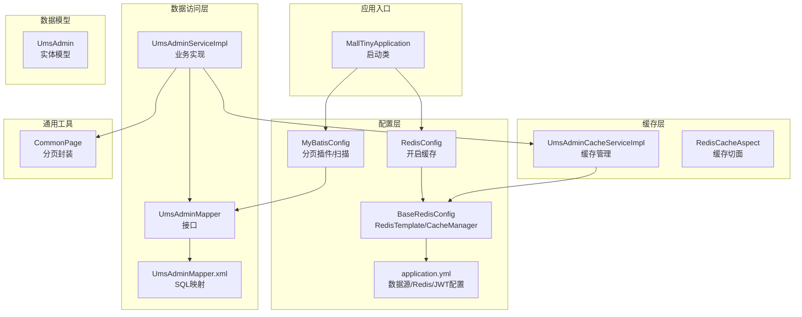
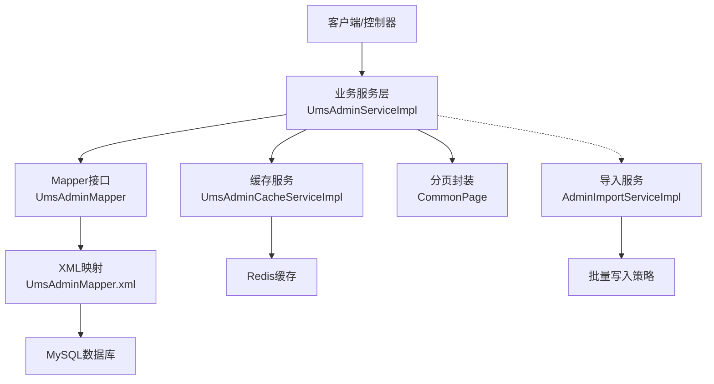
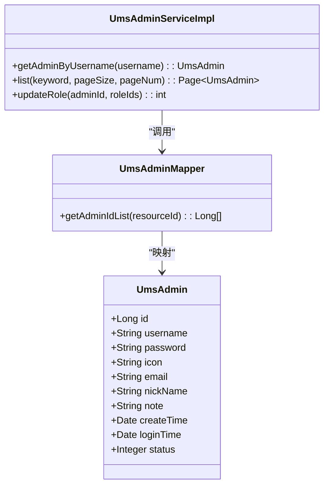
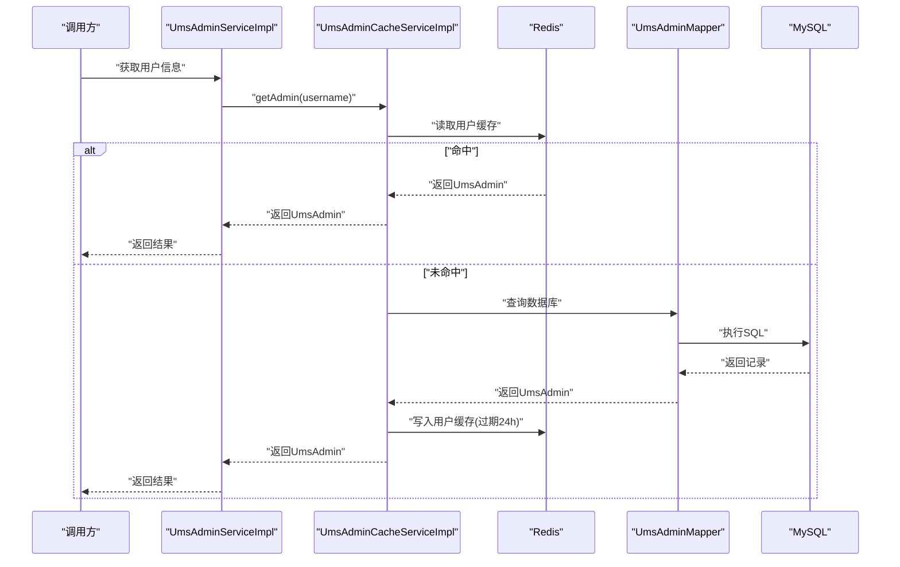
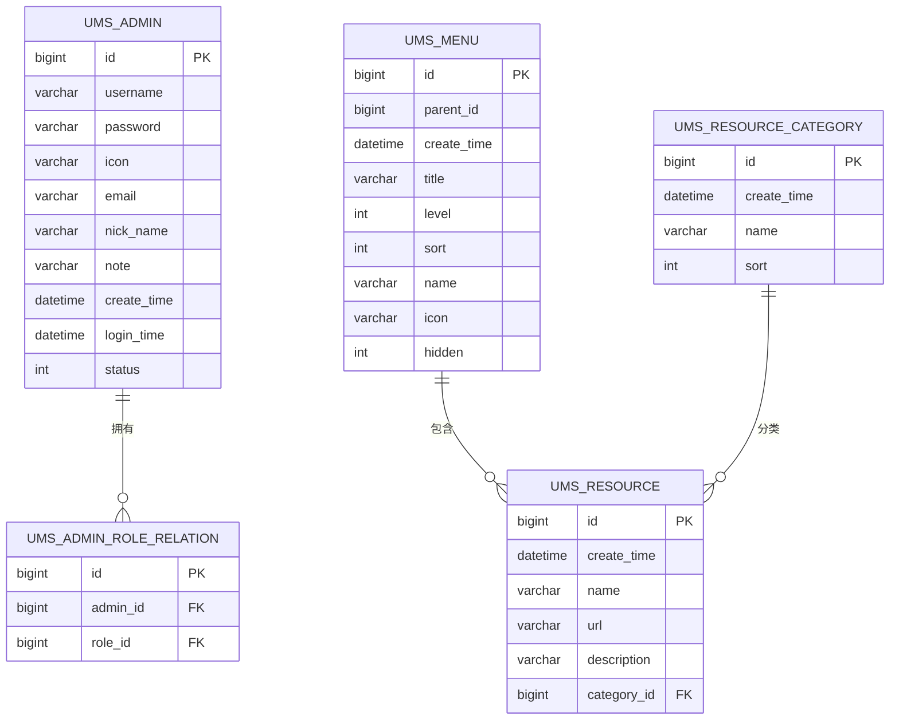
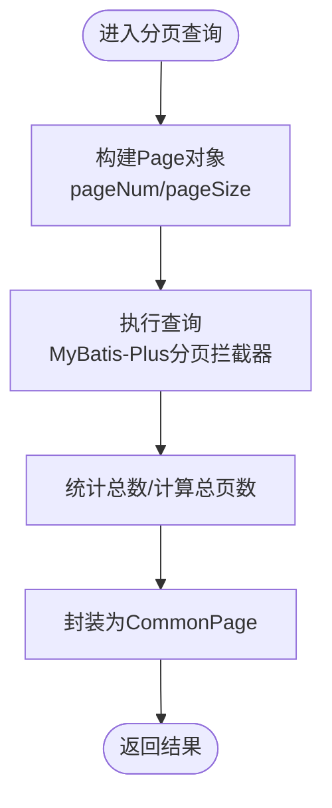
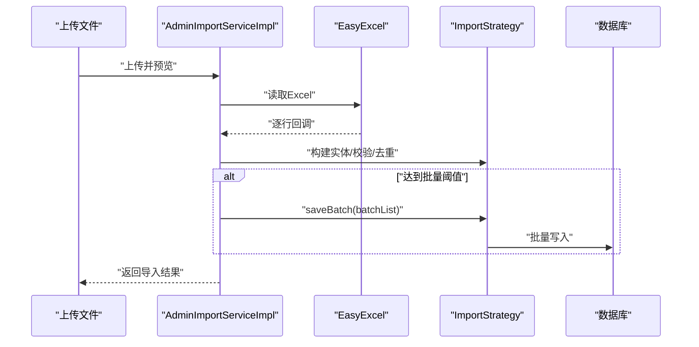
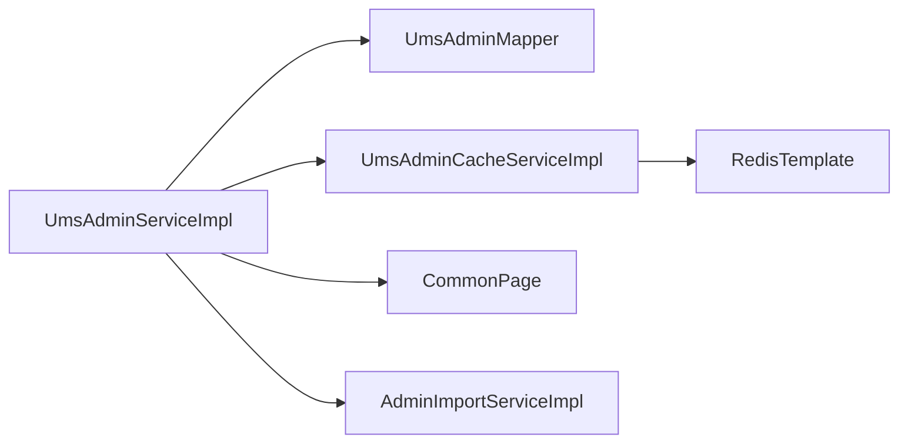

# 数据架构设计

<cite>
**本文引用的文件**
- [MallTinyApplication.java](file://src/main/java/com/macro/mall/tiny/MallTinyApplication.java)
- [application.yml](file://src/main/resources/application.yml)
- [application-dev.yml](file://src/main/resources/application-dev.yml)
- [application-prod.yml](file://src/main/resources/application-prod.yml)
- [MyBatisConfig.java](file://src/main/java/com/macro/mall/tiny/config/MyBatisConfig.java)
- [RedisConfig.java](file://src/main/java/com/macro/mall/tiny/config/RedisConfig.java)
- [BaseRedisConfig.java](file://src/main/java/com/macro/mall/tiny/common/config/BaseRedisConfig.java)
- [UmsAdmin.java](file://src/main/java/com/macro/mall/tiny/modules/ums/model/UmsAdmin.java)
- [UmsAdminMapper.java](file://src/main/java/com/macro/mall/tiny/modules/ums/mapper/UmsAdminMapper.java)
- [UmsAdminMapper.xml](file://src/main/resources/mapper/ums/UmsAdminMapper.xml)
- [CommonPage.java](file://src/main/java/com/macro/mall/tiny/common/api/CommonPage.java)
- [UmsAdminServiceImpl.java](file://src/main/java/com/macro/mall/tiny/modules/ums/service/impl/UmsAdminServiceImpl.java)
- [UmsAdminCacheServiceImpl.java](file://src/main/java/com/macro/mall/tiny/modules/ums/service/impl/UmsAdminCacheServiceImpl.java)
- [RedisCacheAspect.java](file://src/main/java/com/macro/mall/tiny/security/aspect/RedisCacheAspect.java)
- [AdminImportServiceImpl.java](file://src/main/java/com/macro/mall/tiny/modules/ums/service/impl/AdminImportServiceImpl.java)
- [MatchServiceImpl.java](file://src/main/java/com/macro/mall/tiny/modules/ums/service/impl/MatchServiceImpl.java)
- [mall_tiny.sql](file://sql/mall_tiny.sql)
- [generator.properties](file://src/main/resources/generator.properties)
- [MyBatisPlusGenerator.java](file://src/main/java/com/macro/mall/tiny/generator/MyBatisPlusGenerator.java)
</cite>

## 目录
1. [简介](#简介)
2. [项目结构](#项目结构)
3. [核心组件](#核心组件)
4. [架构总览](#架构总览)
5. [详细组件分析](#详细组件分析)
6. [依赖分析](#依赖分析)
7. [性能考虑](#性能考虑)
8. [故障排查指南](#故障排查指南)
9. [结论](#结论)
10. [附录](#附录)

## 简介
本文件面向Mall-Tiny项目的“数据架构”主题，系统化梳理基于MyBatis-Plus的数据访问层设计、Redis缓存架构、数据库连接与事务管理、SQL优化策略、数据模型设计原则、分页与批量操作实践，以及数据迁移策略。文档以可视化图表呈现整体架构与关键流程，并提供可操作的优化建议与排障指引。

## 项目结构
Mall-Tiny采用按功能域划分的模块化结构，数据相关的核心位于modules/ums子模块，配合MyBatis-Plus的Mapper/XML、Redis缓存配置与通用分页封装，形成清晰的分层与职责边界。

**图表来源**
- [MallTinyApplication.java:1-14](file://src/main/java/com/macro/mall/tiny/MallTinyApplication.java#L1-L14)
- [MyBatisConfig.java:1-28](file://src/main/java/com/macro/mall/tiny/config/MyBatisConfig.java#L1-L28)
- [RedisConfig.java:1-16](file://src/main/java/com/macro/mall/tiny/config/RedisConfig.java#L1-L16)
- [BaseRedisConfig.java:1-69](file://src/main/java/com/macro/mall/tiny/common/config/BaseRedisConfig.java#L1-L69)
- [application.yml:1-57](file://src/main/resources/application.yml#L1-L57)
- [UmsAdminMapper.java:1-25](file://src/main/java/com/macro/mall/tiny/modules/ums/mapper/UmsAdminMapper.java#L1-L25)
- [UmsAdminMapper.xml:1-29](file://src/main/resources/mapper/ums/UmsAdminMapper.xml#L1-L29)
- [UmsAdminServiceImpl.java:1-272](file://src/main/java/com/macro/mall/tiny/modules/ums/service/impl/UmsAdminServiceImpl.java#L1-L272)
- [UmsAdminCacheServiceImpl.java:1-116](file://src/main/java/com/macro/mall/tiny/modules/ums/service/impl/UmsAdminCacheServiceImpl.java#L1-L116)
- [RedisCacheAspect.java:1-51](file://src/main/java/com/macro/mall/tiny/security/aspect/RedisCacheAspect.java#L1-L51)
- [CommonPage.java:1-72](file://src/main/java/com/macro/mall/tiny/common/api/CommonPage.java#L1-L72)
- [UmsAdmin.java:1-59](file://src/main/java/com/macro/mall/tiny/modules/ums/model/UmsAdmin.java#L1-L59)

**章节来源**
- [MallTinyApplication.java:1-14](file://src/main/java/com/macro/mall/tiny/MallTinyApplication.java#L1-L14)
- [application.yml:1-57](file://src/main/resources/application.yml#L1-L57)
- [MyBatisConfig.java:1-28](file://src/main/java/com/macro/mall/tiny/config/MyBatisConfig.java#L1-L28)
- [RedisConfig.java:1-16](file://src/main/java/com/macro/mall/tiny/config/RedisConfig.java#L1-L16)
- [BaseRedisConfig.java:1-69](file://src/main/java/com/macro/mall/tiny/common/config/BaseRedisConfig.java#L1-L69)

## 核心组件
- MyBatis-Plus配置与分页插件：启用分页内核拦截器，扫描Mapper包，统一配置驼峰映射与自动映射行为。
- Redis缓存配置：自定义RedisTemplate与CacheManager，JSON序列化，统一TTL策略。
- 数据模型与Mapper：实体类标注表名与主键策略，Mapper接口继承BaseMapper，XML定义SQL映射。
- 通用分页封装：将MyBatis-Plus Page转换为通用分页对象。
- 缓存服务与切面：提供用户与资源列表缓存，缓存异常兜底切面保障业务可用性。
- 导入与批量策略：基于EasyExcel的流式解析与批量写入，结合策略模式实现多类型导入。

**章节来源**
- [MyBatisConfig.java:15-28](file://src/main/java/com/macro/mall/tiny/config/MyBatisConfig.java#L15-L28)
- [BaseRedisConfig.java:28-69](file://src/main/java/com/macro/mall/tiny/common/config/BaseRedisConfig.java#L28-L69)
- [UmsAdmin.java:23-59](file://src/main/java/com/macro/mall/tiny/modules/ums/model/UmsAdmin.java#L23-L59)
- [UmsAdminMapper.java:17-24](file://src/main/java/com/macro/mall/tiny/modules/ums/mapper/UmsAdminMapper.java#L17-L24)
- [UmsAdminMapper.xml:3-28](file://src/main/resources/mapper/ums/UmsAdminMapper.xml#L3-L28)
- [CommonPage.java:22-30](file://src/main/java/com/macro/mall/tiny/common/api/CommonPage.java#L22-L30)
- [UmsAdminCacheServiceImpl.java:25-116](file://src/main/java/com/macro/mall/tiny/modules/ums/service/impl/UmsAdminCacheServiceImpl.java#L25-L116)
- [RedisCacheAspect.java:27-50](file://src/main/java/com/macro/mall/tiny/security/aspect/RedisCacheAspect.java#L27-L50)
- [AdminImportServiceImpl.java:160-257](file://src/main/java/com/macro/mall/tiny/modules/ums/service/impl/AdminImportServiceImpl.java#L160-L257)

## 架构总览
下图展示数据访问层与缓存层的整体交互，以及分页与批量导入的关键流程。

**图表来源**
- [UmsAdminServiceImpl.java:64-76](file://src/main/java/com/macro/mall/tiny/modules/ums/service/impl/UmsAdminServiceImpl.java#L64-L76)
- [UmsAdminCacheServiceImpl.java:93-114](file://src/main/java/com/macro/mall/tiny/modules/ums/service/impl/UmsAdminCacheServiceImpl.java#L93-L114)
- [UmsAdminMapper.java:17-24](file://src/main/java/com/macro/mall/tiny/modules/ums/mapper/UmsAdminMapper.java#L17-L24)
- [UmsAdminMapper.xml:19-26](file://src/main/resources/mapper/ums/UmsAdminMapper.xml#L19-L26)
- [CommonPage.java:22-30](file://src/main/java/com/macro/mall/tiny/common/api/CommonPage.java#L22-L30)
- [AdminImportServiceImpl.java:204-246](file://src/main/java/com/macro/mall/tiny/modules/ums/service/impl/AdminImportServiceImpl.java#L204-L246)

## 详细组件分析

### 数据访问层（MyBatis-Plus）设计
- 实体模型映射
  - 表名与主键策略：通过注解声明表名与自增主键。
  - 字段命名与驼峰映射：全局开启下划线转驼峰，减少映射配置。
- Mapper接口定义
  - 继承BaseMapper，获得通用CRUD能力；自定义方法通过XML实现复杂查询。
- XML配置组织
  - 命名空间与ResultMap：确保字段与实体属性一一对应。
  - 复杂查询：如资源关联用户ID查询，使用LEFT JOIN与DISTINCT去重。
- 自动分页
  - MyBatis-Plus分页拦截器对MySQL生效，业务层直接传入Page对象即可。

**图表来源**
- [UmsAdmin.java:25-59](file://src/main/java/com/macro/mall/tiny/modules/ums/model/UmsAdmin.java#L25-L59)
- [UmsAdminMapper.java:17-24](file://src/main/java/com/macro/mall/tiny/modules/ums/mapper/UmsAdminMapper.java#L17-L24)
- [UmsAdminServiceImpl.java:64-76](file://src/main/java/com/macro/mall/tiny/modules/ums/service/impl/UmsAdminServiceImpl.java#L64-L76)

**章节来源**
- [UmsAdmin.java:23-59](file://src/main/java/com/macro/mall/tiny/modules/ums/model/UmsAdmin.java#L23-L59)
- [UmsAdminMapper.java:17-24](file://src/main/java/com/macro/mall/tiny/modules/ums/mapper/UmsAdminMapper.java#L17-L24)
- [UmsAdminMapper.xml:3-28](file://src/main/resources/mapper/ums/UmsAdminMapper.xml#L3-L28)
- [MyBatisConfig.java:20-25](file://src/main/java/com/macro/mall/tiny/config/MyBatisConfig.java#L20-L25)

### 缓存架构设计
- 缓存键命名规范
  - 用户信息键：database:prefix:username
  - 资源列表键：database:prefix:adminId
- 过期时间策略
  - 应用级缓存TTL：统一1天；业务键过期：common=24小时。
- 缓存一致性保证
  - 写操作后主动删除相关缓存键，读取时若命中则返回，未命中再回源数据库并写入缓存。
  - 缓存异常切面：对带CacheException注解的方法抛出异常，其他情况吞掉异常并记录日志，保证业务不中断。
- Redis序列化与连接
  - JSON序列化器，开启默认类型激活，确保对象反序列化正确。
  - 提供RedisService与RedisCacheManager，便于扩展。

**图表来源**
- [UmsAdminServiceImpl.java:64-76](file://src/main/java/com/macro/mall/tiny/modules/ums/service/impl/UmsAdminServiceImpl.java#L64-L76)
- [UmsAdminCacheServiceImpl.java:93-102](file://src/main/java/com/macro/mall/tiny/modules/ums/service/impl/UmsAdminCacheServiceImpl.java#L93-L102)
- [application.yml:30-37](file://src/main/resources/application.yml#L30-L37)

**章节来源**
- [UmsAdminCacheServiceImpl.java:44-114](file://src/main/java/com/macro/mall/tiny/modules/ums/service/impl/UmsAdminCacheServiceImpl.java#L44-L114)
- [RedisCacheAspect.java:31-48](file://src/main/java/com/macro/mall/tiny/security/aspect/RedisCacheAspect.java#L31-L48)
- [BaseRedisConfig.java:54-60](file://src/main/java/com/macro/mall/tiny/common/config/BaseRedisConfig.java#L54-L60)
- [application.yml:30-37](file://src/main/resources/application.yml#L30-L37)

### 数据模型与索引策略
- 表结构与字段
  - 用户表、角色关系表、菜单表、资源表、资源分类表等，均定义了主键与常用字段。
- 索引与约束
  - 主键索引：各表主键自动建立。
  - 唯一/普通索引：建议在高频过滤字段（如用户名、角色ID、资源URL）上建立索引。
  - 外键约束：根据业务需求可在应用层或数据库层控制参照完整性。
- 设计原则
  - 读多写少场景优先考虑缓存与只读副本。
  - 关联查询尽量走单表或少量JOIN，避免深度嵌套。

**图表来源**
- [mall_tiny.sql:19-200](file://sql/mall_tiny.sql#L19-L200)

**章节来源**
- [mall_tiny.sql:19-200](file://sql/mall_tiny.sql#L19-L200)

### 分页查询实现
- 控制器/服务层传入Page对象，分页拦截器自动注入LIMIT与总数统计。
- 通用分页封装：将Page<T>转换为CommonPage<T>，统一对外输出格式。

**图表来源**
- [UmsAdminServiceImpl.java:154-163](file://src/main/java/com/macro/mall/tiny/modules/ums/service/impl/UmsAdminServiceImpl.java#L154-L163)
- [CommonPage.java:22-30](file://src/main/java/com/macro/mall/tiny/common/api/CommonPage.java#L22-L30)

**章节来源**
- [UmsAdminServiceImpl.java:154-163](file://src/main/java/com/macro/mall/tiny/modules/ums/service/impl/UmsAdminServiceImpl.java#L154-L163)
- [CommonPage.java:22-30](file://src/main/java/com/macro/mall/tiny/common/api/CommonPage.java#L22-L30)

### 批量操作与导入优化
- 流式读取与批量写入
  - EasyExcel逐行读取，构建实体并校验，累积到阈值（如1000条）后一次性写入。
  - 去重策略：基于唯一键集合（会话内与历史数据）避免重复。
- 事务与异常处理
  - 导入流程使用@Transactional，异常时回滚，保证数据一致性。
  - 定时清理临时文件，降低磁盘占用。
- 匹配算法
  - 岗位匹配服务对用户档案与岗位要求进行硬性条件筛选与评分，最终按匹配度排序返回。

**图表来源**
- [AdminImportServiceImpl.java:160-257](file://src/main/java/com/macro/mall/tiny/modules/ums/service/impl/AdminImportServiceImpl.java#L160-L257)
- [AdminImportServiceImpl.java:204-246](file://src/main/java/com/macro/mall/tiny/modules/ums/service/impl/AdminImportServiceImpl.java#L204-L246)

**章节来源**
- [AdminImportServiceImpl.java:160-257](file://src/main/java/com/macro/mall/tiny/modules/ums/service/impl/AdminImportServiceImpl.java#L160-L257)
- [MatchServiceImpl.java:111-148](file://src/main/java/com/macro/mall/tiny/modules/ums/service/impl/MatchServiceImpl.java#L111-L148)

### 数据迁移策略
- 生成器与脚本
  - MyBatis-Plus Generator支持从YAML配置读取数据源，生成实体、Mapper、XML与Service。
  - SQL脚本提供初始化与变更脚本，便于版本化迁移。
- 迁移建议
  - 使用版本化的SQL脚本，先在测试环境验证，再灰度到生产。
  - 对大表DDL操作采用在线DDL或分批迁移，避免锁表。

**章节来源**
- [MyBatisPlusGenerator.java:75-103](file://src/main/java/com/macro/mall/tiny/generator/MyBatisPlusGenerator.java#L75-L103)
- [generator.properties:1-5](file://src/main/resources/generator.properties#L1-L5)
- [mall_tiny.sql:1-200](file://sql/mall_tiny.sql#L1-L200)

## 依赖分析
- 组件耦合
  - 业务服务依赖Mapper与缓存服务，缓存服务依赖RedisTemplate与Mapper。
  - 分页封装独立于业务，被多个服务复用。
- 外部依赖
  - MySQL驱动与连接池由Spring Boot自动配置；Redis由Spring Data Redis提供连接工厂。
- 循环依赖
  - 当前结构未见循环依赖迹象，缓存切面通过AOP隔离异常，避免运行时循环。

**图表来源**
- [UmsAdminServiceImpl.java:64-76](file://src/main/java/com/macro/mall/tiny/modules/ums/service/impl/UmsAdminServiceImpl.java#L64-L76)
- [UmsAdminCacheServiceImpl.java:93-114](file://src/main/java/com/macro/mall/tiny/modules/ums/service/impl/UmsAdminCacheServiceImpl.java#L93-L114)
- [CommonPage.java:22-30](file://src/main/java/com/macro/mall/tiny/common/api/CommonPage.java#L22-L30)
- [AdminImportServiceImpl.java:160-257](file://src/main/java/com/macro/mall/tiny/modules/ums/service/impl/AdminImportServiceImpl.java#L160-L257)

**章节来源**
- [UmsAdminServiceImpl.java:64-76](file://src/main/java/com/macro/mall/tiny/modules/ums/service/impl/UmsAdminServiceImpl.java#L64-L76)
- [UmsAdminCacheServiceImpl.java:93-114](file://src/main/java/com/macro/mall/tiny/modules/ums/service/impl/UmsAdminCacheServiceImpl.java#L93-L114)
- [CommonPage.java:22-30](file://src/main/java/com/macro/mall/tiny/common/api/CommonPage.java#L22-L30)
- [AdminImportServiceImpl.java:160-257](file://src/main/java/com/macro/mall/tiny/modules/ums/service/impl/AdminImportServiceImpl.java#L160-L257)

## 性能考虑
- 数据库连接池与事务
  - 使用Spring Boot默认HikariCP；可通过application.yml调整连接池大小、空闲超时等参数。
  - 事务注解@Transactional确保批量导入原子性，异常回滚。
- SQL优化
  - 为高频查询字段建立索引（如用户名、角色ID、资源URL）。
  - 避免SELECT *，明确字段列表；复杂JOIN限制表数量。
- 缓存优化
  - 合理设置TTL，热点数据短TTL提升一致性，非热点长TTL降低DB压力。
  - 缓存穿透：对不存在数据也做短TTL缓存，避免持续击穿。
- 批量导入
  - 批量阈值1000条，既平衡内存占用又提升IO效率。
  - 去重在内存中完成，建议结合数据库唯一约束与幂等设计。

[本节为通用指导，无需特定文件引用]

## 故障排查指南
- 缓存异常
  - 现象：Redis不可用导致业务失败。
  - 处理：RedisCacheAspect对非CacheException方法吞掉异常并记录日志，保障降级可用。
- 登录与鉴权
  - 现象：登录失败或权限不足。
  - 处理：检查用户状态、密码匹配与资源权限缓存是否失效。
- 导入失败
  - 现象：导入过程中断或重复数据。
  - 处理：确认会话是否过期、唯一键去重逻辑、批量阈值与事务回滚。

**章节来源**
- [RedisCacheAspect.java:31-48](file://src/main/java/com/macro/mall/tiny/security/aspect/RedisCacheAspect.java#L31-L48)
- [UmsAdminServiceImpl.java:99-119](file://src/main/java/com/macro/mall/tiny/modules/ums/service/impl/UmsAdminServiceImpl.java#L99-L119)
- [AdminImportServiceImpl.java:177-185](file://src/main/java/com/macro/mall/tiny/modules/ums/service/impl/AdminImportServiceImpl.java#L177-L185)

## 结论
Mall-Tiny的数据架构以MyBatis-Plus为核心，结合Redis缓存与通用分页封装，实现了清晰的分层与良好的扩展性。通过合理的缓存键命名、TTL策略与异常兜底切面，系统在可用性与一致性之间取得平衡。批量导入采用流式解析与批量写入，配合去重与事务控制，提升了大规模数据处理的稳定性与性能。建议后续进一步完善索引策略与监控告警，持续优化热点数据的缓存命中率与数据库查询性能。

[本节为总结性内容，无需特定文件引用]

## 附录
- 配置文件要点
  - 数据源：dev/prod分别指向本地与容器内数据库。
  - Redis：host/port/password/timeout等参数按环境配置。
  - JWT：token头、密钥、过期时间与前缀。
- 生成器配置
  - generator.properties提供数据库连接参数，MyBatisPlusGenerator支持从YAML加载配置并生成代码。

**章节来源**
- [application-dev.yml:1-16](file://src/main/resources/application-dev.yml#L1-L16)
- [application-prod.yml:1-18](file://src/main/resources/application-prod.yml#L1-L18)
- [application.yml:24-28](file://src/main/resources/application.yml#L24-L28)
- [generator.properties:1-5](file://src/main/resources/generator.properties#L1-L5)
- [MyBatisPlusGenerator.java:75-103](file://src/main/java/com/macro/mall/tiny/generator/MyBatisPlusGenerator.java#L75-L103)