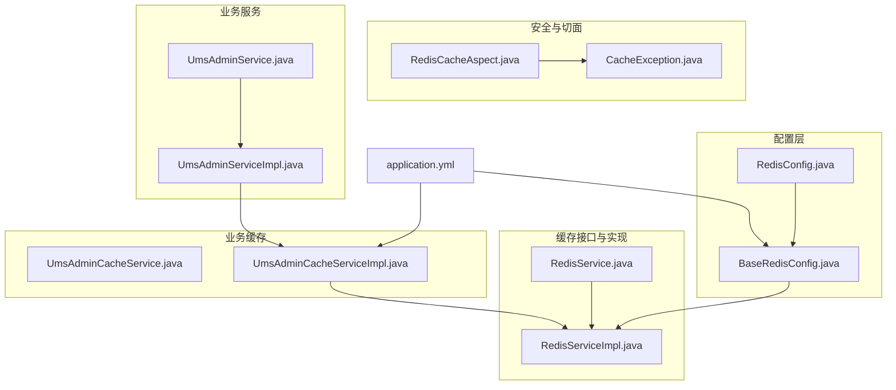
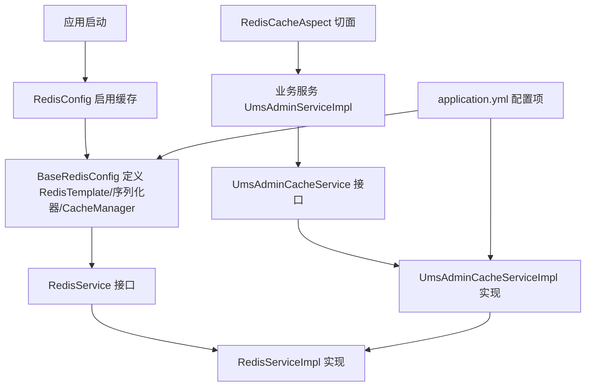
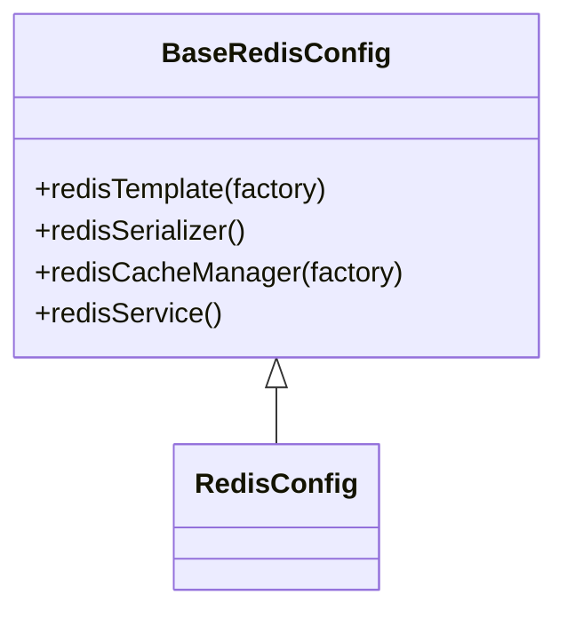
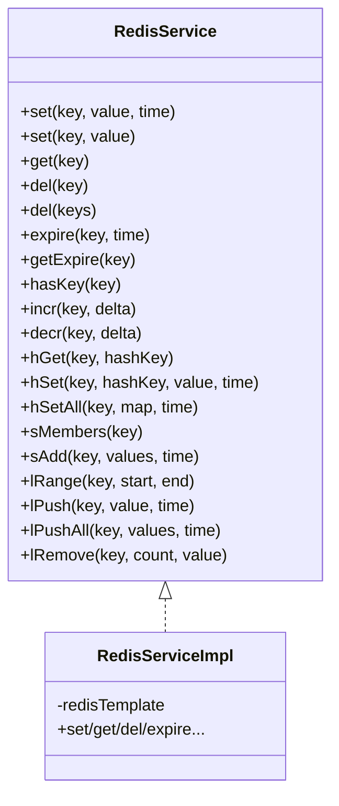
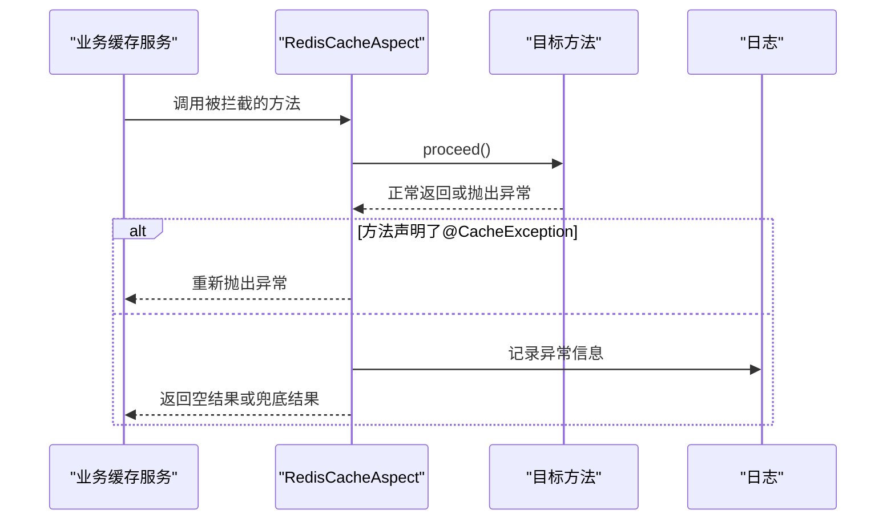
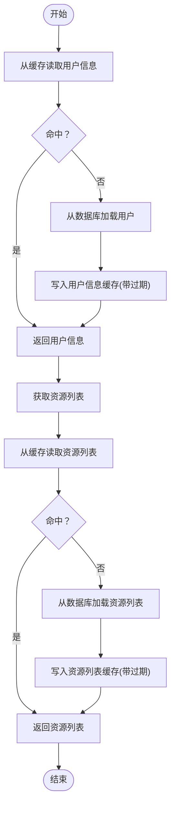
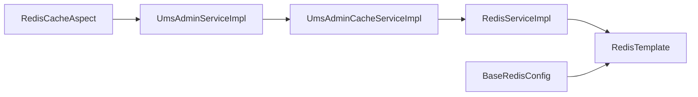

# 缓存架构设计

<cite>
**本文引用的文件**
- [RedisConfig.java](file://src/main/java/com/macro/mall/tiny/config/RedisConfig.java)
- [BaseRedisConfig.java](file://src/main/java/com/macro/mall/tiny/common/config/BaseRedisConfig.java)
- [RedisService.java](file://src/main/java/com/macro/mall/tiny/common/service/RedisService.java)
- [RedisServiceImpl.java](file://src/main/java/com/macro/mall/tiny/common/service/impl/RedisServiceImpl.java)
- [RedisCacheAspect.java](file://src/main/java/com/macro/mall/tiny/security/aspect/RedisCacheAspect.java)
- [CacheException.java](file://src/main/java/com/macro/mall/tiny/security/annotation/CacheException.java)
- [UmsAdminCacheService.java](file://src/main/java/com/macro/mall/tiny/modules/ums/service/UmsAdminCacheService.java)
- [UmsAdminCacheServiceImpl.java](file://src/main/java/com/macro/mall/tiny/modules/ums/service/impl/UmsAdminCacheServiceImpl.java)
- [UmsAdminService.java](file://src/main/java/com/macro/mall/tiny/modules/ums/service/UmsAdminService.java)
- [UmsAdminServiceImpl.java](file://src/main/java/com/macro/mall/tiny/modules/ums/service/impl/UmsAdminServiceImpl.java)
- [application.yml](file://src/main/resources/application.yml)
</cite>

## 目录
1. [简介](#简介)
2. [项目结构](#项目结构)
3. [核心组件](#核心组件)
4. [架构总览](#架构总览)
5. [详细组件分析](#详细组件分析)
6. [依赖分析](#依赖分析)
7. [性能考虑](#性能考虑)
8. [故障排查指南](#故障排查指南)
9. [结论](#结论)
10. [附录](#附录)

## 简介
本文件系统性梳理 Mall-Tiny 基于 Redis 的分布式缓存架构设计，覆盖缓存配置类设计理念、连接池与序列化策略、缓存接口抽象与实现、缓存切面与异常处理、用户管理模块的缓存实践（用户信息、权限与动态权限），并给出缓存键命名规范、过期策略、内存管理与性能监控建议。

## 项目结构
围绕缓存的关键代码分布在以下包与文件：
- 配置层：RedisConfig、BaseRedisConfig
- 接口与实现：RedisService、RedisServiceImpl
- 安全与切面：RedisCacheAspect、CacheException
- 业务缓存：UmsAdminCacheService、UmsAdminCacheServiceImpl
- 业务服务：UmsAdminService、UmsAdminServiceImpl
- 配置文件：application.yml

**图示来源**
- [RedisConfig.java:11-15](file://src/main/java/com/macro/mall/tiny/config/RedisConfig.java#L11-L15)
- [BaseRedisConfig.java:28-68](file://src/main/java/com/macro/mall/tiny/common/config/BaseRedisConfig.java#L28-L68)
- [RedisService.java:11-182](file://src/main/java/com/macro/mall/tiny/common/service/RedisService.java#L11-L182)
- [RedisServiceImpl.java:16-198](file://src/main/java/com/macro/mall/tiny/common/service/impl/RedisServiceImpl.java#L16-L198)
- [RedisCacheAspect.java:21-51](file://src/main/java/com/macro/mall/tiny/security/aspect/RedisCacheAspect.java#L21-L51)
- [CacheException.java:8-12](file://src/main/java/com/macro/mall/tiny/security/annotation/CacheException.java#L8-L12)
- [UmsAdminCacheService.java:14-59](file://src/main/java/com/macro/mall/tiny/modules/ums/service/UmsAdminCacheService.java#L14-L59)
- [UmsAdminCacheServiceImpl.java:24-116](file://src/main/java/com/macro/mall/tiny/modules/ums/service/impl/UmsAdminCacheServiceImpl.java#L24-L116)
- [UmsAdminService.java:19-89](file://src/main/java/com/macro/mall/tiny/modules/ums/service/UmsAdminService.java#L19-L89)
- [UmsAdminServiceImpl.java:47-272](file://src/main/java/com/macro/mall/tiny/modules/ums/service/impl/UmsAdminServiceImpl.java#L47-L272)
- [application.yml:30-37](file://src/main/resources/application.yml#L30-L37)

**章节来源**
- [RedisConfig.java:11-15](file://src/main/java/com/macro/mall/tiny/config/RedisConfig.java#L11-L15)
- [BaseRedisConfig.java:28-68](file://src/main/java/com/macro/mall/tiny/common/config/BaseRedisConfig.java#L28-L68)
- [application.yml:30-37](file://src/main/resources/application.yml#L30-L37)

## 核心组件
- 缓存配置类：通过继承 BaseRedisConfig 提供 RedisTemplate、序列化器与 RedisCacheManager 的 Bean 定义，启用 Spring Cache 并设置默认 TTL。
- 缓存接口与实现：RedisService 抽象了常用数据结构操作；RedisServiceImpl 统一封装 RedisTemplate 调用，提供过期时间、批量删除、集合与列表操作等。
- 缓存切面：RedisCacheAspect 对特定包下的缓存服务方法进行环绕增强，捕获异常并按需抛出，提升缓存异常对业务的容错能力。
- 业务缓存服务：UmsAdminCacheService 定义用户与资源列表的缓存 CRUD；UmsAdminCacheServiceImpl 实现键空间组织、失效策略与读写缓存。
- 业务服务：UmsAdminServiceImpl 在用户登录、角色变更、密码更新等场景触发缓存失效，确保缓存一致性。

**章节来源**
- [BaseRedisConfig.java:28-68](file://src/main/java/com/macro/mall/tiny/common/config/BaseRedisConfig.java#L28-L68)
- [RedisService.java:11-182](file://src/main/java/com/macro/mall/tiny/common/service/RedisService.java#L11-L182)
- [RedisServiceImpl.java:16-198](file://src/main/java/com/macro/mall/tiny/common/service/impl/RedisServiceImpl.java#L16-L198)
- [RedisCacheAspect.java:21-51](file://src/main/java/com/macro/mall/tiny/security/aspect/RedisCacheAspect.java#L21-L51)
- [UmsAdminCacheService.java:14-59](file://src/main/java/com/macro/mall/tiny/modules/ums/service/UmsAdminCacheService.java#L14-L59)
- [UmsAdminCacheServiceImpl.java:24-116](file://src/main/java/com/macro/mall/tiny/modules/ums/service/impl/UmsAdminCacheServiceImpl.java#L24-L116)
- [UmsAdminService.java:19-89](file://src/main/java/com/macro/mall/tiny/modules/ums/service/UmsAdminService.java#L19-L89)
- [UmsAdminServiceImpl.java:47-272](file://src/main/java/com/macro/mall/tiny/modules/ums/service/impl/UmsAdminServiceImpl.java#L47-L272)

## 架构总览
整体采用“配置层 + 接口层 + 实现层 + 切面层 + 业务层”的分层设计，RedisTemplate 作为底层客户端，RedisService 提供统一抽象，业务层在关键路径上读写缓存并主动失效，切面保障异常可控。

**图示来源**
- [RedisConfig.java:11-15](file://src/main/java/com/macro/mall/tiny/config/RedisConfig.java#L11-L15)
- [BaseRedisConfig.java:28-68](file://src/main/java/com/macro/mall/tiny/common/config/BaseRedisConfig.java#L28-L68)
- [UmsAdminServiceImpl.java:64-76](file://src/main/java/com/macro/mall/tiny/modules/ums/service/impl/UmsAdminServiceImpl.java#L64-L76)
- [UmsAdminCacheServiceImpl.java:92-114](file://src/main/java/com/macro/mall/tiny/modules/ums/service/impl/UmsAdminCacheServiceImpl.java#L92-L114)
- [RedisCacheAspect.java:31-48](file://src/main/java/com/macro/mall/tiny/security/aspect/RedisCacheAspect.java#L31-L48)
- [application.yml:30-37](file://src/main/resources/application.yml#L30-L37)

## 详细组件分析

### 缓存配置类设计
- 设计理念
  - 通过继承 BaseRedisConfig 将 RedisTemplate、序列化器与 RedisCacheManager 的 Bean 定义集中管理，避免重复配置。
  - 使用@EnableCaching 启用 Spring Cache，结合 RedisCacheManager 提供统一的缓存管理能力。
- 连接池与序列化
  - RedisTemplate 使用 StringRedisSerializer 作为键序列化，Jackson2JsonRedisSerializer 作为值序列化，支持复杂对象 JSON 序列化与反序列化。
  - 默认缓存 TTL 为 1 天，可通过业务层单独设置。
- 可扩展点
  - 可在子类中覆盖 RedisCacheManager 的 TTL 或自定义序列化策略。

**图示来源**
- [BaseRedisConfig.java:26-68](file://src/main/java/com/macro/mall/tiny/common/config/BaseRedisConfig.java#L26-L68)
- [RedisConfig.java:11-15](file://src/main/java/com/macro/mall/tiny/config/RedisConfig.java#L11-L15)

**章节来源**
- [BaseRedisConfig.java:28-68](file://src/main/java/com/macro/mall/tiny/common/config/BaseRedisConfig.java#L28-L68)
- [RedisConfig.java:11-15](file://src/main/java/com/macro/mall/tiny/config/RedisConfig.java#L11-L15)

### 缓存接口与实现
- 接口设计模式
  - RedisService 抽象了常用数据结构操作（字符串、哈希、集合、列表）及通用方法（过期、存在性、自增自减等），职责单一、易于替换。
- 实现类统一管理
  - RedisServiceImpl 将 RedisTemplate 的调用封装为链式 API，提供过期时间控制、批量删除、集合与列表操作等，减少业务层直接依赖 RedisTemplate。
- 序列化策略
  - 值序列化采用 Jackson2JsonRedisSerializer，配合 ObjectMapper.DefaultTyping.NON_FINAL 以支持多态对象的 JSON 序列化与反序列化。

**图示来源**
- [RedisService.java:11-182](file://src/main/java/com/macro/mall/tiny/common/service/RedisService.java#L11-L182)
- [RedisServiceImpl.java:16-198](file://src/main/java/com/macro/mall/tiny/common/service/impl/RedisServiceImpl.java#L16-L198)

**章节来源**
- [RedisService.java:11-182](file://src/main/java/com/macro/mall/tiny/common/service/RedisService.java#L11-L182)
- [RedisServiceImpl.java:16-198](file://src/main/java/com/macro/mall/tiny/common/service/impl/RedisServiceImpl.java#L16-L198)
- [BaseRedisConfig.java:42-51](file://src/main/java/com/macro/mall/tiny/common/config/BaseRedisConfig.java#L42-L51)

### 缓存切面设计
- 注解与拦截范围
  - RedisCacheAspect 对 com.macro.mall.tiny.service.*CacheService.* 方法进行拦截，环绕执行目标方法。
- 异常处理策略
  - 捕获目标方法抛出的异常；若方法声明了 CacheException 注解，则继续抛出；否则记录日志并吞掉异常，保证业务不受缓存失败影响。
- 顺序控制
  - @Order(2) 确保切面在其他切面之后执行，避免对前置条件造成干扰。

**图示来源**
- [RedisCacheAspect.java:27-48](file://src/main/java/com/macro/mall/tiny/security/aspect/RedisCacheAspect.java#L27-L48)
- [CacheException.java:8-12](file://src/main/java/com/macro/mall/tiny/security/annotation/CacheException.java#L8-L12)

**章节来源**
- [RedisCacheAspect.java:21-51](file://src/main/java/com/macro/mall/tiny/security/aspect/RedisCacheAspect.java#L21-L51)
- [CacheException.java:8-12](file://src/main/java/com/macro/mall/tiny/security/annotation/CacheException.java#L8-L12)

### 用户管理模块缓存实现
- 缓存职责划分
  - 用户信息缓存：按用户名维度缓存 UmsAdmin，用于登录与鉴权快速获取用户基本信息。
  - 权限缓存：按用户 ID 维度缓存资源列表，用于权限校验与动态权限过滤。
  - 动态权限缓存：当角色或资源发生变更时，按角色 ID 或资源 ID 批量失效相关用户权限缓存。
- 键命名规范
  - 使用“数据库名:前缀:标识符”的层级命名，如：
    - 用户信息键：{database}:{key.admin}:{username}
    - 资源列表键：{database}:{key.resourceList}:{adminId}
- 过期策略
  - 通用过期时间由配置项 redis.expire.common 控制，默认 24 小时。
- 一致性保证
  - 在用户更新、删除、角色变更、密码修改等关键路径主动删除相关缓存键，确保后续读取从数据库刷新最新数据。

**图示来源**
- [UmsAdminServiceImpl.java:64-76](file://src/main/java/com/macro/mall/tiny/modules/ums/service/impl/UmsAdminServiceImpl.java#L64-L76)
- [UmsAdminServiceImpl.java:220-231](file://src/main/java/com/macro/mall/tiny/modules/ums/service/impl/UmsAdminServiceImpl.java#L220-L231)
- [UmsAdminCacheServiceImpl.java:92-114](file://src/main/java/com/macro/mall/tiny/modules/ums/service/impl/UmsAdminCacheServiceImpl.java#L92-L114)

**章节来源**
- [UmsAdminCacheService.java:14-59](file://src/main/java/com/macro/mall/tiny/modules/ums/service/UmsAdminCacheService.java#L14-L59)
- [UmsAdminCacheServiceImpl.java:24-116](file://src/main/java/com/macro/mall/tiny/modules/ums/service/impl/UmsAdminCacheServiceImpl.java#L24-L116)
- [UmsAdminService.java:19-89](file://src/main/java/com/macro/mall/tiny/modules/ums/service/UmsAdminService.java#L19-L89)
- [UmsAdminServiceImpl.java:181-213](file://src/main/java/com/macro/mall/tiny/modules/ums/service/impl/UmsAdminServiceImpl.java#L181-L213)
- [application.yml:30-37](file://src/main/resources/application.yml#L30-L37)

## 依赖分析
- 组件耦合
  - UmsAdminServiceImpl 依赖 UmsAdminCacheService 进行缓存读写；UmsAdminCacheServiceImpl 依赖 RedisService 与数据库映射关系进行缓存维护。
  - RedisServiceImpl 依赖 RedisTemplate，BaseRedisConfig 提供 RedisTemplate 与序列化器 Bean。
  - RedisCacheAspect 通过注解与包路径拦截业务缓存服务，降低对业务代码的侵入。
- 外部依赖
  - Spring Cache、Redis、Jackson2JsonRedisSerializer、Hutool 集合工具库。

**图示来源**
- [UmsAdminServiceImpl.java:268-270](file://src/main/java/com/macro/mall/tiny/modules/ums/service/impl/UmsAdminServiceImpl.java#L268-L270)
- [UmsAdminCacheServiceImpl.java:24-116](file://src/main/java/com/macro/mall/tiny/modules/ums/service/impl/UmsAdminCacheServiceImpl.java#L24-L116)
- [RedisServiceImpl.java:16-198](file://src/main/java/com/macro/mall/tiny/common/service/impl/RedisServiceImpl.java#L16-L198)
- [BaseRedisConfig.java:28-39](file://src/main/java/com/macro/mall/tiny/common/config/BaseRedisConfig.java#L28-L39)
- [RedisCacheAspect.java:27-29](file://src/main/java/com/macro/mall/tiny/security/aspect/RedisCacheAspect.java#L27-L29)

**章节来源**
- [UmsAdminServiceImpl.java:47-272](file://src/main/java/com/macro/mall/tiny/modules/ums/service/impl/UmsAdminServiceImpl.java#L47-L272)
- [UmsAdminCacheServiceImpl.java:24-116](file://src/main/java/com/macro/mall/tiny/modules/ums/service/impl/UmsAdminCacheServiceImpl.java#L24-L116)
- [RedisServiceImpl.java:16-198](file://src/main/java/com/macro/mall/tiny/common/service/impl/RedisServiceImpl.java#L16-L198)
- [BaseRedisConfig.java:28-39](file://src/main/java/com/macro/mall/tiny/common/config/BaseRedisConfig.java#L28-L39)
- [RedisCacheAspect.java:27-29](file://src/main/java/com/macro/mall/tiny/security/aspect/RedisCacheAspect.java#L27-L29)

## 性能考虑
- 序列化开销
  - JSON 序列化适合跨语言与可读性，但 CPU 开销高于二进制序列化；可按热点数据评估是否引入更快的序列化方案。
- 过期策略
  - 默认缓存 TTL 为 1 天，业务层使用通用过期时间 redis.expire.common（24 小时）。对高并发读取场景，建议根据访问模式设置更细粒度的 TTL。
- 内存管理
  - 使用合理 TTL 与键空间前缀，定期清理无效键；对大对象（如资源列表）建议分页或拆分缓存，避免单键过大。
- 并发与锁
  - RedisCacheManager 使用非阻塞写入，避免分布式锁带来的额外延迟；对热点键可考虑本地缓存（如 Caffeine）做二级加速。
- 监控指标
  - 建议采集命中率、过期键数量、内存使用、命令耗时、连接池状态等指标，结合业务峰值进行容量规划。

[本节为通用性能建议，无需列出具体文件来源]

## 故障排查指南
- 缓存异常导致业务中断
  - 症状：缓存不可用时业务报错。
  - 处理：在业务缓存服务方法上使用 @CacheException 注解，使异常透传；未标注时切面会吞掉异常并记录日志，保证业务可用。
- 缓存不一致
  - 症状：角色或资源变更后权限未生效。
  - 处理：确认在角色变更、资源变更、用户更新、删除等路径已调用缓存失效方法；检查键命名与过期时间配置。
- 序列化问题
  - 症状：JSON 反序列化为 Map 或类型丢失。
  - 处理：确认 BaseRedisConfig 中 Jackson2JsonRedisSerializer 已启用 DefaultTyping.NON_FINAL；确保实体类具备完整构造函数与可序列化字段。

**章节来源**
- [RedisCacheAspect.java:31-48](file://src/main/java/com/macro/mall/tiny/security/aspect/RedisCacheAspect.java#L31-L48)
- [CacheException.java:8-12](file://src/main/java/com/macro/mall/tiny/security/annotation/CacheException.java#L8-L12)
- [BaseRedisConfig.java:42-51](file://src/main/java/com/macro/mall/tiny/common/config/BaseRedisConfig.java#L42-L51)
- [UmsAdminServiceImpl.java:181-213](file://src/main/java/com/macro/mall/tiny/modules/ums/service/impl/UmsAdminServiceImpl.java#L181-L213)

## 结论
Mall-Tiny 的缓存架构以 BaseRedisConfig 为核心，通过 RedisService 抽象与 RedisServiceImpl 统一实现，结合 RedisCacheAspect 的异常容错与 UmsAdminCacheServiceImpl 的业务缓存策略，实现了用户信息与权限缓存的高效读取与一致失效。建议在生产环境中进一步细化 TTL、引入监控与二级缓存，并持续优化序列化与键空间设计以提升整体性能与稳定性。

[本节为总结性内容，无需列出具体文件来源]

## 附录

### 缓存键命名规范
- 用户信息键：{redis.database}:{redis.key.admin}:{username}
- 资源列表键：{redis.database}:{redis.key.resourceList}:{adminId}
- 建议：使用冒号分隔层级，便于运维检索与清理。

**章节来源**
- [UmsAdminCacheServiceImpl.java:47-114](file://src/main/java/com/macro/mall/tiny/modules/ums/service/impl/UmsAdminCacheServiceImpl.java#L47-L114)
- [application.yml:30-37](file://src/main/resources/application.yml#L30-L37)

### 过期时间策略
- 默认缓存 TTL：1 天（由 RedisCacheManager 设置）
- 业务层通用过期：redis.expire.common=86400（秒，即 24 小时）
- 建议：对高敏感数据（如登录态）采用更短 TTL；对只读静态数据可延长 TTL。

**章节来源**
- [BaseRedisConfig.java:54-60](file://src/main/java/com/macro/mall/tiny/common/config/BaseRedisConfig.java#L54-L60)
- [application.yml:35-37](file://src/main/resources/application.yml#L35-L37)

### 内存管理方案
- TTL 策略：为不同业务设置差异化 TTL，避免全局一致导致的内存浪费。
- 键空间前缀：使用统一前缀隔离业务域，便于批量清理与容量统计。
- 大对象拆分：对长列表或大对象进行分页或拆分，降低单键内存占用。

[本节为通用建议，无需列出具体文件来源]

### 缓存性能监控指标
- 命中率：(命中数)/(命中数+未命中数)
- 过期键数量：定期统计过期键数量，评估 TTL 合理性
- 内存使用：监控 Redis 内存使用与碎片率
- 命令耗时：采样慢查询与热点命令
- 连接池状态：活跃连接数、等待队列长度

[本节为通用建议，无需列出具体文件来源]