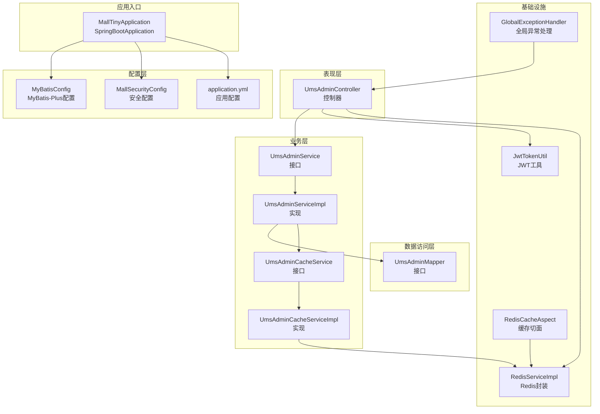
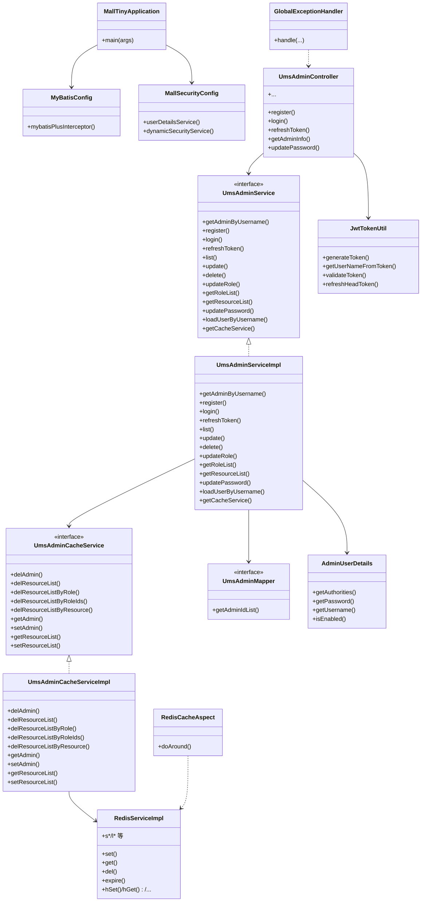
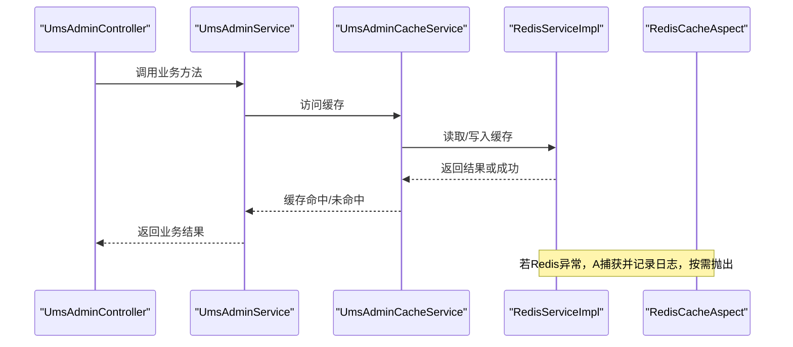
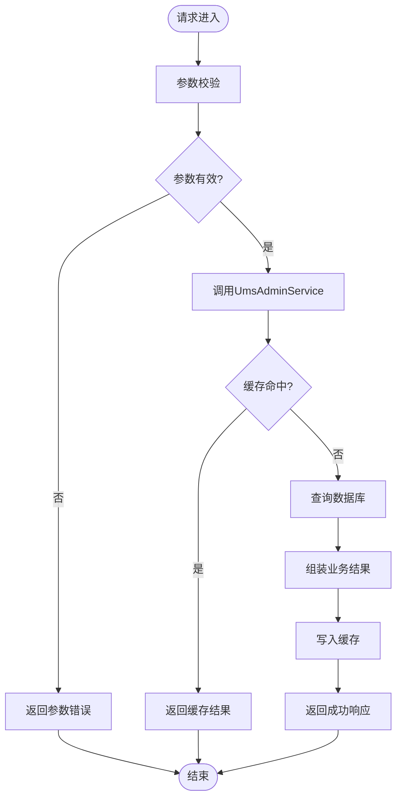
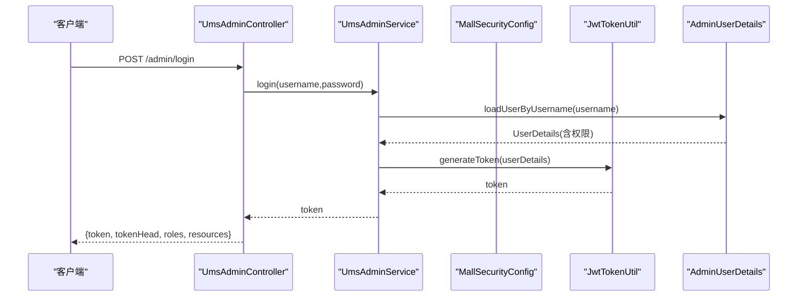
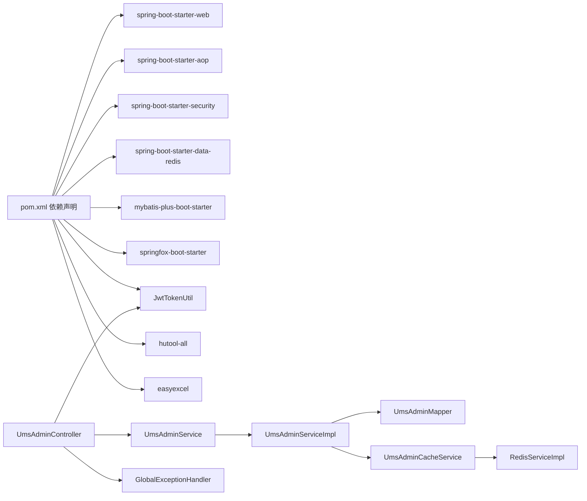

# 整体架构概览

<cite>
**本文引用的文件**
- [MallTinyApplication.java](file://src/main/java/com/macro/mall/tiny/MallTinyApplication.java)
- [pom.xml](file://pom.xml)
- [application.yml](file://src/main/resources/application.yml)
- [MyBatisConfig.java](file://src/main/java/com/macro/mall/tiny/config/MyBatisConfig.java)
- [MallSecurityConfig.java](file://src/main/java/com/macro/mall/tiny/config/MallSecurityConfig.java)
- [RedisCacheAspect.java](file://src/main/java/com/macro/mall/tiny/security/aspect/RedisCacheAspect.java)
- [RedisServiceImpl.java](file://src/main/java/com/macro/mall/tiny/common/service/impl/RedisServiceImpl.java)
- [UmsAdminController.java](file://src/main/java/com/macro/mall/tiny/modules/ums/controller/UmsAdminController.java)
- [UmsAdminService.java](file://src/main/java/com/macro/mall/tiny/modules/ums/service/UmsAdminService.java)
- [UmsAdminServiceImpl.java](file://src/main/java/com/macro/mall/tiny/modules/ums/service/impl/UmsAdminServiceImpl.java)
- [UmsAdminCacheService.java](file://src/main/java/com/macro/mall/tiny/modules/ums/service/UmsAdminCacheService.java)
- [UmsAdminCacheServiceImpl.java](file://src/main/java/com/macro/mall/tiny/modules/ums/service/impl/UmsAdminCacheServiceImpl.java)
- [UmsAdminMapper.java](file://src/main/java/com/macro/mall/tiny/modules/ums/mapper/UmsAdminMapper.java)
- [AdminUserDetails.java](file://src/main/java/com/macro/mall/tiny/domain/AdminUserDetails.java)
- [JwtTokenUtil.java](file://src/main/java/com/macro/mall/tiny/security/util/JwtTokenUtil.java)
- [GlobalExceptionHandler.java](file://src/main/java/com/macro/mall/tiny/common/exception/GlobalExceptionHandler.java)
</cite>

## 目录
1. [引言](#引言)
2. [项目结构](#项目结构)
3. [核心组件](#核心组件)
4. [架构总览](#架构总览)
5. [详细组件分析](#详细组件分析)
6. [依赖分析](#依赖分析)
7. [性能考虑](#性能考虑)
8. [故障排查指南](#故障排查指南)
9. [结论](#结论)
10. [附录](#附录)

## 引言
本文件面向Mall-Tiny项目的整体架构与实现，围绕基于Spring Boot的分层架构展开，重点说明表现层（Controller）、业务层（Service）、数据访问层（Mapper）的职责划分与交互关系；阐述模块化设计理念与UMS用户管理模块的组织结构与功能边界；解释MVC设计模式在本项目中的具体实现、依赖注入容器工作机制、以及AOP切面编程在日志记录与缓存管理中的应用；并梳理系统启动流程、配置加载机制与组件初始化顺序。文档同时提供架构图、组件关系图与数据流向图，并总结架构决策的技术考量与设计原则。

## 项目结构
Mall-Tiny采用标准的Spring Boot工程布局，按功能域划分模块，核心模块集中在modules目录下，UMS为用户与权限管理域。整体结构遵循“表现层-业务层-数据访问层”的分层设计，配合Spring Security与MyBatis-Plus实现认证授权与数据持久化。

**图表来源**
- [MallTinyApplication.java:1-14](file://src/main/java/com/macro/mall/tiny/MallTinyApplication.java#L1-L14)
- [MyBatisConfig.java:1-28](file://src/main/java/com/macro/mall/tiny/config/MyBatisConfig.java#L1-L28)
- [MallSecurityConfig.java:1-54](file://src/main/java/com/macro/mall/tiny/config/MallSecurityConfig.java#L1-L54)
- [UmsAdminController.java:1-350](file://src/main/java/com/macro/mall/tiny/modules/ums/controller/UmsAdminController.java#L1-L350)
- [UmsAdminService.java:1-90](file://src/main/java/com/macro/mall/tiny/modules/ums/service/UmsAdminService.java#L1-L90)
- [UmsAdminServiceImpl.java:1-272](file://src/main/java/com/macro/mall/tiny/modules/ums/service/impl/UmsAdminServiceImpl.java#L1-L272)
- [UmsAdminCacheService.java:1-60](file://src/main/java/com/macro/mall/tiny/modules/ums/service/UmsAdminCacheService.java#L1-L60)
- [UmsAdminCacheServiceImpl.java:1-116](file://src/main/java/com/macro/mall/tiny/modules/ums/service/impl/UmsAdminCacheServiceImpl.java#L1-L116)
- [UmsAdminMapper.java:1-25](file://src/main/java/com/macro/mall/tiny/modules/ums/mapper/UmsAdminMapper.java#L1-L25)
- [JwtTokenUtil.java:1-171](file://src/main/java/com/macro/mall/tiny/security/util/JwtTokenUtil.java#L1-L171)
- [RedisServiceImpl.java:1-198](file://src/main/java/com/macro/mall/tiny/common/service/impl/RedisServiceImpl.java#L1-L198)
- [RedisCacheAspect.java:1-51](file://src/main/java/com/macro/mall/tiny/security/aspect/RedisCacheAspect.java#L1-L51)
- [GlobalExceptionHandler.java:1-100](file://src/main/java/com/macro/mall/tiny/common/exception/GlobalExceptionHandler.java#L1-L100)

**章节来源**
- [MallTinyApplication.java:1-14](file://src/main/java/com/macro/mall/tiny/MallTinyApplication.java#L1-L14)
- [pom.xml:1-222](file://pom.xml#L1-L222)
- [application.yml:1-57](file://src/main/resources/application.yml#L1-L57)

## 核心组件
- 应用入口与启动
  - 使用@SpringBootApplication标注主类，交由Spring Boot自动装配与组件扫描，启动嵌入式Web容器。
- 配置层
  - MyBatisConfig：启用事务、分页插件、Mapper扫描范围。
  - MallSecurityConfig：提供UserDetailsService与动态权限数据源，整合Spring Security。
  - application.yml：统一管理端口、MyBatis-Plus映射、JWT、Redis键空间与白名单等配置。
- 表现层（Controller）
  - UmsAdminController：提供用户注册、登录、刷新Token、个人信息、角色与资源查询、密码更新等REST接口。
- 业务层（Service）
  - UmsAdminService：定义用户域核心业务契约；UmsAdminServiceImpl：实现登录、鉴权、缓存、角色与资源查询、密码更新等。
  - UmsAdminCacheService：抽象缓存策略；UmsAdminCacheServiceImpl：基于Redis的用户与资源列表缓存实现。
- 数据访问层（Mapper）
  - UmsAdminMapper：定义用户相关查询，如资源关联的用户ID列表。
- 基础设施
  - JwtTokenUtil：JWT生成、解析、刷新与校验。
  - RedisServiceImpl：对RedisTemplate的常用操作封装。
  - RedisCacheAspect：对以CacheService命名的缓存方法进行AOP保护，避免Redis异常影响主流程。
  - GlobalExceptionHandler：统一异常处理，屏蔽底层异常细节，返回标准化响应。

**章节来源**
- [MyBatisConfig.java:1-28](file://src/main/java/com/macro/mall/tiny/config/MyBatisConfig.java#L1-L28)
- [MallSecurityConfig.java:1-54](file://src/main/java/com/macro/mall/tiny/config/MallSecurityConfig.java#L1-L54)
- [application.yml:1-57](file://src/main/resources/application.yml#L1-L57)
- [UmsAdminController.java:1-350](file://src/main/java/com/macro/mall/tiny/modules/ums/controller/UmsAdminController.java#L1-L350)
- [UmsAdminService.java:1-90](file://src/main/java/com/macro/mall/tiny/modules/ums/service/UmsAdminService.java#L1-L90)
- [UmsAdminServiceImpl.java:1-272](file://src/main/java/com/macro/mall/tiny/modules/ums/service/impl/UmsAdminServiceImpl.java#L1-L272)
- [UmsAdminCacheService.java:1-60](file://src/main/java/com/macro/mall/tiny/modules/ums/service/UmsAdminCacheService.java#L1-L60)
- [UmsAdminCacheServiceImpl.java:1-116](file://src/main/java/com/macro/mall/tiny/modules/ums/service/impl/UmsAdminCacheServiceImpl.java#L1-L116)
- [UmsAdminMapper.java:1-25](file://src/main/java/com/macro/mall/tiny/modules/ums/mapper/UmsAdminMapper.java#L1-L25)
- [JwtTokenUtil.java:1-171](file://src/main/java/com/macro/mall/tiny/security/util/JwtTokenUtil.java#L1-L171)
- [RedisServiceImpl.java:1-198](file://src/main/java/com/macro/mall/tiny/common/service/impl/RedisServiceImpl.java#L1-L198)
- [RedisCacheAspect.java:1-51](file://src/main/java/com/macro/mall/tiny/security/aspect/RedisCacheAspect.java#L1-L51)
- [GlobalExceptionHandler.java:1-100](file://src/main/java/com/macro/mall/tiny/common/exception/GlobalExceptionHandler.java#L1-L100)

## 架构总览
Mall-Tiny采用经典的三层架构：
- 表现层（Controller）：接收HTTP请求，调用业务层，返回标准化响应。
- 业务层（Service）：编排领域逻辑、调用缓存与数据访问层、处理事务。
- 数据访问层（Mapper）：基于MyBatis-Plus执行SQL，提供分页与条件查询能力。

安全与缓存通过Spring Security与AOP切面集成：
- Spring Security：基于JWT与动态权限，实现细粒度资源级访问控制。
- AOP切面：对缓存方法进行容错保护，降低Redis故障对业务的影响。

**图表来源**
- [MallTinyApplication.java:1-14](file://src/main/java/com/macro/mall/tiny/MallTinyApplication.java#L1-L14)
- [MyBatisConfig.java:1-28](file://src/main/java/com/macro/mall/tiny/config/MyBatisConfig.java#L1-L28)
- [MallSecurityConfig.java:1-54](file://src/main/java/com/macro/mall/tiny/config/MallSecurityConfig.java#L1-L54)
- [UmsAdminController.java:1-350](file://src/main/java/com/macro/mall/tiny/modules/ums/controller/UmsAdminController.java#L1-L350)
- [UmsAdminService.java:1-90](file://src/main/java/com/macro/mall/tiny/modules/ums/service/UmsAdminService.java#L1-L90)
- [UmsAdminServiceImpl.java:1-272](file://src/main/java/com/macro/mall/tiny/modules/ums/service/impl/UmsAdminServiceImpl.java#L1-L272)
- [UmsAdminCacheService.java:1-60](file://src/main/java/com/macro/mall/tiny/modules/ums/service/UmsAdminCacheService.java#L1-L60)
- [UmsAdminCacheServiceImpl.java:1-116](file://src/main/java/com/macro/mall/tiny/modules/ums/service/impl/UmsAdminCacheServiceImpl.java#L1-L116)
- [UmsAdminMapper.java:1-25](file://src/main/java/com/macro/mall/tiny/modules/ums/mapper/UmsAdminMapper.java#L1-L25)
- [JwtTokenUtil.java:1-171](file://src/main/java/com/macro/mall/tiny/security/util/JwtTokenUtil.java#L1-L171)
- [RedisServiceImpl.java:1-198](file://src/main/java/com/macro/mall/tiny/common/service/impl/RedisServiceImpl.java#L1-L198)
- [RedisCacheAspect.java:1-51](file://src/main/java/com/macro/mall/tiny/security/aspect/RedisCacheAspect.java#L1-L51)
- [AdminUserDetails.java:1-87](file://src/main/java/com/macro/mall/tiny/domain/AdminUserDetails.java#L1-L87)
- [GlobalExceptionHandler.java:1-100](file://src/main/java/com/macro/mall/tiny/common/exception/GlobalExceptionHandler.java#L1-L100)

## 详细组件分析

### MVC设计模式实现
- 控制器（Controller）
  - UmsAdminController：基于@RequestMapping与@RestControllerAdvice，提供REST风格接口，集中处理参数校验、业务调用与结果封装。
- 视图解析与响应
  - 统一返回包装类（CommonResult/CommonPage），异常通过GlobalExceptionHandler转换为标准化错误响应。
- 业务编排
  - 控制器仅负责参数接收与调用Service，不直接操作缓存或数据库，保证职责单一。

**章节来源**
- [UmsAdminController.java:1-350](file://src/main/java/com/macro/mall/tiny/modules/ums/controller/UmsAdminController.java#L1-L350)
- [GlobalExceptionHandler.java:1-100](file://src/main/java/com/macro/mall/tiny/common/exception/GlobalExceptionHandler.java#L1-L100)

### 依赖注入容器工作机制
- 组件发现与注册
  - @SpringBootApplication触发组件扫描，自动注册@Controller、@Service、@Repository、@Configuration等。
- Bean生命周期
  - Service默认单例，通过@Autowired注入依赖；Redis、JWT工具等作为Bean在容器中共享。
- 动态权限与用户详情
  - MallSecurityConfig通过@Bean提供UserDetailsService与动态权限数据源，供Spring Security使用。

**章节来源**
- [MallTinyApplication.java:1-14](file://src/main/java/com/macro/mall/tiny/MallTinyApplication.java#L1-L14)
- [MallSecurityConfig.java:1-54](file://src/main/java/com/macro/mall/tiny/config/MallSecurityConfig.java#L1-L54)

### AOP切面编程：日志与缓存容错
- RedisCacheAspect
  - 对匹配“以CacheService结尾”的公共方法进行环绕增强，捕获异常并按需抛出，避免Redis故障导致业务中断。
  - 通过@Order(2)确保在其他切面之后执行，形成稳定的增强链。
- 日志记录
  - 控制器与服务层广泛使用SLF4J输出关键流程日志，便于审计与排障。

**图表来源**
- [UmsAdminController.java:1-350](file://src/main/java/com/macro/mall/tiny/modules/ums/controller/UmsAdminController.java#L1-L350)
- [UmsAdminService.java:1-90](file://src/main/java/com/macro/mall/tiny/modules/ums/service/UmsAdminService.java#L1-L90)
- [UmsAdminCacheService.java:1-60](file://src/main/java/com/macro/mall/tiny/modules/ums/service/UmsAdminCacheService.java#L1-L60)
- [UmsAdminCacheServiceImpl.java:1-116](file://src/main/java/com/macro/mall/tiny/modules/ums/service/impl/UmsAdminCacheServiceImpl.java#L1-L116)
- [RedisServiceImpl.java:1-198](file://src/main/java/com/macro/mall/tiny/common/service/impl/RedisServiceImpl.java#L1-L198)
- [RedisCacheAspect.java:1-51](file://src/main/java/com/macro/mall/tiny/security/aspect/RedisCacheAspect.java#L1-L51)

**章节来源**
- [RedisCacheAspect.java:1-51](file://src/main/java/com/macro/mall/tiny/security/aspect/RedisCacheAspect.java#L1-L51)
- [RedisServiceImpl.java:1-198](file://src/main/java/com/macro/mall/tiny/common/service/impl/RedisServiceImpl.java#L1-L198)

### UMS用户管理模块：职责与边界
- 控制器边界
  - UmsAdminController：暴露用户注册、登录、刷新Token、个人信息、角色与资源查询、密码更新等接口，参数校验与结果封装均在此完成。
- 业务边界
  - UmsAdminService：定义用户域核心业务契约；UmsAdminServiceImpl：实现登录鉴权、角色与资源查询、密码更新、缓存清理与写入等。
- 缓存边界
  - UmsAdminCacheService：抽象缓存策略；UmsAdminCacheServiceImpl：基于Redis实现用户信息与资源列表缓存，提供失效与批量失效能力。
- 数据访问边界
  - UmsAdminMapper：提供用户相关查询，如资源关联的用户ID列表，支撑动态权限与资源查询。

**图表来源**
- [UmsAdminController.java:1-350](file://src/main/java/com/macro/mall/tiny/modules/ums/controller/UmsAdminController.java#L1-L350)
- [UmsAdminService.java:1-90](file://src/main/java/com/macro/mall/tiny/modules/ums/service/UmsAdminService.java#L1-L90)
- [UmsAdminServiceImpl.java:1-272](file://src/main/java/com/macro/mall/tiny/modules/ums/service/impl/UmsAdminServiceImpl.java#L1-L272)
- [UmsAdminCacheService.java:1-60](file://src/main/java/com/macro/mall/tiny/modules/ums/service/UmsAdminCacheService.java#L1-L60)
- [UmsAdminCacheServiceImpl.java:1-116](file://src/main/java/com/macro/mall/tiny/modules/ums/service/impl/UmsAdminCacheServiceImpl.java#L1-L116)
- [UmsAdminMapper.java:1-25](file://src/main/java/com/macro/mall/tiny/modules/ums/mapper/UmsAdminMapper.java#L1-L25)

**章节来源**
- [UmsAdminController.java:1-350](file://src/main/java/com/macro/mall/tiny/modules/ums/controller/UmsAdminController.java#L1-L350)
- [UmsAdminService.java:1-90](file://src/main/java/com/macro/mall/tiny/modules/ums/service/UmsAdminService.java#L1-L90)
- [UmsAdminServiceImpl.java:1-272](file://src/main/java/com/macro/mall/tiny/modules/ums/service/impl/UmsAdminServiceImpl.java#L1-L272)
- [UmsAdminCacheService.java:1-60](file://src/main/java/com/macro/mall/tiny/modules/ums/service/UmsAdminCacheService.java#L1-L60)
- [UmsAdminCacheServiceImpl.java:1-116](file://src/main/java/com/macro/mall/tiny/modules/ums/service/impl/UmsAdminCacheServiceImpl.java#L1-L116)
- [UmsAdminMapper.java:1-25](file://src/main/java/com/macro/mall/tiny/modules/ums/mapper/UmsAdminMapper.java#L1-L25)

### 安全与认证：JWT与动态权限
- 用户详情与权限
  - AdminUserDetails：将用户与资源列表转换为Spring Security的权限集合，支持多种权限表达式格式。
- 用户加载
  - MallSecurityConfig.userDetailsService：委托UmsAdminService.loadUserByUsername获取用户详情。
- JWT令牌
  - JwtTokenUtil：生成、解析、校验与刷新Token，结合配置项控制密钥、过期时间与头部前缀。
- 白名单与忽略路径
  - application.yml中配置了无需鉴权的静态资源与开放接口，减少不必要的鉴权开销。

**图表来源**
- [UmsAdminController.java:1-350](file://src/main/java/com/macro/mall/tiny/modules/ums/controller/UmsAdminController.java#L1-L350)
- [UmsAdminService.java:1-90](file://src/main/java/com/macro/mall/tiny/modules/ums/service/UmsAdminService.java#L1-L90)
- [MallSecurityConfig.java:1-54](file://src/main/java/com/macro/mall/tiny/config/MallSecurityConfig.java#L1-L54)
- [JwtTokenUtil.java:1-171](file://src/main/java/com/macro/mall/tiny/security/util/JwtTokenUtil.java#L1-L171)
- [AdminUserDetails.java:1-87](file://src/main/java/com/macro/mall/tiny/domain/AdminUserDetails.java#L1-L87)

**章节来源**
- [MallSecurityConfig.java:1-54](file://src/main/java/com/macro/mall/tiny/config/MallSecurityConfig.java#L1-L54)
- [JwtTokenUtil.java:1-171](file://src/main/java/com/macro/mall/tiny/security/util/JwtTokenUtil.java#L1-L171)
- [AdminUserDetails.java:1-87](file://src/main/java/com/macro/mall/tiny/domain/AdminUserDetails.java#L1-L87)
- [application.yml:38-57](file://src/main/resources/application.yml#L38-L57)

### 数据访问与ORM：MyBatis-Plus
- 配置
  - MyBatisConfig启用分页插件与Mapper扫描，限定扫描范围为modules.*.mapper，避免误扫。
- 使用
  - UmsAdminServiceImpl继承IServiceImpl，直接获得分页、条件构造器等能力；自定义查询通过Mapper接口扩展。
- 配置加载
  - application.yml设置mapper-locations、驼峰映射与自动映射策略，提升开发效率与一致性。

**章节来源**
- [MyBatisConfig.java:1-28](file://src/main/java/com/macro/mall/tiny/config/MyBatisConfig.java#L1-L28)
- [UmsAdminServiceImpl.java:1-272](file://src/main/java/com/macro/mall/tiny/modules/ums/service/impl/UmsAdminServiceImpl.java#L1-L272)
- [application.yml:15-22](file://src/main/resources/application.yml#L15-L22)

## 依赖分析
- 外部依赖
  - Spring Boot Starter Web、AOP、Validation、Actuator、Security、Redis、MyBatis-Plus、Swagger、JWT、Hutool、EasyExcel等。
- 内部模块耦合
  - 控制器依赖业务接口；业务实现依赖Mapper与缓存接口；缓存实现依赖Redis；安全配置依赖业务Service与资源Service。
- 循环依赖规避
  - 通过接口隔离与依赖注入，避免控制器与实现之间的直接循环依赖；缓存服务通过工具类获取Bean，降低耦合。

**图表来源**
- [pom.xml:34-151](file://pom.xml#L34-L151)
- [UmsAdminController.java:1-350](file://src/main/java/com/macro/mall/tiny/modules/ums/controller/UmsAdminController.java#L1-L350)
- [UmsAdminService.java:1-90](file://src/main/java/com/macro/mall/tiny/modules/ums/service/UmsAdminService.java#L1-L90)
- [UmsAdminServiceImpl.java:1-272](file://src/main/java/com/macro/mall/tiny/modules/ums/service/impl/UmsAdminServiceImpl.java#L1-L272)
- [UmsAdminMapper.java:1-25](file://src/main/java/com/macro/mall/tiny/modules/ums/mapper/UmsAdminMapper.java#L1-L25)
- [UmsAdminCacheService.java:1-60](file://src/main/java/com/macro/mall/tiny/modules/ums/service/UmsAdminCacheService.java#L1-L60)
- [RedisServiceImpl.java:1-198](file://src/main/java/com/macro/mall/tiny/common/service/impl/RedisServiceImpl.java#L1-L198)
- [JwtTokenUtil.java:1-171](file://src/main/java/com/macro/mall/tiny/security/util/JwtTokenUtil.java#L1-L171)
- [GlobalExceptionHandler.java:1-100](file://src/main/java/com/macro/mall/tiny/common/exception/GlobalExceptionHandler.java#L1-L100)

**章节来源**
- [pom.xml:34-151](file://pom.xml#L34-L151)

## 性能考虑
- 缓存优先策略
  - 用户信息与资源列表缓存显著降低数据库压力；更新角色/资源后主动失效相关缓存，保证一致性。
- 分页与查询优化
  - MyBatis-Plus分页插件与条件构造器减少手写SQL复杂度，提高查询性能与可维护性。
- Redis操作封装
  - RedisServiceImpl提供丰富操作，结合过期策略与批量删除，提升缓存命中率与回收效率。
- AOP容错
  - RedisCacheAspect在缓存异常时降级处理，避免影响主流程，提升系统稳定性。

[本节为通用指导，不直接分析具体文件]

## 故障排查指南
- 统一异常处理
  - GlobalExceptionHandler覆盖参数校验、请求体解析、缺失参数、方法不支持、上传大小限制与访问拒绝等场景，返回标准化错误信息。
- 日志定位
  - 关键流程（登录、刷新Token、密码重置、缓存读写）均输出日志，便于快速定位问题。
- 缓存问题
  - 若出现缓存异常导致业务失败，检查RedisCacheAspect是否生效、Redis实例连通性与键空间配置。

**章节来源**
- [GlobalExceptionHandler.java:1-100](file://src/main/java/com/macro/mall/tiny/common/exception/GlobalExceptionHandler.java#L1-L100)
- [UmsAdminController.java:1-350](file://src/main/java/com/macro/mall/tiny/modules/ums/controller/UmsAdminController.java#L1-L350)
- [RedisCacheAspect.java:1-51](file://src/main/java/com/macro/mall/tiny/security/aspect/RedisCacheAspect.java#L1-L51)

## 结论
Mall-Tiny以Spring Boot为基础，采用清晰的分层架构与模块化设计，结合Spring Security与JWT实现认证授权，利用MyBatis-Plus简化数据访问，通过Redis与AOP提升性能与稳定性。UMS模块边界明确、职责清晰，具备良好的扩展性与可维护性。整体架构在保证功能完整性的同时，兼顾了性能、安全与可运维性。

[本节为总结性内容，不直接分析具体文件]

## 附录
- 系统启动流程与配置加载
  - 主类启动后，Spring Boot加载application.yml中的配置，初始化MyBatis-Plus与Security相关Bean，随后扫描并注册各层组件。
- 初始化顺序要点
  - 配置类（MyBatisConfig、MallSecurityConfig）先于业务类初始化；控制器依赖的Service在容器中可用；AOP切面在Bean创建后生效。
- 技术考量与设计原则
  - 分层解耦、接口隔离、依赖倒置、关注点分离、最小意外原则、防御式编程（AOP容错）、统一异常处理与日志输出。

**章节来源**
- [MallTinyApplication.java:1-14](file://src/main/java/com/macro/mall/tiny/MallTinyApplication.java#L1-L14)
- [MyBatisConfig.java:1-28](file://src/main/java/com/macro/mall/tiny/config/MyBatisConfig.java#L1-L28)
- [MallSecurityConfig.java:1-54](file://src/main/java/com/macro/mall/tiny/config/MallSecurityConfig.java#L1-L54)
- [application.yml:1-57](file://src/main/resources/application.yml#L1-L57)