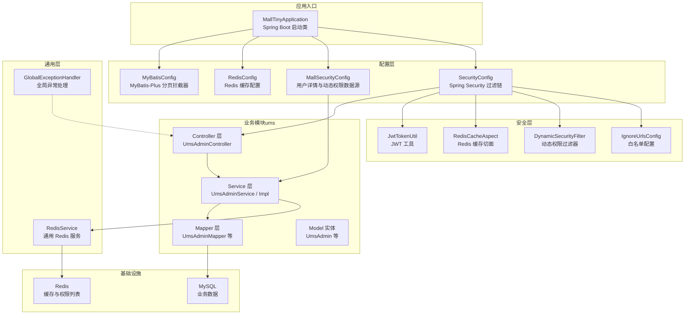
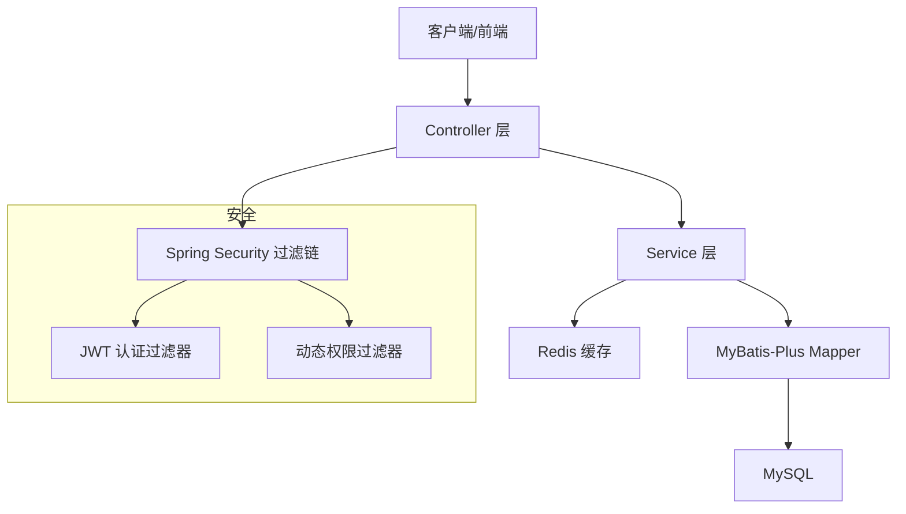
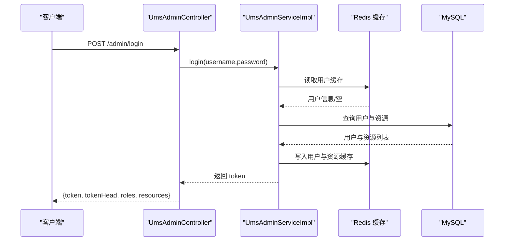
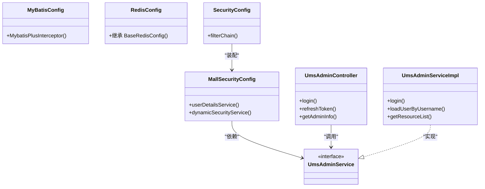
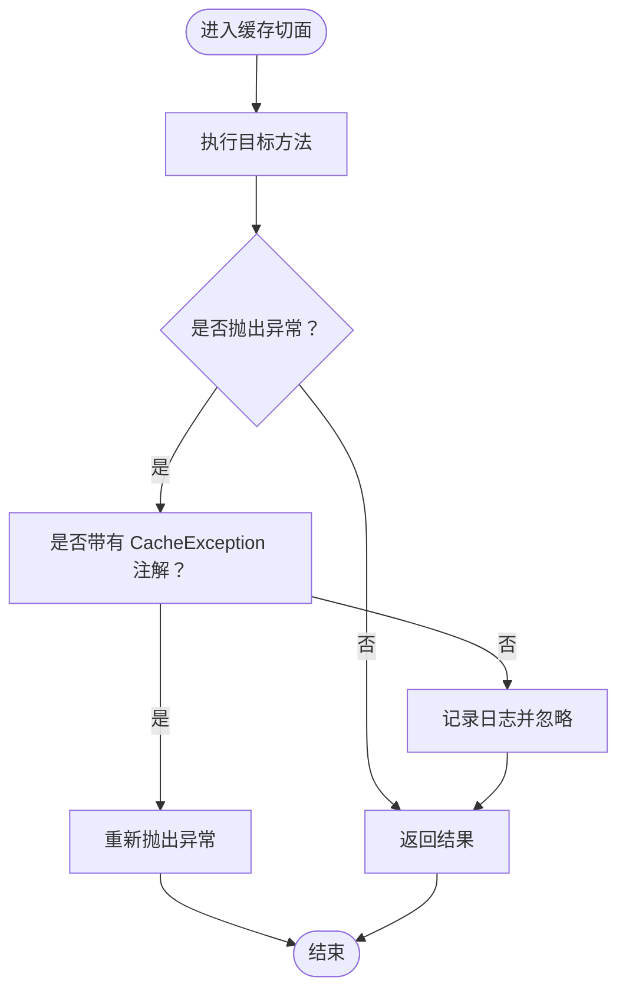
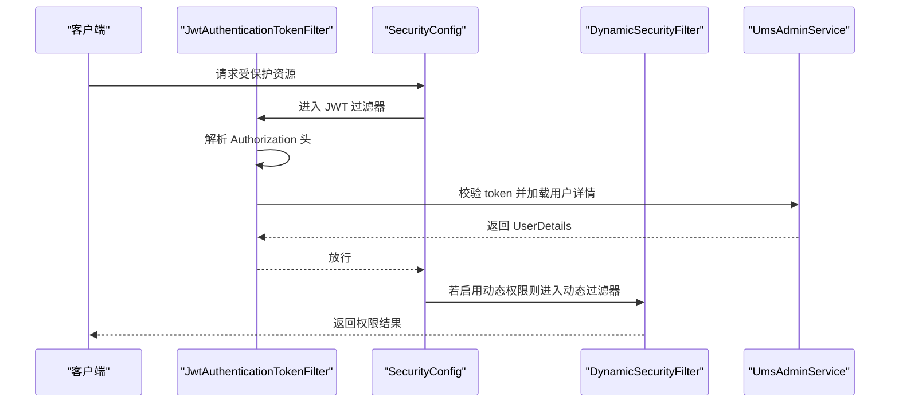
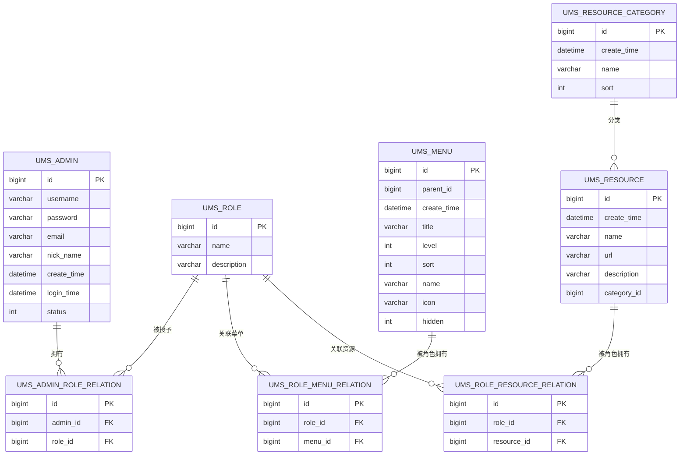
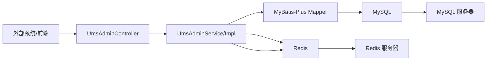
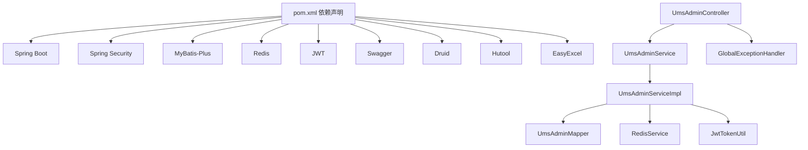

# 系统架构设计

<cite>
**本文引用的文件**
- [MallTinyApplication.java](file://src/main/java/com/macro/mall/tiny/MallTinyApplication.java)
- [pom.xml](file://pom.xml)
- [application.yml](file://src/main/resources/application.yml)
- [README.md](file://README.md)
- [MallSecurityConfig.java](file://src/main/java/com/macro/mall/tiny/config/MallSecurityConfig.java)
- [MyBatisConfig.java](file://src/main/java/com/macro/mall/tiny/config/MyBatisConfig.java)
- [RedisConfig.java](file://src/main/java/com/macro/mall/tiny/config/RedisConfig.java)
- [MyBatisPlusGenerator.java](file://src/main/java/com/macro/mall/tiny/generator/MyBatisPlusGenerator.java)
- [SecurityConfig.java](file://src/main/java/com/macro/mall/tiny/security/config/SecurityConfig.java)
- [RedisCacheAspect.java](file://src/main/java/com/macro/mall/tiny/security/aspect/RedisCacheAspect.java)
- [UmsAdminService.java](file://src/main/java/com/macro/mall/tiny/modules/ums/service/UmsAdminService.java)
- [UmsAdminController.java](file://src/main/java/com/macro/mall/tiny/modules/ums/controller/UmsAdminController.java)
- [UmsAdminServiceImpl.java](file://src/main/java/com/macro/mall/tiny/modules/ums/service/impl/UmsAdminServiceImpl.java)
- [JwtTokenUtil.java](file://src/main/java/com/macro/mall/tiny/security/util/JwtTokenUtil.java)
- [GlobalExceptionHandler.java](file://src/main/java/com/macro/mall/tiny/common/exception/GlobalExceptionHandler.java)
- [mall_tiny.sql](file://sql/mall_tiny.sql)
</cite>

## 目录
1. [简介](#简介)
2. [项目结构](#项目结构)
3. [核心组件](#核心组件)
4. [架构总览](#架构总览)
5. [详细组件分析](#详细组件分析)
6. [依赖关系分析](#依赖关系分析)
7. [性能考虑](#性能考虑)
8. [故障排查指南](#故障排查指南)
9. [结论](#结论)
10. [附录](#附录)

## 简介
Mall-Tiny 是一款基于 Spring Boot + MyBatis-Plus 的权限管理脚手架，提供完整的后台权限体系与开箱即用的前后端对接能力。系统采用分层架构与模块化设计，结合 Spring Security 实现认证与授权，利用 JWT 实现无状态鉴权，并通过 Redis 提供缓存与会话外置能力。MyBatis-Plus 代码生成器支持一键生成 CRUD 代码，加速业务开发。

## 项目结构
系统采用按功能域划分的模块化组织方式，核心模块集中在 ums（用户权限管理）下，配合通用层 common、配置层 config、安全层 security 与代码生成器 generator。资源文件集中于 resources，包含 MyBatis 映射 XML、配置文件与模板。

图表来源
- [MallTinyApplication.java:1-14](file://src/main/java/com/macro/mall/tiny/MallTinyApplication.java#L1-L14)
- [MyBatisConfig.java:1-28](file://src/main/java/com/macro/mall/tiny/config/MyBatisConfig.java#L1-L28)
- [RedisConfig.java:1-16](file://src/main/java/com/macro/mall/tiny/config/RedisConfig.java#L1-L16)
- [MallSecurityConfig.java:1-54](file://src/main/java/com/macro/mall/tiny/config/MallSecurityConfig.java#L1-L54)
- [SecurityConfig.java:1-86](file://src/main/java/com/macro/mall/tiny/security/config/SecurityConfig.java#L1-L86)
- [UmsAdminController.java:1-350](file://src/main/java/com/macro/mall/tiny/modules/ums/controller/UmsAdminController.java#L1-L350)
- [UmsAdminService.java:1-90](file://src/main/java/com/macro/mall/tiny/modules/ums/service/UmsAdminService.java#L1-L90)
- [UmsAdminServiceImpl.java:1-272](file://src/main/java/com/macro/mall/tiny/modules/ums/service/impl/UmsAdminServiceImpl.java#L1-L272)
- [JwtTokenUtil.java:1-171](file://src/main/java/com/macro/mall/tiny/security/util/JwtTokenUtil.java#L1-L171)
- [RedisCacheAspect.java:1-51](file://src/main/java/com/macro/mall/tiny/security/aspect/RedisCacheAspect.java#L1-L51)
- [GlobalExceptionHandler.java:1-100](file://src/main/java/com/macro/mall/tiny/common/exception/GlobalExceptionHandler.java#L1-L100)

章节来源
- [README.md:61-98](file://README.md#L61-L98)
- [pom.xml:34-151](file://pom.xml#L34-L151)

## 核心组件
- 启动类与容器：Spring Boot 启动类负责应用上下文初始化与自动装配。
- 配置层：MyBatis-Plus 分页拦截器、Redis 缓存配置、安全过滤链与用户详情提供。
- 业务层：以 ums 模块为核心，提供后台用户、角色、菜单、资源等权限相关能力。
- 安全层：JWT 工具、动态权限过滤器、白名单配置与全局异常处理。
- 基础设施：MySQL 业务数据与 Redis 缓存。

章节来源
- [MallTinyApplication.java:1-14](file://src/main/java/com/macro/mall/tiny/MallTinyApplication.java#L1-L14)
- [MyBatisConfig.java:15-28](file://src/main/java/com/macro/mall/tiny/config/MyBatisConfig.java#L15-L28)
- [RedisConfig.java:11-16](file://src/main/java/com/macro/mall/tiny/config/RedisConfig.java#L11-L16)
- [SecurityConfig.java:29-86](file://src/main/java/com/macro/mall/tiny/security/config/SecurityConfig.java#L29-L86)
- [UmsAdminService.java:19-90](file://src/main/java/com/macro/mall/tiny/modules/ums/service/UmsAdminService.java#L19-L90)
- [UmsAdminController.java:43-350](file://src/main/java/com/macro/mall/tiny/modules/ums/controller/UmsAdminController.java#L43-L350)
- [JwtTokenUtil.java:28-171](file://src/main/java/com/macro/mall/tiny/security/util/JwtTokenUtil.java#L28-L171)
- [GlobalExceptionHandler.java:22-100](file://src/main/java/com/macro/mall/tiny/common/exception/GlobalExceptionHandler.java#L22-L100)

## 架构总览
系统采用经典的三层架构与模块化设计：
- 表现层（Controller）：统一 REST 接口，负责参数接收、校验与结果封装。
- 业务层（Service）：封装领域业务逻辑，协调缓存与数据访问。
- 数据访问层（Mapper/MyBatis-Plus）：基于 MyBatis-Plus 的增强能力，提供单表 CRUD 与分页。
- 安全架构：Spring Security + JWT + 动态权限，白名单放行 + 无状态会话。

图表来源
- [UmsAdminController.java:43-350](file://src/main/java/com/macro/mall/tiny/modules/ums/controller/UmsAdminController.java#L43-L350)
- [UmsAdminServiceImpl.java:47-272](file://src/main/java/com/macro/mall/tiny/modules/ums/service/impl/UmsAdminServiceImpl.java#L47-L272)
- [SecurityConfig.java:46-84](file://src/main/java/com/macro/mall/tiny/security/config/SecurityConfig.java#L46-L84)
- [JwtTokenUtil.java:117-153](file://src/main/java/com/macro/mall/tiny/security/util/JwtTokenUtil.java#L117-L153)

## 详细组件分析

### MVC 模式与分层架构
- 控制器层：统一处理 HTTP 请求，参数校验与结果封装，典型接口如登录、刷新、用户信息获取等。
- 业务层：实现领域逻辑，如用户注册、登录、角色与资源查询、密码更新等。
- 数据访问层：基于 MyBatis-Plus 的 ServiceImpl 与 BaseMapper，提供增强的单表操作与分页。
- 视图层：本项目为后端 API 脚手架，未包含传统视图层，接口通过 Swagger 文档暴露。

图表来源
- [UmsAdminController.java:166-196](file://src/main/java/com/macro/mall/tiny/modules/ums/controller/UmsAdminController.java#L166-L196)
- [UmsAdminServiceImpl.java:98-119](file://src/main/java/com/macro/mall/tiny/modules/ums/service/impl/UmsAdminServiceImpl.java#L98-L119)

章节来源
- [UmsAdminController.java:43-350](file://src/main/java/com/macro/mall/tiny/modules/ums/controller/UmsAdminController.java#L43-L350)
- [UmsAdminService.java:19-90](file://src/main/java/com/macro/mall/tiny/modules/ums/service/UmsAdminService.java#L19-L90)
- [UmsAdminServiceImpl.java:47-272](file://src/main/java/com/macro/mall/tiny/modules/ums/service/impl/UmsAdminServiceImpl.java#L47-L272)

### 依赖注入与模块化设计
- 组件扫描：MyBatis Mapper 扫描路径与事务管理在 MyBatisConfig 中声明。
- 安全配置：MallSecurityConfig 提供 UserDetailsService 与动态权限数据源；SecurityConfig 组装过滤链。
- 业务模块：ums 下按职责拆分 controller、service、mapper、model、dto、listener、strategy 等子包，职责清晰、便于扩展。

图表来源
- [MyBatisConfig.java:15-28](file://src/main/java/com/macro/mall/tiny/config/MyBatisConfig.java#L15-L28)
- [RedisConfig.java:11-16](file://src/main/java/com/macro/mall/tiny/config/RedisConfig.java#L11-L16)
- [MallSecurityConfig.java:25-54](file://src/main/java/com/macro/mall/tiny/config/MallSecurityConfig.java#L25-L54)
- [SecurityConfig.java:29-86](file://src/main/java/com/macro/mall/tiny/security/config/SecurityConfig.java#L29-L86)
- [UmsAdminController.java:43-350](file://src/main/java/com/macro/mall/tiny/modules/ums/controller/UmsAdminController.java#L43-L350)
- [UmsAdminService.java:19-90](file://src/main/java/com/macro/mall/tiny/modules/ums/service/UmsAdminService.java#L19-L90)
- [UmsAdminServiceImpl.java:47-272](file://src/main/java/com/macro/mall/tiny/modules/ums/service/impl/UmsAdminServiceImpl.java#L47-L272)

章节来源
- [MyBatisConfig.java:15-28](file://src/main/java/com/macro/mall/tiny/config/MyBatisConfig.java#L15-L28)
- [MallSecurityConfig.java:25-54](file://src/main/java/com/macro/mall/tiny/config/MallSecurityConfig.java#L25-L54)
- [SecurityConfig.java:29-86](file://src/main/java/com/macro/mall/tiny/security/config/SecurityConfig.java#L29-L86)
- [UmsAdminController.java:43-350](file://src/main/java/com/macro/mall/tiny/modules/ums/controller/UmsAdminController.java#L43-L350)
- [UmsAdminService.java:19-90](file://src/main/java/com/macro/mall/tiny/modules/ums/service/UmsAdminService.java#L19-L90)
- [UmsAdminServiceImpl.java:47-272](file://src/main/java/com/macro/mall/tiny/modules/ums/service/impl/UmsAdminServiceImpl.java#L47-L272)

### AOP 切面编程
- Redis 缓存切面：对所有 CacheService 方法进行环绕增强，捕获异常并按需抛出，保证 Redis 故障不影响主业务。
- 切点与顺序：针对 com.macro.mall.tiny.service.*CacheService.*(..) 的方法执行环绕通知，优先级较低以避免干扰核心逻辑。

图表来源
- [RedisCacheAspect.java:27-51](file://src/main/java/com/macro/mall/tiny/security/aspect/RedisCacheAspect.java#L27-L51)

章节来源
- [RedisCacheAspect.java:1-51](file://src/main/java/com/macro/mall/tiny/security/aspect/RedisCacheAspect.java#L1-L51)

### 安全架构设计
- JWT 认证机制：登录成功后生成 token，客户端在后续请求头携带 Authorization，服务端通过 JwtAuthenticationTokenFilter 解析与校验。
- Spring Security 集成：SecurityConfig 组装过滤链，关闭 CSRF 与 Session，启用无状态鉴权；白名单通过 IgnoreUrlsConfig 放行。
- 动态权限控制：MallSecurityConfig 提供动态权限数据源，SecurityConfig 在需要时启用 DynamicSecurityFilter，按资源 URL 动态匹配权限。

图表来源
- [SecurityConfig.java:46-84](file://src/main/java/com/macro/mall/tiny/security/config/SecurityConfig.java#L46-L84)
- [MallSecurityConfig.java:33-52](file://src/main/java/com/macro/mall/tiny/config/MallSecurityConfig.java#L33-L52)
- [JwtTokenUtil.java:93-96](file://src/main/java/com/macro/mall/tiny/security/util/JwtTokenUtil.java#L93-L96)

章节来源
- [SecurityConfig.java:29-86](file://src/main/java/com/macro/mall/tiny/security/config/SecurityConfig.java#L29-L86)
- [MallSecurityConfig.java:25-54](file://src/main/java/com/macro/mall/tiny/config/MallSecurityConfig.java#L25-L54)
- [JwtTokenUtil.java:28-171](file://src/main/java/com/macro/mall/tiny/security/util/JwtTokenUtil.java#L28-L171)

### 数据库架构与 MyBatis-Plus 使用
- MyBatis-Plus 配置：启用分页插件、Mapper 扫描路径与事务管理；XML 映射文件位于 resources/mapper/ums。
- 代码生成器：MyBatisPlusGenerator 支持单表与模块批量生成 controller、service、mapper、model、mapper.xml，模板引擎为 Velocity。
- 数据模型：权限相关表包括后台用户、角色、菜单、资源、资源分类与用户-角色关系等，满足 RBAC 权限模型。

图表来源
- [mall_tiny.sql:19-200](file://sql/mall_tiny.sql#L19-L200)

章节来源
- [MyBatisConfig.java:15-28](file://src/main/java/com/macro/mall/tiny/config/MyBatisConfig.java#L15-L28)
- [MyBatisPlusGenerator.java:25-175](file://src/main/java/com/macro/mall/tiny/generator/MyBatisPlusGenerator.java#L25-L175)
- [mall_tiny.sql:19-200](file://sql/mall_tiny.sql#L19-L200)

### 系统边界与组件交互
- 边界定义：对外暴露 REST API，内部通过 Service 协调缓存与数据库；安全边界由 Spring Security 与 JWT 统一管控。
- 交互关系：Controller 仅负责编排，Service 负责业务与缓存，DAO 负责持久化；异常通过全局异常处理器统一返回。

图表来源
- [UmsAdminController.java:43-350](file://src/main/java/com/macro/mall/tiny/modules/ums/controller/UmsAdminController.java#L43-L350)
- [UmsAdminServiceImpl.java:47-272](file://src/main/java/com/macro/mall/tiny/modules/ums/service/impl/UmsAdminServiceImpl.java#L47-L272)
- [GlobalExceptionHandler.java:22-100](file://src/main/java/com/macro/mall/tiny/common/exception/GlobalExceptionHandler.java#L22-L100)

## 依赖关系分析
- 外部依赖：Spring Boot、Spring Security、MyBatis-Plus、Redis、JWT、Swagger、Druid、Hutool、EasyExcel 等。
- 内部耦合：控制器依赖服务接口；服务实现依赖 Mapper 与缓存；安全配置依赖用户与资源服务；全局异常处理横切所有控制器。

图表来源
- [pom.xml:34-151](file://pom.xml#L34-L151)
- [UmsAdminController.java:43-350](file://src/main/java/com/macro/mall/tiny/modules/ums/controller/UmsAdminController.java#L43-L350)
- [UmsAdminServiceImpl.java:47-272](file://src/main/java/com/macro/mall/tiny/modules/ums/service/impl/UmsAdminServiceImpl.java#L47-L272)
- [JwtTokenUtil.java:28-171](file://src/main/java/com/macro/mall/tiny/security/util/JwtTokenUtil.java#L28-L171)
- [GlobalExceptionHandler.java:22-100](file://src/main/java/com/macro/mall/tiny/common/exception/GlobalExceptionHandler.java#L22-L100)

章节来源
- [pom.xml:34-151](file://pom.xml#L34-L151)

## 性能考虑
- 缓存策略：用户与资源列表缓存至 Redis，降低数据库压力；登录日志异步写入，避免阻塞主流程。
- 分页与查询：MyBatis-Plus 分页内核适配 MySQL，减少一次性大结果集；Lambda 条件构造器提升查询效率。
- 安全无状态：JWT 无状态鉴权避免会话存储开销；动态权限过滤器按需启用，减少不必要的权限解析。
- 异常处理：全局异常处理器统一返回，避免重复的 try-catch，提高吞吐。

## 故障排查指南
- 登录失败：检查用户名是否存在、密码是否匹配、账户是否启用；查看登录日志插入情况。
- 权限不足：确认资源 URL 是否在白名单或动态权限映射中；检查用户角色与资源关联。
- 缓存异常：RedisCacheAspect 会吞掉非关键异常，若出现缓存不可用，检查 Redis 连接与键空间。
- 参数校验失败：查看全局异常处理器对 MethodArgumentNotValidException 的处理与字段错误信息。
- 文件上传限制：MaxUploadSizeExceededException 将触发统一的大小限制提示。

章节来源
- [UmsAdminServiceImpl.java:98-119](file://src/main/java/com/macro/mall/tiny/modules/ums/service/impl/UmsAdminServiceImpl.java#L98-L119)
- [SecurityConfig.java:46-84](file://src/main/java/com/macro/mall/tiny/security/config/SecurityConfig.java#L46-L84)
- [RedisCacheAspect.java:31-48](file://src/main/java/com/macro/mall/tiny/security/aspect/RedisCacheAspect.java#L31-L48)
- [GlobalExceptionHandler.java:27-98](file://src/main/java/com/macro/mall/tiny/common/exception/GlobalExceptionHandler.java#L27-L98)

## 结论
Mall-Tiny 以清晰的分层与模块化设计为基础，结合 Spring Security 与 JWT 实现高可用的认证授权体系，借助 MyBatis-Plus 与代码生成器显著提升开发效率。通过 Redis 缓存与全局异常处理保障系统稳定性与可观测性。该架构适合在中小型权限管理场景快速落地，并具备良好的扩展性与可维护性。

## 附录
- 配置要点：application.yml 中的 JWT、Redis、安全白名单与 MyBatis-Plus 配置项。
- 开发流程：创建业务表 → 使用代码生成器 → 编写业务逻辑 → Swagger 文档调试 → 部署上线。

章节来源
- [application.yml:1-57](file://src/main/resources/application.yml#L1-L57)
- [README.md:120-143](file://README.md#L120-L143)