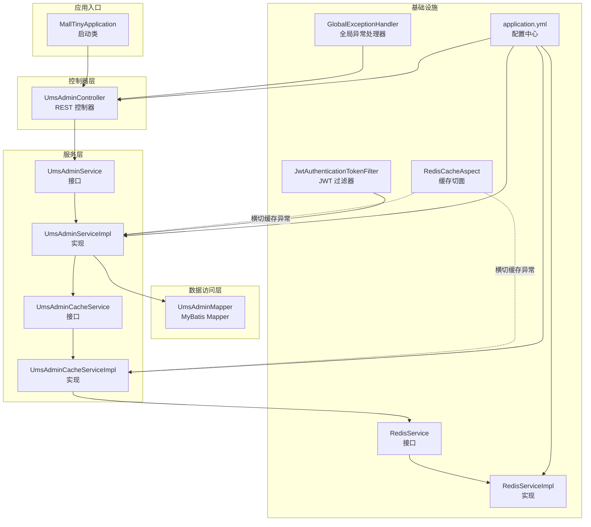
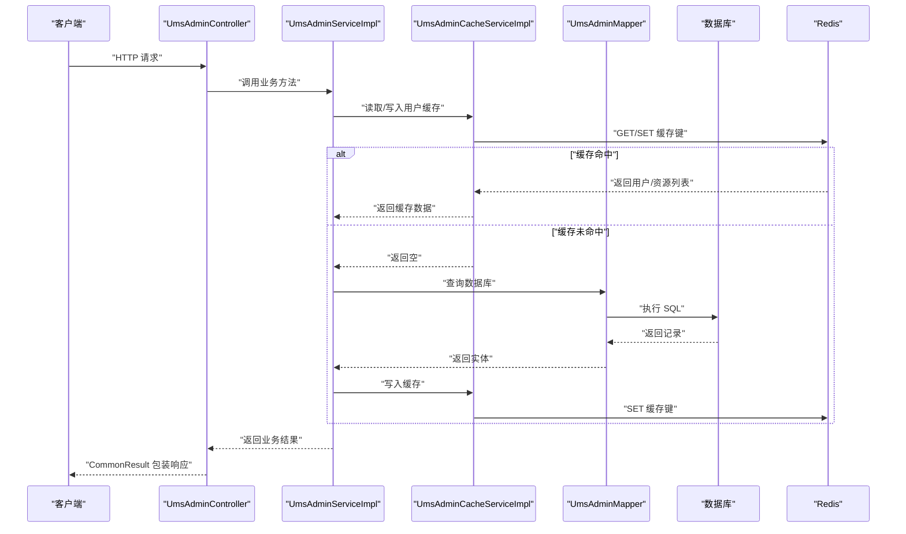
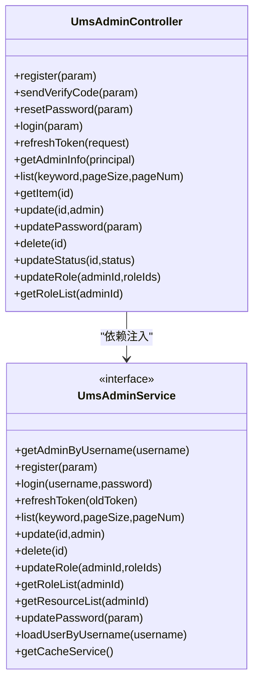
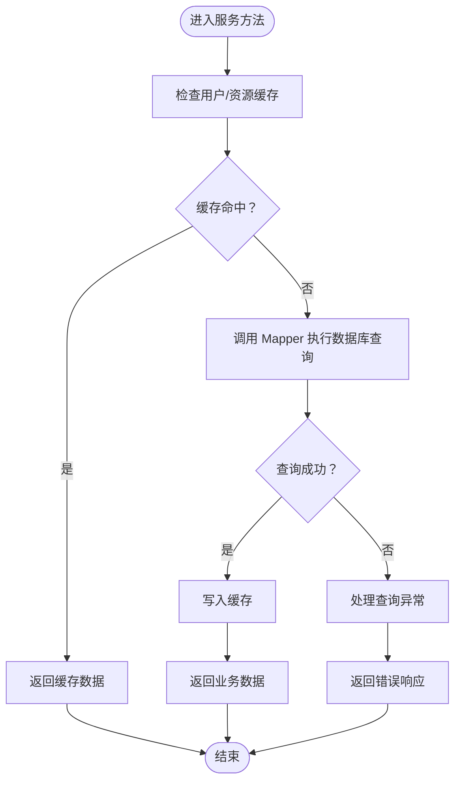
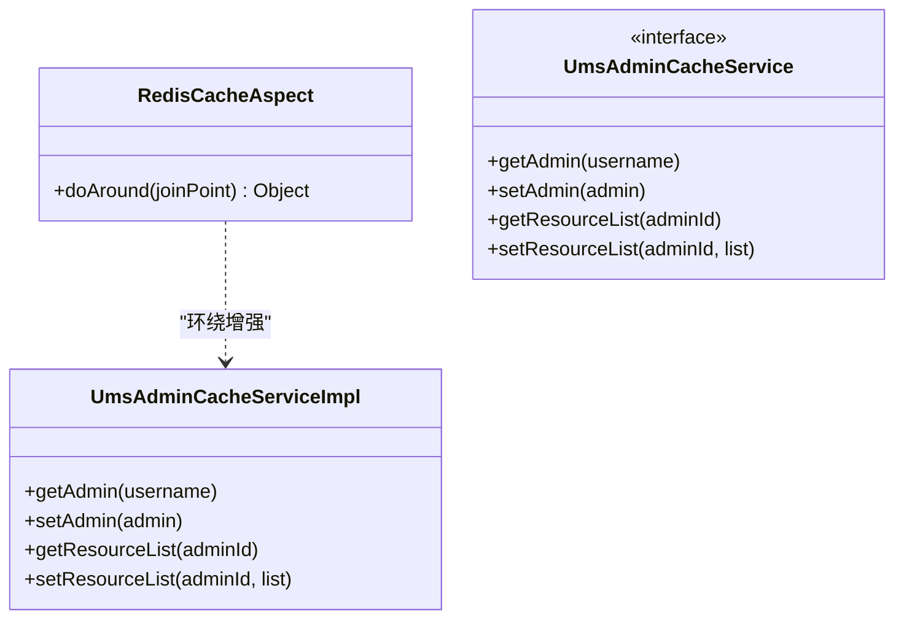
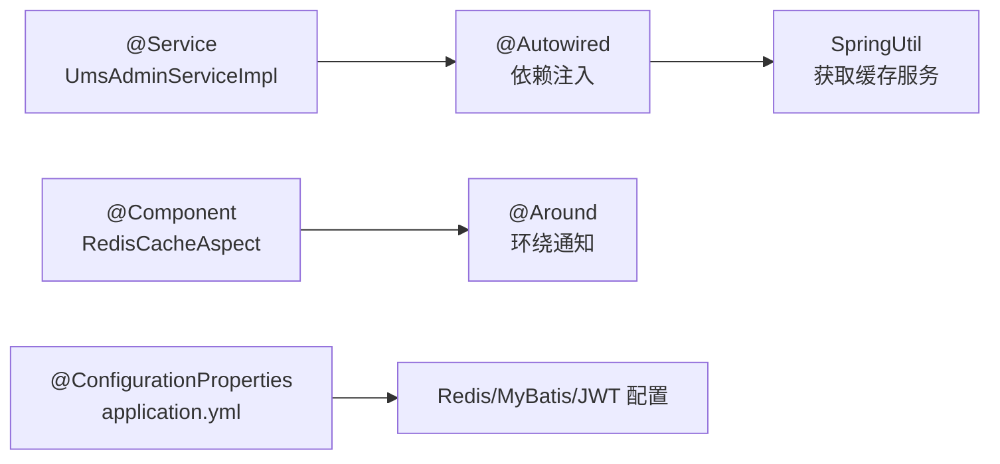
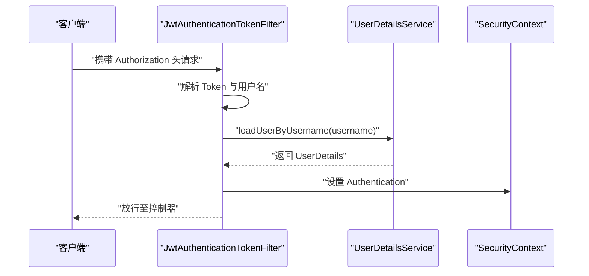
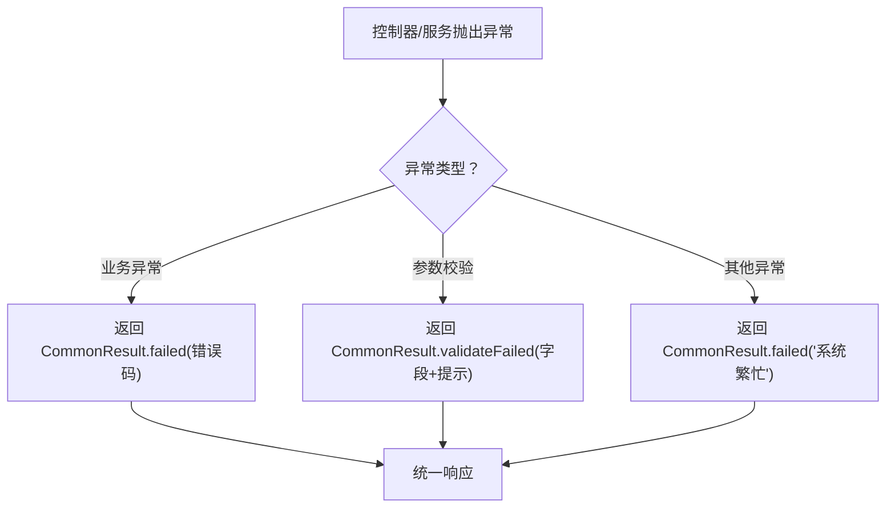
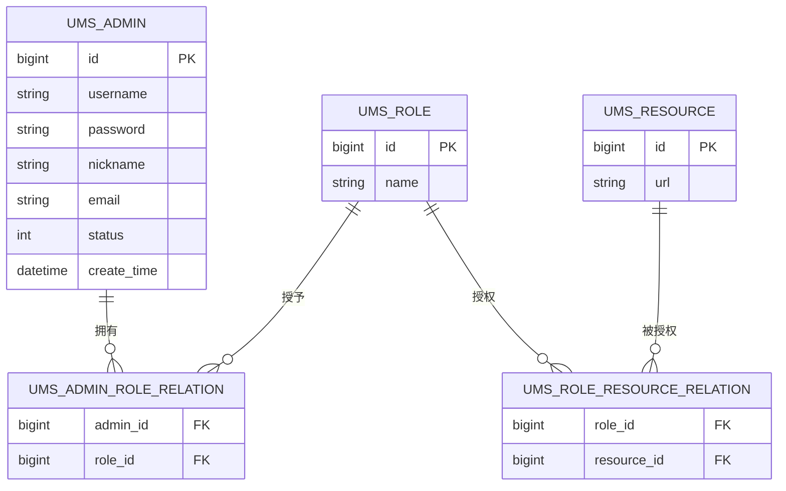
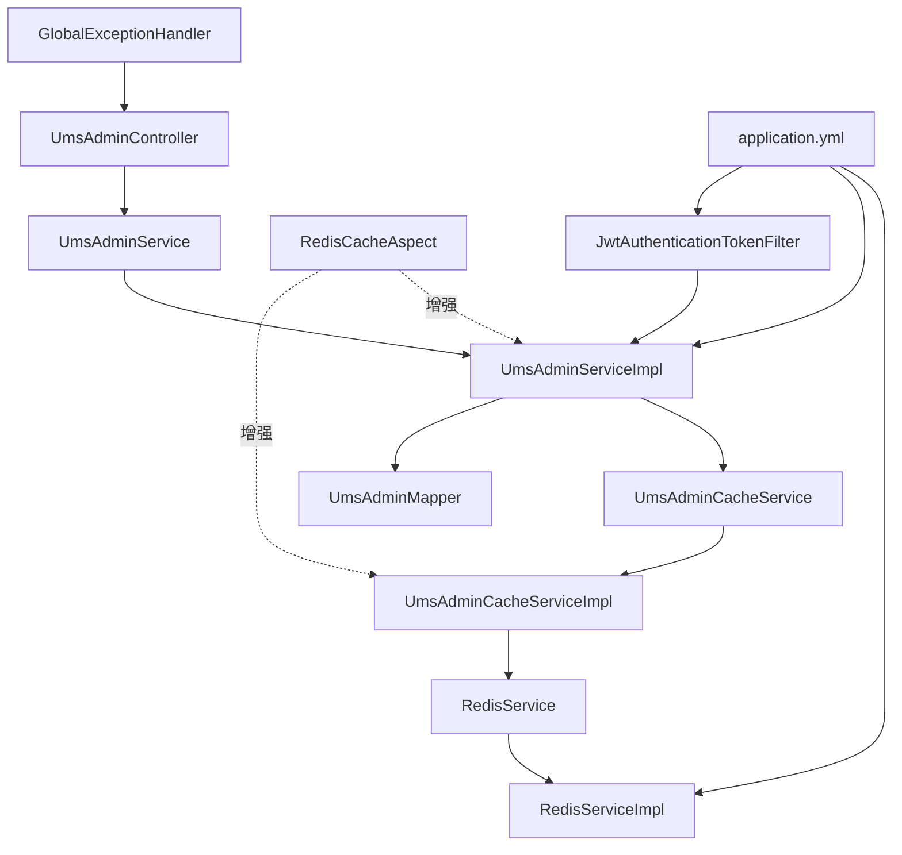

# 组件交互设计

<cite>
**本文引用的文件**
- [MallTinyApplication.java](file://src/main/java/com/macro/mall/tiny/MallTinyApplication.java)
- [UmsAdminController.java](file://src/main/java/com/macro/mall/tiny/modules/ums/controller/UmsAdminController.java)
- [UmsAdminService.java](file://src/main/java/com/macro/mall/tiny/modules/ums/service/UmsAdminService.java)
- [UmsAdminServiceImpl.java](file://src/main/java/com/macro/mall/tiny/modules/ums/service/impl/UmsAdminServiceImpl.java)
- [UmsAdminCacheService.java](file://src/main/java/com/macro/mall/tiny/modules/ums/service/UmsAdminCacheService.java)
- [UmsAdminCacheServiceImpl.java](file://src/main/java/com/macro/mall/tiny/modules/ums/service/impl/UmsAdminCacheServiceImpl.java)
- [UmsAdminMapper.java](file://src/main/java/com/macro/mall/tiny/modules/ums/mapper/UmsAdminMapper.java)
- [RedisService.java](file://src/main/java/com/macro/mall/tiny/common/service/RedisService.java)
- [RedisServiceImpl.java](file://src/main/java/com/macro/mall/tiny/common/service/impl/RedisServiceImpl.java)
- [RedisCacheAspect.java](file://src/main/java/com/macro/mall/tiny/security/aspect/RedisCacheAspect.java)
- [JwtAuthenticationTokenFilter.java](file://src/main/java/com/macro/mall/tiny/security/component/JwtAuthenticationTokenFilter.java)
- [GlobalExceptionHandler.java](file://src/main/java/com/macro/mall/tiny/common/exception/GlobalExceptionHandler.java)
- [CommonResult.java](file://src/main/java/com/macro/mall/tiny/common/api/CommonResult.java)
- [application.yml](file://src/main/resources/application.yml)
- [SpringUtil.java](file://src/main/java/com/macro/mall/tiny/security/util/SpringUtil.java)
</cite>

## 目录
1. [简介](#简介)
2. [项目结构](#项目结构)
3. [核心组件](#核心组件)
4. [架构总览](#架构总览)
5. [详细组件分析](#详细组件分析)
6. [依赖关系分析](#依赖关系分析)
7. [性能考量](#性能考量)
8. [故障排查指南](#故障排查指南)
9. [结论](#结论)
10. [附录](#附录)

## 简介
本设计文档聚焦于 Mall-Tiny 的组件交互设计，系统化阐述 Controller 到 Service 的调用关系、Service 到 Mapper 的数据访问流程、AOP 切面在缓存管理与异常处理中的横切关注点、依赖注入与组件生命周期管理、安全过滤链、全局异常处理策略，以及组件间通信协议与错误传播机制。文档同时提供架构图、调用序列图与数据流图，帮助读者快速把握系统的运行机制。

## 项目结构
Mall-Tiny 采用典型的分层架构：控制器层（Controller）、服务层（Service）、数据访问层（Mapper）与基础设施（Redis、MyBatis-Plus、Spring Security）。应用入口通过 Spring Boot 启动，配置文件集中管理行为开关与外部集成参数。

图表来源
- [MallTinyApplication.java:1-14](file://src/main/java/com/macro/mall/tiny/MallTinyApplication.java#L1-L14)
- [UmsAdminController.java:1-350](file://src/main/java/com/macro/mall/tiny/modules/ums/controller/UmsAdminController.java#L1-L350)
- [UmsAdminService.java:1-90](file://src/main/java/com/macro/mall/tiny/modules/ums/service/UmsAdminService.java#L1-L90)
- [UmsAdminServiceImpl.java:1-272](file://src/main/java/com/macro/mall/tiny/modules/ums/service/impl/UmsAdminServiceImpl.java#L1-L272)
- [UmsAdminCacheService.java:1-60](file://src/main/java/com/macro/mall/tiny/modules/ums/service/UmsAdminCacheService.java#L1-L60)
- [UmsAdminCacheServiceImpl.java:1-116](file://src/main/java/com/macro/mall/tiny/modules/ums/service/impl/UmsAdminCacheServiceImpl.java#L1-L116)
- [UmsAdminMapper.java:1-25](file://src/main/java/com/macro/mall/tiny/modules/ums/mapper/UmsAdminMapper.java#L1-L25)
- [RedisService.java:1-182](file://src/main/java/com/macro/mall/tiny/common/service/RedisService.java#L1-L182)
- [RedisServiceImpl.java:1-198](file://src/main/java/com/macro/mall/tiny/common/service/impl/RedisServiceImpl.java#L1-L198)
- [RedisCacheAspect.java:1-51](file://src/main/java/com/macro/mall/tiny/security/aspect/RedisCacheAspect.java#L1-L51)
- [JwtAuthenticationTokenFilter.java:1-59](file://src/main/java/com/macro/mall/tiny/security/component/JwtAuthenticationTokenFilter.java#L1-L59)
- [GlobalExceptionHandler.java:1-100](file://src/main/java/com/macro/mall/tiny/common/exception/GlobalExceptionHandler.java#L1-L100)
- [application.yml:1-57](file://src/main/resources/application.yml#L1-L57)

章节来源
- [MallTinyApplication.java:1-14](file://src/main/java/com/macro/mall/tiny/MallTinyApplication.java#L1-L14)
- [application.yml:1-57](file://src/main/resources/application.yml#L1-L57)

## 核心组件
- 控制器层：以 UmsAdminController 为例，负责接收 HTTP 请求、参数校验、调用服务层并返回统一响应包装对象。
- 服务层：UmsAdminService 定义领域能力；UmsAdminServiceImpl 实现业务逻辑，协调缓存服务与数据访问；UmsAdminCacheServiceImpl 负责基于 Redis 的用户与资源缓存。
- 数据访问层：UmsAdminMapper 基于 MyBatis-Plus 访问数据库。
- 基础设施：RedisService/RedisServiceImpl 提供 Redis 操作；RedisCacheAspect 对缓存相关方法进行容错切面；JwtAuthenticationTokenFilter 实现基于 JWT 的认证；GlobalExceptionHandler 统一异常处理；application.yml 提供配置。

章节来源
- [UmsAdminController.java:1-350](file://src/main/java/com/macro/mall/tiny/modules/ums/controller/UmsAdminController.java#L1-L350)
- [UmsAdminService.java:1-90](file://src/main/java/com/macro/mall/tiny/modules/ums/service/UmsAdminService.java#L1-L90)
- [UmsAdminServiceImpl.java:1-272](file://src/main/java/com/macro/mall/tiny/modules/ums/service/impl/UmsAdminServiceImpl.java#L1-L272)
- [UmsAdminCacheService.java:1-60](file://src/main/java/com/macro/mall/tiny/modules/ums/service/UmsAdminCacheService.java#L1-L60)
- [UmsAdminCacheServiceImpl.java:1-116](file://src/main/java/com/macro/mall/tiny/modules/ums/service/impl/UmsAdminCacheServiceImpl.java#L1-L116)
- [UmsAdminMapper.java:1-25](file://src/main/java/com/macro/mall/tiny/modules/ums/mapper/UmsAdminMapper.java#L1-L25)
- [RedisService.java:1-182](file://src/main/java/com/macro/mall/tiny/common/service/RedisService.java#L1-L182)
- [RedisServiceImpl.java:1-198](file://src/main/java/com/macro/mall/tiny/common/service/impl/RedisServiceImpl.java#L1-L198)
- [RedisCacheAspect.java:1-51](file://src/main/java/com/macro/mall/tiny/security/aspect/RedisCacheAspect.java#L1-L51)
- [JwtAuthenticationTokenFilter.java:1-59](file://src/main/java/com/macro/mall/tiny/security/component/JwtAuthenticationTokenFilter.java#L1-L59)
- [GlobalExceptionHandler.java:1-100](file://src/main/java/com/macro/mall/tiny/common/exception/GlobalExceptionHandler.java#L1-L100)
- [CommonResult.java:1-125](file://src/main/java/com/macro/mall/tiny/common/api/CommonResult.java#L1-L125)

## 架构总览
下图展示从 HTTP 请求到数据库访问的整体交互路径，以及缓存与安全过滤的关键节点。

图表来源
- [UmsAdminController.java:1-350](file://src/main/java/com/macro/mall/tiny/modules/ums/controller/UmsAdminController.java#L1-L350)
- [UmsAdminServiceImpl.java:1-272](file://src/main/java/com/macro/mall/tiny/modules/ums/service/impl/UmsAdminServiceImpl.java#L1-L272)
- [UmsAdminCacheServiceImpl.java:1-116](file://src/main/java/com/macro/mall/tiny/modules/ums/service/impl/UmsAdminCacheServiceImpl.java#L1-L116)
- [UmsAdminMapper.java:1-25](file://src/main/java/com/macro/mall/tiny/modules/ums/mapper/UmsAdminMapper.java#L1-L25)
- [RedisServiceImpl.java:1-198](file://src/main/java/com/macro/mall/tiny/common/service/impl/RedisServiceImpl.java#L1-L198)

## 详细组件分析

### 控制器到服务的调用关系
- 控制器通过 @Autowired 注入服务接口，遵循面向接口编程原则，便于替换实现与测试。
- 控制器方法返回 CommonResult，统一响应结构，便于前端消费与异常处理。

图表来源
- [UmsAdminController.java:1-350](file://src/main/java/com/macro/mall/tiny/modules/ums/controller/UmsAdminController.java#L1-L350)
- [UmsAdminService.java:1-90](file://src/main/java/com/macro/mall/tiny/modules/ums/service/UmsAdminService.java#L1-L90)

章节来源
- [UmsAdminController.java:1-350](file://src/main/java/com/macro/mall/tiny/modules/ums/controller/UmsAdminController.java#L1-L350)
- [UmsAdminService.java:1-90](file://src/main/java/com/macro/mall/tiny/modules/ums/service/UmsAdminService.java#L1-L90)
- [CommonResult.java:1-125](file://src/main/java/com/macro/mall/tiny/common/api/CommonResult.java#L1-L125)

### 服务到 Mapper 的数据访问流程
- 服务层通过 MyBatis-Plus 的 Mapper 接口访问数据库，支持分页、条件查询与批量操作。
- 缓存未命中时，服务层从数据库加载数据并写入缓存，提升后续访问性能。

图表来源
- [UmsAdminServiceImpl.java:1-272](file://src/main/java/com/macro/mall/tiny/modules/ums/service/impl/UmsAdminServiceImpl.java#L1-L272)
- [UmsAdminCacheServiceImpl.java:1-116](file://src/main/java/com/macro/mall/tiny/modules/ums/service/impl/UmsAdminCacheServiceImpl.java#L1-L116)
- [UmsAdminMapper.java:1-25](file://src/main/java/com/macro/mall/tiny/modules/ums/mapper/UmsAdminMapper.java#L1-L25)

章节来源
- [UmsAdminServiceImpl.java:1-272](file://src/main/java/com/macro/mall/tiny/modules/ums/service/impl/UmsAdminServiceImpl.java#L1-L272)
- [UmsAdminCacheServiceImpl.java:1-116](file://src/main/java/com/macro/mall/tiny/modules/ums/service/impl/UmsAdminCacheServiceImpl.java#L1-L116)
- [UmsAdminMapper.java:1-25](file://src/main/java/com/macro/mall/tiny/modules/ums/mapper/UmsAdminMapper.java#L1-L25)

### AOP 切面：缓存管理与异常容错
- RedisCacheAspect 对匹配的缓存服务方法进行环绕增强，捕获异常并按需抛出，保证 Redis 故障不影响主业务。
- 通过注解 CacheException 可控制异常是否向上抛出，实现“降级不中断”的缓存策略。

图表来源
- [RedisCacheAspect.java:1-51](file://src/main/java/com/macro/mall/tiny/security/aspect/RedisCacheAspect.java#L1-L51)
- [UmsAdminCacheService.java:1-60](file://src/main/java/com/macro/mall/tiny/modules/ums/service/UmsAdminCacheService.java#L1-L60)
- [UmsAdminCacheServiceImpl.java:1-116](file://src/main/java/com/macro/mall/tiny/modules/ums/service/impl/UmsAdminCacheServiceImpl.java#L1-L116)

章节来源
- [RedisCacheAspect.java:1-51](file://src/main/java/com/macro/mall/tiny/security/aspect/RedisCacheAspect.java#L1-L51)

### 依赖注入与组件生命周期
- 通过 @Service、@Component、@Autowired 实现自动装配与依赖注入。
- UmsAdminServiceImpl 通过 SpringUtil.getBean 获取缓存服务，绕开构造注入的循环依赖限制，但建议优先使用构造注入以提升可测试性与线程安全。
- application.yml 中开启路径匹配策略与 MyBatis-Plus 配置，影响组件扫描与 SQL 映射行为。

图表来源
- [UmsAdminServiceImpl.java:1-272](file://src/main/java/com/macro/mall/tiny/modules/ums/service/impl/UmsAdminServiceImpl.java#L1-L272)
- [SpringUtil.java:1-44](file://src/main/java/com/macro/mall/tiny/security/util/SpringUtil.java#L1-L44)
- [RedisCacheAspect.java:1-51](file://src/main/java/com/macro/mall/tiny/security/aspect/RedisCacheAspect.java#L1-L51)
- [application.yml:1-57](file://src/main/resources/application.yml#L1-L57)

章节来源
- [UmsAdminServiceImpl.java:1-272](file://src/main/java/com/macro/mall/tiny/modules/ums/service/impl/UmsAdminServiceImpl.java#L1-L272)
- [SpringUtil.java:1-44](file://src/main/java/com/macro/mall/tiny/security/util/SpringUtil.java#L1-L44)
- [application.yml:1-57](file://src/main/resources/application.yml#L1-L57)

### 安全过滤与认证链
- JwtAuthenticationTokenFilter 从请求头提取 JWT，解析用户名并委托 UserDetailsService 加载用户详情，完成认证上下文设置。
- 与 Spring Security 配置结合，形成完整的认证与授权链路。

图表来源
- [JwtAuthenticationTokenFilter.java:1-59](file://src/main/java/com/macro/mall/tiny/security/component/JwtAuthenticationTokenFilter.java#L1-L59)
- [UmsAdminServiceImpl.java:1-272](file://src/main/java/com/macro/mall/tiny/modules/ums/service/impl/UmsAdminServiceImpl.java#L1-L272)

章节来源
- [JwtAuthenticationTokenFilter.java:1-59](file://src/main/java/com/macro/mall/tiny/security/component/JwtAuthenticationTokenFilter.java#L1-L59)

### 全局异常处理与错误传播
- GlobalExceptionHandler 作为 @RestControllerAdvice，统一捕获各类异常并返回 CommonResult，屏蔽内部细节，保障对外一致的错误语义。
- 对业务异常（ApiException）与参数校验异常分别处理，便于前端提示与日志审计。

图表来源
- [GlobalExceptionHandler.java:1-100](file://src/main/java/com/macro/mall/tiny/common/exception/GlobalExceptionHandler.java#L1-L100)
- [CommonResult.java:1-125](file://src/main/java/com/macro/mall/tiny/common/api/CommonResult.java#L1-L125)

章节来源
- [GlobalExceptionHandler.java:1-100](file://src/main/java/com/macro/mall/tiny/common/exception/GlobalExceptionHandler.java#L1-L100)
- [CommonResult.java:1-125](file://src/main/java/com/macro/mall/tiny/common/api/CommonResult.java#L1-L125)

### 组件间通信协议与数据模型
- 控制器与服务之间通过方法调用与参数对象交互；服务与缓存之间通过 Redis 键空间约定进行数据交换。
- 统一响应对象 CommonResult 提供 code/message/data 三段式结构，简化前后端契约。

图表来源
- [UmsAdminMapper.java:1-25](file://src/main/java/com/macro/mall/tiny/modules/ums/mapper/UmsAdminMapper.java#L1-L25)

章节来源
- [UmsAdminMapper.java:1-25](file://src/main/java/com/macro/mall/tiny/modules/ums/mapper/UmsAdminMapper.java#L1-L25)

## 依赖关系分析
- 控制器依赖服务接口，服务实现依赖 Mapper 与缓存服务；缓存服务依赖 Redis 模板；切面横切服务与缓存实现；过滤器依赖用户详情服务与 JWT 工具；全局异常处理器独立于业务组件。
- 配置文件贯穿于 Redis、MyBatis-Plus、JWT 与安全白名单等关键行为。

图表来源
- [UmsAdminController.java:1-350](file://src/main/java/com/macro/mall/tiny/modules/ums/controller/UmsAdminController.java#L1-L350)
- [UmsAdminService.java:1-90](file://src/main/java/com/macro/mall/tiny/modules/ums/service/UmsAdminService.java#L1-L90)
- [UmsAdminServiceImpl.java:1-272](file://src/main/java/com/macro/mall/tiny/modules/ums/service/impl/UmsAdminServiceImpl.java#L1-L272)
- [UmsAdminCacheService.java:1-60](file://src/main/java/com/macro/mall/tiny/modules/ums/service/UmsAdminCacheService.java#L1-L60)
- [UmsAdminCacheServiceImpl.java:1-116](file://src/main/java/com/macro/mall/tiny/modules/ums/service/impl/UmsAdminCacheServiceImpl.java#L1-L116)
- [RedisService.java:1-182](file://src/main/java/com/macro/mall/tiny/common/service/RedisService.java#L1-L182)
- [RedisServiceImpl.java:1-198](file://src/main/java/com/macro/mall/tiny/common/service/impl/RedisServiceImpl.java#L1-L198)
- [RedisCacheAspect.java:1-51](file://src/main/java/com/macro/mall/tiny/security/aspect/RedisCacheAspect.java#L1-L51)
- [JwtAuthenticationTokenFilter.java:1-59](file://src/main/java/com/macro/mall/tiny/security/component/JwtAuthenticationTokenFilter.java#L1-L59)
- [GlobalExceptionHandler.java:1-100](file://src/main/java/com/macro/mall/tiny/common/exception/GlobalExceptionHandler.java#L1-L100)
- [application.yml:1-57](file://src/main/resources/application.yml#L1-L57)

章节来源
- [application.yml:1-57](file://src/main/resources/application.yml#L1-L57)

## 性能考量
- 缓存优先：用户信息与资源列表通过 Redis 缓存降低数据库压力，建议合理设置过期时间与键命名规范。
- 异常降级：RedisCacheAspect 在缓存异常时记录日志并继续执行，避免缓存故障导致业务中断。
- 分页与条件查询：服务层使用 MyBatis-Plus 分页与条件构造器，减少一次性加载大量数据带来的内存压力。
- 安全过滤：JWT 解析与校验在过滤器阶段完成，避免重复认证与不必要的服务调用。

## 故障排查指南
- 统一异常：优先查看 GlobalExceptionHandler 的日志输出，区分业务异常与系统异常，定位具体错误码与提示信息。
- 缓存异常：若缓存不可用，确认 Redis 连接与键空间配置；通过 RedisCacheAspect 的日志判断是否触发降级。
- 认证失败：检查请求头 Authorization 是否符合配置项 tokenHeader/tokenHead；核对 JWT 有效性与用户状态。
- 数据访问：核对 MyBatis-Plus 的映射路径与驼峰规则配置，确保 SQL 执行与结果映射正确。

章节来源
- [GlobalExceptionHandler.java:1-100](file://src/main/java/com/macro/mall/tiny/common/exception/GlobalExceptionHandler.java#L1-L100)
- [RedisCacheAspect.java:1-51](file://src/main/java/com/macro/mall/tiny/security/aspect/RedisCacheAspect.java#L1-L51)
- [application.yml:1-57](file://src/main/resources/application.yml#L1-L57)

## 结论
Mall-Tiny 通过清晰的分层架构与 Spring 生态实现了高内聚低耦合的组件交互：控制器负责契约与响应封装，服务层承载业务与缓存策略，数据访问层专注持久化，基础设施提供缓存与安全支撑。AOP 切面与全局异常处理增强了系统的韧性与可观测性。建议在保持现有设计的基础上，进一步优化缓存键设计、引入更细粒度的监控指标，并持续完善测试覆盖。

## 附录
- 关键配置项参考：
  - JWT：tokenHeader、tokenHead、secret、expiration
  - Redis：database、key.admin、key.resourceList、expire.common
  - MyBatis-Plus：mapper-locations、map-underscore-to-camel-case
  - 安全白名单：ignored.urls

章节来源
- [application.yml:1-57](file://src/main/resources/application.yml#L1-L57)