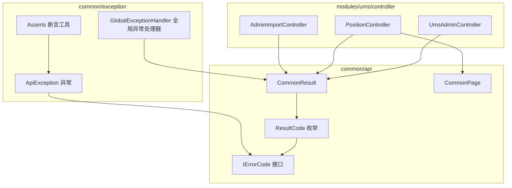
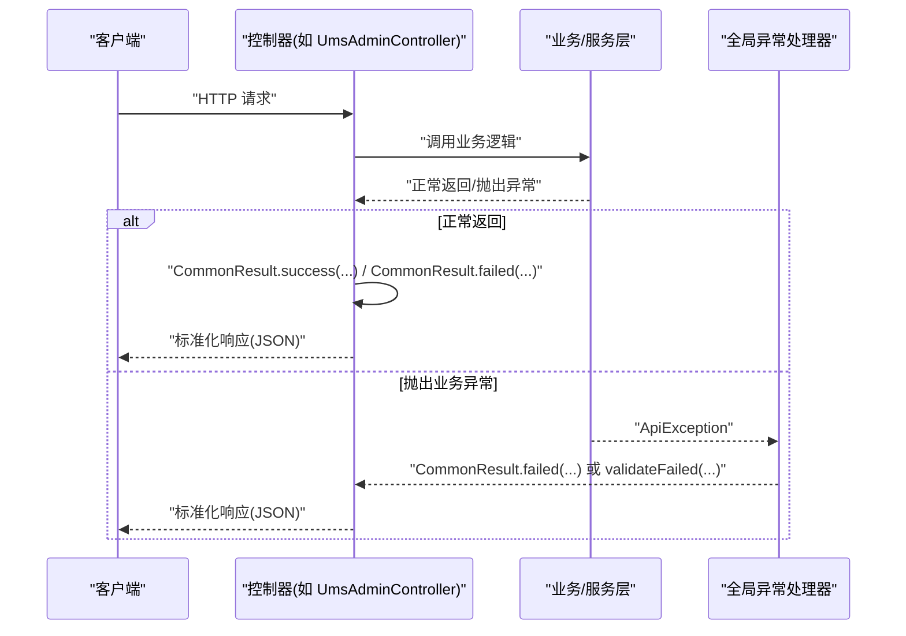
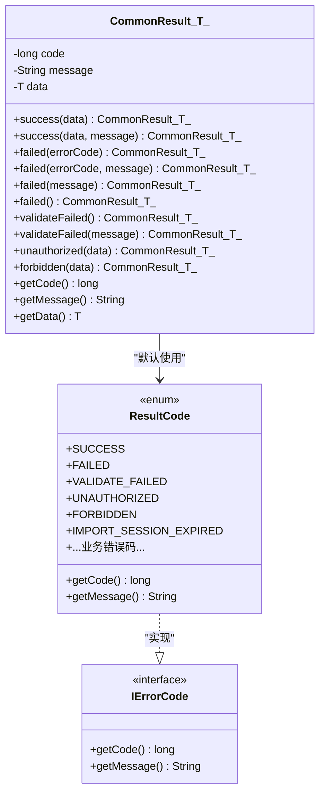
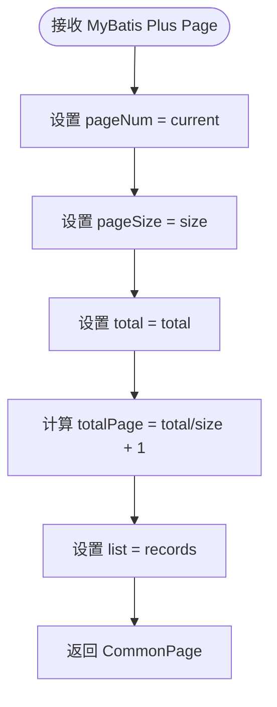
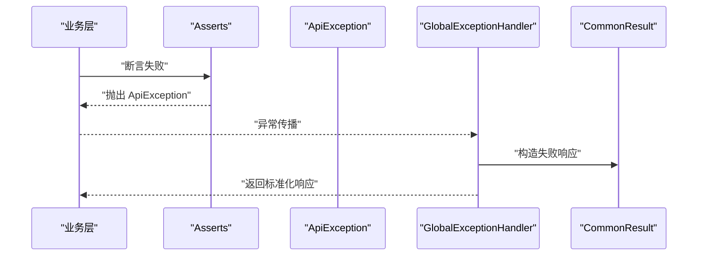
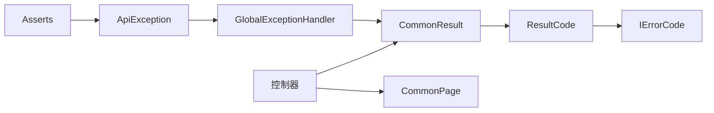

# API统一封装

<cite>
**本文引用的文件**
- [CommonResult.java](file://src/main/java/com/macro/mall/tiny/common/api/CommonResult.java)
- [CommonPage.java](file://src/main/java/com/macro/mall/tiny/common/api/CommonPage.java)
- [IErrorCode.java](file://src/main/java/com/macro/mall/tiny/common/api/IErrorCode.java)
- [ResultCode.java](file://src/main/java/com/macro/mall/tiny/common/api/ResultCode.java)
- [ApiException.java](file://src/main/java/com/macro/mall/tiny/common/exception/ApiException.java)
- [Asserts.java](file://src/main/java/com/macro/mall/tiny/common/exception/Asserts.java)
- [GlobalExceptionHandler.java](file://src/main/java/com/macro/mall/tiny/common/exception/GlobalExceptionHandler.java)
- [UmsAdminController.java](file://src/main/java/com/macro/mall/tiny/modules/ums/controller/UmsAdminController.java)
- [PositionController.java](file://src/main/java/com/macro/mall/tiny/modules/ums/controller/PositionController.java)
- [AdminImportController.java](file://src/main/java/com/macro/mall/tiny/modules/ums/controller/AdminImportController.java)
</cite>

## 目录
1. [简介](#简介)
2. [项目结构](#项目结构)
3. [核心组件](#核心组件)
4. [架构总览](#架构总览)
5. [详细组件分析](#详细组件分析)
6. [依赖分析](#依赖分析)
7. [性能考虑](#性能考虑)
8. [故障排查指南](#故障排查指南)
9. [结论](#结论)
10. [附录](#附录)

## 简介
本文件系统性地阐述 mall-tiny 项目中的 API 统一封装体系，围绕以下目标展开：
- CommonResult 泛型设计与静态工厂方法：涵盖成功、失败、验证失败、未登录、未授权等响应类型。
- CommonPage 分页封装：统一分页参数、数据列表与总数统计的格式。
- IErrorCode 接口与 ResultCode 枚举：错误码定义、错误消息、以及与业务语义的映射。
- 实际使用示例：展示在控制器中如何返回标准化响应。
- 最佳实践与常见问题解决方案。

## 项目结构
API 统一封装位于 common/api 包下，异常处理与断言位于 common/exception 包下；多个模块控制器通过统一的 CommonResult/ CommonPage 返回标准响应。

图示来源
- [CommonResult.java:1-125](file://src/main/java/com/macro/mall/tiny/common/api/CommonResult.java#L1-L125)
- [CommonPage.java:1-72](file://src/main/java/com/macro/mall/tiny/common/api/CommonPage.java#L1-L72)
- [IErrorCode.java:1-12](file://src/main/java/com/macro/mall/tiny/common/api/IErrorCode.java#L1-L12)
- [ResultCode.java:1-38](file://src/main/java/com/macro/mall/tiny/common/api/ResultCode.java#L1-L38)
- [ApiException.java:1-34](file://src/main/java/com/macro/mall/tiny/common/exception/ApiException.java#L1-L34)
- [Asserts.java:1-19](file://src/main/java/com/macro/mall/tiny/common/exception/Asserts.java#L1-L19)
- [GlobalExceptionHandler.java:1-100](file://src/main/java/com/macro/mall/tiny/common/exception/GlobalExceptionHandler.java#L1-L100)
- [UmsAdminController.java:1-350](file://src/main/java/com/macro/mall/tiny/modules/ums/controller/UmsAdminController.java#L1-L350)
- [PositionController.java:1-119](file://src/main/java/com/macro/mall/tiny/modules/ums/controller/PositionController.java#L1-L119)
- [AdminImportController.java:1-148](file://src/main/java/com/macro/mall/tiny/modules/ums/controller/AdminImportController.java#L1-L148)

章节来源
- [CommonResult.java:1-125](file://src/main/java/com/macro/mall/tiny/common/api/CommonResult.java#L1-L125)
- [CommonPage.java:1-72](file://src/main/java/com/macro/mall/tiny/common/api/CommonPage.java#L1-L72)
- [IErrorCode.java:1-12](file://src/main/java/com/macro/mall/tiny/common/api/IErrorCode.java#L1-L12)
- [ResultCode.java:1-38](file://src/main/java/com/macro/mall/tiny/common/api/ResultCode.java#L1-L38)
- [GlobalExceptionHandler.java:1-100](file://src/main/java/com/macro/mall/tiny/common/exception/GlobalExceptionHandler.java#L1-L100)

## 核心组件
- CommonResult<T>：统一响应载体，包含 code、message、data 三要素；提供大量静态工厂方法以快速构造不同场景的响应。
- CommonPage<T>：分页结果封装，将 MyBatis Plus 的 Page 结果转换为统一的分页 JSON 结构。
- IErrorCode 接口：定义错误码与错误消息的契约，便于扩展自定义错误。
- ResultCode 枚举：内置常用业务错误码与消息，覆盖通用操作、鉴权、业务校验等场景。

章节来源
- [CommonResult.java:7-124](file://src/main/java/com/macro/mall/tiny/common/api/CommonResult.java#L7-L124)
- [CommonPage.java:12-71](file://src/main/java/com/macro/mall/tiny/common/api/CommonPage.java#L12-L71)
- [IErrorCode.java:7-11](file://src/main/java/com/macro/mall/tiny/common/api/IErrorCode.java#L7-L11)
- [ResultCode.java:7-37](file://src/main/java/com/macro/mall/tiny/common/api/ResultCode.java#L7-L37)

## 架构总览
统一响应在控制器层被广泛使用，全局异常处理器将运行时异常转换为标准化的 CommonResult 响应，保证前后端交互的一致性与可预期性。

图示来源
- [UmsAdminController.java:65-94](file://src/main/java/com/macro/mall/tiny/modules/ums/controller/UmsAdminController.java#L65-L94)
- [GlobalExceptionHandler.java:27-34](file://src/main/java/com/macro/mall/tiny/common/exception/GlobalExceptionHandler.java#L27-L34)
- [ApiException.java:10-34](file://src/main/java/com/macro/mall/tiny/common/exception/ApiException.java#L10-L34)

## 详细组件分析

### CommonResult<T> 设计与静态工厂方法
- 泛型设计：通过类型参数 T 表示 data 字段的泛型化，使响应体可承载任意数据类型，同时保持编译期类型安全。
- 静态工厂方法族：
  - 成功：success(T data)、success(T data, String message)
  - 失败：failed(IErrorCode)、failed(IErrorCode, String message)、failed(String message)、failed()
  - 验证失败：validateFailed()、validateFailed(String message)
  - 未登录/未授权：unauthorized(T data)、forbidden(T data)
- 设计要点：
  - 所有静态方法均返回新的 CommonResult 实例，避免共享状态引发并发问题。
  - 默认 message 来源于 ResultCode 常量，便于统一语义与国际化扩展点。
  - data 可为 null，用于仅携带状态码与消息的场景（如“操作成功”）。

图示来源
- [CommonResult.java:7-124](file://src/main/java/com/macro/mall/tiny/common/api/CommonResult.java#L7-L124)
- [ResultCode.java:7-37](file://src/main/java/com/macro/mall/tiny/common/api/ResultCode.java#L7-L37)
- [IErrorCode.java:7-11](file://src/main/java/com/macro/mall/tiny/common/api/IErrorCode.java#L7-L11)

章节来源
- [CommonResult.java:21-99](file://src/main/java/com/macro/mall/tiny/common/api/CommonResult.java#L21-L99)

### CommonPage 分页封装
- 职责：将 MyBatis Plus 的 Page<T> 转换为统一的分页 JSON 结构，包含 pageNum、pageSize、totalPage、total、records 列表。
- 关键点：
  - restPage(Page<T>)：静态方法将 Page 结果映射到 CommonPage 字段。
  - totalPage 计算：基于 total 与 size 的整除与余数处理，确保页数计算正确。
  - 类型安全：返回值为 CommonPage<T>，与具体实体类型一一对应。

图示来源
- [CommonPage.java:22-30](file://src/main/java/com/macro/mall/tiny/common/api/CommonPage.java#L22-L30)

章节来源
- [CommonPage.java:12-71](file://src/main/java/com/macro/mall/tiny/common/api/CommonPage.java#L12-L71)

### IErrorCode 接口与 ResultCode 枚举
- IErrorCode：定义错误码与错误消息的最小契约，便于扩展自定义错误类型。
- ResultCode：内置常用错误码与消息，覆盖通用操作码与业务错误码，例如：
  - 成功/失败/验证失败/未登录/未授权
  - 导入会话过期、文件格式无效、用户档案缺失、用户名重复、密码不匹配、验证码错误等
- 设计优势：
  - 与业务语义强关联，便于前端与测试定位问题。
  - 与静态工厂方法配合，可在控制器中直接使用枚举常量构造失败响应。

章节来源
- [IErrorCode.java:7-11](file://src/main/java/com/macro/mall/tiny/common/api/IErrorCode.java#L7-L11)
- [ResultCode.java:7-37](file://src/main/java/com/macro/mall/tiny/common/api/ResultCode.java#L7-L37)

### 全局异常处理与断言工具
- GlobalExceptionHandler：
  - 捕获业务异常 ApiException 并转换为 CommonResult.failed(...) 或 validateFailed(...)。
  - 捕获参数校验异常（MethodArgumentNotValidException、BindException）并返回 validateFailed(...)。
  - 捕获其他异常（如请求方法不支持、文件过大、访问被拒绝）并返回相应失败响应。
- Asserts：
  - 提供 fail(String)/fail(IErrorCode) 快速抛出 ApiException，简化业务层断言逻辑。
- ApiException：
  - 支持携带 IErrorCode 或字符串消息，便于全局捕获后统一格式化。

图示来源
- [Asserts.java:10-18](file://src/main/java/com/macro/mall/tiny/common/exception/Asserts.java#L10-L18)
- [ApiException.java:10-34](file://src/main/java/com/macro/mall/tiny/common/exception/ApiException.java#L10-L34)
- [GlobalExceptionHandler.java:27-34](file://src/main/java/com/macro/mall/tiny/common/exception/GlobalExceptionHandler.java#L27-L34)

章节来源
- [GlobalExceptionHandler.java:27-98](file://src/main/java/com/macro/mall/tiny/common/exception/GlobalExceptionHandler.java#L27-L98)
- [Asserts.java:10-18](file://src/main/java/com/macro/mall/tiny/common/exception/Asserts.java#L10-L18)
- [ApiException.java:10-34](file://src/main/java/com/macro/mall/tiny/common/exception/ApiException.java#L10-L34)

### 控制器使用示例与最佳实践
- 登录/注册/忘记密码等场景：
  - 使用 CommonResult.success(...) 返回成功数据（如 token、提示信息）。
  - 使用 CommonResult.failed(ResultCode.XXX) 返回业务错误。
  - 使用 CommonResult.validateFailed(...) 返回参数校验失败。
  - 使用 CommonResult.unauthorized(...) 处理未登录场景。
- 分页场景：
  - 使用 CommonPage.restPage(...) 将 Page<T> 转为统一分页结构，再通过 CommonResult.success(...) 返回。
- 最佳实践：
  - 统一在业务层抛出 ApiException，由全局异常处理器集中处理，避免分散的 try-catch。
  - 对外响应一律使用 CommonResult，确保前后端契约稳定。
  - 对于复杂分页，优先使用 CommonPage.restPage(...)，减少重复转换逻辑。
  - 对于参数校验，建议结合 Bean Validation 注解与全局异常处理器，自动返回 validateFailed(...)。

章节来源
- [UmsAdminController.java:65-94](file://src/main/java/com/macro/mall/tiny/modules/ums/controller/UmsAdminController.java#L65-L94)
- [UmsAdminController.java:262-267](file://src/main/java/com/macro/mall/tiny/modules/ums/controller/UmsAdminController.java#L262-L267)
- [PositionController.java:82-87](file://src/main/java/com/macro/mall/tiny/modules/ums/controller/PositionController.java#L82-L87)
- [AdminImportController.java:65-79](file://src/main/java/com/macro/mall/tiny/modules/ums/controller/AdminImportController.java#L65-L79)

## 依赖分析
- CommonResult 依赖 ResultCode 作为默认错误码来源，ResultCode 实现 IErrorCode。
- 控制器依赖 CommonResult/CommonPage 进行响应封装。
- 全局异常处理器依赖 CommonResult 将异常转换为统一响应。
- 断言工具与异常类共同构成“断言—抛出—捕获—统一响应”的闭环。

图示来源
- [CommonResult.java:26-28](file://src/main/java/com/macro/mall/tiny/common/api/CommonResult.java#L26-L28)
- [ResultCode.java:7-37](file://src/main/java/com/macro/mall/tiny/common/api/ResultCode.java#L7-L37)
- [IErrorCode.java:7-11](file://src/main/java/com/macro/mall/tiny/common/api/IErrorCode.java#L7-L11)
- [GlobalExceptionHandler.java:27-34](file://src/main/java/com/macro/mall/tiny/common/exception/GlobalExceptionHandler.java#L27-L34)
- [Asserts.java:10-18](file://src/main/java/com/macro/mall/tiny/common/exception/Asserts.java#L10-L18)
- [ApiException.java:10-34](file://src/main/java/com/macro/mall/tiny/common/exception/ApiException.java#L10-L34)

章节来源
- [CommonResult.java:21-99](file://src/main/java/com/macro/mall/tiny/common/api/CommonResult.java#L21-L99)
- [CommonPage.java:22-30](file://src/main/java/com/macro/mall/tiny/common/api/CommonPage.java#L22-L30)
- [GlobalExceptionHandler.java:27-98](file://src/main/java/com/macro/mall/tiny/common/exception/GlobalExceptionHandler.java#L27-L98)

## 性能考虑
- 泛型与静态工厂：CommonResult 的静态工厂方法避免了重复构造对象的样板代码，且在 JVM 层面具备良好的内联优化空间。
- 分页转换：CommonPage.restPage(...) 仅进行字段映射与简单计算，开销极低，适合高频分页场景。
- 全局异常处理：将异常转换逻辑集中在一处，减少控制器中的重复判断与分支，提升整体可维护性与可读性。

## 故障排查指南
- 参数校验失败：确认是否触发了全局异常处理器对校验异常的捕获，返回 validateFailed(...)。若未触发，检查控制器是否使用了 JSR-303 注解与 @Validated。
- 业务异常未统一：若业务层直接抛出非 ApiException，需在业务层改为使用 Asserts.fail(...) 或抛出 ApiException，以便全局异常处理器统一处理。
- 未登录/未授权：检查是否使用了 unauthorized(...) 或 forbidden(...)，并确认安全配置是否正确拦截。
- 分页数据异常：核对 Page<T> 的 current、size、total 是否合理，确保 totalPage 计算逻辑符合预期。

章节来源
- [GlobalExceptionHandler.java:36-98](file://src/main/java/com/macro/mall/tiny/common/exception/GlobalExceptionHandler.java#L36-L98)
- [Asserts.java:10-18](file://src/main/java/com/macro/mall/tiny/common/exception/Asserts.java#L10-L18)
- [CommonResult.java:88-99](file://src/main/java/com/macro/mall/tiny/common/api/CommonResult.java#L88-L99)

## 结论
mall-tiny 的 API 统一封装以 CommonResult/CommonPage 为核心，辅以 IErrorCode/ResultCode 与全局异常处理机制，实现了前后端一致的响应契约与健壮的错误处理流程。通过在控制器中统一使用这些封装类，可以显著降低重复代码、提升可维护性，并为国际化与扩展留出清晰的接口。

## 附录
- 常用响应类型速览
  - 成功：CommonResult.success(...)
  - 失败：CommonResult.failed(...)
  - 验证失败：CommonResult.validateFailed(...)
  - 未登录：CommonResult.unauthorized(...)
  - 未授权：CommonResult.forbidden(...)
- 分页封装：CommonPage.restPage(Page<T>)
- 错误码来源：ResultCode 内置常用错误码，亦可通过 IErrorCode 扩展