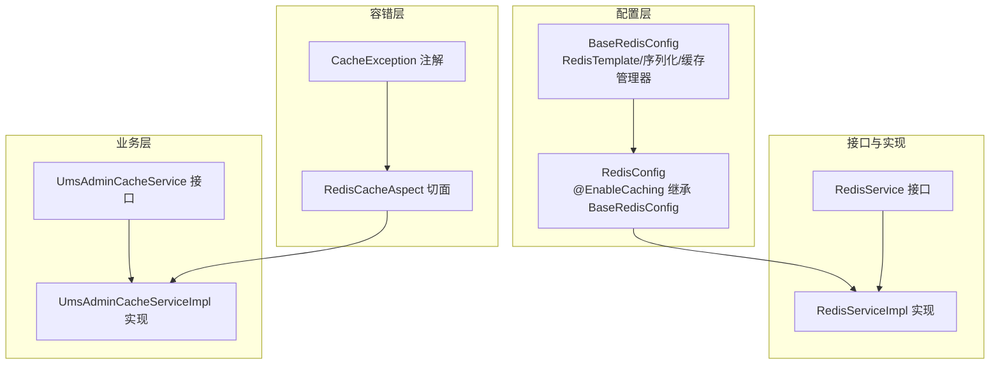
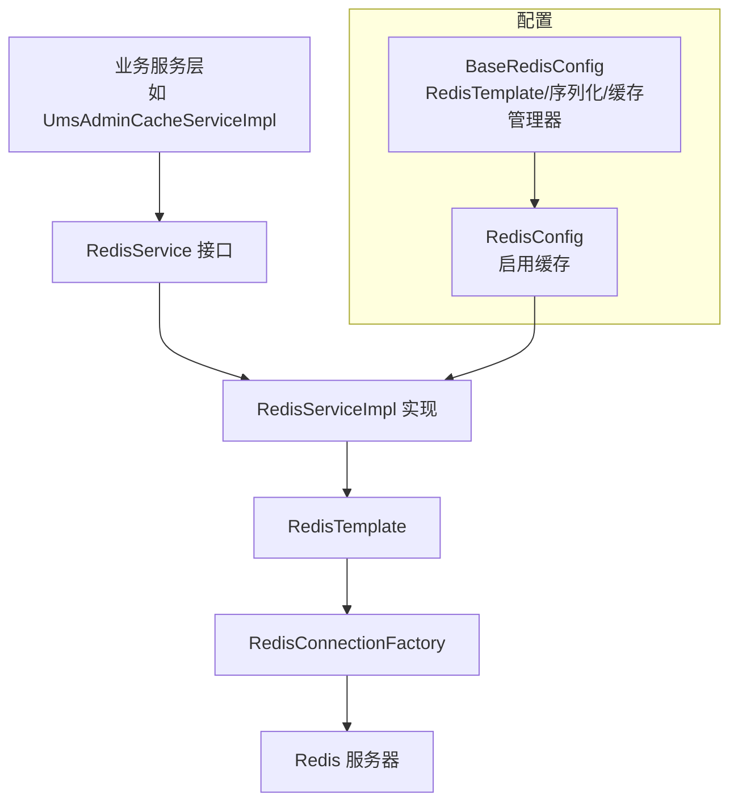
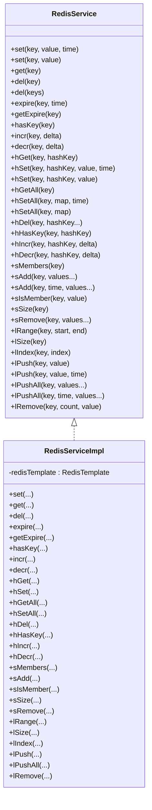
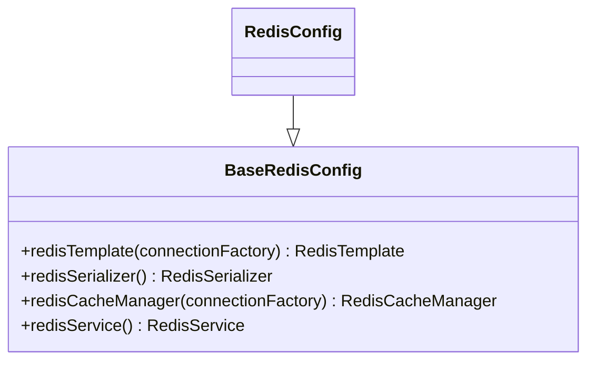
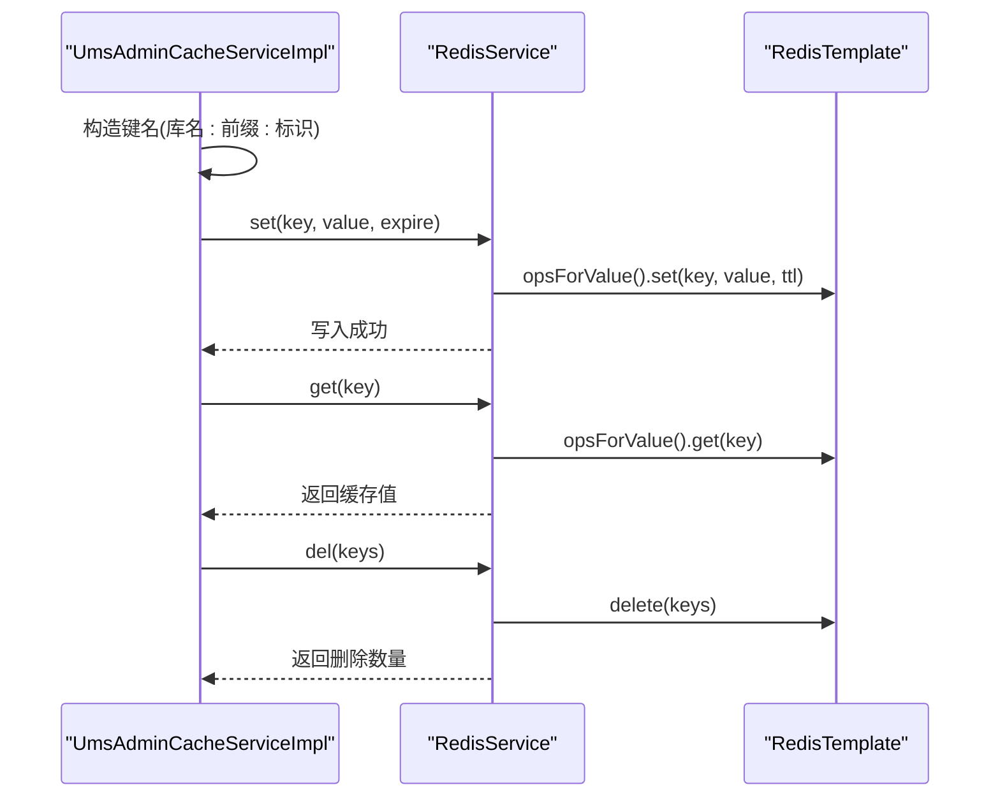
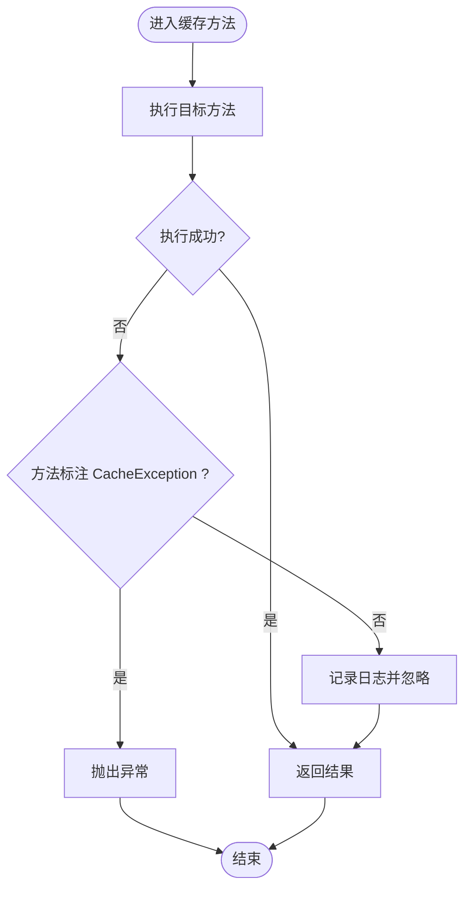
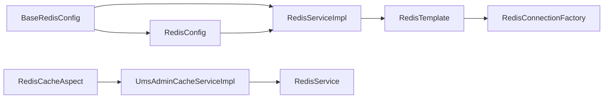

# Redis缓存服务

<cite>
**本文引用的文件**
- [RedisService.java](file://src/main/java/com/macro/mall/tiny/common/service/RedisService.java)
- [RedisServiceImpl.java](file://src/main/java/com/macro/mall/tiny/common/service/impl/RedisServiceImpl.java)
- [BaseRedisConfig.java](file://src/main/java/com/macro/mall/tiny/common/config/BaseRedisConfig.java)
- [RedisConfig.java](file://src/main/java/com/macro/mall/tiny/config/RedisConfig.java)
- [application.yml](file://src/main/resources/application.yml)
- [application-dev.yml](file://src/main/resources/application-dev.yml)
- [application-prod.yml](file://src/main/resources/application-prod.yml)
- [UmsAdminCacheService.java](file://src/main/java/com/macro/mall/tiny/modules/ums/service/UmsAdminCacheService.java)
- [UmsAdminCacheServiceImpl.java](file://src/main/java/com/macro/mall/tiny/modules/ums/service/impl/UmsAdminCacheServiceImpl.java)
- [RedisCacheAspect.java](file://src/main/java/com/macro/mall/tiny/security/aspect/RedisCacheAspect.java)
- [CacheException.java](file://src/main/java/com/macro/mall/tiny/security/annotation/CacheException.java)
</cite>

## 目录
1. [简介](#简介)
2. [项目结构](#项目结构)
3. [核心组件](#核心组件)
4. [架构总览](#架构总览)
5. [详细组件分析](#详细组件分析)
6. [依赖分析](#依赖分析)
7. [性能考虑](#性能考虑)
8. [故障排查指南](#故障排查指南)
9. [结论](#结论)
10. [附录：缓存使用示例与最佳实践](#附录缓存使用示例与最佳实践)

## 简介
本文件系统性梳理并解读 Mall-Tiny 项目中的 Redis 缓存服务设计与实现，重点覆盖以下方面：
- RedisService 接口的设计目标与抽象能力
- RedisServiceImpl 实现类对 RedisTemplate 的封装与序列化策略
- BaseRedisConfig 与 RedisConfig 的配置体系（含连接、序列化、缓存管理器）
- 基于配置的缓存键命名规范与过期时间管理
- 面向业务的后台用户缓存服务（UmsAdminCacheService）与切面容错机制
- 缓存穿透、缓存雪崩、缓存一致性等常见问题的工程化对策与最佳实践
- 具体的缓存操作示例与性能优化建议

## 项目结构
围绕 Redis 缓存的关键模块分布如下：
- 接口层：RedisService 定义统一的缓存操作抽象
- 实现层：RedisServiceImpl 基于 RedisTemplate 提供具体实现
- 配置层：BaseRedisConfig 负责 RedisTemplate、序列化器与缓存管理器的 Bean 注册；RedisConfig 继承并启用 Spring Cache
- 业务层：UmsAdminCacheService/Impl 提供后台用户与资源列表的缓存读写与失效策略
- 容错层：RedisCacheAspect 对缓存相关方法进行切面保护，避免 Redis 故障影响主流程

图表来源
- [BaseRedisConfig.java:26-68](file://src/main/java/com/macro/mall/tiny/common/config/BaseRedisConfig.java#L26-L68)
- [RedisConfig.java:11-15](file://src/main/java/com/macro/mall/tiny/config/RedisConfig.java#L11-L15)
- [RedisService.java:11-182](file://src/main/java/com/macro/mall/tiny/common/service/RedisService.java#L11-L182)
- [RedisServiceImpl.java:16-197](file://src/main/java/com/macro/mall/tiny/common/service/impl/RedisServiceImpl.java#L16-L197)
- [UmsAdminCacheService.java:14-59](file://src/main/java/com/macro/mall/tiny/modules/ums/service/UmsAdminCacheService.java#L14-L59)
- [UmsAdminCacheServiceImpl.java:24-115](file://src/main/java/com/macro/mall/tiny/modules/ums/service/impl/UmsAdminCacheServiceImpl.java#L24-L115)
- [RedisCacheAspect.java:21-50](file://src/main/java/com/macro/mall/tiny/security/aspect/RedisCacheAspect.java#L21-L50)
- [CacheException.java:5-12](file://src/main/java/com/macro/mall/tiny/security/annotation/CacheException.java#L5-L12)

章节来源
- [RedisService.java:11-182](file://src/main/java/com/macro/mall/tiny/common/service/RedisService.java#L11-L182)
- [RedisServiceImpl.java:16-197](file://src/main/java/com/macro/mall/tiny/common/service/impl/RedisServiceImpl.java#L16-L197)
- [BaseRedisConfig.java:26-68](file://src/main/java/com/macro/mall/tiny/common/config/BaseRedisConfig.java#L26-L68)
- [RedisConfig.java:11-15](file://src/main/java/com/macro/mall/tiny/config/RedisConfig.java#L11-L15)
- [UmsAdminCacheService.java:14-59](file://src/main/java/com/macro/mall/tiny/modules/ums/service/UmsAdminCacheService.java#L14-L59)
- [UmsAdminCacheServiceImpl.java:24-115](file://src/main/java/com/macro/mall/tiny/modules/ums/service/impl/UmsAdminCacheServiceImpl.java#L24-L115)
- [RedisCacheAspect.java:21-50](file://src/main/java/com/macro/mall/tiny/security/aspect/RedisCacheAspect.java#L21-L50)
- [CacheException.java:5-12](file://src/main/java/com/macro/mall/tiny/security/annotation/CacheException.java#L5-L12)

## 核心组件
- RedisService 接口：提供键值、哈希、集合、列表等多数据结构的通用缓存操作，以及过期时间设置、判断存在、自增自减等原子操作。接口方法覆盖了常见的缓存 CRUD 场景，便于上层业务以统一方式调用。
- RedisServiceImpl 实现：基于 RedisTemplate 对各数据结构的操作进行封装，统一处理过期时间设置、批量删除、序列化等细节，确保调用方无需关心底层实现。

章节来源
- [RedisService.java:11-182](file://src/main/java/com/macro/mall/tiny/common/service/RedisService.java#L11-L182)
- [RedisServiceImpl.java:16-197](file://src/main/java/com/macro/mall/tiny/common/service/impl/RedisServiceImpl.java#L16-L197)

## 架构总览
下图展示 Redis 缓存服务在应用中的整体架构与交互关系：

图表来源
- [BaseRedisConfig.java:26-68](file://src/main/java/com/macro/mall/tiny/common/config/BaseRedisConfig.java#L26-L68)
- [RedisConfig.java:11-15](file://src/main/java/com/macro/mall/tiny/config/RedisConfig.java#L11-L15)
- [RedisServiceImpl.java:16-197](file://src/main/java/com/macro/mall/tiny/common/service/impl/RedisServiceImpl.java#L16-L197)

## 详细组件分析

### RedisService 接口设计
- 抽象职责：面向缓存操作的统一抽象，屏蔽不同数据结构与序列化细节，便于替换实现或扩展新功能。
- 数据结构覆盖：字符串、哈希、集合、列表，满足多种业务场景（如用户信息、权限列表、计数器等）。
- 时间管理：提供过期设置、查询剩余时间、判断存在等能力，便于精细化控制缓存生命周期。
- 原子操作：自增自减、批量删除等，提升并发场景下的正确性与效率。

章节来源
- [RedisService.java:11-182](file://src/main/java/com/macro/mall/tiny/common/service/RedisService.java#L11-L182)

### RedisServiceImpl 实现细节
- RedisTemplate 使用：通过 opsForXxx 获取对应的数据结构操作器，统一进行 set/get/del/expire 等操作。
- 序列化配置：采用 Jackson2JsonRedisSerializer，结合 ObjectMapper 的默认类型处理，确保复杂对象的序列化与反序列化一致。
- 过期时间管理：针对部分操作（如 Hash/Set/List 的带时长写入），在写入后显式调用 expire 设置 TTL，保证缓存时效性。
- 批量与原子操作：提供批量删除、批量写入、索引访问、自增自减等，兼顾易用性与性能。

图表来源
- [RedisService.java:11-182](file://src/main/java/com/macro/mall/tiny/common/service/RedisService.java#L11-L182)
- [RedisServiceImpl.java:16-197](file://src/main/java/com/macro/mall/tiny/common/service/impl/RedisServiceImpl.java#L16-L197)

章节来源
- [RedisServiceImpl.java:16-197](file://src/main/java/com/macro/mall/tiny/common/service/impl/RedisServiceImpl.java#L16-L197)

### Redis 配置类设计
- BaseRedisConfig
  - RedisTemplate：设置 String 键/哈希键序列化器与 JSON 值/哈希值序列化器，完成连接工厂注入与初始化。
  - RedisSerializer：Jackson2JsonRedisSerializer，配合 ObjectMapper 默认类型处理，确保对象序列化正确。
  - RedisCacheManager：非阻塞写入器，统一缓存 TTL 为 1 天，便于 Spring Cache 使用。
  - RedisService Bean：注册 RedisServiceImpl 实例，供业务层直接注入使用。
- RedisConfig
  - 继承 BaseRedisConfig 并启用 @EnableCaching，使 Spring Cache 能够生效。

图表来源
- [BaseRedisConfig.java:26-68](file://src/main/java/com/macro/mall/tiny/common/config/BaseRedisConfig.java#L26-L68)
- [RedisConfig.java:11-15](file://src/main/java/com/macro/mall/tiny/config/RedisConfig.java#L11-L15)

章节来源
- [BaseRedisConfig.java:26-68](file://src/main/java/com/macro/mall/tiny/common/config/BaseRedisConfig.java#L26-L68)
- [RedisConfig.java:11-15](file://src/main/java/com/macro/mall/tiny/config/RedisConfig.java#L11-L15)

### 缓存键命名规范与过期时间管理
- 命名规范：业务侧通过配置文件集中定义键前缀与通用过期时间，实现“库名:业务域:标识”的层级化命名，便于维护与清理。
- 过期时间：在写入时统一设置过期时间，避免缓存无限期存在；对热点数据可结合业务场景设置更短 TTL，降低陈旧风险。
- 配置来源：应用配置文件中定义了数据库名、键前缀与通用过期时间，业务实现类通过 @Value 注入使用。

章节来源
- [application.yml:30-37](file://src/main/resources/application.yml#L30-L37)
- [UmsAdminCacheServiceImpl.java:34-41](file://src/main/java/com/macro/mall/tiny/modules/ums/service/impl/UmsAdminCacheServiceImpl.java#L34-L41)
- [UmsAdminCacheServiceImpl.java:93-114](file://src/main/java/com/macro/mall/tiny/modules/ums/service/impl/UmsAdminCacheServiceImpl.java#L93-L114)

### 业务缓存服务：后台用户与资源列表
- UmsAdminCacheService：提供管理员信息与资源列表的缓存读写与失效策略，覆盖按用户、角色、资源维度的清理。
- UmsAdminCacheServiceImpl：基于 RedisService 实现，遵循统一键命名与过期时间策略；在角色/资源变更时主动失效相关缓存，保障一致性。

图表来源
- [UmsAdminCacheServiceImpl.java:24-115](file://src/main/java/com/macro/mall/tiny/modules/ums/service/impl/UmsAdminCacheServiceImpl.java#L24-L115)
- [RedisServiceImpl.java:16-197](file://src/main/java/com/macro/mall/tiny/common/service/impl/RedisServiceImpl.java#L16-L197)

章节来源
- [UmsAdminCacheService.java:14-59](file://src/main/java/com/macro/mall/tiny/modules/ums/service/UmsAdminCacheService.java#L14-L59)
- [UmsAdminCacheServiceImpl.java:24-115](file://src/main/java/com/macro/mall/tiny/modules/ums/service/impl/UmsAdminCacheServiceImpl.java#L24-L115)

### 缓存容错与异常处理
- RedisCacheAspect：对匹配到的缓存服务方法进行环绕增强，捕获异常并根据方法是否标注 CacheException 决定是否继续抛出，从而在 Redis 故障时不影响主业务流程。
- CacheException：用于标记“需要抛出异常”的缓存方法，确保关键路径上的错误不会被吞掉。

图表来源
- [RedisCacheAspect.java:21-50](file://src/main/java/com/macro/mall/tiny/security/aspect/RedisCacheAspect.java#L21-L50)
- [CacheException.java:5-12](file://src/main/java/com/macro/mall/tiny/security/annotation/CacheException.java#L5-L12)

章节来源
- [RedisCacheAspect.java:21-50](file://src/main/java/com/macro/mall/tiny/security/aspect/RedisCacheAspect.java#L21-L50)
- [CacheException.java:5-12](file://src/main/java/com/macro/mall/tiny/security/annotation/CacheException.java#L5-L12)

## 依赖分析
- 组件耦合
  - RedisServiceImpl 依赖 RedisTemplate，间接依赖 RedisConnectionFactory
  - BaseRedisConfig 提供 RedisTemplate、RedisSerializer、RedisCacheManager 与 RedisService Bean
  - RedisConfig 继承 BaseRedisConfig 并启用缓存
  - UmsAdminCacheServiceImpl 依赖 RedisService 与业务 Mapper/Service
  - RedisCacheAspect 通过注解与方法签名识别缓存方法
- 外部依赖
  - Spring Data Redis、Jackson、Spring Cache

图表来源
- [BaseRedisConfig.java:26-68](file://src/main/java/com/macro/mall/tiny/common/config/BaseRedisConfig.java#L26-L68)
- [RedisConfig.java:11-15](file://src/main/java/com/macro/mall/tiny/config/RedisConfig.java#L11-L15)
- [RedisServiceImpl.java:16-197](file://src/main/java/com/macro/mall/tiny/common/service/impl/RedisServiceImpl.java#L16-L197)
- [UmsAdminCacheServiceImpl.java:24-115](file://src/main/java/com/macro/mall/tiny/modules/ums/service/impl/UmsAdminCacheServiceImpl.java#L24-L115)
- [RedisCacheAspect.java:21-50](file://src/main/java/com/macro/mall/tiny/security/aspect/RedisCacheAspect.java#L21-L50)

章节来源
- [BaseRedisConfig.java:26-68](file://src/main/java/com/macro/mall/tiny/common/config/BaseRedisConfig.java#L26-L68)
- [RedisConfig.java:11-15](file://src/main/java/com/macro/mall/tiny/config/RedisConfig.java#L11-L15)
- [RedisServiceImpl.java:16-197](file://src/main/java/com/macro/mall/tiny/common/service/impl/RedisServiceImpl.java#L16-L197)
- [UmsAdminCacheServiceImpl.java:24-115](file://src/main/java/com/macro/mall/tiny/modules/ums/service/impl/UmsAdminCacheServiceImpl.java#L24-L115)
- [RedisCacheAspect.java:21-50](file://src/main/java/com/macro/mall/tiny/security/aspect/RedisCacheAspect.java#L21-L50)

## 性能考虑
- 序列化开销：JSON 序列化适合跨语言与结构变化场景，但 CPU 开销高于 JDK 序列化；对简单对象可考虑二进制序列化以降低开销。
- 批量操作：优先使用批量写入与批量删除，减少网络往返次数。
- TTL 设计：为不同业务设置差异化 TTL，热点数据短 TTL，冷数据长 TTL；对周期性刷新的任务使用分布式锁避免同时重建。
- 连接与超时：合理设置连接池大小与超时时间，避免阻塞与堆积；在高并发场景下开启连接池复用。
- 缓存命中率：通过合理的键命名与分片策略提升命中率；对热点键进行本地缓存或只读副本。
- 渐进式过期：对大量数据过期时避免集中过期导致抖动，采用随机 TTL 或延迟过期策略。

## 故障排查指南
- Redis 不可用
  - 现象：缓存读写失败、业务降级
  - 排查：检查 Redis 连接配置、网络连通性、认证信息；确认连接池与超时参数
  - 处理：启用 RedisCacheAspect 的容错策略，确保异常被捕获或按需抛出
- 序列化异常
  - 现象：对象无法正确序列化/反序列化
  - 排查：确认对象具备默认构造函数、字段可见性与类型兼容性；检查 ObjectMapper 默认类型处理配置
- 键冲突与命名不一致
  - 现象：缓存键重复、清理不生效
  - 排查：核对业务侧键拼接规则与配置文件中的前缀、过期时间
- 过期时间未生效
  - 现象：缓存长期存在
  - 排查：确认写入时是否调用 expire；检查 TTL 单位与业务侧传参

章节来源
- [RedisCacheAspect.java:21-50](file://src/main/java/com/macro/mall/tiny/security/aspect/RedisCacheAspect.java#L21-L50)
- [BaseRedisConfig.java:42-51](file://src/main/java/com/macro/mall/tiny/common/config/BaseRedisConfig.java#L42-L51)
- [UmsAdminCacheServiceImpl.java:44-114](file://src/main/java/com/macro/mall/tiny/modules/ums/service/impl/UmsAdminCacheServiceImpl.java#L44-L114)

## 结论
本项目通过 RedisService 接口与 RedisServiceImpl 实现，构建了统一、可扩展的缓存抽象；借助 BaseRedisConfig 与 RedisConfig 提供的序列化与缓存管理器配置，实现了良好的可维护性与可移植性。业务层的 UmsAdminCacheService/Impl 将缓存键命名与过期策略落地到实际场景，并通过 RedisCacheAspect 提升了系统的容错能力。结合本文提供的最佳实践与排障建议，可在生产环境中稳定地发挥 Redis 的性能优势。

## 附录：缓存使用示例与最佳实践

### 缓存键命名规范
- 建议格式：库名:业务域:标识
- 示例：ums:admin:{username}、ums:resourceList:{adminId}
- 配置集中化：通过配置文件定义库名、键前缀与通用过期时间，业务侧仅负责拼接标识

章节来源
- [application.yml:30-37](file://src/main/resources/application.yml#L30-L37)
- [UmsAdminCacheServiceImpl.java:44-114](file://src/main/java/com/macro/mall/tiny/modules/ums/service/impl/UmsAdminCacheServiceImpl.java#L44-L114)

### 过期时间管理
- 写入即过期：对新增缓存统一设置 TTL，避免无限期缓存
- 差异化 TTL：热点数据短 TTL，冷数据长 TTL；对周期性任务设置随机偏移
- 主动失效：在数据变更时主动删除相关缓存键，确保一致性

章节来源
- [RedisServiceImpl.java:76-78](file://src/main/java/com/macro/mall/tiny/common/service/impl/RedisServiceImpl.java#L76-L78)
- [RedisServiceImpl.java:133-136](file://src/main/java/com/macro/mall/tiny/common/service/impl/RedisServiceImpl.java#L133-L136)
- [UmsAdminCacheServiceImpl.java:44-90](file://src/main/java/com/macro/mall/tiny/modules/ums/service/impl/UmsAdminCacheServiceImpl.java#L44-L90)

### 缓存穿透防护
- 空值缓存：对不存在的查询也写入空值或短 TTL，避免持续穿透
- 唯一索引：通过唯一索引或布隆过滤器快速判定数据是否存在
- 参数校验：对非法输入直接拦截，减少无效查询

### 缓存雪崩处理
- 随机 TTL：为大批量过期键增加随机抖动，避免同时过期
- 多级缓存：引入本地缓存或只读副本，降低单 Redis 压力
- 限流降级：在高峰期限制请求速率或降级非关键缓存

### 缓存一致性保证
- 先更新数据库，再删除缓存（或更新后写入新值）
- 在数据变更时主动失效相关键，确保下次读取时重建
- 对热点数据采用“延迟双删”或分布式锁，避免并发不一致

### 具体缓存操作示例（步骤说明）
- 写入用户信息
  - 步骤：构造键名 → 调用 set(key, value, expire) → 校验写入结果
  - 参考实现位置：[UmsAdminCacheServiceImpl.java:99-102](file://src/main/java/com/macro/mall/tiny/modules/ums/service/impl/UmsAdminCacheServiceImpl.java#L99-L102)
- 读取用户信息
  - 步骤：构造键名 → 调用 get(key) → 判空与回源
  - 参考实现位置：[UmsAdminCacheServiceImpl.java:93-96](file://src/main/java/com/macro/mall/tiny/modules/ums/service/impl/UmsAdminCacheServiceImpl.java#L93-L96)
- 删除用户资源列表
  - 步骤：构造键名 → 调用 del(key) → 校验删除数量
  - 参考实现位置：[UmsAdminCacheServiceImpl.java:53-56](file://src/main/java/com/macro/mall/tiny/modules/ums/service/impl/UmsAdminCacheServiceImpl.java#L53-L56)
- 角色/资源变更后的批量失效
  - 步骤：查询关联关系 → 构造多个键 → 调用批量删除
  - 参考实现位置：[UmsAdminCacheServiceImpl.java:59-90](file://src/main/java/com/macro/mall/tiny/modules/ums/service/impl/UmsAdminCacheServiceImpl.java#L59-L90)