# 异常处理系统

<cite>
**本文档引用的文件**
- [ApiException.java](file://src/main/java/com/macro/mall/tiny/common/exception/ApiException.java)
- [GlobalExceptionHandler.java](file://src/main/java/com/macro/mall/tiny/common/exception/GlobalExceptionHandler.java)
- [Asserts.java](file://src/main/java/com/macro/mall/tiny/common/exception/Asserts.java)
- [CommonResult.java](file://src/main/java/com/macro/mall/tiny/common/api/CommonResult.java)
- [IErrorCode.java](file://src/main/java/com/macro/mall/tiny/common/api/IErrorCode.java)
- [ResultCode.java](file://src/main/java/com/macro/mall/tiny/common/api/ResultCode.java)
- [GlobalExceptionHandlerTest.java](file://src/test/java/com/macro/mall/tiny/common/exception/GlobalExceptionHandlerTest.java)
- [AdminImportServiceImpl.java](file://src/main/java/com/macro/mall/tiny/modules/ums/service/impl/AdminImportServiceImpl.java)
- [UmsAdminServiceImpl.java](file://src/main/java/com/macro/mall/tiny/modules/ums/service/impl/UmsAdminServiceImpl.java)
- [application.yml](file://src/main/resources/application.yml)
</cite>

## 目录
1. [简介](#简介)
2. [项目结构](#项目结构)
3. [核心组件](#核心组件)
4. [架构概览](#架构概览)
5. [详细组件分析](#详细组件分析)
6. [依赖关系分析](#依赖关系分析)
7. [性能考虑](#性能考虑)
8. [故障排除指南](#故障排除指南)
9. [最佳实践](#最佳实践)
10. [结论](#结论)

## 简介

Mall-Tiny项目的异常处理系统是一个基于Spring Boot的统一异常管理框架，旨在提供一致的错误处理体验和标准化的API响应格式。该系统通过全局异常处理器、自定义异常类和断言工具类的协同工作，实现了从异常捕获到统一响应的完整处理流程。

系统的核心设计目标包括：
- 统一异常类型识别和分类处理
- 标准化的API响应格式
- 安全的异常日志记录机制
- 友好的用户体验和错误信息展示

## 项目结构

异常处理系统在项目中的组织结构如下：

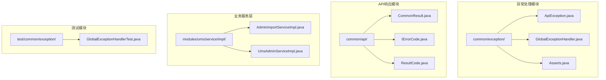

**图表来源**
- [ApiException.java:1-34](file://src/main/java/com/macro/mall/tiny/common/exception/ApiException.java#L1-L34)
- [GlobalExceptionHandler.java:1-100](file://src/main/java/com/macro/mall/tiny/common/exception/GlobalExceptionHandler.java#L1-L100)
- [Asserts.java:1-19](file://src/main/java/com/macro/mall/tiny/common/exception/Asserts.java#L1-L19)

**章节来源**
- [ApiException.java:1-34](file://src/main/java/com/macro/mall/tiny/common/exception/ApiException.java#L1-L34)
- [GlobalExceptionHandler.java:1-100](file://src/main/java/com/macro/mall/tiny/common/exception/GlobalExceptionHandler.java#L1-L100)
- [Asserts.java:1-19](file://src/main/java/com/macro/mall/tiny/common/exception/Asserts.java#L1-L19)

## 核心组件

### ApiException自定义异常类

ApiException是系统的核心异常类，继承自RuntimeException，提供了灵活的异常构造方式：

- **多构造函数支持**：支持基于IErrorCode、String消息、Throwable原因以及组合参数的多种构造方式
- **错误码关联**：通过IErrorCode接口关联具体的错误码和消息
- **链式异常支持**：支持异常原因传递，便于追踪异常源头

### GlobalExceptionHandler全局异常处理器

作为@RestControllerAdvice，提供统一的异常处理机制：

- **异常类型识别**：针对不同类型的异常进行专门处理
- **日志记录**：使用SLF4J进行异常日志记录，区分警告和错误级别
- **响应格式化**：将异常转换为标准化的CommonResult响应格式
- **安全处理**：对未知异常进行安全处理，避免敏感信息泄露

### Asserts断言工具类

提供静态断言方法，简化业务逻辑中的异常抛出：

- **简洁API**：提供fail方法的两个重载版本
- **灵活使用**：支持直接消息或错误码两种断言方式
- **统一异常**：确保所有断言都抛出ApiException异常

**章节来源**
- [ApiException.java:10-33](file://src/main/java/com/macro/mall/tiny/common/exception/ApiException.java#L10-L33)
- [GlobalExceptionHandler.java:22-98](file://src/main/java/com/macro/mall/tiny/common/exception/GlobalExceptionHandler.java#L22-L98)
- [Asserts.java:10-18](file://src/main/java/com/macro/mall/tiny/common/exception/Asserts.java#L10-L18)

## 架构概览

异常处理系统的整体架构采用分层设计，从异常产生到最终响应的完整流程如下：

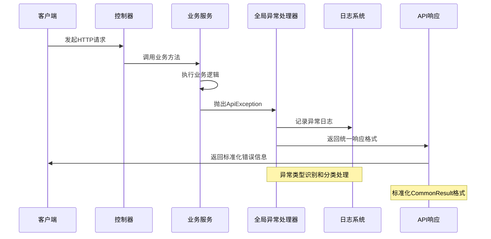

**图表来源**
- [GlobalExceptionHandler.java:27-34](file://src/main/java/com/macro/mall/tiny/common/exception/GlobalExceptionHandler.java#L27-L34)
- [CommonResult.java:44-76](file://src/main/java/com/macro/mall/tiny/common/api/CommonResult.java#L44-L76)

## 详细组件分析

### ApiException类深度分析

ApiException类的设计体现了良好的面向对象原则：

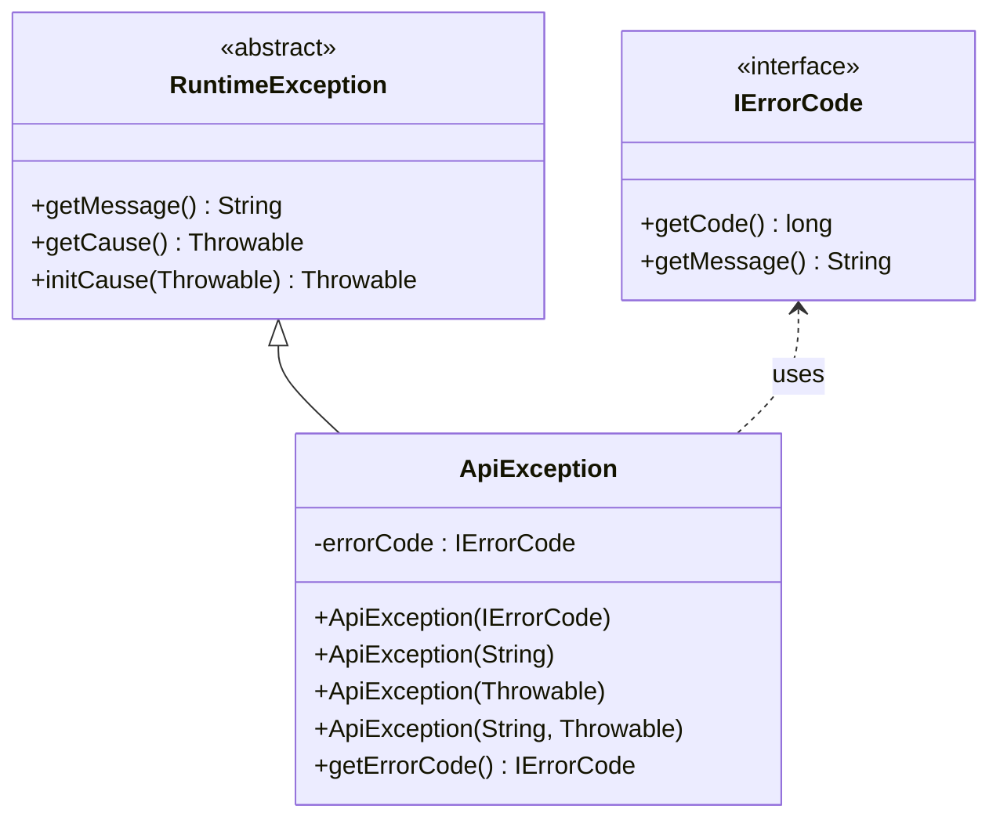

**图表来源**
- [ApiException.java:10-33](file://src/main/java/com/macro/mall/tiny/common/exception/ApiException.java#L10-L33)
- [IErrorCode.java:7-11](file://src/main/java/com/macro/mall/tiny/common/api/IErrorCode.java#L7-L11)

#### 异常构造函数分析

ApiException提供了四种构造函数，满足不同场景的需求：

1. **基于错误码的构造**：适用于预定义的业务错误
2. **基于消息的构造**：适用于临时性错误信息
3. **基于原因的构造**：支持异常链传递
4. **组合参数构造**：同时支持消息和原因

**章节来源**
- [ApiException.java:13-28](file://src/main/java/com/macro/mall/tiny/common/exception/ApiException.java#L13-L28)

### GlobalExceptionHandler异常处理器分析

全局异常处理器采用注解驱动的方式，通过@ExceptionHandler标注具体异常类型的处理方法：

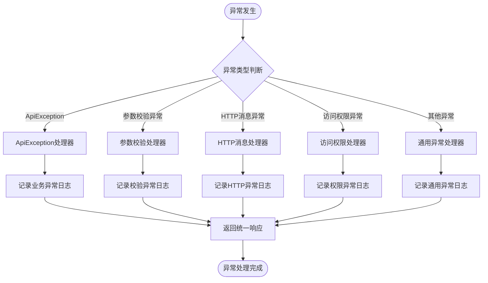

**图表来源**
- [GlobalExceptionHandler.java:27-98](file://src/main/java/com/macro/mall/tiny/common/exception/GlobalExceptionHandler.java#L27-L98)

#### 异常处理策略

系统针对不同类型的异常采用了差异化的处理策略：

1. **业务异常(ApiException)**：优先使用错误码，提供精确的错误信息
2. **参数校验异常**：提取字段错误信息，提供具体的校验失败详情
3. **HTTP消息异常**：提供友好的格式错误提示
4. **访问权限异常**：返回403状态码，表示权限不足
5. **通用异常**：统一返回系统繁忙信息，避免泄露内部细节

**章节来源**
- [GlobalExceptionHandler.java:27-98](file://src/main/java/com/macro/mall/tiny/common/exception/GlobalExceptionHandler.java#L27-L98)

### Asserts断言工具类分析

Asserts类提供了简洁的断言API，简化了业务逻辑中的异常处理：

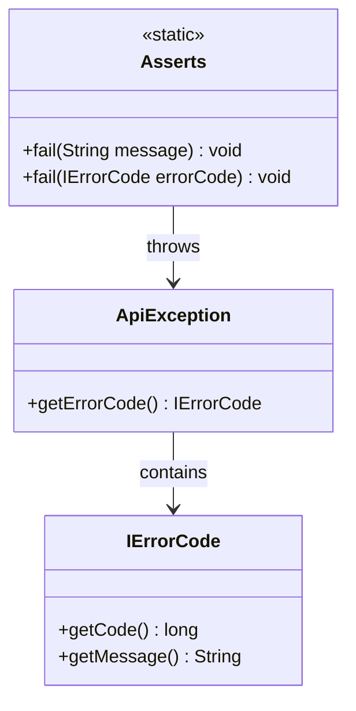

**图表来源**
- [Asserts.java:10-18](file://src/main/java/com/macro/mall/tiny/common/exception/Asserts.java#L10-L18)
- [ApiException.java:30-32](file://src/main/java/com/macro/mall/tiny/common/exception/ApiException.java#L30-L32)

#### 断言使用模式

Asserts类支持两种断言模式：

1. **消息断言**：直接抛出ApiException，适用于临时性错误
2. **错误码断言**：使用预定义的ResultCode，确保错误信息的一致性

**章节来源**
- [Asserts.java:11-17](file://src/main/java/com/macro/mall/tiny/common/exception/Asserts.java#L11-L17)

### API响应格式化分析

系统通过CommonResult类提供统一的API响应格式：

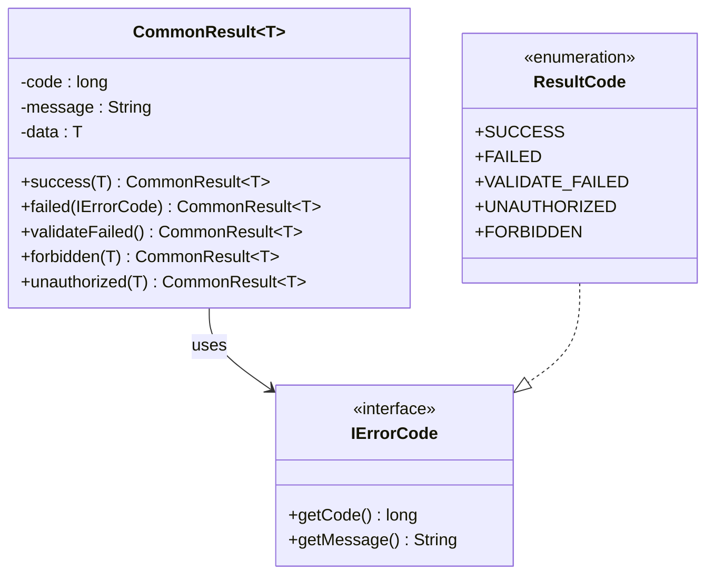

**图表来源**
- [CommonResult.java:7-124](file://src/main/java/com/macro/mall/tiny/common/api/CommonResult.java#L7-L124)
- [ResultCode.java:7-37](file://src/main/java/com/macro/mall/tiny/common/api/ResultCode.java#L7-L37)

#### 响应状态码体系

系统定义了完整的响应状态码体系：

- **200系列**：SUCCESS(200) - 操作成功
- **400系列**：VALIDATE_FAILED(400) - 参数校验失败
- **401系列**：UNAUTHORIZED(401) - 未登录或token过期
- **403系列**：FORBIDDEN(403) - 权限不足
- **500系列**：FAILED(500) - 操作失败

**章节来源**
- [CommonResult.java:26-99](file://src/main/java/com/macro/mall/tiny/common/api/CommonResult.java#L26-L99)
- [ResultCode.java:8-21](file://src/main/java/com/macro/mall/tiny/common/api/ResultCode.java#L8-L21)

## 依赖关系分析

异常处理系统的依赖关系清晰明确，遵循单一职责原则：

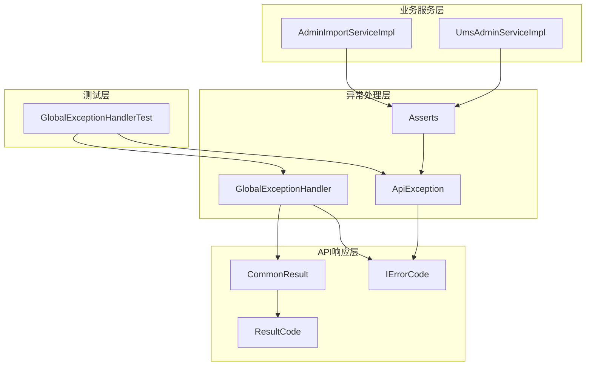

**图表来源**
- [GlobalExceptionHandler.java:3-15](file://src/main/java/com/macro/mall/tiny/common/exception/GlobalExceptionHandler.java#L3-L15)
- [ApiException.java](file://src/main/java/com/macro/mall/tiny/common/exception/ApiException.java#L4)
- [CommonResult.java:1-6](file://src/main/java/com/macro/mall/tiny/common/api/CommonResult.java#L1-L6)

### 关键依赖关系

1. **异常到响应的映射**：GlobalExceptionHandler依赖CommonResult进行响应格式化
2. **错误码接口**：ApiException和Asserts都依赖IErrorCode接口
3. **业务集成**：业务服务通过Asserts类抛出ApiException
4. **测试覆盖**：GlobalExceptionHandlerTest验证异常处理逻辑

**章节来源**
- [GlobalExceptionHandler.java:3-15](file://src/main/java/com/macro/mall/tiny/common/exception/GlobalExceptionHandler.java#L3-L15)
- [ApiException.java](file://src/main/java/com/macro/mall/tiny/common/exception/ApiException.java#L4)
- [CommonResult.java:1-6](file://src/main/java/com/macro/mall/tiny/common/api/CommonResult.java#L1-L6)

## 性能考虑

异常处理系统的性能优化主要体现在以下几个方面：

### 异常处理性能

1. **选择性日志记录**：根据异常类型选择适当的日志级别，避免过度日志记录
2. **快速异常分类**：通过@ExceptionHandler的精确匹配，减少异常处理的开销
3. **响应格式缓存**：CommonResult的静态工厂方法减少了对象创建开销

### 内存使用优化

1. **异常对象复用**：ResultCode枚举实例在整个应用生命周期内复用
2. **字符串常量池**：错误消息使用字符串常量，利用JVM的字符串池优化
3. **流式处理**：业务层采用流式处理方式，减少内存占用

### 网络传输优化

1. **最小化响应体**：异常响应只包含必要的错误信息
2. **状态码标准化**：使用标准HTTP状态码，提高客户端处理效率
3. **错误信息本地化**：支持多语言错误信息，提升国际化体验

## 故障排除指南

### 常见异常问题诊断

#### 异常未被捕获

**症状**：业务异常直接导致服务器错误页面

**排查步骤**：
1. 检查业务方法是否正确抛出ApiException
2. 验证GlobalExceptionHandler是否正确配置
3. 确认@RestControllerAdvice注解生效

**解决方案**：
```java
// 确保业务方法抛出ApiException
if (invalidCondition) {
    Asserts.fail("参数无效");
}

// 或者直接抛出
throw new ApiException(ResultCode.VALIDATE_FAILED);
```

#### 错误码不匹配

**症状**：API响应的状态码与预期不符

**排查步骤**：
1. 检查ResultCode枚举定义
2. 验证ApiException构造参数
3. 确认GlobalExceptionHandler的处理逻辑

**解决方案**：
```java
// 使用预定义错误码
Asserts.fail(ResultCode.IMPORT_SESSION_EXPIRED);

// 或者自定义错误码
Asserts.fail(new CustomErrorCode(1001, "自定义错误信息"));
```

#### 日志记录问题

**症状**：异常日志缺失或信息不完整

**排查步骤**：
1. 检查SLF4J配置
2. 验证Logger实例初始化
3. 确认异常处理方法中的日志记录语句

**解决方案**：
```java
// 确保正确的日志记录
LOGGER.warn("业务异常: {}", e.getMessage());
LOGGER.error("系统异常", e); // 对于未知异常
```

### 调试技巧

#### 异常堆栈跟踪

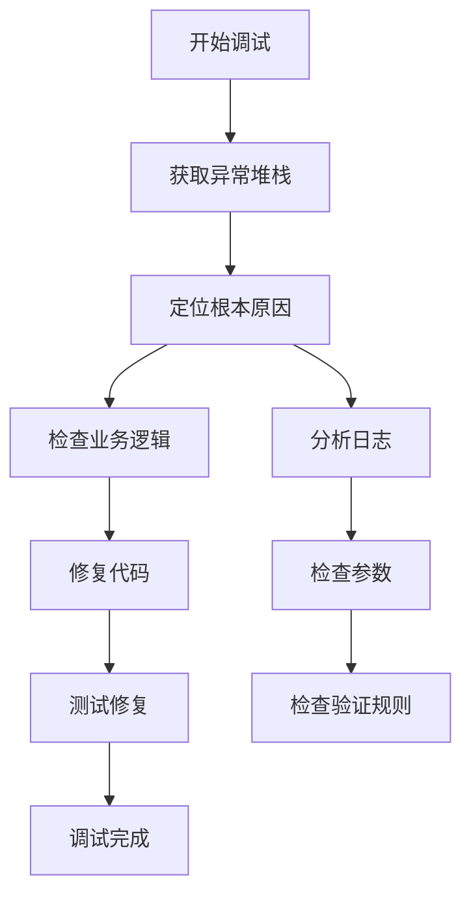

#### 单元测试策略

系统提供了完善的异常处理测试：

1. **异常类型测试**：验证不同异常类型的处理结果
2. **错误码测试**：确认错误码映射的准确性
3. **日志记录测试**：验证异常日志的正确性
4. **安全测试**：确保敏感信息不被泄露

**章节来源**
- [GlobalExceptionHandlerTest.java:27-121](file://src/test/java/com/macro/mall/tiny/common/exception/GlobalExceptionHandlerTest.java#L27-L121)

## 最佳实践

### 异常分类策略

#### 业务异常分类

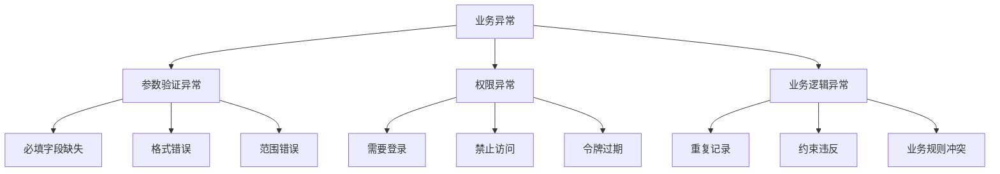

#### 技术异常分类

技术异常主要由系统底层问题引起，需要统一处理：

1. **网络异常**：连接超时、网络中断等
2. **数据库异常**：连接失败、SQL错误等
3. **文件异常**：文件不存在、权限不足等
4. **系统异常**：内存不足、磁盘空间不足等

### 错误信息本地化

#### 多语言支持策略

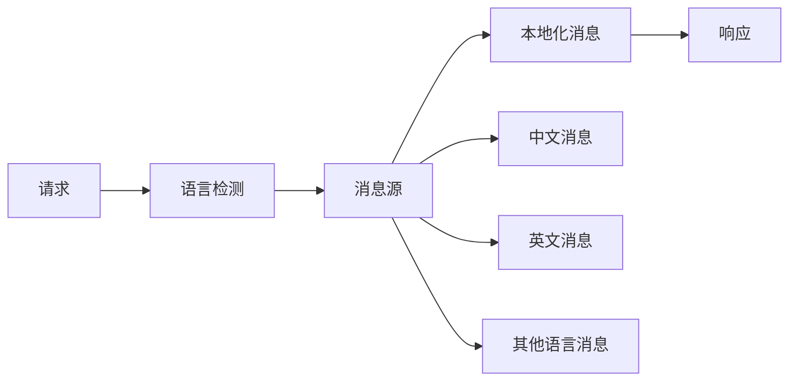

#### 实现建议

1. **消息配置分离**：将错误消息与代码分离，便于维护
2. **占位符支持**：支持动态参数替换
3. **默认消息回退**：提供默认语言的消息回退机制

### 敏感信息脱敏处理

#### 数据脱敏策略

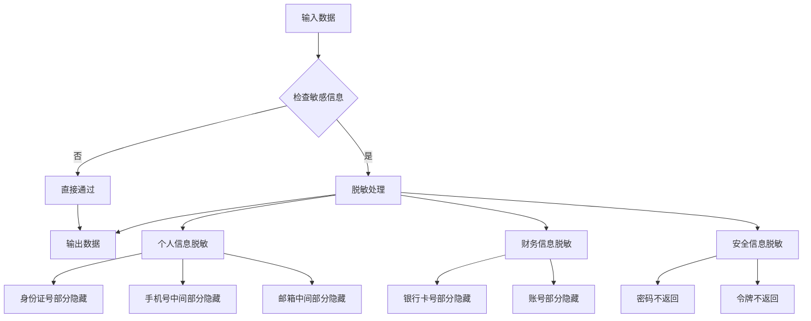

#### 实施要点

1. **黑名单机制**：识别所有可能的敏感信息类型
2. **白名单机制**：明确哪些信息可以安全返回
3. **动态脱敏**：根据上下文动态决定脱敏程度
4. **日志脱敏**：确保日志中不包含敏感信息

### 异常处理最佳实践清单

#### 设计阶段

1. **定义异常层次**：明确业务异常和技术异常的边界
2. **制定错误码规范**：建立统一的错误码命名和编号规则
3. **设计响应格式**：确定API响应的标准格式和字段
4. **规划日志策略**：定义不同类型异常的日志记录要求

#### 开发阶段

1. **使用Asserts工具**：统一异常抛出方式
2. **提供有意义的错误信息**：帮助用户理解和解决问题
3. **避免泄露内部实现细节**：保护系统安全
4. **确保异常处理的幂等性**：重复处理不应产生副作用

#### 测试阶段

1. **编写异常场景测试**：覆盖各种异常情况
2. **验证响应格式一致性**：确保API响应符合规范
3. **检查日志完整性**：确认异常日志记录完整
4. **性能测试**：评估异常处理对系统性能的影响

#### 运维阶段

1. **监控异常指标**：跟踪异常发生频率和类型分布
2. **建立告警机制**：对异常情况进行及时通知
3. **定期审查日志**：发现潜在问题和改进机会
4. **持续优化策略**：根据实际使用情况调整异常处理策略

## 结论

Mall-Tiny项目的异常处理系统通过精心设计的架构和实现，为整个应用提供了强大而灵活的异常管理能力。系统的主要优势包括：

### 设计优势

1. **层次清晰**：异常处理、响应格式化、断言工具各司其职，职责分离明确
2. **扩展性强**：基于接口的设计允许轻松添加新的异常类型和处理逻辑
3. **使用便捷**：简洁的API设计降低了开发者的使用成本
4. **安全可靠**：完善的日志记录和敏感信息保护机制

### 实践价值

1. **提升用户体验**：统一的错误处理和友好的错误信息提升了用户满意度
2. **降低维护成本**：标准化的异常处理减少了代码重复和维护复杂度
3. **增强系统稳定性**：完善的异常处理机制提高了系统的健壮性
4. **支持团队协作**：清晰的异常处理规范便于团队成员协作开发

### 改进建议

1. **增加异常统计功能**：提供异常发生频率和趋势分析
2. **实现异常重试机制**：对于可恢复的异常提供自动重试功能
3. **增强异常链追踪**：提供更详细的异常链路追踪能力
4. **优化性能监控**：增加异常处理性能的实时监控

通过持续的优化和完善，这个异常处理系统将继续为Mall-Tiny项目提供稳定可靠的异常管理支持，成为企业级应用开发的优秀参考范例。