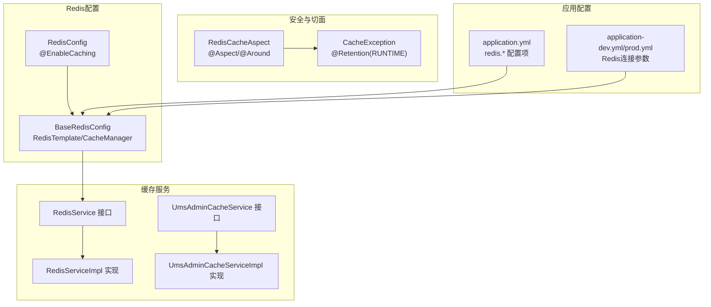
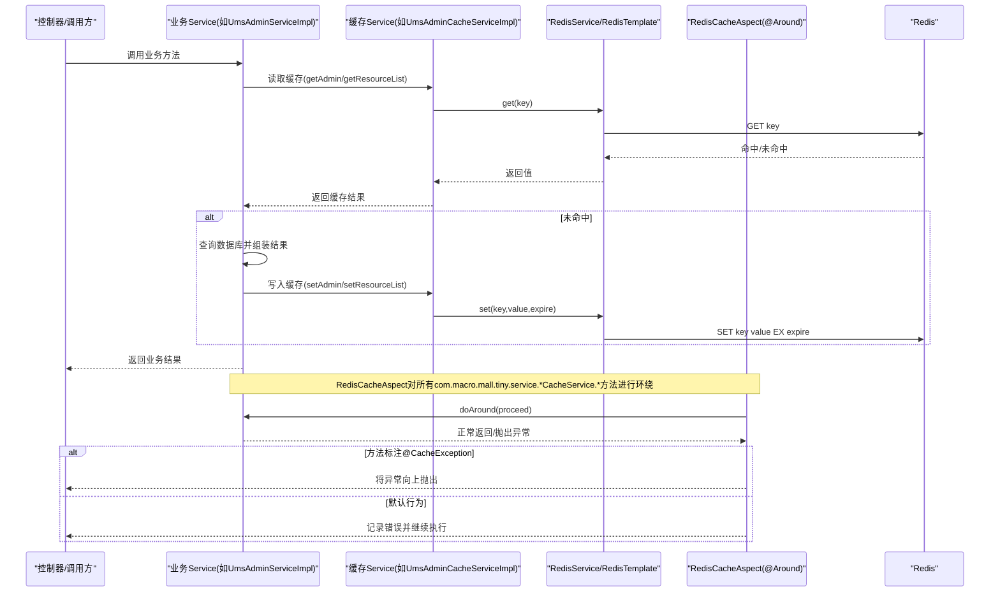
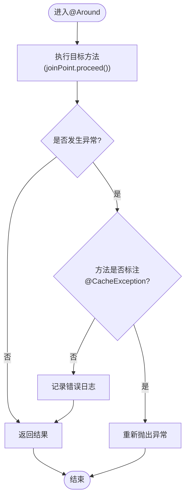
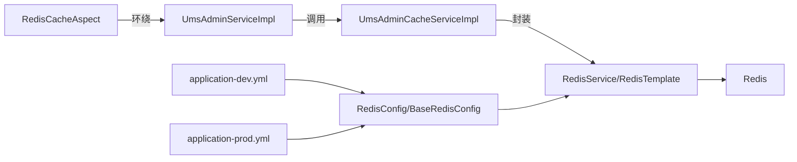

# 缓存切面编程

<cite>
**本文引用的文件**
- [RedisCacheAspect.java](file://src/main/java/com/macro/mall/tiny/security/aspect/RedisCacheAspect.java)
- [CacheException.java](file://src/main/java/com/macro/mall/tiny/security/annotation/CacheException.java)
- [RedisConfig.java](file://src/main/java/com/macro/mall/tiny/config/RedisConfig.java)
- [BaseRedisConfig.java](file://src/main/java/com/macro/mall/tiny/common/config/BaseRedisConfig.java)
- [RedisService.java](file://src/main/java/com/macro/mall/tiny/common/service/RedisService.java)
- [RedisServiceImpl.java](file://src/main/java/com/macro/mall/tiny/common/service/impl/RedisServiceImpl.java)
- [UmsAdminCacheService.java](file://src/main/java/com/macro/mall/tiny/modules/ums/service/UmsAdminCacheService.java)
- [UmsAdminCacheServiceImpl.java](file://src/main/java/com/macro/mall/tiny/modules/ums/service/impl/UmsAdminCacheServiceImpl.java)
- [UmsAdminServiceImpl.java](file://src/main/java/com/macro/mall/tiny/modules/ums/service/impl/UmsAdminServiceImpl.java)
- [application.yml](file://src/main/resources/application.yml)
- [application-dev.yml](file://src/main/resources/application-dev.yml)
- [application-prod.yml](file://src/main/resources/application-prod.yml)
</cite>

## 目录
1. [简介](#简介)
2. [项目结构](#项目结构)
3. [核心组件](#核心组件)
4. [架构总览](#架构总览)
5. [详细组件分析](#详细组件分析)
6. [依赖分析](#依赖分析)
7. [性能考虑](#性能考虑)
8. [故障排查指南](#故障排查指南)
9. [结论](#结论)
10. [附录：使用示例与调试方法](#附录使用示例与调试方法)

## 简介
本文件系统性阐述基于 Spring AOP 的缓存切面设计与实现，重点围绕 RedisCacheAspect 切面展开，解释其如何通过 @Around 注解对特定服务层方法进行环绕增强，以在 Redis 宕机或异常情况下保证主业务逻辑不受影响。同时结合项目中的自定义注解 CacheException、Redis 配置与 RedisService 抽象，给出缓存策略（命中率优化、更新策略、失效机制）、最佳实践（切入点表达式、异常处理、性能监控）以及可操作的使用示例与调试方法。

## 项目结构
本项目采用分层+模块化的组织方式，缓存相关能力主要分布在以下位置：
- 安全与切面：security/aspect、security/annotation
- Redis 基础配置：common/config、config
- 缓存服务接口与实现：common/service、modules/ums/service
- 应用配置：resources/application*.yml



图表来源
- [RedisCacheAspect.java:1-51](file://src/main/java/com/macro/mall/tiny/security/aspect/RedisCacheAspect.java#L1-L51)
- [CacheException.java:1-13](file://src/main/java/com/macro/mall/tiny/security/annotation/CacheException.java#L1-L13)
- [RedisConfig.java:1-16](file://src/main/java/com/macro/mall/tiny/config/RedisConfig.java#L1-L16)
- [BaseRedisConfig.java:1-68](file://src/main/java/com/macro/mall/tiny/common/config/BaseRedisConfig.java#L1-L68)
- [RedisService.java:1-182](file://src/main/java/com/macro/mall/tiny/common/service/RedisService.java#L1-L182)
- [RedisServiceImpl.java:1-198](file://src/main/java/com/macro/mall/tiny/common/service/impl/RedisServiceImpl.java#L1-L198)
- [UmsAdminCacheService.java:1-60](file://src/main/java/com/macro/mall/tiny/modules/ums/service/UmsAdminCacheService.java#L1-L60)
- [UmsAdminCacheServiceImpl.java:1-116](file://src/main/java/com/macro/mall/tiny/modules/ums/service/impl/UmsAdminCacheServiceImpl.java#L1-L116)
- [application.yml:30-37](file://src/main/resources/application.yml#L30-L37)
- [application-dev.yml:6-11](file://src/main/resources/application-dev.yml#L6-L11)
- [application-prod.yml:6-11](file://src/main/resources/application-prod.yml#L6-L11)

章节来源
- [RedisConfig.java:1-16](file://src/main/java/com/macro/mall/tiny/config/RedisConfig.java#L1-L16)
- [BaseRedisConfig.java:1-68](file://src/main/java/com/macro/mall/tiny/common/config/BaseRedisConfig.java#L1-L68)
- [application.yml:30-37](file://src/main/resources/application.yml#L30-L37)
- [application-dev.yml:6-11](file://src/main/resources/application-dev.yml#L6-L11)
- [application-prod.yml:6-11](file://src/main/resources/application-prod.yml#L6-L11)

## 核心组件
- RedisCacheAspect：面向 com.macro.mall.tiny.service.*CacheService.* 的环绕切面，统一捕获异常并根据方法是否标注 CacheException 决定是否向上抛出，从而在 Redis 异常时不影响主流程。
- CacheException：运行时注解，用于标记“缓存方法”在异常时应抛出，以便上层感知。
- RedisConfig/BaseRedisConfig：启用 Spring Cache 并提供 RedisTemplate、Jackson 序列化器与 RedisCacheManager。
- RedisService/RedisServiceImpl：对 Redis 的通用操作抽象与实现，覆盖字符串、哈希、集合、列表等数据结构。
- UmsAdminCacheService/Impl：面向后台用户与资源列表的缓存读写与失效策略示例。
- UmsAdminServiceImpl：在业务层调用缓存服务，体现“先查缓存、未命中再查数据库”的典型模式，并在变更时主动清理缓存。

章节来源
- [RedisCacheAspect.java:17-50](file://src/main/java/com/macro/mall/tiny/security/aspect/RedisCacheAspect.java#L17-L50)
- [CacheException.java:5-12](file://src/main/java/com/macro/mall/tiny/security/annotation/CacheException.java#L5-L12)
- [RedisConfig.java:11-13](file://src/main/java/com/macro/mall/tiny/config/RedisConfig.java#L11-L13)
- [BaseRedisConfig.java:26-68](file://src/main/java/com/macro/mall/tiny/common/config/BaseRedisConfig.java#L26-L68)
- [RedisService.java:11-182](file://src/main/java/com/macro/mall/tiny/common/service/RedisService.java#L11-L182)
- [RedisServiceImpl.java:16-198](file://src/main/java/com/macro/mall/tiny/common/service/impl/RedisServiceImpl.java#L16-L198)
- [UmsAdminCacheService.java:14-59](file://src/main/java/com/macro/mall/tiny/modules/ums/service/UmsAdminCacheService.java#L14-L59)
- [UmsAdminCacheServiceImpl.java:24-116](file://src/main/java/com/macro/mall/tiny/modules/ums/service/impl/UmsAdminCacheServiceImpl.java#L24-L116)
- [UmsAdminServiceImpl.java:64-76](file://src/main/java/com/macro/mall/tiny/modules/ums/service/impl/UmsAdminServiceImpl.java#L64-L76)

## 架构总览
下图展示缓存切面与业务层、缓存服务之间的交互关系，以及异常处理策略：



图表来源
- [RedisCacheAspect.java:31-48](file://src/main/java/com/macro/mall/tiny/security/aspect/RedisCacheAspect.java#L31-L48)
- [UmsAdminServiceImpl.java:64-76](file://src/main/java/com/macro/mall/tiny/modules/ums/service/impl/UmsAdminServiceImpl.java#L64-L76)
- [UmsAdminCacheServiceImpl.java:92-114](file://src/main/java/com/macro/mall/tiny/modules/ums/service/impl/UmsAdminCacheServiceImpl.java#L92-L114)
- [RedisServiceImpl.java:20-33](file://src/main/java/com/macro/mall/tiny/common/service/impl/RedisServiceImpl.java#L20-L33)

## 详细组件分析

### RedisCacheAspect 切面设计与织入时机
- 织入点：通过 @Pointcut 定义对 com.macro.mall.tiny.service.*CacheService.* 的公共方法匹配；@Around 在方法执行前后进行拦截。
- 执行顺序：@Order(2) 确保在其他可能的切面之后执行，避免相互干扰。
- 异常策略：try/catch 包裹 proceed()，若方法标注 @CacheException 则将异常重新抛出；否则仅记录日志并继续返回结果，确保 Redis 故障不影响主业务。



图表来源
- [RedisCacheAspect.java:31-48](file://src/main/java/com/macro/mall/tiny/security/aspect/RedisCacheAspect.java#L31-L48)

章节来源
- [RedisCacheAspect.java:27-48](file://src/main/java/com/macro/mall/tiny/security/aspect/RedisCacheAspect.java#L27-L48)

### 缓存注解与使用方式
- 项目中存在自定义注解 CacheException，用于标识“缓存方法”在异常时需要向上抛出，便于上层感知缓存层故障。
- 项目未直接使用 Spring Cache 的 @Cacheable、@CacheEvict、@CachePut 等注解。实际缓存逻辑由 UmsAdminCacheServiceImpl 等显式调用 RedisService 实现，形成“编程式缓存”。

章节来源
- [CacheException.java:8-12](file://src/main/java/com/macro/mall/tiny/security/annotation/CacheException.java#L8-L12)
- [UmsAdminCacheServiceImpl.java:44-114](file://src/main/java/com/macro/mall/tiny/modules/ums/service/impl/UmsAdminCacheServiceImpl.java#L44-L114)

### 缓存策略实现
- 命中率优化
  - 先查缓存：UmsAdminServiceImpl 在查询用户时优先从缓存读取，未命中再查数据库并回填缓存。
  - 键命名规范：使用“数据库名:前缀:标识”的组合，降低键冲突风险。
- 更新策略
  - 变更时主动失效：在更新用户信息、删除用户、更新角色关系等场景，调用缓存服务删除相关键，确保后续读取走数据库并回填最新数据。
- 失效机制
  - TTL：通过 RedisService.set(key, value, expire) 设置过期时间，结合配置项控制缓存生命周期。
  - 批量删除：当角色或资源变更时，按前缀批量构造键并删除，避免遗漏。

```mermaid
flowchart TD
A["业务变更事件"] --> B["构造缓存键前缀"]
B --> C{"涉及范围?"}
C --> |单个用户| D["删除单个键"]
C --> |多用户(角色/资源)| E["批量构造键列表"]
E --> F["批量删除(keys)"]
D --> G["下次访问触发回填"]
F --> G
```

图表来源
- [UmsAdminServiceImpl.java:181-190](file://src/main/java/com/macro/mall/tiny/modules/ums/service/impl/UmsAdminServiceImpl.java#L181-L190)
- [UmsAdminCacheServiceImpl.java:58-90](file://src/main/java/com/macro/mall/tiny/modules/ums/service/impl/UmsAdminCacheServiceImpl.java#L58-L90)
- [RedisServiceImpl.java:40-43](file://src/main/java/com/macro/mall/tiny/common/service/impl/RedisServiceImpl.java#L40-L43)

章节来源
- [UmsAdminServiceImpl.java:64-76](file://src/main/java/com/macro/mall/tiny/modules/ums/service/impl/UmsAdminServiceImpl.java#L64-L76)
- [UmsAdminCacheServiceImpl.java:44-114](file://src/main/java/com/macro/mall/tiny/modules/ums/service/impl/UmsAdminCacheServiceImpl.java#L44-L114)
- [RedisServiceImpl.java:20-48](file://src/main/java/com/macro/mall/tiny/common/service/impl/RedisServiceImpl.java#L20-L48)
- [application.yml:30-37](file://src/main/resources/application.yml#L30-L37)

### Redis 配置与序列化
- 启用缓存：RedisConfig 继承 BaseRedisConfig 并标注 @EnableCaching。
- RedisTemplate：统一使用 StringRedisSerializer 作为 key/hashKey 的序列化器，Jackson2JsonRedisSerializer 作为 value/hashValue 的序列化器，支持复杂对象的 JSON 序列化与反序列化。
- CacheManager：默认缓存 TTL 为 1 天，可通过 entryTtl 调整。

章节来源
- [RedisConfig.java:11-13](file://src/main/java/com/macro/mall/tiny/config/RedisConfig.java#L11-L13)
- [BaseRedisConfig.java:28-60](file://src/main/java/com/macro/mall/tiny/common/config/BaseRedisConfig.java#L28-L60)

### RedisService 抽象与实现
- 抽象接口 RedisService 提供丰富的 Redis 操作方法，涵盖字符串、哈希、集合、列表等。
- 实现类 RedisServiceImpl 基于 RedisTemplate 提供具体实现，统一处理过期时间、批量删除、增量/递减等常用场景。

章节来源
- [RedisService.java:11-182](file://src/main/java/com/macro/mall/tiny/common/service/RedisService.java#L11-L182)
- [RedisServiceImpl.java:16-198](file://src/main/java/com/macro/mall/tiny/common/service/impl/RedisServiceImpl.java#L16-L198)

### 业务层缓存调用示例
- 读取用户：UmsAdminServiceImpl.getAdminByUsername 先查缓存，未命中则查数据库并写入缓存。
- 删除用户：更新/删除用户后调用缓存服务删除用户信息与资源列表缓存。
- 角色/资源变更：通过 UmsAdminCacheServiceImpl 提供的批量删除方法，按角色或资源 ID 清理相关缓存。

章节来源
- [UmsAdminServiceImpl.java:64-76](file://src/main/java/com/macro/mall/tiny/modules/ums/service/impl/UmsAdminServiceImpl.java#L64-L76)
- [UmsAdminServiceImpl.java:181-190](file://src/main/java/com/macro/mall/tiny/modules/ums/service/impl/UmsAdminServiceImpl.java#L181-L190)
- [UmsAdminCacheServiceImpl.java:44-90](file://src/main/java/com/macro/mall/tiny/modules/ums/service/impl/UmsAdminCacheServiceImpl.java#L44-L90)

## 依赖分析
- 组件耦合
  - RedisCacheAspect 仅依赖方法签名与注解元数据，低耦合。
  - UmsAdminServiceImpl 依赖 UmsAdminCacheService 与 RedisService，体现“业务层调用缓存层”的清晰边界。
- 外部依赖
  - Spring Cache 与 RedisTemplate/RedisCacheManager 由 BaseRedisConfig 提供。
  - Redis 连接参数由 application-dev.yml 与 application-prod.yml 提供。



图表来源
- [RedisCacheAspect.java:31-48](file://src/main/java/com/macro/mall/tiny/security/aspect/RedisCacheAspect.java#L31-L48)
- [UmsAdminServiceImpl.java:64-76](file://src/main/java/com/macro/mall/tiny/modules/ums/service/impl/UmsAdminServiceImpl.java#L64-L76)
- [UmsAdminCacheServiceImpl.java:92-114](file://src/main/java/com/macro/mall/tiny/modules/ums/service/impl/UmsAdminCacheServiceImpl.java#L92-L114)
- [BaseRedisConfig.java:28-60](file://src/main/java/com/macro/mall/tiny/common/config/BaseRedisConfig.java#L28-L60)
- [application-dev.yml:6-11](file://src/main/resources/application-dev.yml#L6-L11)
- [application-prod.yml:6-11](file://src/main/resources/application-prod.yml#L6-L11)

章节来源
- [RedisConfig.java:11-13](file://src/main/java/com/macro/mall/tiny/config/RedisConfig.java#L11-L13)
- [BaseRedisConfig.java:28-60](file://src/main/java/com/macro/mall/tiny/common/config/BaseRedisConfig.java#L28-L60)
- [application-dev.yml:6-11](file://src/main/resources/application-dev.yml#L6-L11)
- [application-prod.yml:6-11](file://src/main/resources/application-prod.yml#L6-L11)

## 性能考虑
- 序列化成本：Jackson2JsonRedisSerializer 对复杂对象序列化/反序列化有一定开销，建议缓存热点小对象或对大对象进行精简。
- 过期策略：合理设置 TTL，避免缓存雪崩（可在 TTL 基础上加入随机抖动），并定期预热热点键。
- 批量操作：批量删除与批量写入可减少网络往返次数，提升吞吐。
- 切面开销：@Around 会带来额外的反射与拦截成本，建议仅对关键路径启用，或在高并发场景下评估 AOP 影响。

## 故障排查指南
- Redis 连接失败
  - 检查 application-dev.yml 或 application-prod.yml 中的 Redis 主机、端口、数据库索引与超时配置。
  - 关注 BaseRedisConfig 的 RedisTemplate 与 RedisCacheManager Bean 初始化是否成功。
- 缓存异常导致业务中断
  - 若方法需在缓存异常时立即失败，请在对应方法上标注 @CacheException，使 RedisCacheAspect 将异常向上抛出。
  - 未标注时，切面会记录错误日志并继续执行，确保主流程可用。
- 键空间与过期
  - 使用 Redis 客户端检查键是否存在、TTL 是否正确，确认键命名规则与前缀配置一致。
- 日志定位
  - 开启 com.macro.mall 日志级别，观察缓存读写与异常处理路径。

章节来源
- [application-dev.yml:6-11](file://src/main/resources/application-dev.yml#L6-L11)
- [application-prod.yml:6-11](file://src/main/resources/application-prod.yml#L6-L11)
- [BaseRedisConfig.java:28-60](file://src/main/java/com/macro/mall/tiny/common/config/BaseRedisConfig.java#L28-L60)
- [RedisCacheAspect.java:37-46](file://src/main/java/com/macro/mall/tiny/security/aspect/RedisCacheAspect.java#L37-L46)

## 结论
本项目通过 RedisCacheAspect 与编程式缓存相结合的方式，在保证 Redis 故障不影响主业务的前提下，实现了用户与资源列表的高效缓存。通过合理的键命名、TTL 控制与主动失效策略，有效提升了系统的响应性能与一致性。建议在高并发场景下进一步优化序列化策略与批量操作，并完善监控与告警体系。

## 附录：使用示例与调试方法
- 使用示例（步骤说明）
  - 读取用户：调用 UmsAdminServiceImpl.getAdminByUsername，内部先查缓存，未命中则查数据库并写入缓存。
  - 更新用户：调用 UmsAdminServiceImpl.update，更新后删除用户缓存与资源列表缓存。
  - 角色/资源变更：调用 UmsAdminCacheServiceImpl 的批量删除方法，按角色或资源 ID 清理缓存。
- 调试方法
  - 启用开发环境 Redis 连接参数与日志级别，观察缓存读写与异常路径。
  - 在关键方法上临时添加 @CacheException，验证异常是否按预期向上抛出。
  - 使用 Redis 客户端检查键空间、TTL 与数据结构，核对键命名与过期策略。

章节来源
- [UmsAdminServiceImpl.java:64-76](file://src/main/java/com/macro/mall/tiny/modules/ums/service/impl/UmsAdminServiceImpl.java#L64-L76)
- [UmsAdminServiceImpl.java:181-190](file://src/main/java/com/macro/mall/tiny/modules/ums/service/impl/UmsAdminServiceImpl.java#L181-L190)
- [UmsAdminCacheServiceImpl.java:44-90](file://src/main/java/com/macro/mall/tiny/modules/ums/service/impl/UmsAdminCacheServiceImpl.java#L44-L90)
- [application-dev.yml:6-11](file://src/main/resources/application-dev.yml#L6-L11)
- [application.yml:30-37](file://src/main/resources/application.yml#L30-L37)