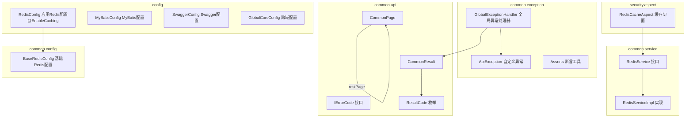
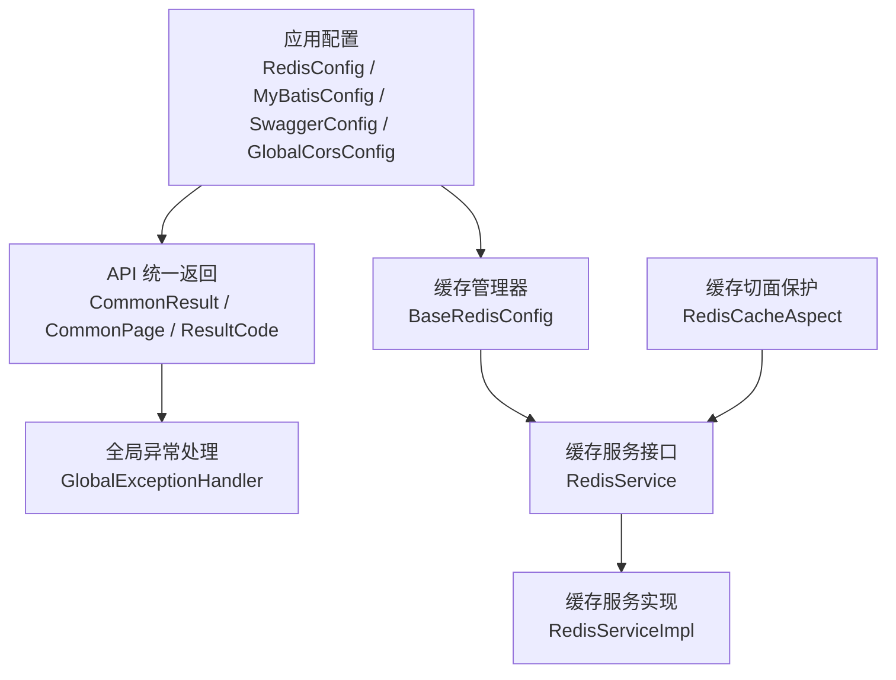
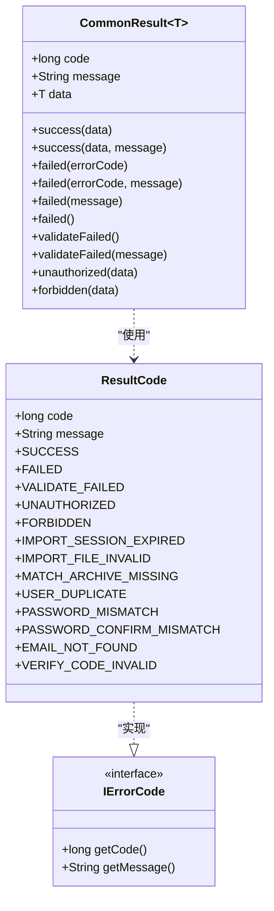
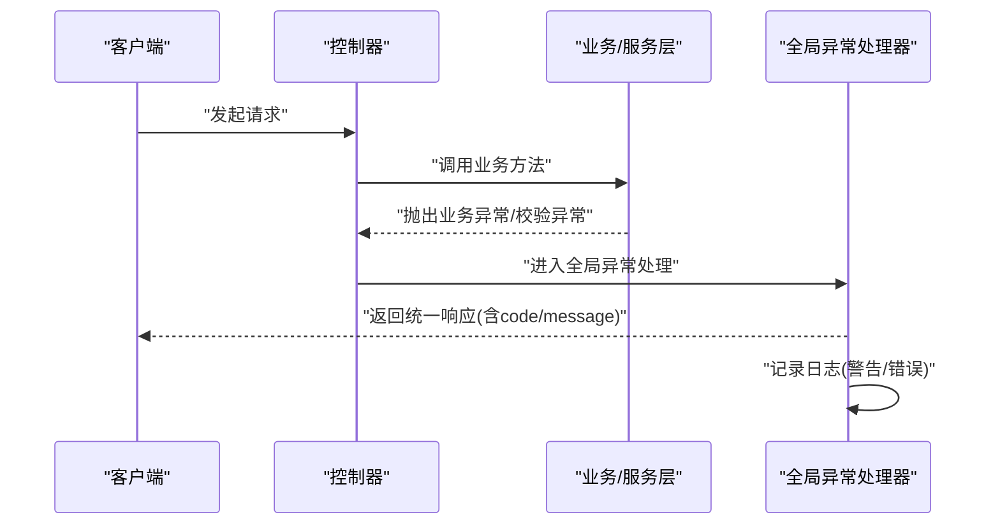
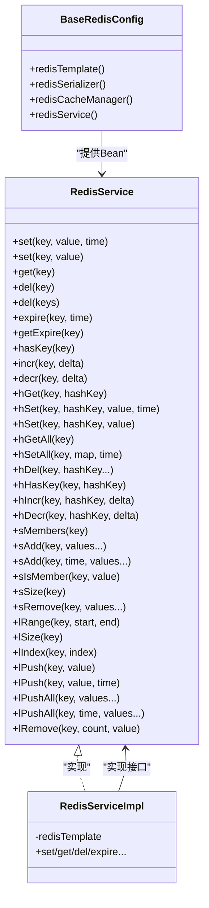
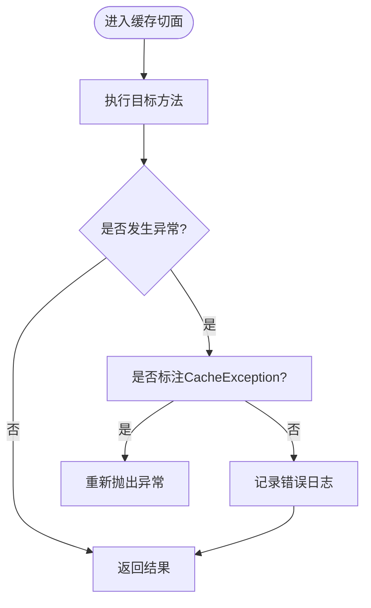
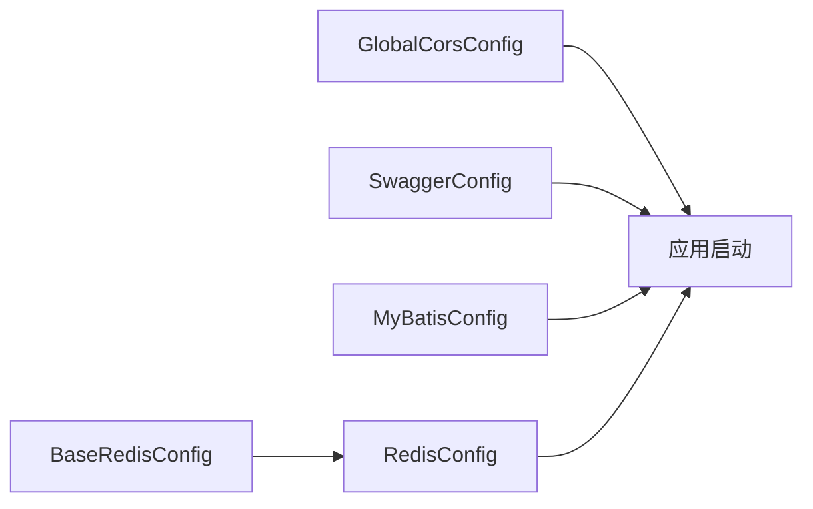
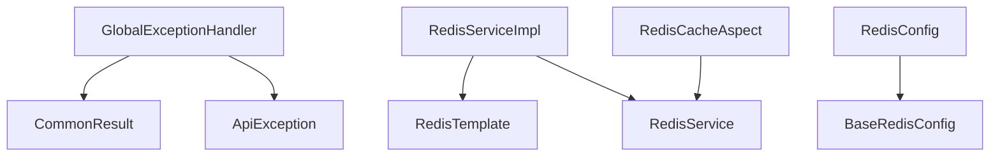

# 通用模块设计

<cite>
**本文引用的文件**
- [CommonResult.java](file://src/main/java/com/macro/mall/tiny/common/api/CommonResult.java)
- [CommonPage.java](file://src/main/java/com/macro/mall/tiny/common/api/CommonPage.java)
- [IErrorCode.java](file://src/main/java/com/macro/mall/tiny/common/api/IErrorCode.java)
- [ResultCode.java](file://src/main/java/com/macro/mall/tiny/common/api/ResultCode.java)
- [GlobalExceptionHandler.java](file://src/main/java/com/macro/mall/tiny/common/exception/GlobalExceptionHandler.java)
- [ApiException.java](file://src/main/java/com/macro/mall/tiny/common/exception/ApiException.java)
- [Asserts.java](file://src/main/java/com/macro/mall/tiny/common/exception/Asserts.java)
- [RedisService.java](file://src/main/java/com/macro/mall/tiny/common/service/RedisService.java)
- [RedisServiceImpl.java](file://src/main/java/com/macro/mall/tiny/common/service/impl/RedisServiceImpl.java)
- [BaseRedisConfig.java](file://src/main/java/com/macro/mall/tiny/common/config/BaseRedisConfig.java)
- [RedisConfig.java](file://src/main/java/com/macro/mall/tiny/config/RedisConfig.java)
- [RedisCacheAspect.java](file://src/main/java/com/macro/mall/tiny/security/aspect/RedisCacheAspect.java)
- [MyBatisConfig.java](file://src/main/java/com/macro/mall/tiny/config/MyBatisConfig.java)
- [SwaggerConfig.java](file://src/main/java/com/macro/mall/tiny/config/SwaggerConfig.java)
- [GlobalCorsConfig.java](file://src/main/java/com/macro/mall/tiny/config/GlobalCorsConfig.java)
</cite>

## 目录
1. [简介](#简介)
2. [项目结构](#项目结构)
3. [核心组件](#核心组件)
4. [架构总览](#架构总览)
5. [详细组件分析](#详细组件分析)
6. [依赖分析](#依赖分析)
7. [性能考虑](#性能考虑)
8. [故障排查指南](#故障排查指南)
9. [结论](#结论)
10. [附录](#附录)

## 简介
本设计文档聚焦于通用模块的统一封装与最佳实践，涵盖以下方面：
- 统一响应格式：通过通用返回对象与错误码体系，确保前后端交互的一致性与可预期性。
- 分页查询封装：基于 MyBatis Plus 的分页结果转换为通用分页模型，简化控制器层处理。
- 错误码定义：以枚举形式集中管理常用业务与系统错误码，便于维护与扩展。
- 国际化支持：当前仓库未直接提供国际化资源文件，但统一响应与错误码为后续国际化改造提供基础。
- 全局异常处理：集中捕获各类异常，输出统一响应，并记录日志，保障客户端体验与可观测性。
- Redis 缓存服务：抽象缓存接口、提供完整实现、配置序列化与缓存管理器，并通过切面保护业务不受缓存异常影响。
- 通用配置类：跨域、Swagger 文档、MyBatis 配置等，统一入口便于扩展与维护。
- 缓存切面编程：通过 AOP 对特定缓存服务方法进行保护，控制异常传播与日志记录。
- 通用工具类：断言工具类，统一抛出业务异常，提升代码一致性。

## 项目结构
通用模块位于 common 包下，围绕 API 统一、异常处理、缓存服务与配置展开；安全相关切面位于 security/aspect 下；应用级配置位于 config 下。

**图表来源**
- [CommonResult.java:1-125](file://src/main/java/com/macro/mall/tiny/common/api/CommonResult.java#L1-L125)
- [CommonPage.java:1-72](file://src/main/java/com/macro/mall/tiny/common/api/CommonPage.java#L1-L72)
- [IErrorCode.java:1-12](file://src/main/java/com/macro/mall/tiny/common/api/IErrorCode.java#L1-L12)
- [ResultCode.java:1-38](file://src/main/java/com/macro/mall/tiny/common/api/ResultCode.java#L1-L38)
- [GlobalExceptionHandler.java:1-100](file://src/main/java/com/macro/mall/tiny/common/exception/GlobalExceptionHandler.java#L1-L100)
- [ApiException.java:1-34](file://src/main/java/com/macro/mall/tiny/common/exception/ApiException.java#L1-L34)
- [Asserts.java:1-19](file://src/main/java/com/macro/mall/tiny/common/exception/Asserts.java#L1-L19)
- [RedisService.java:1-182](file://src/main/java/com/macro/mall/tiny/common/service/RedisService.java#L1-L182)
- [RedisServiceImpl.java:1-198](file://src/main/java/com/macro/mall/tiny/common/service/impl/RedisServiceImpl.java#L1-L198)
- [BaseRedisConfig.java:1-69](file://src/main/java/com/macro/mall/tiny/common/config/BaseRedisConfig.java#L1-L69)
- [RedisConfig.java:1-16](file://src/main/java/com/macro/mall/tiny/config/RedisConfig.java#L1-L16)
- [RedisCacheAspect.java:1-51](file://src/main/java/com/macro/mall/tiny/security/aspect/RedisCacheAspect.java#L1-L51)
- [MyBatisConfig.java:1-28](file://src/main/java/com/macro/mall/tiny/config/MyBatisConfig.java#L1-L28)
- [SwaggerConfig.java:1-72](file://src/main/java/com/macro/mall/tiny/config/SwaggerConfig.java#L1-L72)
- [GlobalCorsConfig.java:1-37](file://src/main/java/com/macro/mall/tiny/config/GlobalCorsConfig.java#L1-L37)

**章节来源**
- [CommonResult.java:1-125](file://src/main/java/com/macro/mall/tiny/common/api/CommonResult.java#L1-L125)
- [CommonPage.java:1-72](file://src/main/java/com/macro/mall/tiny/common/api/CommonPage.java#L1-L72)
- [IErrorCode.java:1-12](file://src/main/java/com/macro/mall/tiny/common/api/IErrorCode.java#L1-L12)
- [ResultCode.java:1-38](file://src/main/java/com/macro/mall/tiny/common/api/ResultCode.java#L1-L38)
- [GlobalExceptionHandler.java:1-100](file://src/main/java/com/macro/mall/tiny/common/exception/GlobalExceptionHandler.java#L1-L100)
- [ApiException.java:1-34](file://src/main/java/com/macro/mall/tiny/common/exception/ApiException.java#L1-L34)
- [Asserts.java:1-19](file://src/main/java/com/macro/mall/tiny/common/exception/Asserts.java#L1-L19)
- [RedisService.java:1-182](file://src/main/java/com/macro/mall/tiny/common/service/RedisService.java#L1-L182)
- [RedisServiceImpl.java:1-198](file://src/main/java/com/macro/mall/tiny/common/service/impl/RedisServiceImpl.java#L1-L198)
- [BaseRedisConfig.java:1-69](file://src/main/java/com/macro/mall/tiny/common/config/BaseRedisConfig.java#L1-L69)
- [RedisConfig.java:1-16](file://src/main/java/com/macro/mall/tiny/config/RedisConfig.java#L1-L16)
- [RedisCacheAspect.java:1-51](file://src/main/java/com/macro/mall/tiny/security/aspect/RedisCacheAspect.java#L1-L51)
- [MyBatisConfig.java:1-28](file://src/main/java/com/macro/mall/tiny/config/MyBatisConfig.java#L1-L28)
- [SwaggerConfig.java:1-72](file://src/main/java/com/macro/mall/tiny/config/SwaggerConfig.java#L1-L72)
- [GlobalCorsConfig.java:1-37](file://src/main/java/com/macro/mall/tiny/config/GlobalCorsConfig.java#L1-L37)

## 核心组件
- 统一响应格式：通过通用返回对象承载 code、message、data，配合静态工厂方法覆盖成功、失败、未登录、未授权等场景。
- 分页封装：将 MyBatis Plus 的 Page 结果转换为通用分页模型，包含页码、条数、总数、总页数与列表数据。
- 错误码体系：以接口 IErrorCode 抽象错误码，ResultCode 以枚举形式提供常用错误码，便于全局复用。
- 全局异常处理：集中捕获业务异常、参数校验异常、HTTP 请求异常、权限异常与通用异常，输出统一响应并记录日志。
- Redis 缓存服务：抽象 RedisService 接口，提供键值、哈希、集合、列表等多种数据结构的操作实现，并配置 JSON 序列化与缓存管理器。
- 缓存切面保护：对以 CacheService 结尾的服务方法进行环绕增强，非声明 CacheException 的方法吞掉异常，避免缓存故障影响主业务。
- 通用配置：MyBatis 配置启用分页插件与 Mapper 扫描；Swagger 配置统一文档元信息与映射兼容；跨域配置支持通配符来源、凭证与方法。

**章节来源**
- [CommonResult.java:1-125](file://src/main/java/com/macro/mall/tiny/common/api/CommonResult.java#L1-L125)
- [CommonPage.java:1-72](file://src/main/java/com/macro/mall/tiny/common/api/CommonPage.java#L1-L72)
- [IErrorCode.java:1-12](file://src/main/java/com/macro/mall/tiny/common/api/IErrorCode.java#L1-L12)
- [ResultCode.java:1-38](file://src/main/java/com/macro/mall/tiny/common/api/ResultCode.java#L1-L38)
- [GlobalExceptionHandler.java:1-100](file://src/main/java/com/macro/mall/tiny/common/exception/GlobalExceptionHandler.java#L1-L100)
- [RedisService.java:1-182](file://src/main/java/com/macro/mall/tiny/common/service/RedisService.java#L1-L182)
- [RedisServiceImpl.java:1-198](file://src/main/java/com/macro/mall/tiny/common/service/impl/RedisServiceImpl.java#L1-L198)
- [RedisCacheAspect.java:1-51](file://src/main/java/com/macro/mall/tiny/security/aspect/RedisCacheAspect.java#L1-L51)
- [MyBatisConfig.java:1-28](file://src/main/java/com/macro/mall/tiny/config/MyBatisConfig.java#L1-L28)
- [SwaggerConfig.java:1-72](file://src/main/java/com/macro/mall/tiny/config/SwaggerConfig.java#L1-L72)
- [GlobalCorsConfig.java:1-37](file://src/main/java/com/macro/mall/tiny/config/GlobalCorsConfig.java#L1-L37)

## 架构总览
通用模块通过“接口 + 实现 + 配置 + 切面 + 异常处理”的组合，形成稳定、可扩展且易维护的基础设施层。

**图表来源**
- [RedisConfig.java:1-16](file://src/main/java/com/macro/mall/tiny/config/RedisConfig.java#L1-L16)
- [BaseRedisConfig.java:1-69](file://src/main/java/com/macro/mall/tiny/common/config/BaseRedisConfig.java#L1-L69)
- [RedisService.java:1-182](file://src/main/java/com/macro/mall/tiny/common/service/RedisService.java#L1-L182)
- [RedisServiceImpl.java:1-198](file://src/main/java/com/macro/mall/tiny/common/service/impl/RedisServiceImpl.java#L1-L198)
- [RedisCacheAspect.java:1-51](file://src/main/java/com/macro/mall/tiny/security/aspect/RedisCacheAspect.java#L1-L51)
- [CommonResult.java:1-125](file://src/main/java/com/macro/mall/tiny/common/api/CommonResult.java#L1-L125)
- [CommonPage.java:1-72](file://src/main/java/com/macro/mall/tiny/common/api/CommonPage.java#L1-L72)
- [ResultCode.java:1-38](file://src/main/java/com/macro/mall/tiny/common/api/ResultCode.java#L1-L38)
- [GlobalExceptionHandler.java:1-100](file://src/main/java/com/macro/mall/tiny/common/exception/GlobalExceptionHandler.java#L1-L100)
- [MyBatisConfig.java:1-28](file://src/main/java/com/macro/mall/tiny/config/MyBatisConfig.java#L1-L28)
- [SwaggerConfig.java:1-72](file://src/main/java/com/macro/mall/tiny/config/SwaggerConfig.java#L1-L72)
- [GlobalCorsConfig.java:1-37](file://src/main/java/com/macro/mall/tiny/config/GlobalCorsConfig.java#L1-L37)

## 详细组件分析

### 统一响应与错误码
- 设计理念
  - 统一响应：所有接口返回统一结构，前端无需针对不同异常做特殊处理，降低对接成本。
  - 错误码：以枚举形式集中管理，便于前端根据 code 进行本地化提示与路由处理。
  - 分页封装：将后端分页结果转换为通用模型，减少重复代码与边界计算。
- 关键点
  - 成功/失败/验证失败/未登录/未授权均有明确静态方法，便于调用。
  - 分页转换时计算总页数与页码，确保前端分页控件可用。
  - 错误码接口与枚举分离，既可复用内置枚举，也可自定义扩展。

**图表来源**
- [CommonResult.java:1-125](file://src/main/java/com/macro/mall/tiny/common/api/CommonResult.java#L1-L125)
- [IErrorCode.java:1-12](file://src/main/java/com/macro/mall/tiny/common/api/IErrorCode.java#L1-L12)
- [ResultCode.java:1-38](file://src/main/java/com/macro/mall/tiny/common/api/ResultCode.java#L1-L38)

**章节来源**
- [CommonResult.java:1-125](file://src/main/java/com/macro/mall/tiny/common/api/CommonResult.java#L1-L125)
- [CommonPage.java:1-72](file://src/main/java/com/macro/mall/tiny/common/api/CommonPage.java#L1-L72)
- [IErrorCode.java:1-12](file://src/main/java/com/macro/mall/tiny/common/api/IErrorCode.java#L1-L12)
- [ResultCode.java:1-38](file://src/main/java/com/macro/mall/tiny/common/api/ResultCode.java#L1-L38)

### 全局异常处理机制
- 异常分类
  - 业务异常：由业务层抛出，携带错误码或消息。
  - 参数校验异常：字段校验失败、绑定失败、请求体不可读、缺失参数等。
  - 权限异常：访问被拒绝。
  - 方法不支持与文件大小超限：HTTP 方法不支持、上传大小超限。
  - 通用异常：兜底异常，向客户端返回系统繁忙提示。
- 错误信息处理
  - 参数校验异常提取首个字段错误，拼接字段名与默认消息。
  - 访问被拒绝返回未授权或禁止访问的统一响应。
- 日志记录
  - 使用 SLF4J 记录警告与错误级别日志，便于问题追踪。
- 客户端友好提示
  - 返回统一响应，message 字段提供可读提示，code 便于前端分支处理。

**图表来源**
- [GlobalExceptionHandler.java:1-100](file://src/main/java/com/macro/mall/tiny/common/exception/GlobalExceptionHandler.java#L1-L100)
- [ApiException.java:1-34](file://src/main/java/com/macro/mall/tiny/common/exception/ApiException.java#L1-L34)
- [Asserts.java:1-19](file://src/main/java/com/macro/mall/tiny/common/exception/Asserts.java#L1-L19)
- [CommonResult.java:1-125](file://src/main/java/com/macro/mall/tiny/common/api/CommonResult.java#L1-L125)

**章节来源**
- [GlobalExceptionHandler.java:1-100](file://src/main/java/com/macro/mall/tiny/common/exception/GlobalExceptionHandler.java#L1-L100)
- [ApiException.java:1-34](file://src/main/java/com/macro/mall/tiny/common/exception/ApiException.java#L1-L34)
- [Asserts.java:1-19](file://src/main/java/com/macro/mall/tiny/common/exception/Asserts.java#L1-L19)

### Redis 缓存服务设计
- 接口抽象
  - RedisService 提供键值、哈希、集合、列表等常用操作，覆盖缓存场景。
- 实现策略
  - RedisServiceImpl 基于 RedisTemplate 封装具体操作，支持过期时间、批量删除、增量/递减等。
- 配置管理
  - BaseRedisConfig 提供 RedisTemplate、序列化器与 RedisCacheManager 的 Bean 定义，统一 JSON 序列化与缓存 TTL。
  - RedisConfig 继承基础配置并启用 Spring Cache。
- 失效机制
  - 支持按 key 设置过期时间；集合与列表写入时可同时设置过期；通过缓存管理器统一 TTL 控制。

**图表来源**
- [RedisService.java:1-182](file://src/main/java/com/macro/mall/tiny/common/service/RedisService.java#L1-L182)
- [RedisServiceImpl.java:1-198](file://src/main/java/com/macro/mall/tiny/common/service/impl/RedisServiceImpl.java#L1-L198)
- [BaseRedisConfig.java:1-69](file://src/main/java/com/macro/mall/tiny/common/config/BaseRedisConfig.java#L1-L69)
- [RedisConfig.java:1-16](file://src/main/java/com/macro/mall/tiny/config/RedisConfig.java#L1-L16)

**章节来源**
- [RedisService.java:1-182](file://src/main/java/com/macro/mall/tiny/common/service/RedisService.java#L1-L182)
- [RedisServiceImpl.java:1-198](file://src/main/java/com/macro/mall/tiny/common/service/impl/RedisServiceImpl.java#L1-L198)
- [BaseRedisConfig.java:1-69](file://src/main/java/com/macro/mall/tiny/common/config/BaseRedisConfig.java#L1-L69)
- [RedisConfig.java:1-16](file://src/main/java/com/macro/mall/tiny/config/RedisConfig.java#L1-L16)

### 缓存切面编程
- 目标
  - 对以 CacheService 结尾的缓存服务方法进行环绕增强，防止缓存异常影响主业务流程。
- 行为
  - 正常执行：返回目标方法结果。
  - 发生异常：若方法标注 CacheException 注解则抛出；否则记录错误日志并吞掉异常，保证业务继续运行。
- 顺序
  - 通过 @Order(2) 控制切面优先级，避免与其他切面冲突。

**图表来源**
- [RedisCacheAspect.java:1-51](file://src/main/java/com/macro/mall/tiny/security/aspect/RedisCacheAspect.java#L1-L51)

**章节来源**
- [RedisCacheAspect.java:1-51](file://src/main/java/com/macro/mall/tiny/security/aspect/RedisCacheAspect.java#L1-L51)

### 通用配置类设计
- 跨域配置
  - 允许任意来源模式、凭证、头部与方法，注册到全局过滤器。
- Swagger 配置
  - 继承基础配置类，设置包扫描路径、标题、描述、版本与安全开关；通过 BeanPostProcessor 修复映射兼容性。
- MyBatis 配置
  - 开启事务与 Mapper 扫描，注入分页插件（MySQL 内核），自动拦截分页 SQL。
- Redis 配置
  - 继承基础配置，启用 Spring Cache，统一序列化与缓存管理器。

**图表来源**
- [GlobalCorsConfig.java:1-37](file://src/main/java/com/macro/mall/tiny/config/GlobalCorsConfig.java#L1-L37)
- [SwaggerConfig.java:1-72](file://src/main/java/com/macro/mall/tiny/config/SwaggerConfig.java#L1-L72)
- [MyBatisConfig.java:1-28](file://src/main/java/com/macro/mall/tiny/config/MyBatisConfig.java#L1-L28)
- [RedisConfig.java:1-16](file://src/main/java/com/macro/mall/tiny/config/RedisConfig.java#L1-L16)
- [BaseRedisConfig.java:1-69](file://src/main/java/com/macro/mall/tiny/common/config/BaseRedisConfig.java#L1-L69)

**章节来源**
- [GlobalCorsConfig.java:1-37](file://src/main/java/com/macro/mall/tiny/config/GlobalCorsConfig.java#L1-L37)
- [SwaggerConfig.java:1-72](file://src/main/java/com/macro/mall/tiny/config/SwaggerConfig.java#L1-L72)
- [MyBatisConfig.java:1-28](file://src/main/java/com/macro/mall/tiny/config/MyBatisConfig.java#L1-L28)
- [RedisConfig.java:1-16](file://src/main/java/com/macro/mall/tiny/config/RedisConfig.java#L1-L16)
- [BaseRedisConfig.java:1-69](file://src/main/java/com/macro/mall/tiny/common/config/BaseRedisConfig.java#L1-L69)

## 依赖分析
- 组件耦合
  - 全局异常处理器依赖统一响应与自定义异常，确保异常到统一响应的转换。
  - 缓存服务实现依赖 RedisTemplate，序列化器与缓存管理器由基础配置提供。
  - 缓存切面依赖缓存服务接口，通过包名匹配对缓存服务方法进行保护。
- 外部依赖
  - Spring MVC、Spring Security、Spring Data Redis、MyBatis Plus、Swagger。
- 循环依赖
  - 当前模块未见循环依赖迹象，接口与实现分离清晰。

**图表来源**
- [GlobalExceptionHandler.java:1-100](file://src/main/java/com/macro/mall/tiny/common/exception/GlobalExceptionHandler.java#L1-L100)
- [CommonResult.java:1-125](file://src/main/java/com/macro/mall/tiny/common/api/CommonResult.java#L1-L125)
- [ApiException.java:1-34](file://src/main/java/com/macro/mall/tiny/common/exception/ApiException.java#L1-L34)
- [RedisServiceImpl.java:1-198](file://src/main/java/com/macro/mall/tiny/common/service/impl/RedisServiceImpl.java#L1-L198)
- [RedisService.java:1-182](file://src/main/java/com/macro/mall/tiny/common/service/RedisService.java#L1-L182)
- [RedisCacheAspect.java:1-51](file://src/main/java/com/macro/mall/tiny/security/aspect/RedisCacheAspect.java#L1-L51)
- [RedisConfig.java:1-16](file://src/main/java/com/macro/mall/tiny/config/RedisConfig.java#L1-L16)
- [BaseRedisConfig.java:1-69](file://src/main/java/com/macro/mall/tiny/common/config/BaseRedisConfig.java#L1-L69)

**章节来源**
- [GlobalExceptionHandler.java:1-100](file://src/main/java/com/macro/mall/tiny/common/exception/GlobalExceptionHandler.java#L1-L100)
- [RedisServiceImpl.java:1-198](file://src/main/java/com/macro/mall/tiny/common/service/impl/RedisServiceImpl.java#L1-L198)
- [RedisService.java:1-182](file://src/main/java/com/macro/mall/tiny/common/service/RedisService.java#L1-L182)
- [RedisCacheAspect.java:1-51](file://src/main/java/com/macro/mall/tiny/security/aspect/RedisCacheAspect.java#L1-L51)
- [RedisConfig.java:1-16](file://src/main/java/com/macro/mall/tiny/config/RedisConfig.java#L1-L16)
- [BaseRedisConfig.java:1-69](file://src/main/java/com/macro/mall/tiny/common/config/BaseRedisConfig.java#L1-L69)

## 性能考虑
- 缓存命中率
  - 合理设置过期时间与 TTL，避免热点 key 集中失效导致缓存雪崩。
  - 对高频读取数据采用短 TTL 并结合异步刷新策略。
- 序列化开销
  - 使用 JSON 序列化器时注意对象类型信息存储，避免过大 payload。
- 分页性能
  - 分页查询应配合索引与 LIMIT 优化，避免大偏移量导致慢查询。
- 切面开销
  - 缓存切面仅作用于特定包下的缓存服务，避免对业务方法造成额外负担。

## 故障排查指南
- 统一响应与错误码
  - 若出现未知错误码，检查 ResultCode 枚举是否覆盖该场景，或新增自定义 IErrorCode 实现。
- 全局异常处理
  - 参数校验失败时，确认实体类上的校验注解是否正确，以及异常处理器是否捕获对应异常类型。
  - 访问被拒绝时，检查权限配置与动态权限元数据源。
- Redis 缓存
  - 缓存异常不影响主流程：确认缓存切面是否生效，以及方法是否标注 CacheException。
  - 序列化失败：检查对象是否包含复杂类型或循环引用，必要时调整序列化策略。
- Swagger 文档
  - 映射冲突：确认 BeanPostProcessor 是否正确替换 handlerMappings。
- 跨域
  - 检查来源模式、凭证与方法是否按需放开，避免浏览器预检失败。

**章节来源**
- [GlobalExceptionHandler.java:1-100](file://src/main/java/com/macro/mall/tiny/common/exception/GlobalExceptionHandler.java#L1-L100)
- [RedisCacheAspect.java:1-51](file://src/main/java/com/macro/mall/tiny/security/aspect/RedisCacheAspect.java#L1-L51)
- [BaseRedisConfig.java:1-69](file://src/main/java/com/macro/mall/tiny/common/config/BaseRedisConfig.java#L1-L69)
- [SwaggerConfig.java:1-72](file://src/main/java/com/macro/mall/tiny/config/SwaggerConfig.java#L1-L72)
- [GlobalCorsConfig.java:1-37](file://src/main/java/com/macro/mall/tiny/config/GlobalCorsConfig.java#L1-L37)

## 结论
通用模块通过统一响应、错误码、异常处理、缓存服务与配置类的协同，构建了高内聚、低耦合的基础设施层。其设计强调一致性、可维护性与可扩展性，为上层业务提供了稳定可靠的支撑。建议在后续迭代中：
- 引入国际化资源文件，结合统一响应的 message 字段实现多语言提示。
- 对缓存策略进行更细粒度的 TTL 与降级策略设计。
- 在 Swagger 中增加参数与响应示例，提升文档可用性。

## 附录
- 使用示例（路径）
  - 统一返回：参考 [CommonResult.java:1-125](file://src/main/java/com/macro/mall/tiny/common/api/CommonResult.java#L1-L125)
  - 分页封装：参考 [CommonPage.java:1-72](file://src/main/java/com/macro/mall/tiny/common/api/CommonPage.java#L1-L72)
  - 错误码定义：参考 [ResultCode.java:1-38](file://src/main/java/com/macro/mall/tiny/common/api/ResultCode.java#L1-L38)
  - 全局异常处理：参考 [GlobalExceptionHandler.java:1-100](file://src/main/java/com/macro/mall/tiny/common/exception/GlobalExceptionHandler.java#L1-L100)
  - 缓存接口与实现：参考 [RedisService.java:1-182](file://src/main/java/com/macro/mall/tiny/common/service/RedisService.java#L1-L182) 与 [RedisServiceImpl.java:1-198](file://src/main/java/com/macro/mall/tiny/common/service/impl/RedisServiceImpl.java#L1-L198)
  - 缓存切面：参考 [RedisCacheAspect.java:1-51](file://src/main/java/com/macro/mall/tiny/security/aspect/RedisCacheAspect.java#L1-L51)
  - 配置类：参考 [MyBatisConfig.java:1-28](file://src/main/java/com/macro/mall/tiny/config/MyBatisConfig.java#L1-L28)、[SwaggerConfig.java:1-72](file://src/main/java/com/macro/mall/tiny/config/SwaggerConfig.java#L1-L72)、[GlobalCorsConfig.java:1-37](file://src/main/java/com/macro/mall/tiny/config/GlobalCorsConfig.java#L1-L37)、[RedisConfig.java:1-16](file://src/main/java/com/macro/mall/tiny/config/RedisConfig.java#L1-L16)、[BaseRedisConfig.java:1-69](file://src/main/java/com/macro/mall/tiny/common/config/BaseRedisConfig.java#L1-L69)