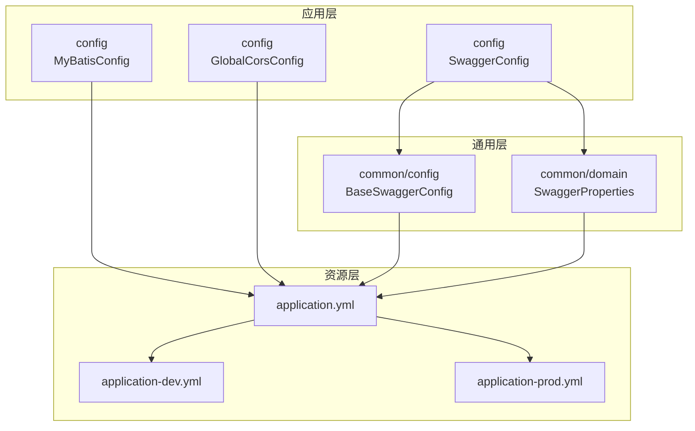
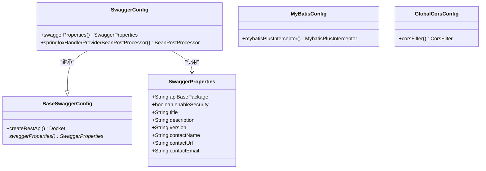
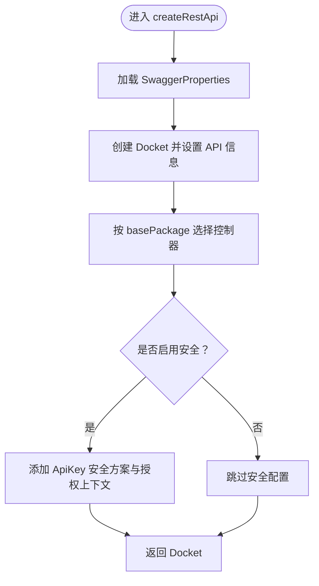
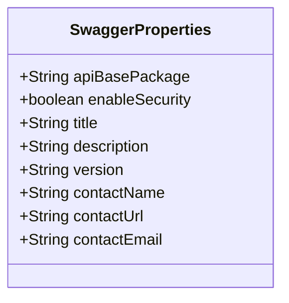
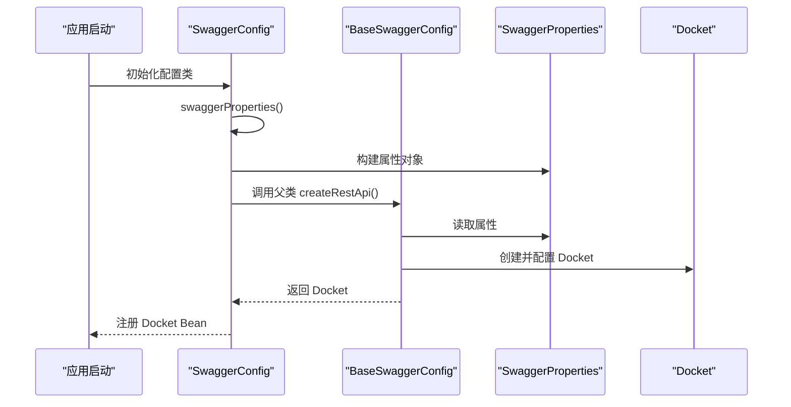
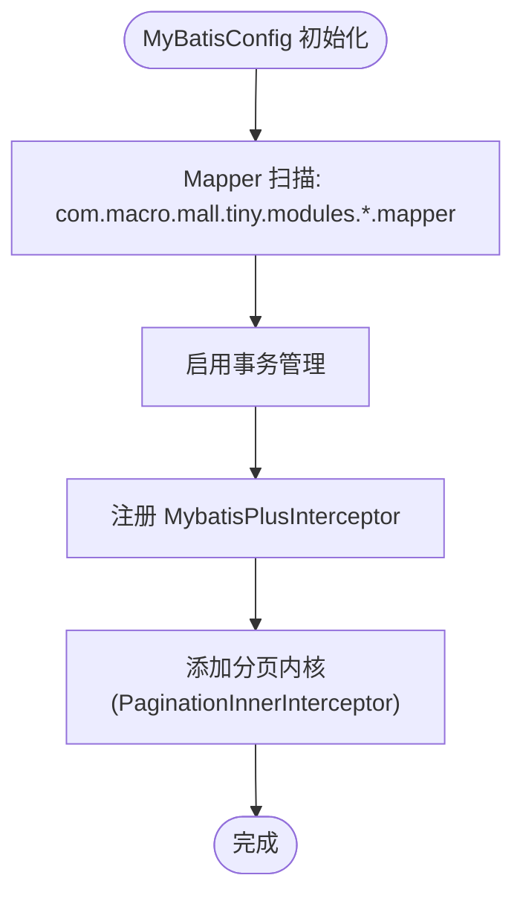
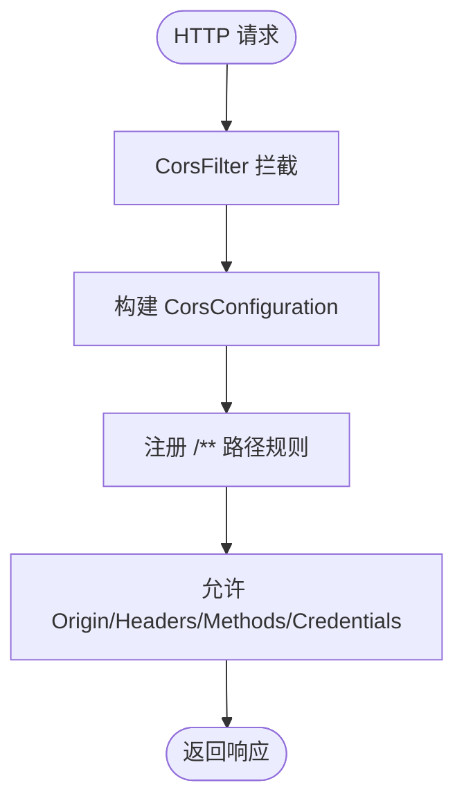
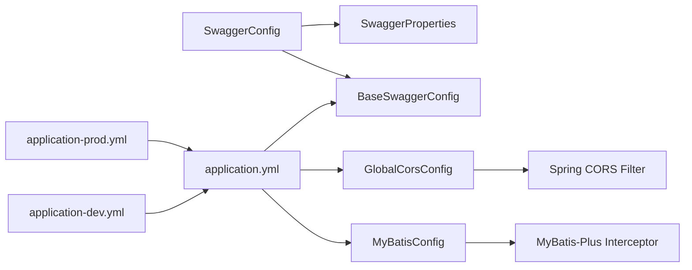

# 配置管理

<cite>
**本文引用的文件**
- [BaseSwaggerConfig.java](file://src/main/java/com/macro/mall/tiny/common/config/BaseSwaggerConfig.java)
- [SwaggerProperties.java](file://src/main/java/com/macro/mall/tiny/common/domain/SwaggerProperties.java)
- [SwaggerConfig.java](file://src/main/java/com/macro/mall/tiny/config/SwaggerConfig.java)
- [MyBatisConfig.java](file://src/main/java/com/macro/mall/tiny/config/MyBatisConfig.java)
- [GlobalCorsConfig.java](file://src/main/java/com/macro/mall/tiny/config/GlobalCorsConfig.java)
- [application.yml](file://src/main/resources/application.yml)
- [application-dev.yml](file://src/main/resources/application-dev.yml)
- [application-prod.yml](file://src/main/resources/application-prod.yml)
</cite>

## 目录
1. [简介](#简介)
2. [项目结构](#项目结构)
3. [核心组件](#核心组件)
4. [架构总览](#架构总览)
5. [详细组件分析](#详细组件分析)
6. [依赖分析](#依赖分析)
7. [性能考虑](#性能考虑)
8. [故障排查指南](#故障排查指南)
9. [结论](#结论)
10. [附录](#附录)

## 简介
本文件系统性梳理并说明本项目的配置管理体系，重点覆盖以下方面：
- 基础Swagger配置设计：包括API文档基础配置、文档标题与描述、版本信息、安全认证等。
- SwaggerProperties属性类设计：配置项定义、默认值策略、扩展方式。
- MyBatis配置类实现：数据源与MyBatis增强、分页插件设置。
- 跨域配置设计：允许的域名、方法、头信息、凭证处理。
- 配置管理最佳实践与常见问题解决方案。

## 项目结构
本项目采用按功能域划分的包结构，配置相关代码主要分布在以下位置：
- 通用配置与领域模型：common/config、common/domain
- 应用配置：config、resources（application.yml及环境配置）
- 各模块配置：如SwaggerConfig、MyBatisConfig、GlobalCorsConfig等

图表来源
- [BaseSwaggerConfig.java:1-82](file://src/main/java/com/macro/mall/tiny/common/config/BaseSwaggerConfig.java#L1-L82)
- [SwaggerProperties.java:1-48](file://src/main/java/com/macro/mall/tiny/common/domain/SwaggerProperties.java#L1-L48)
- [SwaggerConfig.java:1-72](file://src/main/java/com/macro/mall/tiny/config/SwaggerConfig.java#L1-L72)
- [MyBatisConfig.java:1-28](file://src/main/java/com/macro/mall/tiny/config/MyBatisConfig.java#L1-L28)
- [GlobalCorsConfig.java:1-37](file://src/main/java/com/macro/mall/tiny/config/GlobalCorsConfig.java#L1-L37)
- [application.yml:1-57](file://src/main/resources/application.yml#L1-L57)
- [application-dev.yml:1-16](file://src/main/resources/application-dev.yml#L1-L16)
- [application-prod.yml:1-18](file://src/main/resources/application-prod.yml#L1-L18)

章节来源
- [application.yml:1-57](file://src/main/resources/application.yml#L1-L57)
- [application-dev.yml:1-16](file://src/main/resources/application-dev.yml#L1-L16)
- [application-prod.yml:1-18](file://src/main/resources/application-prod.yml#L1-L18)

## 核心组件
本节对关键配置组件进行深入解析，涵盖职责、实现要点与使用方式。

- BaseSwaggerConfig：抽象的Swagger基础配置类，负责构建Docket、API信息、安全方案与上下文。
- SwaggerProperties：Swagger配置属性对象，包含文档基础信息、安全开关、联系人信息等。
- SwaggerConfig：具体实现类，继承BaseSwaggerConfig，提供实际的配置项与兼容性处理。
- MyBatisConfig：MyBatis增强配置，启用事务、扫描Mapper、注册分页插件。
- GlobalCorsConfig：全局跨域配置，统一处理CORS策略。

章节来源
- [BaseSwaggerConfig.java:16-81](file://src/main/java/com/macro/mall/tiny/common/config/BaseSwaggerConfig.java#L16-L81)
- [SwaggerProperties.java:7-47](file://src/main/java/com/macro/mall/tiny/common/domain/SwaggerProperties.java#L7-L47)
- [SwaggerConfig.java:19-71](file://src/main/java/com/macro/mall/tiny/config/SwaggerConfig.java#L19-L71)
- [MyBatisConfig.java:11-27](file://src/main/java/com/macro/mall/tiny/config/MyBatisConfig.java#L11-L27)
- [GlobalCorsConfig.java:9-36](file://src/main/java/com/macro/mall/tiny/config/GlobalCorsConfig.java#L9-L36)

## 架构总览
下图展示配置体系在运行时的交互关系与职责边界。

图表来源
- [BaseSwaggerConfig.java:20-81](file://src/main/java/com/macro/mall/tiny/common/config/BaseSwaggerConfig.java#L20-L81)
- [SwaggerProperties.java:11-47](file://src/main/java/com/macro/mall/tiny/common/domain/SwaggerProperties.java#L11-L47)
- [SwaggerConfig.java:23-71](file://src/main/java/com/macro/mall/tiny/config/SwaggerConfig.java#L23-L71)
- [MyBatisConfig.java:15-27](file://src/main/java/com/macro/mall/tiny/config/MyBatisConfig.java#L15-L27)
- [GlobalCorsConfig.java:13-36](file://src/main/java/com/macro/mall/tiny/config/GlobalCorsConfig.java#L13-L36)

## 详细组件分析

### 基础Swagger配置（BaseSwaggerConfig）
- 设计目标
  - 提供可复用的Swagger配置模板，通过抽象方法注入具体配置。
  - 统一API信息构建、路径选择、安全方案与上下文。
- 关键实现
  - Docket创建：基于SwaggerProperties构建API信息与扫描路径。
  - 安全方案：当启用安全时，添加请求头ApiKey方案与全局授权上下文。
  - 抽象方法：swaggerProperties()由子类实现，提供具体配置。
- 复杂度与性能
  - 创建过程为O(1)，不涉及复杂计算；安全方案与路径匹配在启动时完成。
- 错误处理
  - 未覆盖显式异常处理，建议在子类中确保配置完整性。
- 扩展建议
  - 可增加更多安全方案（如OAuth2）或自定义文档分组。

图表来源
- [BaseSwaggerConfig.java:22-35](file://src/main/java/com/macro/mall/tiny/common/config/BaseSwaggerConfig.java#L22-L35)
- [BaseSwaggerConfig.java:46-75](file://src/main/java/com/macro/mall/tiny/common/config/BaseSwaggerConfig.java#L46-L75)

章节来源
- [BaseSwaggerConfig.java:16-81](file://src/main/java/com/macro/mall/tiny/common/config/BaseSwaggerConfig.java#L16-L81)

### SwaggerProperties属性类
- 设计要点
  - 使用Lombok注解简化getter/setter与equals/hashCode。
  - Builder模式便于链式构建，默认值由子类在SwaggerConfig中设定。
- 配置项说明
  - apiBasePackage：API文档生成的基础包路径。
  - enableSecurity：是否启用登录认证。
  - title/description/version/contactName/contactUrl/contactEmail：文档元信息。
- 默认值与扩展
  - 默认值在SwaggerConfig中通过builder().build()集中设置，便于统一管理。
  - 如需扩展，可在SwaggerProperties中新增字段，并在SwaggerConfig中补充对应默认值。

图表来源
- [SwaggerProperties.java:11-47](file://src/main/java/com/macro/mall/tiny/common/domain/SwaggerProperties.java#L11-L47)

章节来源
- [SwaggerProperties.java:7-47](file://src/main/java/com/macro/mall/tiny/common/domain/SwaggerProperties.java#L7-L47)

### SwaggerConfig实现
- 继承关系
  - 继承BaseSwaggerConfig，重写swaggerProperties()提供具体配置。
- 安全与兼容性
  - 启用Swagger2注解。
  - 通过BeanPostProcessor适配Spring WebFlux/WebMVC映射，解决高版本兼容问题。
- 配置项示例
  - 基础包、标题、描述、版本、联系人、启用安全等。

图表来源
- [SwaggerConfig.java:23-37](file://src/main/java/com/macro/mall/tiny/config/SwaggerConfig.java#L23-L37)
- [BaseSwaggerConfig.java:22-35](file://src/main/java/com/macro/mall/tiny/common/config/BaseSwaggerConfig.java#L22-L35)

章节来源
- [SwaggerConfig.java:19-71](file://src/main/java/com/macro/mall/tiny/config/SwaggerConfig.java#L19-L71)

### MyBatisConfig配置类
- 数据源与事务
  - 通过@EnableTransactionManagement启用声明式事务。
  - Mapper扫描范围：com.macro.mall.tiny.modules.*.mapper。
- MyBatis增强与分页
  - 注入MybatisPlusInterceptor，注册MySQL分页内核。
- 复杂度与性能
  - 插件注册为O(1)，分页内核在执行SQL时生效，开销与查询规模相关。
- 错误处理
  - 未覆盖插件冲突或分页参数异常场景，建议在生产环境增加日志与监控。

图表来源
- [MyBatisConfig.java:15-27](file://src/main/java/com/macro/mall/tiny/config/MyBatisConfig.java#L15-L27)

章节来源
- [MyBatisConfig.java:11-27](file://src/main/java/com/macro/mall/tiny/config/MyBatisConfig.java#L11-L27)

### GlobalCorsConfig跨域配置
- 设计目标
  - 统一处理跨域请求，支持多域名、方法、头信息与凭证。
- 关键点
  - 使用UrlBasedCorsConfigurationSource注册/**路径规则。
  - 允许任意origin pattern（注意安全性）、credentials、headers与methods。
  - 采用CorsFilter实现全局拦截。
- 安全性提示
  - 在生产环境建议限制allowedOriginPattern为可信域名列表，避免通配符风险。

图表来源
- [GlobalCorsConfig.java:19-35](file://src/main/java/com/macro/mall/tiny/config/GlobalCorsConfig.java#L19-L35)

章节来源
- [GlobalCorsConfig.java:9-36](file://src/main/java/com/macro/mall/tiny/config/GlobalCorsConfig.java#L9-L36)

## 依赖分析
- 组件耦合
  - SwaggerConfig强依赖BaseSwaggerConfig与SwaggerProperties，形成清晰的继承与组合关系。
  - MyBatisConfig与Spring Boot自动配置解耦，仅通过注解与Bean注册参与。
  - GlobalCorsConfig独立于业务逻辑，仅依赖Spring Web CORS基础设施。
- 外部依赖
  - Swagger：springfox文档生成。
  - MyBatis-Plus：分页插件与增强。
  - Spring Web：CORS过滤器。
- 配置来源
  - application.yml提供基础环境配置（端口、路径匹配策略、MyBatis-Plus、JWT、Redis、安全白名单等）。
  - application-dev.yml与application-prod.yml分别提供开发与生产环境的数据源与Redis配置。

图表来源
- [SwaggerConfig.java:23-37](file://src/main/java/com/macro/mall/tiny/config/SwaggerConfig.java#L23-L37)
- [BaseSwaggerConfig.java:22-35](file://src/main/java/com/macro/mall/tiny/common/config/BaseSwaggerConfig.java#L22-L35)
- [MyBatisConfig.java:15-27](file://src/main/java/com/macro/mall/tiny/config/MyBatisConfig.java#L15-L27)
- [GlobalCorsConfig.java:19-35](file://src/main/java/com/macro/mall/tiny/config/GlobalCorsConfig.java#L19-L35)
- [application.yml:1-57](file://src/main/resources/application.yml#L1-L57)
- [application-dev.yml:1-16](file://src/main/resources/application-dev.yml#L1-L16)
- [application-prod.yml:1-18](file://src/main/resources/application-prod.yml#L1-L18)

章节来源
- [application.yml:1-57](file://src/main/resources/application.yml#L1-L57)
- [application-dev.yml:1-16](file://src/main/resources/application-dev.yml#L1-L16)
- [application-prod.yml:1-18](file://src/main/resources/application-prod.yml#L1-L18)

## 性能考虑
- Swagger文档生成
  - 在生产环境建议关闭或限制Swagger访问，减少不必要的Bean初始化与文档扫描。
- 分页插件
  - 分页内核在执行SQL时生效，避免一次性加载大量数据；合理设置分页大小与排序条件。
- 跨域过滤
  - 全局CORS过滤器对每个请求进行处理，建议在生产环境限制允许的Origin与Methods，降低跨域风险与性能损耗。

## 故障排查指南
- Swagger无法访问或映射失败
  - 检查SwaggerConfig中的apiBasePackage是否正确指向模块包。
  - 确认springfox Handler映射兼容性处理Bean已注册。
  - 参考：[SwaggerConfig.java:39-70](file://src/main/java/com/macro/mall/tiny/config/SwaggerConfig.java#L39-L70)
- 跨域失败或凭证无效
  - 确认Allowed-Origin是否为可信域名（生产环境不建议使用通配符）。
  - 检查Allow-Credentials与Exposed-Headers配置。
  - 参考：[GlobalCorsConfig.java:20-35](file://src/main/java/com/macro/mall/tiny/config/GlobalCorsConfig.java#L20-L35)
- MyBatis分页不生效
  - 确认Mapper扫描路径与接口注解正确。
  - 检查分页插件是否注册且DbType匹配。
  - 参考：[MyBatisConfig.java:15-27](file://src/main/java/com/macro/mall/tiny/config/MyBatisConfig.java#L15-L27)
- 环境配置差异导致连接失败
  - 开发与生产环境的数据源URL、用户名、密码不同，确认profiles.active与对应配置文件。
  - 参考：[application.yml:7-8](file://src/main/resources/application.yml#L7-L8)、[application-dev.yml:2-5](file://src/main/resources/application-dev.yml#L2-L5)、[application-prod.yml:2-5](file://src/main/resources/application-prod.yml#L2-L5)

章节来源
- [SwaggerConfig.java:39-70](file://src/main/java/com/macro/mall/tiny/config/SwaggerConfig.java#L39-L70)
- [GlobalCorsConfig.java:19-35](file://src/main/java/com/macro/mall/tiny/config/GlobalCorsConfig.java#L19-L35)
- [MyBatisConfig.java:15-27](file://src/main/java/com/macro/mall/tiny/config/MyBatisConfig.java#L15-L27)
- [application.yml:7-8](file://src/main/resources/application.yml#L7-L8)
- [application-dev.yml:2-5](file://src/main/resources/application-dev.yml#L2-L5)
- [application-prod.yml:2-5](file://src/main/resources/application-prod.yml#L2-L5)

## 结论
本项目的配置管理以“抽象模板+具体实现”的方式组织，既保证了可复用性，又提供了灵活的扩展能力。Swagger、MyBatis与CORS三大配置模块职责清晰、耦合度低，配合多环境配置文件实现了开发与生产的无缝切换。建议在生产环境中进一步收紧跨域策略、限制Swagger访问范围，并完善监控与日志记录以提升可观测性。

## 附录
- 最佳实践
  - 跨域：生产环境限制allowedOriginPattern，避免通配符；仅暴露必要头信息与方法。
  - Swagger：仅在开发环境启用或通过白名单访问；开启安全认证。
  - MyBatis：统一分页策略与Mapper扫描路径；对大表查询使用合理的分页大小。
  - 配置：通过profiles区分环境；敏感信息使用环境变量或加密配置中心。