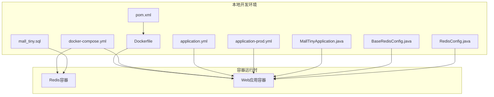
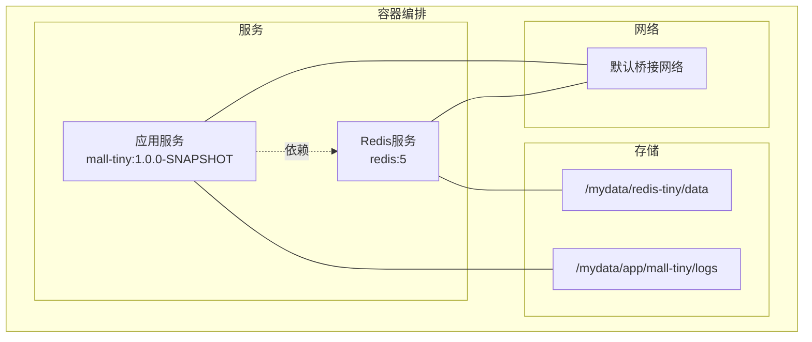
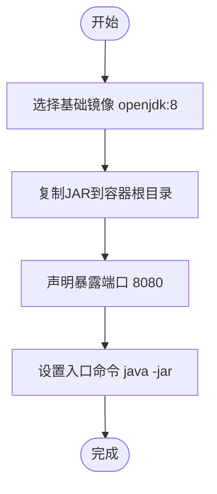
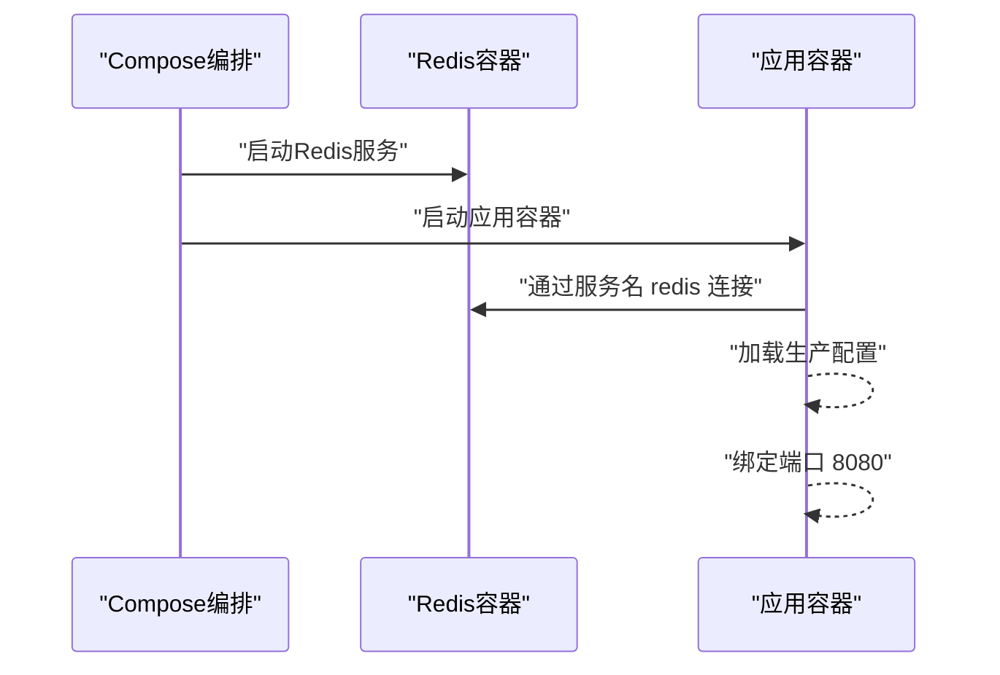
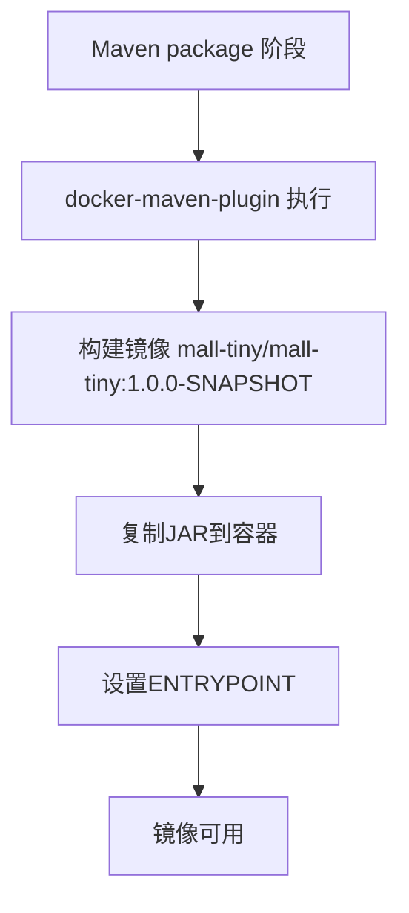
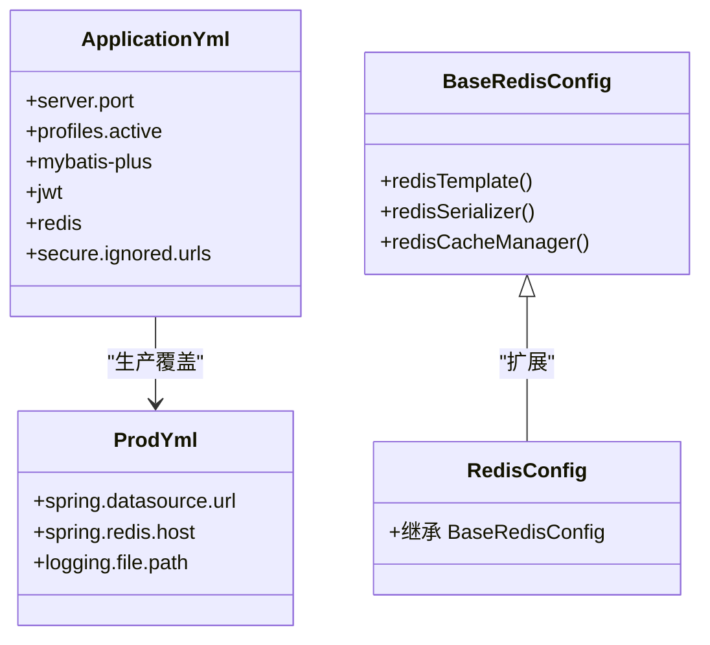
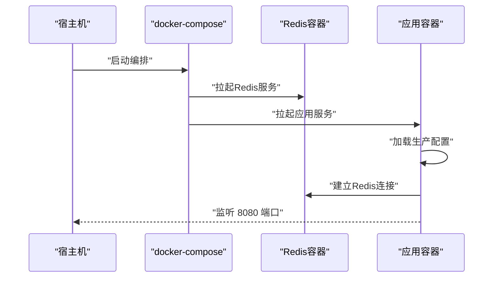
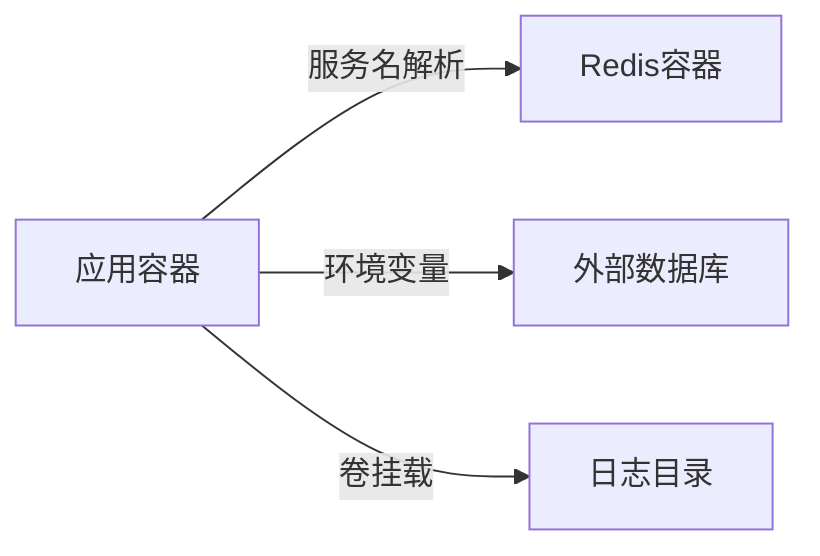

# Docker容器化部署

<cite>
**本文引用的文件**
- [Dockerfile](file://Dockerfile)
- [docker-compose.yml](file://docker-compose.yml)
- [pom.xml](file://pom.xml)
- [README.md](file://README.md)
- [application.yml](file://src/main/resources/application.yml)
- [application-prod.yml](file://src/main/resources/application-prod.yml)
- [MallTinyApplication.java](file://src/main/java/com/macro/mall/tiny/MallTinyApplication.java)
- [BaseRedisConfig.java](file://src/main/java/com/macro/mall/tiny/common/config/BaseRedisConfig.java)
- [RedisConfig.java](file://src/main/java/com/macro/mall/tiny/config/RedisConfig.java)
- [mall_tiny.sql](file://sql/mall_tiny.sql)
</cite>

## 目录
1. [简介](#简介)
2. [项目结构](#项目结构)
3. [核心组件](#核心组件)
4. [架构总览](#架构总览)
5. [详细组件分析](#详细组件分析)
6. [依赖关系分析](#依赖关系分析)
7. [性能考虑](#性能考虑)
8. [故障排查指南](#故障排查指南)
9. [结论](#结论)
10. [附录](#附录)

## 简介
本文件面向Mall-Tiny项目的Docker容器化部署，系统性说明Dockerfile与docker-compose.yml的配置要点，涵盖基础镜像选择、JAR包复制、端口暴露、启动命令、服务编排、网络与卷挂载、环境变量、容器运行参数、服务发现与通信、日志与调试、以及安全最佳实践。文档同时提供从镜像构建到容器启动的完整流程与可视化图示，帮助读者快速完成生产级部署。

## 项目结构
Mall-Tiny采用Spring Boot + MyBatis-Plus的单体应用，容器化通过Dockerfile与docker-compose.yml实现。关键文件与职责：
- Dockerfile：定义容器镜像构建过程，基础镜像、JAR复制、端口暴露、入口命令
- docker-compose.yml：定义服务编排，包含Redis与应用服务，网络、卷挂载、环境变量
- pom.xml：集成docker-maven-plugin，支持Maven阶段化构建镜像
- application.yml / application-prod.yml：应用配置，含数据库、Redis、日志路径等
- MallTinyApplication.java：Spring Boot启动类
- BaseRedisConfig.java / RedisConfig.java：Redis连接与缓存配置
- mall_tiny.sql：初始化数据库结构与数据

图表来源
- [Dockerfile:1-10](file://Dockerfile#L1-L10)
- [docker-compose.yml:1-26](file://docker-compose.yml#L1-L26)
- [pom.xml:154-205](file://pom.xml#L154-L205)
- [application.yml:1-57](file://src/main/resources/application.yml#L1-L57)
- [application-prod.yml:1-18](file://src/main/resources/application-prod.yml#L1-L18)
- [MallTinyApplication.java:1-14](file://src/main/java/com/macro/mall/tiny/MallTinyApplication.java#L1-L14)
- [BaseRedisConfig.java:1-68](file://src/main/java/com/macro/mall/tiny/common/config/BaseRedisConfig.java#L1-L68)
- [RedisConfig.java:1-15](file://src/main/java/com/macro/mall/tiny/config/RedisConfig.java#L1-L15)
- [mall_tiny.sql:1-200](file://sql/mall_tiny.sql#L1-L200)

章节来源
- [Dockerfile:1-10](file://Dockerfile#L1-L10)
- [docker-compose.yml:1-26](file://docker-compose.yml#L1-L26)
- [pom.xml:154-205](file://pom.xml#L154-L205)
- [application.yml:1-57](file://src/main/resources/application.yml#L1-L57)
- [application-prod.yml:1-18](file://src/main/resources/application-prod.yml#L1-L18)
- [MallTinyApplication.java:1-14](file://src/main/java/com/macro/mall/tiny/MallTinyApplication.java#L1-L14)
- [BaseRedisConfig.java:1-68](file://src/main/java/com/macro/mall/tiny/common/config/BaseRedisConfig.java#L1-L68)
- [RedisConfig.java:1-15](file://src/main/java/com/macro/mall/tiny/config/RedisConfig.java#L1-L15)
- [mall_tiny.sql:1-200](file://sql/mall_tiny.sql#L1-L200)

## 核心组件
- 基础镜像与JAR复制
  - 基础镜像：openjdk:8
  - JAR复制：将构建产物复制至容器根目录
  - 入口命令：java -jar 执行JAR
- 端口暴露与启动
  - 暴露端口：8080
  - 启动方式：ENTRYPOINT执行JAR
- 服务编排
  - Redis服务：redis:5，持久化挂载，端口映射6379
  - 应用服务：镜像mall-tiny/mall-tiny:1.0.0-SNAPSHOT，端口映射8080，依赖Redis
- 环境变量与卷挂载
  - 环境变量：spring.profiles.active=prod、数据库URL、Redis主机名
  - 卷挂载：系统时间同步、日志目录挂载
- Maven插件集成
  - docker-maven-plugin：远程Docker主机、镜像构建、入口命令、维护者信息

章节来源
- [Dockerfile:1-10](file://Dockerfile#L1-L10)
- [docker-compose.yml:1-26](file://docker-compose.yml#L1-L26)
- [pom.xml:154-205](file://pom.xml#L154-L205)

## 架构总览
Mall-Tiny容器化架构由两部分组成：Redis作为缓存与会话存储，Web应用容器提供REST API与管理界面。应用通过环境变量与容器网络进行服务发现，日志统一输出到宿主机挂载目录。

图表来源
- [docker-compose.yml:1-26](file://docker-compose.yml#L1-L26)

## 详细组件分析

### Dockerfile配置详解
- 基础镜像选择
  - openjdk:8确保JDK 8兼容性，满足项目Java版本要求
- JAR包复制
  - 将构建产物JAR复制到容器根目录，便于直接执行
- 端口暴露
  - EXPOSE 8080为容器对外提供服务的端口
- 启动命令
  - ENTRYPOINT java -jar 执行JAR，确保容器启动即运行应用
- 维护者信息
  - MAINTAINER标注镜像维护者

图表来源
- [Dockerfile:1-10](file://Dockerfile#L1-L10)

章节来源
- [Dockerfile:1-10](file://Dockerfile#L1-L10)

### docker-compose.yml编排配置
- 服务定义
  - redis：使用redis:5镜像，启用AOF持久化，容器名为redis-tiny
  - mall-tiny：使用自定义镜像，容器名为mall-tiny
- 网络配置
  - 使用默认桥接网络，服务间通过服务名互访
  - links与depends_on确保Redis先于应用启动
- 卷挂载
  - Redis数据目录挂载至宿主机/mydata/redis-tiny/data
  - 日志目录挂载至宿主机/mydata/app/mall-tiny/logs
- 环境变量
  - spring.profiles.active=prod激活生产配置
  - spring.datasource.url指向外部数据库（示例为固定IP）
  - spring.redis.host=redis通过容器网络解析
- 端口映射
  - Redis: 6379:6379
  - 应用: 8080:8080

图表来源
- [docker-compose.yml:1-26](file://docker-compose.yml#L1-L26)

章节来源
- [docker-compose.yml:1-26](file://docker-compose.yml#L1-L26)

### Maven插件与镜像构建
- 插件配置
  - docker-maven-plugin：远程Docker主机、镜像名称、基础镜像、JAR复制策略、入口命令、维护者
- 构建流程
  - 在package阶段可触发镜像构建，自动复制JAR并设置ENTRYPOINT
- 与Dockerfile一致性
  - 插件与Dockerfile均使用openjdk:8与相同的JAR执行命令，保证构建一致性

图表来源
- [pom.xml:154-205](file://pom.xml#L154-L205)

章节来源
- [pom.xml:154-205](file://pom.xml#L154-L205)

### 应用配置与容器化适配
- application.yml
  - server.port=8080与容器端口一致
  - profiles.active=dev用于开发环境
  - mybatis-plus、jwt、redis键空间、安全白名单等
- application-prod.yml
  - spring.datasource.url：生产数据库连接（示例为固定IP）
  - spring.redis.host=redis：通过容器网络解析
  - logging.file.path=/var/logs：与容器卷挂载路径一致
- Redis配置
  - BaseRedisConfig与RedisConfig提供RedisTemplate与缓存管理器，配合容器内Redis使用

图表来源
- [application.yml:1-57](file://src/main/resources/application.yml#L1-L57)
- [application-prod.yml:1-18](file://src/main/resources/application-prod.yml#L1-L18)
- [BaseRedisConfig.java:1-68](file://src/main/java/com/macro/mall/tiny/common/config/BaseRedisConfig.java#L1-L68)
- [RedisConfig.java:1-15](file://src/main/java/com/macro/mall/tiny/config/RedisConfig.java#L1-L15)

章节来源
- [application.yml:1-57](file://src/main/resources/application.yml#L1-L57)
- [application-prod.yml:1-18](file://src/main/resources/application-prod.yml#L1-L18)
- [BaseRedisConfig.java:1-68](file://src/main/java/com/macro/mall/tiny/common/config/BaseRedisConfig.java#L1-L68)
- [RedisConfig.java:1-15](file://src/main/java/com/macro/mall/tiny/config/RedisConfig.java#L1-L15)

### 启动流程与控制流
- 启动顺序
  - Redis先于应用启动（depends_on）
  - 应用通过服务名redis连接Redis
- 端口绑定
  - 宿主机8080映射容器8080
- 日志输出
  - 容器内日志写入/var/logs，宿主机挂载便于查看

图表来源
- [docker-compose.yml:1-26](file://docker-compose.yml#L1-L26)
- [application-prod.yml:1-18](file://src/main/resources/application-prod.yml#L1-L18)

章节来源
- [docker-compose.yml:1-26](file://docker-compose.yml#L1-L26)
- [application-prod.yml:1-18](file://src/main/resources/application-prod.yml#L1-L18)

## 依赖关系分析
- 组件耦合
  - 应用对Redis存在强依赖（缓存与会话），通过服务名解析
  - 应用对数据库依赖（生产配置中URL为固定IP，需按实际替换）
- 外部依赖
  - Redis:5镜像提供缓存能力
  - MySQL（外部）用于数据持久化
- 潜在循环依赖
  - 无直接循环依赖，但应避免在应用中反向依赖Redis
- 接口契约
  - 应用通过环境变量与容器网络进行服务发现，不直接依赖宿主机IP

图表来源
- [docker-compose.yml:1-26](file://docker-compose.yml#L1-L26)
- [application-prod.yml:1-18](file://src/main/resources/application-prod.yml#L1-L18)

章节来源
- [docker-compose.yml:1-26](file://docker-compose.yml#L1-L26)
- [application-prod.yml:1-18](file://src/main/resources/application-prod.yml#L1-L18)

## 性能考虑
- JVM参数与资源限制
  - 建议在容器运行时通过JVM参数优化GC与堆大小，结合CPU与内存限制
- Redis性能
  - 使用AOF持久化提高可靠性，合理设置超时与连接数
- 端口与网络
  - 仅暴露必要端口，减少攻击面
- 日志与监控
  - 将日志输出到标准输出与挂载目录，便于集中收集与分析

[本节为通用指导，不直接分析具体文件]

## 故障排查指南
- 容器启动失败
  - 检查Redis是否先于应用启动（depends_on）
  - 校验spring.redis.host是否解析为redis
- 数据库连接异常
  - 确认spring.datasource.url指向正确数据库实例
  - 校验数据库网络连通性与凭据
- 端口冲突
  - 检查宿主机8080与6379端口占用情况
- 日志定位
  - 查看容器日志与宿主机挂载的日志目录
- 健康检查与运行参数
  - 建议在生产环境中增加健康检查与资源限制（见“容器运行参数”）

章节来源
- [docker-compose.yml:1-26](file://docker-compose.yml#L1-L26)
- [application-prod.yml:1-18](file://src/main/resources/application-prod.yml#L1-L18)

## 结论
Mall-Tiny的Docker容器化方案通过Dockerfile与docker-compose.yml实现了基础镜像、JAR复制、端口暴露与启动命令的一致配置，并通过Maven插件增强了构建自动化。编排层面利用容器网络实现服务发现，通过卷挂载实现持久化与日志采集。建议在生产环境中补充健康检查、资源限制与安全加固，以提升稳定性与安全性。

[本节为总结性内容，不直接分析具体文件]

## 附录

### 完整部署流程
- 准备工作
  - 确保Docker与docker-compose已安装
  - 准备MySQL与Redis服务（或使用容器编排）
- 镜像构建
  - 使用Maven插件构建镜像，或使用Dockerfile手动构建
- 启动编排
  - 使用docker-compose启动Redis与应用服务
- 验证
  - 访问应用端口确认服务可用
  - 查看Redis连接状态与日志输出

章节来源
- [pom.xml:154-205](file://pom.xml#L154-L205)
- [docker-compose.yml:1-26](file://docker-compose.yml#L1-L26)
- [README.md:282-296](file://README.md#L282-L296)

### 容器运行参数配置建议
- 内存限制
  - 通过容器运行参数设置内存上限，避免资源争抢
- CPU分配
  - 设置CPU份额，保障关键服务优先级
- 健康检查
  - 增加HTTP健康检查，自动重启异常容器
- 网络与安全
  - 仅暴露必要端口，使用防火墙策略
  - 使用只读文件系统与非root用户运行（如可行）

[本节为通用指导，不直接分析具体文件]

### 容器间服务发现与通信
- 服务发现
  - 应用通过服务名redis解析到Redis容器
- 通信机制
  - 容器网络桥接，服务间通过服务名与端口通信
- 环境变量
  - 通过spring.redis.host=redis实现容器内解析

章节来源
- [docker-compose.yml:1-26](file://docker-compose.yml#L1-L26)
- [application-prod.yml:1-18](file://src/main/resources/application-prod.yml#L1-L18)

### 容器日志查看与调试
- 日志查看
  - 使用docker logs查看容器日志
  - 检查宿主机挂载的日志目录
- 调试建议
  - 启用DEBUG级别日志（开发环境）
  - 使用集中式日志收集（如ELK/Fluentd）

章节来源
- [application-prod.yml:13-18](file://src/main/resources/application-prod.yml#L13-L18)
- [docker-compose.yml:24-26](file://docker-compose.yml#L24-L26)

### 安全配置与最佳实践
- 最小权限原则
  - 使用非root用户运行应用（如可行）
- 网络隔离
  - 仅暴露必要端口，使用防火墙策略
- 密码与凭据
  - 将敏感信息放入环境变量或密钥管理（如Secrets）
- 镜像安全
  - 使用官方基础镜像，定期更新
- 数据持久化
  - Redis与应用日志目录挂载至宿主机，定期备份

[本节为通用指导，不直接分析具体文件]