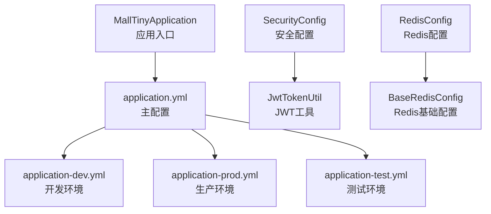
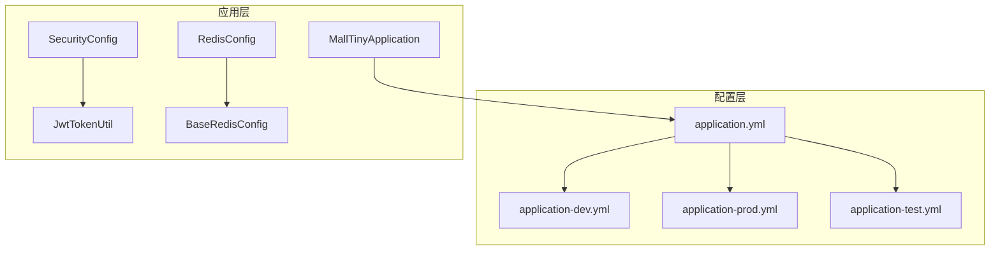
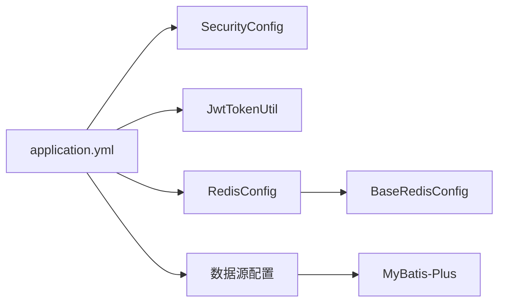

# 多环境配置管理

<cite>
**本文引用的文件**
- [application.yml](file://src/main/resources/application.yml)
- [application-dev.yml](file://src/main/resources/application-dev.yml)
- [application-prod.yml](file://src/main/resources/application-prod.yml)
- [application-test.yml](file://src/test/resources/application-test.yml)
- [RedisConfig.java](file://src/main/java/com/macro/mall/tiny/config/RedisConfig.java)
- [BaseRedisConfig.java](file://src/main/java/com/macro/mall/tiny/common/config/BaseRedisConfig.java)
- [JwtTokenUtil.java](file://src/main/java/com/macro/mall/tiny/security/util/JwtTokenUtil.java)
- [SecurityConfig.java](file://src/main/java/com/macro/mall/tiny/security/config/SecurityConfig.java)
- [MallTinyApplication.java](file://src/main/java/com/macro/mall/tiny/MallTinyApplication.java)
- [Dockerfile](file://Dockerfile)
- [docker-compose.yml](file://docker-compose.yml)
</cite>

## 目录
1. [简介](#简介)
2. [项目结构](#项目结构)
3. [核心组件](#核心组件)
4. [架构总览](#架构总览)
5. [详细组件分析](#详细组件分析)
6. [依赖分析](#依赖分析)
7. [性能考虑](#性能考虑)
8. [故障排查指南](#故障排查指南)
9. [结论](#结论)
10. [附录](#附录)

## 简介
本文件系统性梳理 Mall-Tiny 项目的多环境配置管理，围绕主配置文件与各环境配置文件的结构、关键参数、加载优先级与覆盖规则展开，并结合开发与生产环境的差异、敏感信息的安全策略、热更新方案以及不同部署场景的最佳实践进行说明，帮助开发者与运维人员高效、安全地管理应用配置。

## 项目结构
Mall-Tiny 的配置相关文件主要位于 resources 目录，采用 Spring Boot 的多环境配置机制：
- 主配置文件：application.yml
- 开发环境：application-dev.yml
- 生产环境：application-prod.yml
- 测试环境：application-test.yml（位于测试资源目录）
- 安全与缓存相关配置类：RedisConfig、BaseRedisConfig、JwtTokenUtil、SecurityConfig
- 应用入口：MallTinyApplication
- 容器化部署：Dockerfile、docker-compose.yml

**图表来源**
- [application.yml:1-57](file://src/main/resources/application.yml#L1-L57)
- [application-dev.yml:1-16](file://src/main/resources/application-dev.yml#L1-L16)
- [application-prod.yml:1-18](file://src/main/resources/application-prod.yml#L1-L18)
- [application-test.yml:1-57](file://src/test/resources/application-test.yml#L1-L57)
- [MallTinyApplication.java:1-14](file://src/main/java/com/macro/mall/tiny/MallTinyApplication.java#L1-L14)
- [SecurityConfig.java:1-86](file://src/main/java/com/macro/mall/tiny/security/config/SecurityConfig.java#L1-L86)
- [JwtTokenUtil.java:1-171](file://src/main/java/com/macro/mall/tiny/security/util/JwtTokenUtil.java#L1-L171)
- [RedisConfig.java:1-16](file://src/main/java/com/macro/mall/tiny/config/RedisConfig.java#L1-L16)
- [BaseRedisConfig.java:1-69](file://src/main/java/com/macro/mall/tiny/common/config/BaseRedisConfig.java#L1-L69)

**章节来源**
- [application.yml:1-57](file://src/main/resources/application.yml#L1-L57)
- [application-dev.yml:1-16](file://src/main/resources/application-dev.yml#L1-L16)
- [application-prod.yml:1-18](file://src/main/resources/application-prod.yml#L1-L18)
- [application-test.yml:1-57](file://src/test/resources/application-test.yml#L1-L57)
- [MallTinyApplication.java:1-14](file://src/main/java/com/macro/mall/tiny/MallTinyApplication.java#L1-L14)

## 核心组件
- 主配置文件 application.yml
  - 服务器端口、应用名、激活的 profile、MyBatis-Plus Mapper 路径、全局配置、日志匹配策略
  - JWT 参数：请求头、密钥、过期时间、token 前缀
  - Redis 缓存键空间与通用过期时间
  - 安全白名单路径列表
- 开发环境 application-dev.yml
  - 数据源：本地 MySQL 地址、账号、密码
  - Redis：本地主机、端口、空密码、连接超时
  - 日志级别：root 为 info，包名为 debug
- 生产环境 application-prod.yml
  - 数据源：容器内 db 服务、账号、密码
  - Redis：容器内 redis 服务、端口、空密码、连接超时
  - 日志输出至文件：/var/logs，root 为 info，包名为 info
- 测试环境 application-test.yml
  - 使用内存数据库（H2），便于单元测试
  - JWT 密钥与 Redis 数据库名等测试专用配置
- 安全与缓存配置类
  - SecurityConfig：基于 WebSecurityConfigurerAdapter 的安全链路配置，启用无状态会话、白名单放行、JWT 过滤器等
  - JwtTokenUtil：基于 @Value 注解读取 jwt.* 配置，生成/解析/刷新 token
  - RedisConfig/BaseRedisConfig：RedisTemplate、Jackson 序列化、RedisCacheManager 等缓存配置

**章节来源**
- [application.yml:1-57](file://src/main/resources/application.yml#L1-L57)
- [application-dev.yml:1-16](file://src/main/resources/application-dev.yml#L1-L16)
- [application-prod.yml:1-18](file://src/main/resources/application-prod.yml#L1-L18)
- [application-test.yml:1-57](file://src/test/resources/application-test.yml#L1-L57)
- [SecurityConfig.java:1-86](file://src/main/java/com/macro/mall/tiny/security/config/SecurityConfig.java#L1-L86)
- [JwtTokenUtil.java:1-171](file://src/main/java/com/macro/mall/tiny/security/util/JwtTokenUtil.java#L1-L171)
- [RedisConfig.java:1-16](file://src/main/java/com/macro/mall/tiny/config/RedisConfig.java#L1-L16)
- [BaseRedisConfig.java:1-69](file://src/main/java/com/macro/mall/tiny/common/config/BaseRedisConfig.java#L1-L69)

## 架构总览
下图展示配置在系统中的加载与使用关系，体现主配置与环境配置的继承与覆盖、以及配置对安全与缓存模块的影响。

**图表来源**
- [application.yml:1-57](file://src/main/resources/application.yml#L1-L57)
- [application-dev.yml:1-16](file://src/main/resources/application-dev.yml#L1-L16)
- [application-prod.yml:1-18](file://src/main/resources/application-prod.yml#L1-L18)
- [application-test.yml:1-57](file://src/test/resources/application-test.yml#L1-L57)
- [MallTinyApplication.java:1-14](file://src/main/java/com/macro/mall/tiny/MallTinyApplication.java#L1-L14)
- [SecurityConfig.java:1-86](file://src/main/java/com/macro/mall/tiny/security/config/SecurityConfig.java#L1-L86)
- [JwtTokenUtil.java:1-171](file://src/main/java/com/macro/mall/tiny/security/util/JwtTokenUtil.java#L1-L171)
- [RedisConfig.java:1-16](file://src/main/java/com/macro/mall/tiny/config/RedisConfig.java#L1-L16)
- [BaseRedisConfig.java:1-69](file://src/main/java/com/macro/mall/tiny/common/config/BaseRedisConfig.java#L1-L69)

## 详细组件分析

### 主配置文件 application.yml 结构与关键项
- 服务器与应用
  - server.port：应用监听端口
  - spring.application.name：应用名称
  - spring.profiles.active：当前激活的 profile（默认 dev）
  - spring.mvc.pathmatch.matching-strategy：路径匹配策略
- MyBatis-Plus
  - mybatis-plus.mapper-locations：XML 映射文件位置
  - mybatis-plus.global-config.db-config.id-type：主键策略
  - mybatis-plus.configuration.auto-mapping-behavior、map-underscore-to-camel-case：映射行为
- JWT
  - jwt.tokenHeader：请求头字段名
  - jwt.secret：签名密钥
  - jwt.expiration：过期秒数
  - jwt.tokenHead：token 前缀
- Redis
  - redis.database：数据库名
  - redis.key.admin、redis.key.resourceList：缓存键前缀
  - redis.expire.common：通用过期时间
- 安全白名单
  - secure.ignored.urls：无需鉴权的路径集合

这些键值在运行时由 @Value 或自动装配注入到组件中，例如 JwtTokenUtil 通过 @Value 读取 jwt.*，SecurityConfig 通过 IgnoreUrlsConfig 读取白名单。

**章节来源**
- [application.yml:1-57](file://src/main/resources/application.yml#L1-L57)
- [JwtTokenUtil.java:1-171](file://src/main/java/com/macro/mall/tiny/security/util/JwtTokenUtil.java#L1-L171)
- [SecurityConfig.java:1-86](file://src/main/java/com/macro/mall/tiny/security/config/SecurityConfig.java#L1-L86)

### 开发环境 application-dev.yml 与生产环境 application-prod.yml 差异
- 数据源
  - 开发：jdbc:mysql://localhost:3306/...（本地 MySQL）
  - 生产：jdbc:mysql://db:3306/...（容器网络 db 服务）
- Redis
  - 开发：host=localhost，port=6379，password 留空
  - 生产：host=redis，port=6379，password 留空
- 日志
  - 开发：控制台日志，包级别 debug
  - 生产：文件日志，输出到 /var/logs，包级别 info

这些差异体现了“开发在本地、生产在容器”的典型分离策略。

**章节来源**
- [application-dev.yml:1-16](file://src/main/resources/application-dev.yml#L1-L16)
- [application-prod.yml:1-18](file://src/main/resources/application-prod.yml#L1-L18)

### 测试环境 application-test.yml 特殊设置
- 数据源：H2 内存数据库，便于快速测试
- Redis：本地主机与端口
- JWT 密钥与 Redis 数据库名等测试专用配置
- 其他配置与主配置一致，确保测试隔离

**章节来源**
- [application-test.yml:1-57](file://src/test/resources/application-test.yml#L1-L57)

### 配置加载优先级与覆盖规则
- Spring Boot 配置加载顺序（简述）
  - 外部配置优先于内部配置
  - 命令行参数 > 环境变量 > application-{profile}.yml > application.yml
  - Profile 文件会覆盖同名键的默认值
- 在本项目中的体现
  - application.yml 提供默认值与公共配置
  - application-dev.yml 与 application-prod.yml 覆盖数据源、Redis、日志等差异化项
  - 测试环境 application-test.yml 用于单元测试，隔离数据库与缓存

**章节来源**
- [application.yml:1-57](file://src/main/resources/application.yml#L1-L57)
- [application-dev.yml:1-16](file://src/main/resources/application-dev.yml#L1-L16)
- [application-prod.yml:1-18](file://src/main/resources/application-prod.yml#L1-L18)
- [application-test.yml:1-57](file://src/test/resources/application-test.yml#L1-L57)

### 环境切换方法
- 通过 spring.profiles.active 属性切换
  - 主配置中默认激活 dev
  - 可通过命令行参数或环境变量覆盖
- docker-compose 中通过环境变量显式设置为 prod，并注入数据源与 Redis 主机
- 测试阶段可使用 application-test.yml，确保测试不受其他配置影响

**章节来源**
- [application.yml:7-8](file://src/main/resources/application.yml#L7-L8)
- [docker-compose.yml:20-23](file://docker-compose.yml#L20-L23)

### 敏感信息的安全配置建议
- 数据库密码
  - 开发：本地明文（仅限开发环境）
  - 生产：建议通过环境变量注入，避免硬编码
- Redis 密码
  - 若生产开启密码，建议通过环境变量注入
- JWT 密钥
  - 不要在仓库中保留强敏感密钥；使用环境变量注入
  - 不同环境使用不同密钥，避免跨环境混淆
- 最佳实践
  - 使用配置中心（如 Spring Cloud Config）或密钥管理服务（如 HashiCorp Vault）
  - 对外暴露的配置文件仅包含非敏感默认值或占位符
  - 在 CI/CD 中通过环境变量注入敏感值

[本节为通用指导，不直接分析具体文件，故不附加章节来源]

### 配置热更新实现方案与注意事项
- 方案一：使用 Spring Cloud Bus + 消息总线
  - 配置变更后发送消息，触发 /actuator/refresh 刷新上下文
  - 注意：部分 @ConfigurationProperties 组件需配合 @RefreshScope 才能生效
- 方案二：使用 Actuator + 外部配置
  - 将敏感或频繁变更的配置放入外部配置文件，通过环境变量或命令行参数覆盖
  - 重启容器或应用以加载新配置
- 注意事项
  - @Value 注解读取的配置默认不支持热更新，建议改用 @ConfigurationProperties
  - 缓存配置（如 Redis、JWT）若涉及连接串或密钥，建议重启以确保一致性
  - 生产环境尽量避免频繁热更，优先通过滚动发布降低风险

[本节为通用指导，不直接分析具体文件，故不附加章节来源]

### 不同部署环境下的配置最佳实践
- 本地开发
  - 使用 application-dev.yml，连接本地 MySQL 与 Redis
  - 日志输出到控制台，便于调试
- 容器化部署（Docker/Docker Compose）
  - 使用 application-prod.yml，连接容器网络内的 db 与 redis
  - 通过环境变量注入 spring.profiles.active=prod、数据源与 Redis 主机
  - 将日志输出到挂载目录 /var/logs，便于采集与分析
- Kubernetes
  - 使用 ConfigMap 管理非敏感配置，Secret 管理敏感配置
  - 通过环境变量注入，避免将敏感信息写入镜像或配置文件
- 测试
  - 使用 application-test.yml，连接 H2 内存数据库，确保测试隔离与速度

**章节来源**
- [docker-compose.yml:1-26](file://docker-compose.yml#L1-L26)
- [application-dev.yml:1-16](file://src/main/resources/application-dev.yml#L1-L16)
- [application-prod.yml:1-18](file://src/main/resources/application-prod.yml#L1-L18)
- [application-test.yml:1-57](file://src/test/resources/application-test.yml#L1-L57)

## 依赖分析
- 配置对组件的影响
  - SecurityConfig 依赖白名单配置（来自 secure.ignored.urls）
  - JwtTokenUtil 依赖 jwt.* 配置（@Value 注入）
  - RedisConfig/BaseRedisConfig 依赖 spring.redis.* 配置（自动装配）
  - 数据源配置影响 MyBatis-Plus 与数据库连接池

**图表来源**
- [application.yml:1-57](file://src/main/resources/application.yml#L1-L57)
- [SecurityConfig.java:1-86](file://src/main/java/com/macro/mall/tiny/security/config/SecurityConfig.java#L1-L86)
- [JwtTokenUtil.java:1-171](file://src/main/java/com/macro/mall/tiny/security/util/JwtTokenUtil.java#L1-L171)
- [RedisConfig.java:1-16](file://src/main/java/com/macro/mall/tiny/config/RedisConfig.java#L1-L16)
- [BaseRedisConfig.java:1-69](file://src/main/java/com/macro/mall/tiny/common/config/BaseRedisConfig.java#L1-L69)

**章节来源**
- [application.yml:1-57](file://src/main/resources/application.yml#L1-L57)
- [SecurityConfig.java:1-86](file://src/main/java/com/macro/mall/tiny/security/config/SecurityConfig.java#L1-L86)
- [JwtTokenUtil.java:1-171](file://src/main/java/com/macro/mall/tiny/security/util/JwtTokenUtil.java#L1-L171)
- [RedisConfig.java:1-16](file://src/main/java/com/macro/mall/tiny/config/RedisConfig.java#L1-L16)
- [BaseRedisConfig.java:1-69](file://src/main/java/com/macro/mall/tiny/common/config/BaseRedisConfig.java#L1-L69)

## 性能考虑
- 日志级别
  - 开发环境 debug 便于定位问题，但会带来额外开销；生产环境建议 info 或更高
- Redis 连接与序列化
  - BaseRedisConfig 使用 Jackson2JsonRedisSerializer，序列化开销与数据规模相关；建议合理设置 TTL 与键命名空间
- JWT 过期时间
  - 过短导致频繁刷新，过长增加泄露风险；建议根据业务场景折中

[本节为通用指导，不直接分析具体文件，故不附加章节来源]

## 故障排查指南
- 环境未正确切换
  - 检查 spring.profiles.active 是否被命令行或环境变量覆盖
  - 确认 docker-compose 中已设置 spring.profiles.active=prod
- 数据库连接失败
  - 核对 application-dev.yml 与 application-prod.yml 的数据源 URL、用户名、密码
  - 容器网络中确认 db 服务可达
- Redis 连接异常
  - 核对 host、port、password 与 timeout 设置
  - 确认 Redis 服务已启动并开放端口
- JWT 认证失败
  - 核对 jwt.secret、jwt.expiration、jwt.tokenHead 是否与前端一致
  - 检查白名单配置是否误放行了受保护接口
- 日志输出异常
  - 开发环境应输出到控制台；生产环境应输出到 /var/logs 并检查挂载目录

**章节来源**
- [application-dev.yml:1-16](file://src/main/resources/application-dev.yml#L1-L16)
- [application-prod.yml:1-18](file://src/main/resources/application-prod.yml#L1-L18)
- [docker-compose.yml:20-23](file://docker-compose.yml#L20-L23)
- [JwtTokenUtil.java:1-171](file://src/main/java/com/macro/mall/tiny/security/util/JwtTokenUtil.java#L1-L171)
- [SecurityConfig.java:1-86](file://src/main/java/com/macro/mall/tiny/security/config/SecurityConfig.java#L1-L86)

## 结论
Mall-Tiny 的多环境配置遵循 Spring Boot 的约定优于配置原则，通过主配置与环境配置文件的分层设计，实现了开发、生产与测试环境的清晰分离。结合容器化部署与环境变量注入，可在保证安全性的同时提升配置管理效率。建议在生产环境中进一步引入配置中心与密钥管理，配合严格的权限控制与审计机制，确保敏感信息的安全与合规。

## 附录
- 关键配置项速览
  - 服务器与应用：server.port、spring.application.name、spring.profiles.active、spring.mvc.pathmatch.matching-strategy
  - MyBatis-Plus：mybatis-plus.mapper-locations、global-config.db-config.id-type、configuration.*
  - JWT：jwt.tokenHeader、jwt.secret、jwt.expiration、jwt.tokenHead
  - Redis：redis.database、redis.key.*、redis.expire.*
  - 安全白名单：secure.ignored.urls.*

**章节来源**
- [application.yml:1-57](file://src/main/resources/application.yml#L1-L57)