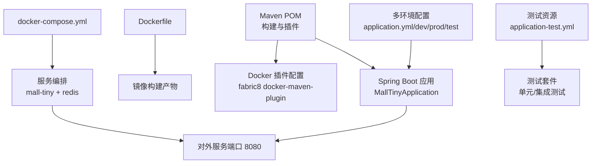
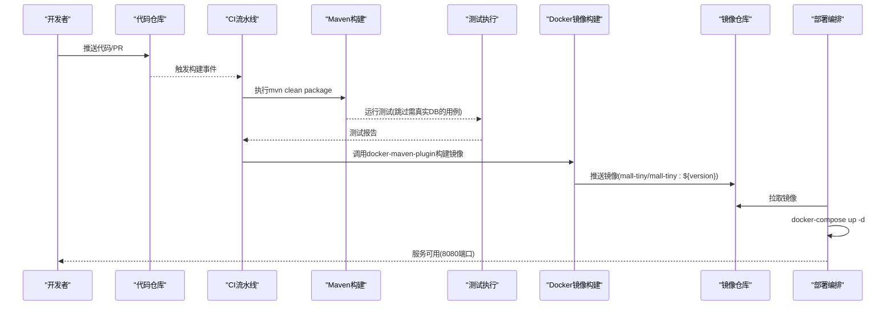
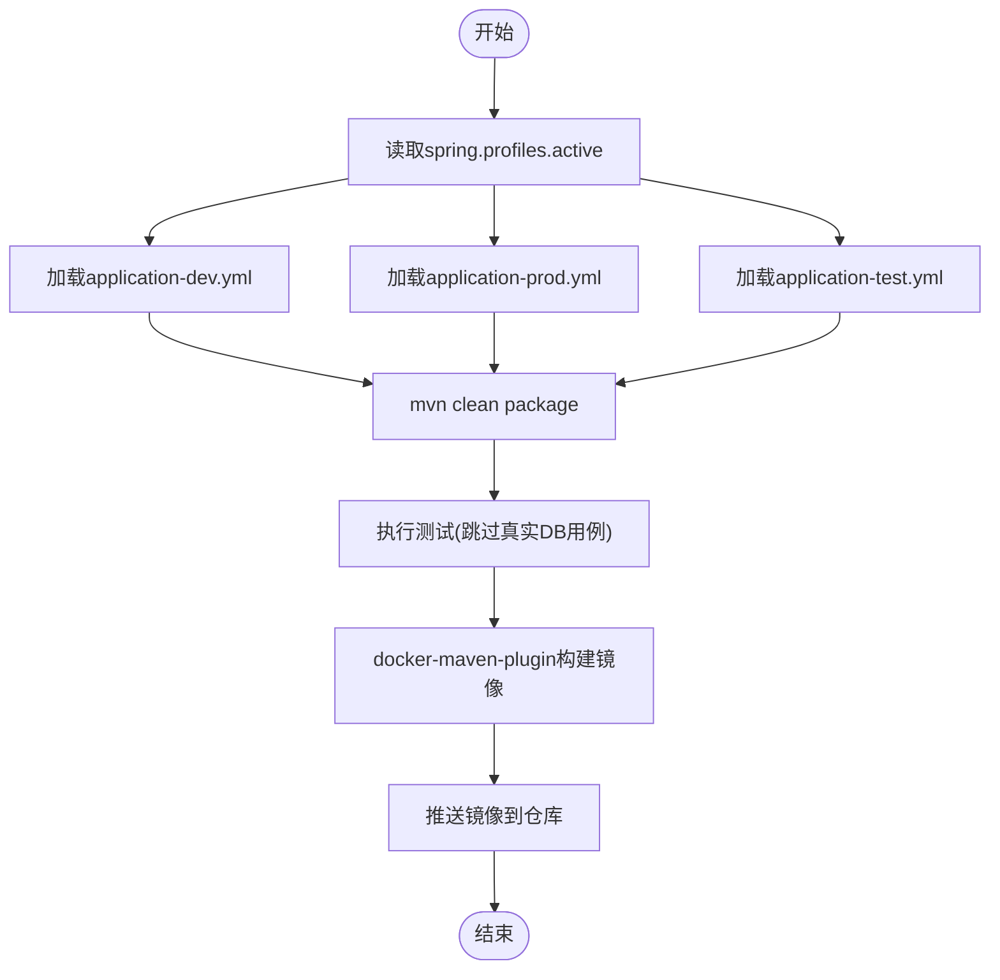
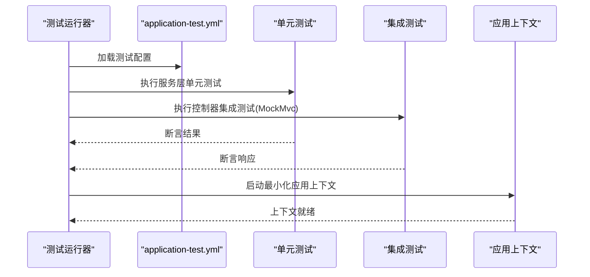
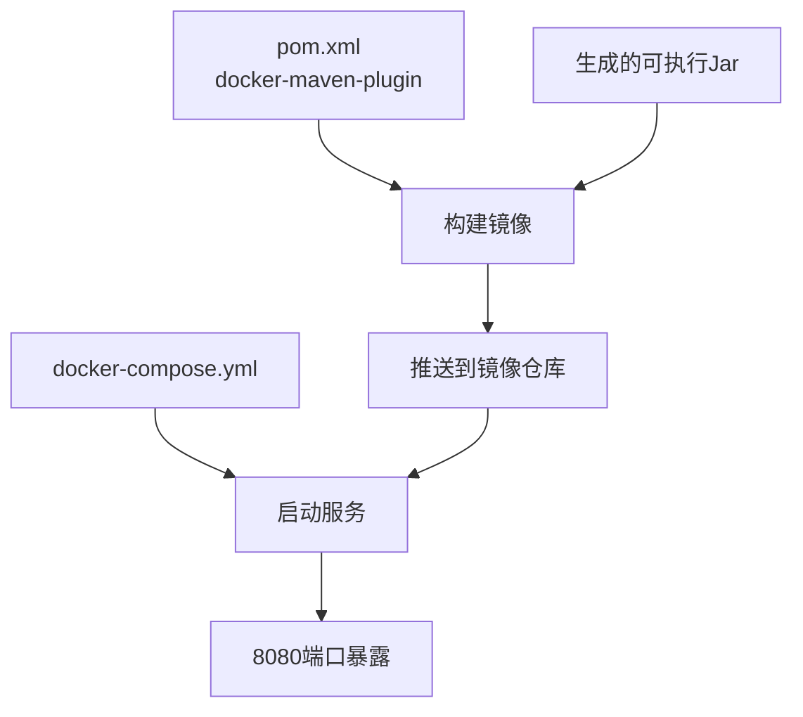
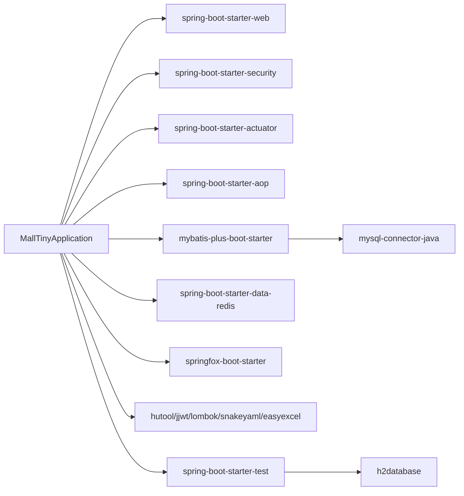

# 持续集成与自动化

<cite>
**本文引用的文件**
- [pom.xml](file://pom.xml)
- [Dockerfile](file://Dockerfile)
- [docker-compose.yml](file://docker-compose.yml)
- [README.md](file://README.md)
- [application.yml](file://src/main/resources/application.yml)
- [application-dev.yml](file://src/main/resources/application-dev.yml)
- [application-prod.yml](file://src/main/resources/application-prod.yml)
- [application-test.yml](file://src/test/resources/application-test.yml)
- [MallTinyApplication.java](file://src/main/java/com/macro/mall/tiny/MallTinyApplication.java)
- [CommonResult.java](file://src/main/java/com/macro/mall/tiny/common/api/CommonResult.java)
- [MallTinyApplicationTests.java](file://src/test/java/com/macro/mall/tiny/MallTinyApplicationTests.java)
- [MatchControllerTest.java](file://src/test/java/com/macro/mall/tiny/modules/ums/controller/MatchControllerTest.java)
- [MatchServiceTest.java](file://src/test/java/com/macro/mall/tiny/modules/ums/service/MatchServiceTest.java)
</cite>

## 目录
1. [简介](#简介)
2. [项目结构](#项目结构)
3. [核心组件](#核心组件)
4. [架构总览](#架构总览)
5. [详细组件分析](#详细组件分析)
6. [依赖分析](#依赖分析)
7. [性能考虑](#性能考虑)
8. [故障排查指南](#故障排查指南)
9. [结论](#结论)
10. [附录](#附录)

## 简介
本文件面向Mall-Tiny项目的持续集成与自动化部署，围绕CI/CD流水线设计、Maven构建优化、自动化测试配置、Docker镜像自动化构建、多环境部署策略、版本发布与回滚机制以及工具链选择进行系统化说明。文档兼顾技术细节与可操作性，帮助团队在保证质量的前提下高效交付。

## 项目结构
Mall-Tiny采用Spring Boot标准结构，核心由以下部分组成：
- Maven多模块与资源环境分离：通过profile与多环境配置文件实现开发、测试、生产环境隔离
- Docker与Compose：提供本地与容器化部署能力
- 测试体系：单元测试与集成测试并存，覆盖关键业务逻辑与控制器层
- 构建与镜像：Maven插件与Dockerfile共同支撑镜像构建与发布

图表来源
- [pom.xml](file://pom.xml)
- [Dockerfile](file://Dockerfile)
- [docker-compose.yml](file://docker-compose.yml)
- [application.yml](file://src/main/resources/application.yml)
- [application-dev.yml](file://src/main/resources/application-dev.yml)
- [application-prod.yml](file://src/main/resources/application-prod.yml)
- [application-test.yml](file://src/test/resources/application-test.yml)
- [MallTinyApplication.java](file://src/main/java/com/macro/mall/tiny/MallTinyApplication.java)

章节来源
- [pom.xml](file://pom.xml)
- [Dockerfile](file://Dockerfile)
- [docker-compose.yml](file://docker-compose.yml)
- [application.yml](file://src/main/resources/application.yml)
- [application-dev.yml](file://src/main/resources/application-dev.yml)
- [application-prod.yml](file://src/main/resources/application-prod.yml)
- [application-test.yml](file://src/test/resources/application-test.yml)
- [MallTinyApplication.java](file://src/main/java/com/macro/mall/tiny/MallTinyApplication.java)

## 核心组件
- Maven构建与插件
  - spring-boot-maven-plugin：打包可执行Jar，内嵌Tomcat
  - fabric8 docker-maven-plugin：定义镜像基础镜像、入口命令、制品装配与远程Docker主机
  - 仓库镜像：阿里云公共镜像源提升依赖下载速度
- 多环境配置
  - application.yml：通用配置与默认激活dev
  - application-dev.yml：本地开发数据库与Redis
  - application-prod.yml：容器化生产数据库与Redis，日志落盘
  - application-test.yml：H2内存数据库与测试专用配置
- Docker与编排
  - Dockerfile：基于openjdk:8，暴露8080端口，ENTRYPOINT为java -jar
  - docker-compose.yml：编排redis与mall-tiny服务，设置环境变量与卷挂载
- 测试与验证
  - 单元测试：覆盖业务算法与服务层
  - 集成测试：控制器层Mock测试，验证HTTP响应与业务流程
  - 应用级测试：禁用真实数据库场景，避免CI环境阻塞

章节来源
- [pom.xml](file://pom.xml)
- [application.yml](file://src/main/resources/application.yml)
- [application-dev.yml](file://src/main/resources/application-dev.yml)
- [application-prod.yml](file://src/main/resources/application-prod.yml)
- [application-test.yml](file://src/test/resources/application-test.yml)
- [Dockerfile](file://Dockerfile)
- [docker-compose.yml](file://docker-compose.yml)
- [MallTinyApplicationTests.java](file://src/test/java/com/macro/mall/tiny/MallTinyApplicationTests.java)
- [MatchControllerTest.java](file://src/test/java/com/macro/mall/tiny/modules/ums/controller/MatchControllerTest.java)
- [MatchServiceTest.java](file://src/test/java/com/macro/mall/tiny/modules/ums/service/MatchServiceTest.java)

## 架构总览
下图展示从代码提交到容器部署的关键路径，涵盖构建、测试、镜像与编排：

图表来源
- [pom.xml](file://pom.xml)
- [docker-compose.yml](file://docker-compose.yml)
- [MallTinyApplicationTests.java](file://src/test/java/com/macro/mall/tiny/MallTinyApplicationTests.java)

## 详细组件分析

### Maven构建与优化
- 多环境构建
  - 通过spring.profiles.active切换dev/prod/test，结合对应配置文件实现环境隔离
  - 生产环境日志输出至/var/logs，便于容器内持久化
- 依赖管理
  - 统一版本属性管理，减少重复与冲突
  - 引入阿里云镜像源，提升依赖下载稳定性与速度
- 构建加速
  - 使用spring-boot-maven-plugin内嵌运行时，减少额外打包步骤
  - 在CI中复用Maven本地缓存，避免重复下载依赖
- Docker集成
  - docker-maven-plugin定义镜像名称、基础镜像、入口命令与制品装配
  - 支持远程Docker主机，便于在CI Agent上构建镜像

图表来源
- [pom.xml](file://pom.xml)
- [application.yml](file://src/main/resources/application.yml)
- [application-dev.yml](file://src/main/resources/application-dev.yml)
- [application-prod.yml](file://src/main/resources/application-prod.yml)
- [application-test.yml](file://src/test/resources/application-test.yml)

章节来源
- [pom.xml](file://pom.xml)
- [application.yml](file://src/main/resources/application.yml)
- [application-dev.yml](file://src/main/resources/application-dev.yml)
- [application-prod.yml](file://src/main/resources/application-prod.yml)
- [application-test.yml](file://src/test/resources/application-test.yml)

### 自动化测试配置
- 单元测试
  - 覆盖MatchService等核心算法，使用反射调用私有方法进行断言
  - 示例：专业分类判断、推荐整合测试
- 集成测试
  - 控制器层使用@WebMvcTest与MockMvc验证HTTP响应
  - 示例：MatchController的推荐流程测试
- 应用级测试
  - MallTinyApplicationTests被禁用，避免CI环境对真实数据库的依赖
- 测试配置
  - application-test.yml使用H2内存数据库，确保测试隔离与快速执行

图表来源
- [application-test.yml](file://src/test/resources/application-test.yml)
- [MatchServiceTest.java](file://src/test/java/com/macro/mall/tiny/modules/ums/service/MatchServiceTest.java)
- [MatchControllerTest.java](file://src/test/java/com/macro/mall/tiny/modules/ums/controller/MatchControllerTest.java)
- [MallTinyApplicationTests.java](file://src/test/java/com/macro/mall/tiny/MallTinyApplicationTests.java)

章节来源
- [application-test.yml](file://src/test/resources/application-test.yml)
- [MatchServiceTest.java](file://src/test/java/com/macro/mall/tiny/modules/ums/service/MatchServiceTest.java)
- [MatchControllerTest.java](file://src/test/java/com/macro/mall/tiny/modules/ums/controller/MatchControllerTest.java)
- [MallTinyApplicationTests.java](file://src/test/java/com/macro/mall/tiny/MallTinyApplicationTests.java)

### Docker镜像自动化构建
- 镜像定义
  - 基础镜像：openjdk:8
  - 入口命令：java -jar /${finalName}.jar
  - 名称格式：mall-tiny/${project.name}:${project.version}
- 构建方式
  - Maven阶段：package时由docker-maven-plugin构建镜像
  - 远程Docker主机：通过docker.host属性指向目标Docker守护进程
- 运行与编排
  - docker-compose.yml声明redis与mall-tiny服务，映射8080端口，挂载日志目录
  - 生产环境通过环境变量切换spring.profiles.active=prod

图表来源
- [pom.xml](file://pom.xml)
- [Dockerfile](file://Dockerfile)
- [docker-compose.yml](file://docker-compose.yml)

章节来源
- [pom.xml](file://pom.xml)
- [Dockerfile](file://Dockerfile)
- [docker-compose.yml](file://docker-compose.yml)

### 多环境部署策略
- 开发环境
  - application-dev.yml直连本地MySQL与Redis，适合本地联调
- 生产环境
  - application-prod.yml通过容器网络访问db与redis，日志落盘至/var/logs
  - docker-compose.yml设置spring.profiles.active=prod
- 测试环境
  - application-test.yml使用H2内存数据库，适合CI流水线中的自动化测试

章节来源
- [application-dev.yml](file://src/main/resources/application-dev.yml)
- [application-prod.yml](file://src/main/resources/application-prod.yml)
- [application-test.yml](file://src/test/resources/application-test.yml)
- [docker-compose.yml](file://docker-compose.yml)

### 版本发布管理最佳实践
- 版本号规则
  - 使用语义化版本：主版本.次版本.修订号[-预发布标识][+构建元数据]
  - SNAPSHOT用于开发分支，稳定版本去除SNAPSHOT
- 发布分支管理
  - develop → release-* → main（打Tag）
  - hotfix分支从main切出，修复后合并回main与develop
- 变更日志维护
  - 采用Keep a Changelog风格，记录新增、修复、变更与废弃项
- 镜像标签策略
  - 最新稳定版本：latest
  - 语义化版本：x.y.z
  - 快照版本：x.y.z-SNAPSHOT（仅开发）

章节来源
- [pom.xml](file://pom.xml)

### 部署回滚机制
- 自动回滚
  - 容器编排层面：通过版本化镜像标签回滚至上一个稳定版本
  - 配置回滚：通过环境变量切换回上一个配置文件或参数集
- 手动回滚
  - 回退到上一个Git Tag对应的镜像版本
  - 若涉及数据库变更，配合迁移脚本与备份恢复
- 数据回滚
  - 生产库：基于备份点进行时间点恢复（PITR）
  - 日志：检查/var/logs定位问题根因，必要时重放关键请求

章节来源
- [docker-compose.yml](file://docker-compose.yml)
- [application-prod.yml](file://src/main/resources/application-prod.yml)

### CI/CD工具链选择与配置建议
- 触发与流水线
  - GitLab CI/GitHub Actions/Jenkins：基于push/PR触发
  - 建议：使用矩阵构建（多JDK/多OS），并行执行测试
- 构建与测试
  - Maven：使用settings.xml配置阿里云镜像与认证
  - 测试：优先执行application-test.yml场景，跳过真实DB用例
- 镜像与发布
  - docker-maven-plugin：集中管理镜像构建与推送
  - 镜像仓库：Harbor/Registry，启用镜像扫描与CVE告警
- 安全与合规
  - 依赖扫描：OWASP Dependency-Check
  - 镜像扫描：Clair/Snyk
  - 代码扫描：SonarQube（静态分析与覆盖率）

章节来源
- [pom.xml](file://pom.xml)
- [application-test.yml](file://src/test/resources/application-test.yml)

## 依赖分析
Mall-Tiny的依赖关系围绕Spring Boot生态与数据访问层展开，关键依赖包括：
- Web与安全：spring-boot-starter-web、spring-boot-starter-security
- 数据访问：mybatis-plus-boot-starter、mysql-connector-java、druid
- 文档与工具：springfox-boot-starter、hutool、jjwt、lombok、snakeyaml、easyexcel
- 测试：spring-boot-starter-test、h2database

图表来源
- [pom.xml](file://pom.xml)
- [MallTinyApplication.java](file://src/main/java/com/macro/mall/tiny/MallTinyApplication.java)

章节来源
- [pom.xml](file://pom.xml)
- [MallTinyApplication.java](file://src/main/java/com/macro/mall/tiny/MallTinyApplication.java)

## 性能考虑
- 构建性能
  - 使用阿里云Maven镜像源，减少依赖下载时间
  - 在CI中缓存Maven本地仓库与依赖缓存
- 运行性能
  - 使用Druid连接池与合理的连接数配置
  - Redis作为缓存层，合理设置键空间与过期策略
- 测试性能
  - H2内存数据库用于测试，避免真实DB交互带来的延迟
  - 控制器层测试使用MockMvc，减少真实网络开销

章节来源
- [pom.xml](file://pom.xml)
- [application-test.yml](file://src/test/resources/application-test.yml)

## 故障排查指南
- 构建失败
  - 检查Maven镜像源是否可达，确认settings.xml配置
  - 查看docker-maven-plugin日志，确认远程Docker主机连通性
- 测试失败
  - application-test.yml是否正确加载，H2数据库初始化是否成功
  - 跳过真实DB的用例是否被禁用，避免CI阻塞
- 镜像与运行
  - Dockerfile与docker-compose.yml中的端口映射与卷挂载是否正确
  - 生产环境spring.profiles.active是否为prod，数据库与Redis连接字符串是否正确
- 常见错误定位
  - 查看/var/logs（生产环境）或容器日志，定位异常堆栈
  - 使用CommonResult统一返回结构，结合接口文档定位业务错误

章节来源
- [pom.xml](file://pom.xml)
- [application-test.yml](file://src/test/resources/application-test.yml)
- [docker-compose.yml](file://docker-compose.yml)
- [application-prod.yml](file://src/main/resources/application-prod.yml)
- [CommonResult.java](file://src/main/java/com/macro/mall/tiny/common/api/CommonResult.java)

## 结论
通过Maven与Docker的协同、多环境配置与容器编排，Mall-Tiny具备了完善的CI/CD基础。结合语义化版本与镜像标签策略、自动化测试与镜像扫描，可在保障质量的同时提升交付效率。建议在现有基础上引入代码质量与安全扫描工具，并完善数据库迁移与回滚流程，进一步增强生产稳定性。

## 附录
- 快速运行
  - 使用docker-compose一键启动：redis与mall-tiny服务
  - 访问Swagger文档：http://localhost:8080/swagger-ui/
- 参考文档
  - README中提供了Docker插件与部署说明链接

章节来源
- [README.md](file://README.md)
- [docker-compose.yml](file://docker-compose.yml)