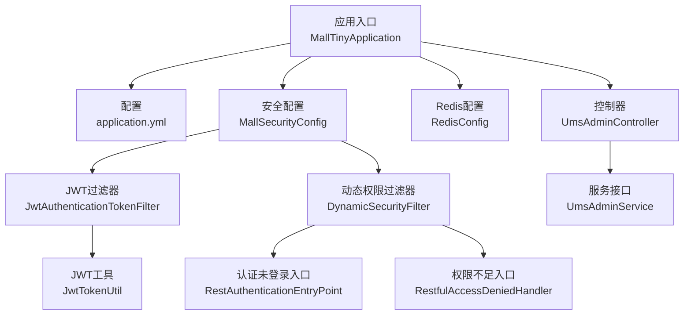
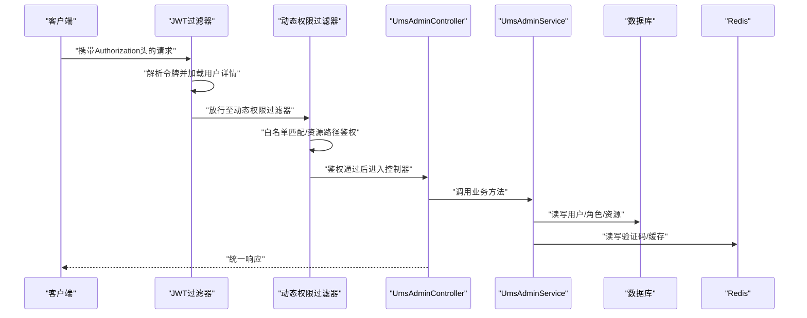
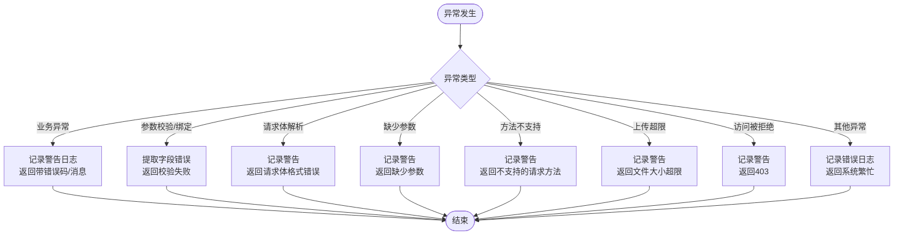
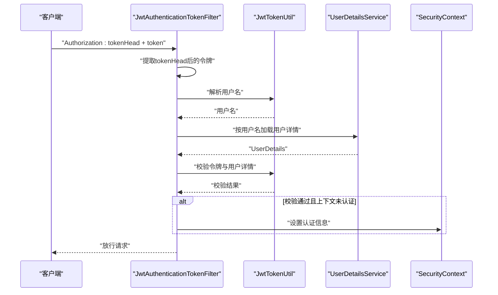
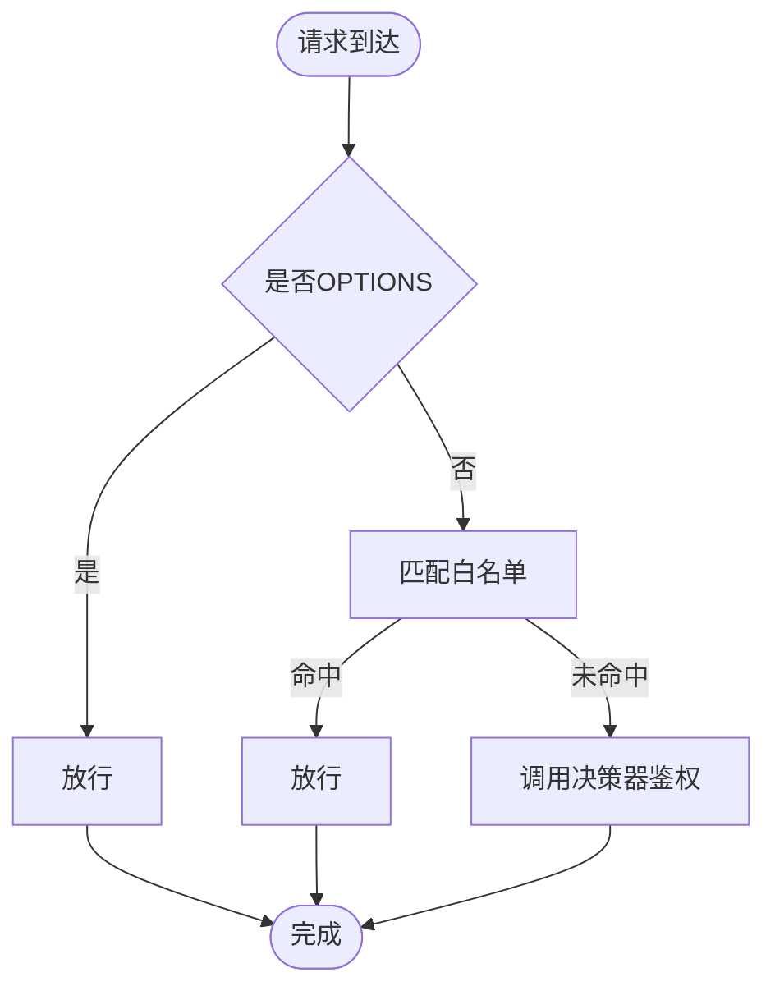
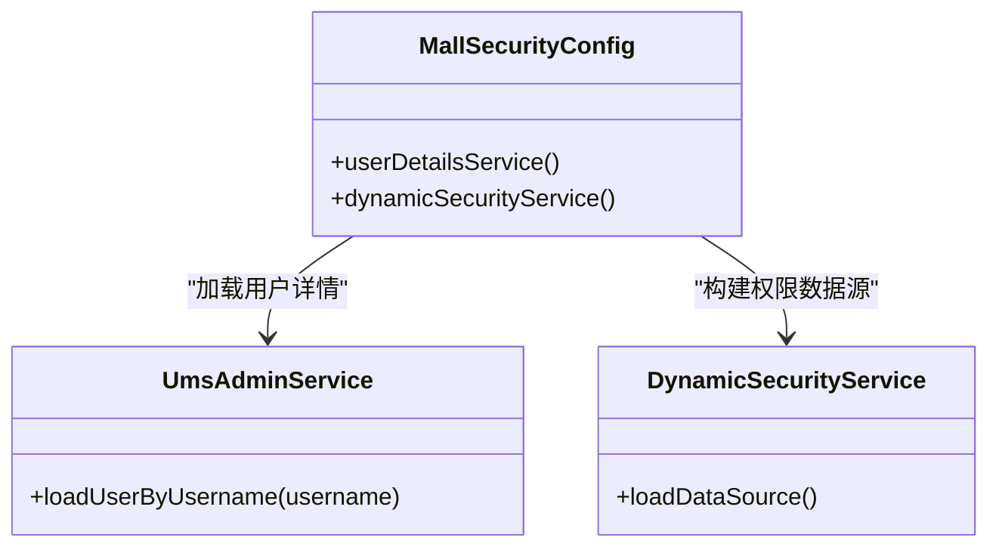
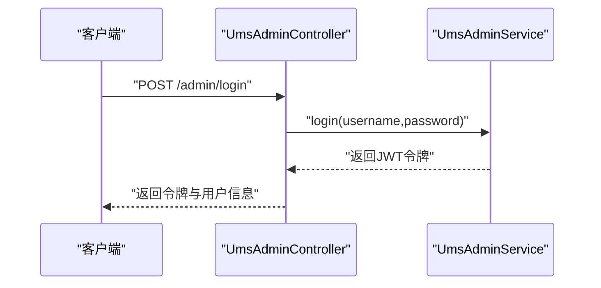
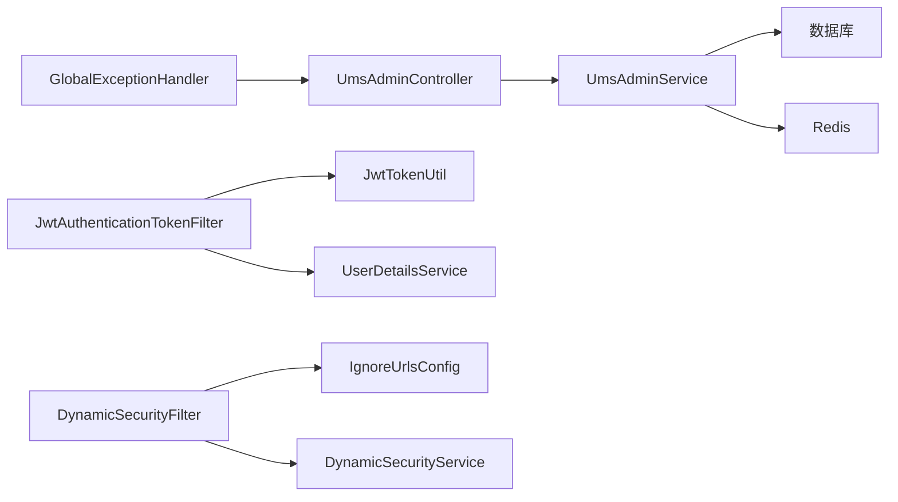

# 故障排查指南

<cite>
**本文引用的文件**
- [MallTinyApplication.java](file://src/main/java/com/macro/mall/tiny/MallTinyApplication.java)
- [application.yml](file://src/main/resources/application.yml)
- [docker-compose.yml](file://docker-compose.yml)
- [GlobalExceptionHandler.java](file://src/main/java/com/macro/mall/tiny/common/exception/GlobalExceptionHandler.java)
- [ApiException.java](file://src/main/java/com/macro/mall/tiny/common/exception/ApiException.java)
- [Asserts.java](file://src/main/java/com/macro/mall/tiny/common/exception/Asserts.java)
- [JwtAuthenticationTokenFilter.java](file://src/main/java/com/macro/mall/tiny/security/component/JwtAuthenticationTokenFilter.java)
- [JwtTokenUtil.java](file://src/main/java/com/macro/mall/tiny/security/util/JwtTokenUtil.java)
- [DynamicSecurityFilter.java](file://src/main/java/com/macro/mall/tiny/security/component/DynamicSecurityFilter.java)
- [MallSecurityConfig.java](file://src/main/java/com/macro/mall/tiny/config/MallSecurityConfig.java)
- [RedisConfig.java](file://src/main/java/com/macro/mall/tiny/config/RedisConfig.java)
- [UmsAdminController.java](file://src/main/java/com/macro/mall/tiny/modules/ums/controller/UmsAdminController.java)
- [UmsAdminService.java](file://src/main/java/com/macro/mall/tiny/modules/ums/service/UmsAdminService.java)
- [RestAuthenticationEntryPoint.java](file://src/main/java/com/macro/mall/tiny/security/component/RestAuthenticationEntryPoint.java)
- [RestfulAccessDeniedHandler.java](file://src/main/java/com/macro/mall/tiny/security/component/RestfulAccessDeniedHandler.java)
</cite>

## 目录
1. [简介](#简介)
2. [项目结构](#项目结构)
3. [核心组件](#核心组件)
4. [架构总览](#架构总览)
5. [详细组件分析](#详细组件分析)
6. [依赖分析](#依赖分析)
7. [性能考虑](#性能考虑)
8. [故障排查指南](#故障排查指南)
9. [结论](#结论)
10. [附录](#附录)

## 简介
本指南面向Mall-Tiny项目的运维与开发人员，聚焦于常见部署与运行期故障的系统化排查流程，覆盖应用启动失败、数据库连接异常、Redis连接问题、JWT认证失败、权限认证异常、全局异常处理机制、性能瓶颈与应急处置等方面。文档提供可执行的诊断步骤、可视化流程图与实用命令，帮助快速定位与修复问题。

## 项目结构
Mall-Tiny采用Spring Boot工程，核心模块包括：
- 应用入口与配置：应用启动类、通用异常处理、安全与Redis配置、Swagger配置等
- 安全模块：JWT过滤器、动态权限过滤器、认证与授权入口点、访问拒绝处理器
- 业务模块：用户中心UMS相关控制器、服务接口与实现
- 运维编排：Docker与Compose用于本地与生产环境容器化部署

图表来源
- [MallTinyApplication.java:1-14](file://src/main/java/com/macro/mall/tiny/MallTinyApplication.java#L1-L14)
- [application.yml:1-57](file://src/main/resources/application.yml#L1-L57)
- [MallSecurityConfig.java:1-54](file://src/main/java/com/macro/mall/tiny/config/MallSecurityConfig.java#L1-L54)
- [JwtAuthenticationTokenFilter.java:1-59](file://src/main/java/com/macro/mall/tiny/security/component/JwtAuthenticationTokenFilter.java#L1-L59)
- [DynamicSecurityFilter.java:1-83](file://src/main/java/com/macro/mall/tiny/security/component/DynamicSecurityFilter.java#L1-L83)
- [JwtTokenUtil.java:1-171](file://src/main/java/com/macro/mall/tiny/security/util/JwtTokenUtil.java#L1-L171)
- [RestAuthenticationEntryPoint.java:1-28](file://src/main/java/com/macro/mall/tiny/security/component/RestAuthenticationEntryPoint.java#L1-L28)
- [RestfulAccessDeniedHandler.java:1-30](file://src/main/java/com/macro/mall/tiny/security/component/RestfulAccessDeniedHandler.java#L1-L30)
- [RedisConfig.java:1-16](file://src/main/java/com/macro/mall/tiny/config/RedisConfig.java#L1-L16)
- [UmsAdminController.java:1-350](file://src/main/java/com/macro/mall/tiny/modules/ums/controller/UmsAdminController.java#L1-L350)
- [UmsAdminService.java:1-90](file://src/main/java/com/macro/mall/tiny/modules/ums/service/UmsAdminService.java#L1-L90)

章节来源
- [MallTinyApplication.java:1-14](file://src/main/java/com/macro/mall/tiny/MallTinyApplication.java#L1-L14)
- [application.yml:1-57](file://src/main/resources/application.yml#L1-L57)

## 核心组件
- 应用入口与启动：Spring Boot应用启动类，负责引导上下文与自动装配
- 全局异常处理：统一捕获业务异常、参数校验异常、HTTP消息解析异常、权限不足等，输出标准化响应
- 安全与认证：JWT过滤器负责从请求头提取令牌并完成用户认证；动态权限过滤器基于白名单与资源路径进行鉴权；认证未登录与权限不足处理器统一返回JSON
- Redis配置：启用Spring Cache注解，为缓存与会话等提供基础能力
- 控制器与服务：用户中心控制器处理登录、刷新令牌、获取用户信息等；服务接口定义用户、角色、资源等业务能力

章节来源
- [GlobalExceptionHandler.java:1-100](file://src/main/java/com/macro/mall/tiny/common/exception/GlobalExceptionHandler.java#L1-L100)
- [JwtAuthenticationTokenFilter.java:1-59](file://src/main/java/com/macro/mall/tiny/security/component/JwtAuthenticationTokenFilter.java#L1-L59)
- [DynamicSecurityFilter.java:1-83](file://src/main/java/com/macro/mall/tiny/security/component/DynamicSecurityFilter.java#L1-L83)
- [RedisConfig.java:1-16](file://src/main/java/com/macro/mall/tiny/config/RedisConfig.java#L1-L16)
- [UmsAdminController.java:1-350](file://src/main/java/com/macro/mall/tiny/modules/ums/controller/UmsAdminController.java#L1-L350)
- [UmsAdminService.java:1-90](file://src/main/java/com/macro/mall/tiny/modules/ums/service/UmsAdminService.java#L1-L90)

## 架构总览
下图展示Mall-Tiny在运行期的关键交互：客户端请求经由安全过滤链进入控制器，控制器调用服务层，服务层可能访问数据库与Redis，最终返回统一响应。

图表来源
- [JwtAuthenticationTokenFilter.java:37-57](file://src/main/java/com/macro/mall/tiny/security/component/JwtAuthenticationTokenFilter.java#L37-L57)
- [DynamicSecurityFilter.java:39-66](file://src/main/java/com/macro/mall/tiny/security/component/DynamicSecurityFilter.java#L39-L66)
- [UmsAdminController.java:166-211](file://src/main/java/com/macro/mall/tiny/modules/ums/controller/UmsAdminController.java#L166-L211)
- [UmsAdminService.java:36-88](file://src/main/java/com/macro/mall/tiny/modules/ums/service/UmsAdminService.java#L36-L88)

## 详细组件分析

### 全局异常处理机制
- 职责：对业务异常、参数校验异常、请求体解析异常、缺少参数、请求方法不支持、上传大小超限、访问被拒绝、未知异常进行分类处理，并输出统一响应
- 关键点：业务异常可携带自定义错误码；参数校验异常提取首个字段错误；访问被拒绝返回403；未知异常记录错误日志并返回系统繁忙提示

图表来源
- [GlobalExceptionHandler.java:27-98](file://src/main/java/com/macro/mall/tiny/common/exception/GlobalExceptionHandler.java#L27-L98)

章节来源
- [GlobalExceptionHandler.java:1-100](file://src/main/java/com/macro/mall/tiny/common/exception/GlobalExceptionHandler.java#L1-L100)
- [ApiException.java:10-33](file://src/main/java/com/macro/mall/tiny/common/exception/ApiException.java#L10-L33)
- [Asserts.java:10-18](file://src/main/java/com/macro/mall/tiny/common/exception/Asserts.java#L10-L18)

### JWT认证与令牌校验
- 请求头约定：Authorization头需以配置的tokenHead前缀开头，随后为JWT令牌
- 认证流程：过滤器从请求头提取令牌，解析用户名，若上下文未认证则加载用户详情并校验令牌有效性，最后设置认证信息到SecurityContext
- 令牌工具：提供生成、解析、过期判断、刷新等能力，支持在指定时间内避免重复刷新

图表来源
- [JwtAuthenticationTokenFilter.java:37-57](file://src/main/java/com/macro/mall/tiny/security/component/JwtAuthenticationTokenFilter.java#L37-L57)
- [JwtTokenUtil.java:76-96](file://src/main/java/com/macro/mall/tiny/security/util/JwtTokenUtil.java#L76-L96)

章节来源
- [JwtAuthenticationTokenFilter.java:1-59](file://src/main/java/com/macro/mall/tiny/security/component/JwtAuthenticationTokenFilter.java#L1-L59)
- [JwtTokenUtil.java:1-171](file://src/main/java/com/macro/mall/tiny/security/util/JwtTokenUtil.java#L1-L171)

### 动态权限过滤与白名单
- 白名单：对静态资源、Swagger、登录/注册/验证码等路径直接放行
- OPTIONS预检：直接放行
- 动态鉴权：委托AccessDecisionManager进行决策，结合资源路径与用户权限进行授权

图表来源
- [DynamicSecurityFilter.java:46-66](file://src/main/java/com/macro/mall/tiny/security/component/DynamicSecurityFilter.java#L46-L66)

章节来源
- [DynamicSecurityFilter.java:1-83](file://src/main/java/com/macro/mall/tiny/security/component/DynamicSecurityFilter.java#L1-L83)
- [application.yml:38-57](file://src/main/resources/application.yml#L38-L57)

### 安全配置与用户详情加载
- 用户详情加载：通过UmsAdminService按用户名加载UserDetails
- 动态权限数据源：从UmsResourceService加载所有资源，构建“URL->权限标识”的映射供鉴权使用

图表来源
- [MallSecurityConfig.java:33-52](file://src/main/java/com/macro/mall/tiny/config/MallSecurityConfig.java#L33-L52)
- [UmsAdminService.java:83](file://src/main/java/com/macro/mall/tiny/modules/ums/service/UmsAdminService.java#L83)

章节来源
- [MallSecurityConfig.java:1-54](file://src/main/java/com/macro/mall/tiny/config/MallSecurityConfig.java#L1-L54)
- [UmsAdminService.java:1-90](file://src/main/java/com/macro/mall/tiny/modules/ums/service/UmsAdminService.java#L1-L90)

### 控制器与服务层交互
- 登录/刷新/获取用户信息等接口由UmsAdminController提供
- 服务层负责业务逻辑与数据访问，可能涉及数据库与Redis

图表来源
- [UmsAdminController.java:166-196](file://src/main/java/com/macro/mall/tiny/modules/ums/controller/UmsAdminController.java#L166-L196)
- [UmsAdminService.java:36](file://src/main/java/com/macro/mall/tiny/modules/ums/service/UmsAdminService.java#L36)

章节来源
- [UmsAdminController.java:1-350](file://src/main/java/com/macro/mall/tiny/modules/ums/controller/UmsAdminController.java#L1-L350)
- [UmsAdminService.java:1-90](file://src/main/java/com/macro/mall/tiny/modules/ums/service/UmsAdminService.java#L1-L90)

## 依赖分析
- 组件耦合：安全过滤链依赖JWT工具与用户详情服务；动态权限过滤器依赖白名单配置与动态权限数据源；控制器依赖服务接口；全局异常处理器作为横切关注点作用于所有控制器
- 外部依赖：MySQL（通过数据源配置）、Redis（通过Redis配置与服务）

图表来源
- [UmsAdminController.java:54-60](file://src/main/java/com/macro/mall/tiny/modules/ums/controller/UmsAdminController.java#L54-L60)
- [UmsAdminService.java:88](file://src/main/java/com/macro/mall/tiny/modules/ums/service/UmsAdminService.java#L88)
- [JwtAuthenticationTokenFilter.java:28-35](file://src/main/java/com/macro/mall/tiny/security/component/JwtAuthenticationTokenFilter.java#L28-L35)
- [JwtTokenUtil.java:32-37](file://src/main/java/com/macro/mall/tiny/security/util/JwtTokenUtil.java#L32-L37)
- [MallSecurityConfig.java:34-51](file://src/main/java/com/macro/mall/tiny/config/MallSecurityConfig.java#L34-L51)
- [GlobalExceptionHandler.java:27-98](file://src/main/java/com/macro/mall/tiny/common/exception/GlobalExceptionHandler.java#L27-L98)

章节来源
- [application.yml:24-37](file://src/main/resources/application.yml#L24-L37)
- [RedisConfig.java:11-15](file://src/main/java/com/macro/mall/tiny/config/RedisConfig.java#L11-L15)

## 性能考虑
- 缓存策略：Redis用于验证码与通用缓存，建议评估热点键与过期策略，避免缓存穿透与雪崩
- 数据访问：MyBatis-Plus配置开启下划线转驼峰与部分自动映射，减少手工映射开销
- 并发与线程：控制器与服务层默认单实例，注意事务与并发控制；高并发场景建议引入限流与异步处理
- 日志与监控：统一异常处理与安全入口点均输出结构化日志，便于性能分析与追踪

章节来源
- [application.yml:15-22](file://src/main/resources/application.yml#L15-L22)
- [RedisConfig.java:11-15](file://src/main/java/com/macro/mall/tiny/config/RedisConfig.java#L11-L15)
- [GlobalExceptionHandler.java:25-98](file://src/main/java/com/macro/mall/tiny/common/exception/GlobalExceptionHandler.java#L25-L98)

## 故障排查指南

### 一、应用启动失败
- 排查要点
  - 端口占用：确认server.port未被占用
  - 配置文件：检查active profile与关键配置项
  - 依赖与容器：确认Docker镜像与Compose配置正确
- 建议步骤
  - 查看启动日志，定位异常堆栈
  - 使用netstat/lsof检查端口占用
  - 在docker-compose中调整端口映射或容器名称
- 相关配置参考
  - [application.yml:1-13](file://src/main/resources/application.yml#L1-L13)
  - [docker-compose.yml:18-25](file://docker-compose.yml#L18-L25)

章节来源
- [MallTinyApplication.java:6-11](file://src/main/java/com/macro/mall/tiny/MallTinyApplication.java#L6-L11)
- [application.yml:1-13](file://src/main/resources/application.yml#L1-L13)
- [docker-compose.yml:18-25](file://docker-compose.yml#L18-L25)

### 二、数据库连接异常
- 可能原因
  - 数据源URL、用户名、密码错误
  - MySQL服务不可达或防火墙阻断
  - 驱动版本与MySQL版本不兼容
- 建议步骤
  - 校验application.yml中的数据源配置
  - 使用ping/nc测试主机与端口连通性
  - 在容器内使用mysql命令行验证连接
  - 检查MySQL日志与连接数上限
- 相关配置参考
  - [docker-compose.yml:22](file://docker-compose.yml#L22)
  - [application.yml:15-22](file://src/main/resources/application.yml#L15-L22)

章节来源
- [docker-compose.yml:22](file://docker-compose.yml#L22)
- [application.yml:15-22](file://src/main/resources/application.yml#L15-L22)

### 三、Redis连接问题
- 可能原因
  - Redis地址或端口错误
  - 容器间网络不通或链接未生效
  - Redis未启动或持久化目录权限问题
- 建议步骤
  - 校验application.yml与docker-compose中的Redis配置
  - 使用docker exec进入应用容器，ping/nc测试redis主机
  - 检查Redis容器日志与数据卷挂载
- 相关配置参考
  - [application.yml:30-37](file://src/main/resources/application.yml#L30-L37)
  - [docker-compose.yml:3-10](file://docker-compose.yml#L3-L10)
  - [RedisConfig.java:11-15](file://src/main/java/com/macro/mall/tiny/config/RedisConfig.java#L11-L15)

章节来源
- [application.yml:30-37](file://src/main/resources/application.yml#L30-L37)
- [docker-compose.yml:3-10](file://docker-compose.yml#L3-L10)
- [RedisConfig.java:11-15](file://src/main/java/com/macro/mall/tiny/config/RedisConfig.java#L11-L15)

### 四、JWT认证失败
- 常见现象
  - 401未认证或令牌无效
  - 令牌过期或签名不一致
  - 请求头未携带或格式不正确
- 排查步骤
  - 确认Authorization头格式与tokenHead一致
  - 校验JWT密钥、过期时间配置
  - 检查用户是否存在且账户状态正常
  - 观察JwtTokenUtil的日志输出
- 相关配置与代码
  - [application.yml:24-28](file://src/main/resources/application.yml#L24-L28)
  - [JwtAuthenticationTokenFilter.java:32-35](file://src/main/java/com/macro/mall/tiny/security/component/JwtAuthenticationTokenFilter.java#L32-L35)
  - [JwtTokenUtil.java:32-37](file://src/main/java/com/macro/mall/tiny/security/util/JwtTokenUtil.java#L32-L37)
  - [RestAuthenticationEntryPoint.java:19-26](file://src/main/java/com/macro/mall/tiny/security/component/RestAuthenticationEntryPoint.java#L19-L26)

章节来源
- [application.yml:24-28](file://src/main/resources/application.yml#L24-L28)
- [JwtAuthenticationTokenFilter.java:32-35](file://src/main/java/com/macro/mall/tiny/security/component/JwtAuthenticationTokenFilter.java#L32-L35)
- [JwtTokenUtil.java:32-37](file://src/main/java/com/macro/mall/tiny/security/util/JwtTokenUtil.java#L32-L37)
- [RestAuthenticationEntryPoint.java:19-26](file://src/main/java/com/macro/mall/tiny/security/component/RestAuthenticationEntryPoint.java#L19-L26)

### 五、权限认证问题
- 常见现象
  - 403权限不足
  - 动态权限未生效或资源路径未配置
- 排查步骤
  - 检查白名单配置是否覆盖目标路径
  - 确认动态权限数据源已加载资源URL
  - 核对用户角色与资源权限映射
- 相关配置与代码
  - [application.yml:38-57](file://src/main/resources/application.yml#L38-L57)
  - [MallSecurityConfig.java:40-51](file://src/main/java/com/macro/mall/tiny/config/MallSecurityConfig.java#L40-L51)
  - [DynamicSecurityFilter.java:52-60](file://src/main/java/com/macro/mall/tiny/security/component/DynamicSecurityFilter.java#L52-L60)
  - [RestfulAccessDeniedHandler.java:17-28](file://src/main/java/com/macro/mall/tiny/security/component/RestfulAccessDeniedHandler.java#L17-L28)

章节来源
- [application.yml:38-57](file://src/main/resources/application.yml#L38-L57)
- [MallSecurityConfig.java:40-51](file://src/main/java/com/macro/mall/tiny/config/MallSecurityConfig.java#L40-L51)
- [DynamicSecurityFilter.java:52-60](file://src/main/java/com/macro/mall/tiny/security/component/DynamicSecurityFilter.java#L52-L60)
- [RestfulAccessDeniedHandler.java:17-28](file://src/main/java/com/macro/mall/tiny/security/component/RestfulAccessDeniedHandler.java#L17-L28)

### 六、异常处理机制排查
- 定位方法
  - 查看全局异常处理器日志级别与输出内容
  - 对照异常类型分支，确认是否为预期处理
  - 使用Asserts/ApiException抛出自定义业务异常
- 建议
  - 为关键业务补充IErrorCode枚举与错误码
  - 对外部依赖异常进行包装，保留上下文信息
- 相关代码
  - [GlobalExceptionHandler.java:27-98](file://src/main/java/com/macro/mall/tiny/common/exception/GlobalExceptionHandler.java#L27-L98)
  - [ApiException.java:10-33](file://src/main/java/com/macro/mall/tiny/common/exception/ApiException.java#L10-L33)
  - [Asserts.java:10-18](file://src/main/java/com/macro/mall/tiny/common/exception/Asserts.java#L10-L18)

章节来源
- [GlobalExceptionHandler.java:27-98](file://src/main/java/com/macro/mall/tiny/common/exception/GlobalExceptionHandler.java#L27-L98)
- [ApiException.java:10-33](file://src/main/java/com/macro/mall/tiny/common/exception/ApiException.java#L10-L33)
- [Asserts.java:10-18](file://src/main/java/com/macro/mall/tiny/common/exception/Asserts.java#L10-L18)

### 七、性能瓶颈分析
- 慢查询识别
  - 开启SQL日志与慢查询阈值，定位耗时SQL
  - 结合分页参数与索引设计优化
- 内存泄漏检测
  - 关注大对象缓存与长生命周期集合
  - 使用JVM分析工具定位堆内存增长点
- 并发问题排查
  - 检查事务边界与锁竞争
  - 评估Redis热点键与过期策略
- 监控与日志
  - 统一日志格式与采样策略
  - 关注全局异常处理器与安全入口点的错误日志

章节来源
- [application.yml:15-22](file://src/main/resources/application.yml#L15-L22)
- [GlobalExceptionHandler.java:25-98](file://src/main/java/com/macro/mall/tiny/common/exception/GlobalExceptionHandler.java#L25-L98)

### 八、应急处理方案
- 快速回滚
  - 使用Compose切换镜像标签或回退配置
  - 保持数据卷与网络不变，缩短恢复时间
- 降级策略
  - 对外暴露只读接口，关闭写操作
  - 临时禁用非关键功能（如验证码发送）
- 熔断机制
  - 对下游依赖（数据库/Redis）增加超时与重试策略
  - 在网关或服务层实现短路熔断

章节来源
- [docker-compose.yml:11-25](file://docker-compose.yml#L11-L25)

### 九、常用排查命令与工具
- 网络连通性
  - ping/nc：检查主机与端口可达
  - curl：验证接口返回与状态码
- 容器与日志
  - docker ps/ logs：查看容器状态与日志
  - docker exec：进入容器内部排查
- 数据库与Redis
  - mysql命令行：验证连接与权限
  - redis-cli：检查键空间与连接数
- JVM与应用
  - jstack/jmap：分析线程与堆
  - Actuator端点：健康检查与指标导出（如启用）

章节来源
- [docker-compose.yml:18-25](file://docker-compose.yml#L18-L25)
- [application.yml:38-57](file://src/main/resources/application.yml#L38-L57)

## 结论
通过系统化的配置核对、日志分析、网络连通性检查与异常处理机制排查，可高效定位Mall-Tiny的部署与运行期问题。建议在生产环境中完善监控与告警体系，持续优化缓存与数据库访问策略，并制定标准化的应急处置流程，以提升系统的稳定性与可维护性。

## 附录
- 关键配置清单
  - 服务器端口与路径匹配策略：[application.yml:1-13](file://src/main/resources/application.yml#L1-L13)
  - JWT参数：[application.yml:24-28](file://src/main/resources/application.yml#L24-L28)
  - Redis参数与键空间：[application.yml:30-37](file://src/main/resources/application.yml#L30-L37)
  - 安全白名单：[application.yml:38-57](file://src/main/resources/application.yml#L38-L57)
- 容器化部署
  - Redis与应用服务编排：[docker-compose.yml:1-26](file://docker-compose.yml#L1-L26)