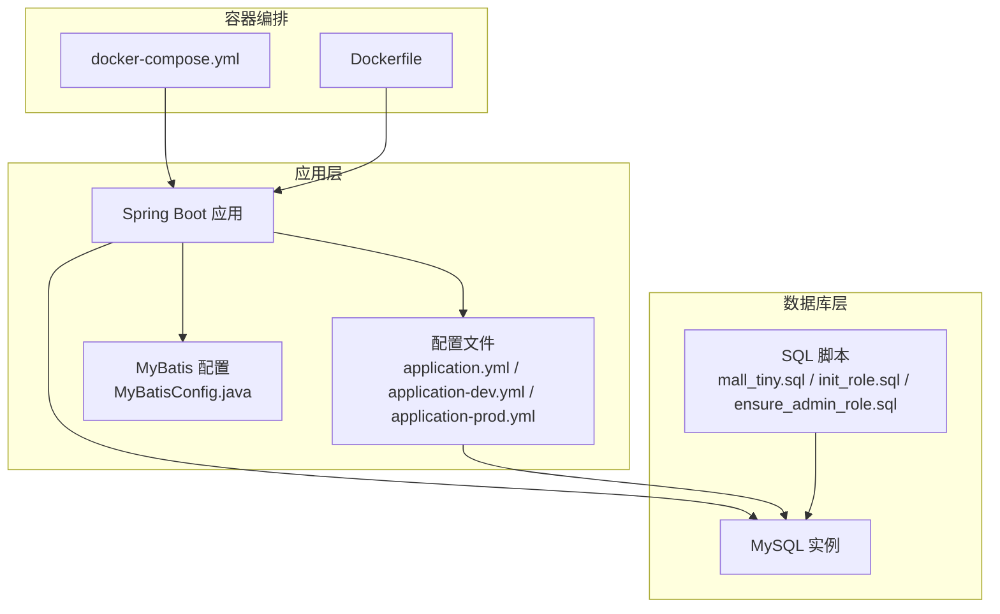
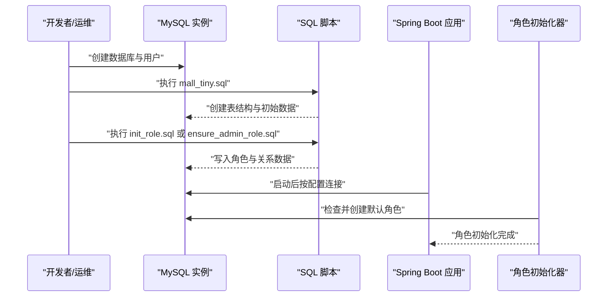
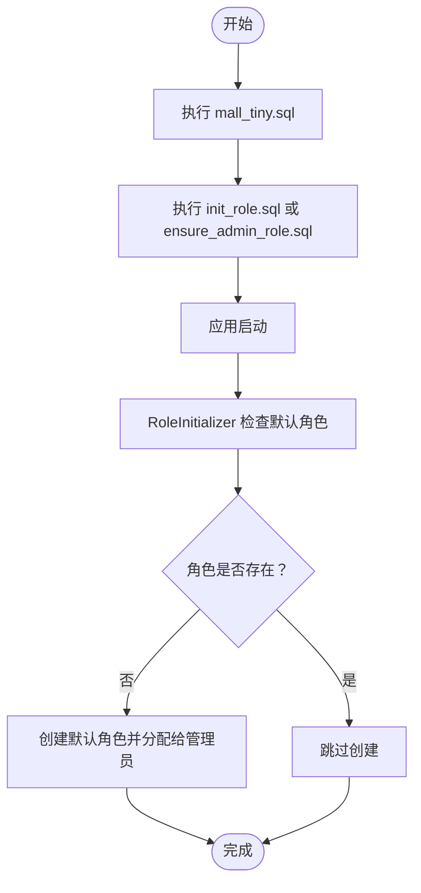
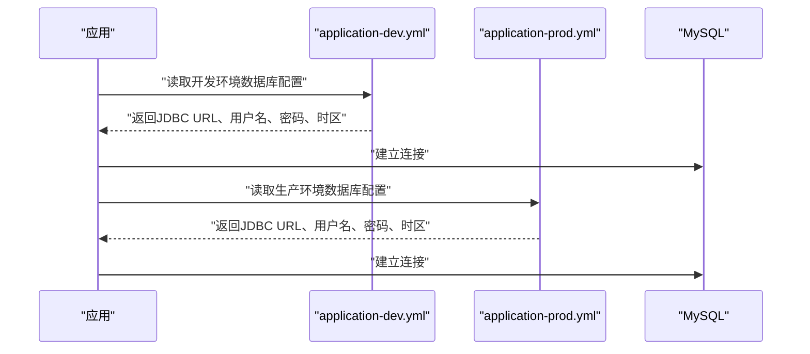
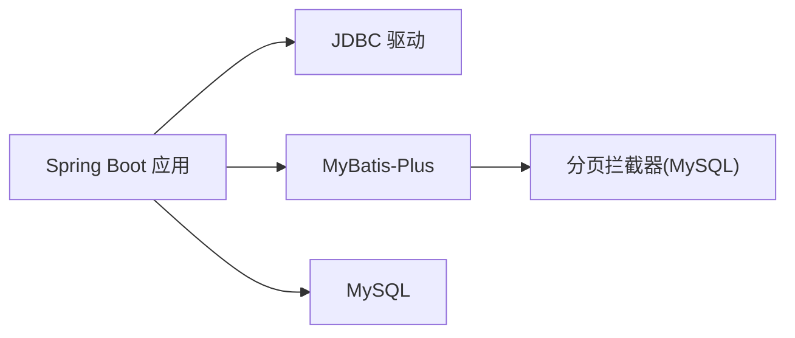

# MySQL数据库部署

<cite>
**本文引用的文件**
- [mall_tiny.sql](file://sql/mall_tiny.sql)
- [init_role.sql](file://sql/init_role.sql)
- [ensure_admin_role.sql](file://sql/ensure_admin_role.sql)
- [application.yml](file://src/main/resources/application.yml)
- [application-dev.yml](file://src/main/resources/application-dev.yml)
- [application-prod.yml](file://src/main/resources/application-prod.yml)
- [generator.properties](file://src/main/resources/generator.properties)
- [MyBatisConfig.java](file://src/main/java/com/macro/mall/tiny/config/MyBatisConfig.java)
- [docker-compose.yml](file://docker-compose.yml)
- [Dockerfile](file://Dockerfile)
- [RoleInitializer.java](file://src/main/java/com/macro/mall/tiny/modules/ums/component/RoleInitializer.java)
</cite>

## 目录
1. [简介](#简介)
2. [项目结构](#项目结构)
3. [核心组件](#核心组件)
4. [架构总览](#架构总览)
5. [详细组件分析](#详细组件分析)
6. [依赖分析](#依赖分析)
7. [性能考虑](#性能考虑)
8. [故障排查指南](#故障排查指南)
9. [结论](#结论)
10. [附录](#附录)

## 简介
本文件面向MySQL数据库部署与运维，结合仓库中的SQL脚本与应用配置，给出从安装要求、初始化配置、连接配置、安全加固到监控与性能调优的完整实践指南。重点覆盖以下方面：
- 安装要求与版本兼容性（基于脚本与驱动）
- 数据库实例初始化（字符集、排序规则、存储引擎）
- 初始化流程（执行SQL脚本、初始化角色数据、确保管理员角色存在）
- 数据库连接配置（JDBC URL、字符集、时区、SSL）
- 安全配置（用户权限、网络访问控制、备份策略）
- 监控与性能调优（慢查询日志、性能分析、索引优化）

## 项目结构
本项目采用Spring Boot + MyBatis-Plus架构，数据库相关配置集中在资源文件与SQL脚本中，容器化通过docker-compose编排。

**图表来源**
- [application.yml:1-57](file://src/main/resources/application.yml#L1-L57)
- [application-dev.yml:1-16](file://src/main/resources/application-dev.yml#L1-L16)
- [application-prod.yml:1-18](file://src/main/resources/application-prod.yml#L1-L18)
- [MyBatisConfig.java:1-28](file://src/main/java/com/macro/mall/tiny/config/MyBatisConfig.java#L1-L28)
- [mall_tiny.sql:1-362](file://sql/mall_tiny.sql#L1-L362)
- [init_role.sql:1-31](file://sql/init_role.sql#L1-L31)
- [ensure_admin_role.sql:1-21](file://sql/ensure_admin_role.sql#L1-L21)
- [docker-compose.yml:1-26](file://docker-compose.yml#L1-L26)
- [Dockerfile:1-10](file://Dockerfile#L1-L10)

**章节来源**
- [application.yml:1-57](file://src/main/resources/application.yml#L1-L57)
- [application-dev.yml:1-16](file://src/main/resources/application-dev.yml#L1-L16)
- [application-prod.yml:1-18](file://src/main/resources/application-prod.yml#L1-L18)
- [MyBatisConfig.java:1-28](file://src/main/java/com/macro/mall/tiny/config/MyBatisConfig.java#L1-L28)
- [mall_tiny.sql:1-362](file://sql/mall_tiny.sql#L1-L362)
- [init_role.sql:1-31](file://sql/init_role.sql#L1-L31)
- [ensure_admin_role.sql:1-21](file://sql/ensure_admin_role.sql#L1-L21)
- [docker-compose.yml:1-26](file://docker-compose.yml#L1-L26)
- [Dockerfile:1-10](file://Dockerfile#L1-L10)

## 核心组件
- 数据库初始化脚本：提供完整的表结构与初始数据，包含用户、角色、菜单、资源等核心表。
- 角色初始化逻辑：应用启动时自动创建默认角色并分配给管理员用户。
- 连接配置：开发与生产环境分别提供JDBC URL、用户名、密码与时区配置。
- ORM配置：MyBatis-Plus分页插件与MySQL适配。

**章节来源**
- [mall_tiny.sql:18-362](file://sql/mall_tiny.sql#L18-L362)
- [RoleInitializer.java:34-53](file://src/main/java/com/macro/mall/tiny/modules/ums/component/RoleInitializer.java#L34-L53)
- [application-dev.yml:2-5](file://src/main/resources/application-dev.yml#L2-L5)
- [application-prod.yml:2-5](file://src/main/resources/application-prod.yml#L2-L5)
- [MyBatisConfig.java:20-25](file://src/main/java/com/macro/mall/tiny/config/MyBatisConfig.java#L20-L25)

## 架构总览
应用通过JDBC连接MySQL，ORM框架负责SQL执行与结果映射。初始化阶段先执行SQL脚本创建表结构与基础数据，再由应用初始化器创建角色并分配权限。

**图表来源**
- [mall_tiny.sql:18-362](file://sql/mall_tiny.sql#L18-L362)
- [init_role.sql:4-30](file://sql/init_role.sql#L4-L30)
- [ensure_admin_role.sql:4-7](file://sql/ensure_admin_role.sql#L4-L7)
- [RoleInitializer.java:34-53](file://src/main/java/com/macro/mall/tiny/modules/ums/component/RoleInitializer.java#L34-L53)

## 详细组件分析

### 安装要求与版本兼容性
- 驱动与客户端
  - 代码中使用了MySQL Connector/J驱动类名，表明需使用与之兼容的MySQL版本。
  - JDBC URL中使用了时区参数，建议MySQL版本支持时区配置。
- 最低版本建议
  - 仓库SQL脚本头部显示源服务器版本为5.7.19，目标服务器版本为5.7.19，建议MySQL 5.7及以上版本。
  - 若使用8.0，请确认驱动版本与时区参数兼容性。
- 操作系统支持
  - 无特定平台限制，可在Linux/Windows/macOS上部署MySQL。

**章节来源**
- [generator.properties:1-5](file://src/main/resources/generator.properties#L1-L5)
- [mall_tiny.sql:4-11](file://sql/mall_tiny.sql#L4-L11)

### 数据库实例初始化配置
- 字符集与排序规则
  - 表结构统一使用utf8字符集（部分表明确为utf8mb4），建议在数据库层面设置默认字符集为utf8mb4以支持完整四字节字符。
  - 排序规则建议使用不区分大小写的校对集，如utf8_general_ci或utf8mb4_general_ci。
- 存储引擎
  - 所有业务表均使用InnoDB存储引擎，具备事务、外键与崩溃恢复能力，适合本项目需求。
- 时间与时区
  - JDBC URL中设置了Asia/Shanghai时区，确保应用侧时间显示与存储一致。

**章节来源**
- [mall_tiny.sql:22-34](file://sql/mall_tiny.sql#L22-L34)
- [mall_tiny.sql:94-105](file://sql/mall_tiny.sql#L94-L105)
- [mall_tiny.sql:139-147](file://sql/mall_tiny.sql#L139-L147)
- [application-dev.yml:3-3](file://src/main/resources/application-dev.yml#L3-L3)
- [application-prod.yml:3-3](file://src/main/resources/application-prod.yml#L3-L3)

### 数据库初始化流程
- 步骤一：执行mall_tiny.sql
  - 创建全部业务表与初始数据（含管理员、登录日志、角色、菜单、资源等）。
- 步骤二：执行init_role.sql或ensure_admin_role.sql
  - 初始化默认角色（管理员、普通用户、数据录入员），并将管理员角色分配给admin用户。
- 步骤三：应用启动初始化
  - 启动后由RoleInitializer检查并创建默认角色，避免重复初始化。

**图表来源**
- [mall_tiny.sql:18-362](file://sql/mall_tiny.sql#L18-L362)
- [init_role.sql:4-30](file://sql/init_role.sql#L4-L30)
- [ensure_admin_role.sql:4-7](file://sql/ensure_admin_role.sql#L4-L7)
- [RoleInitializer.java:34-53](file://src/main/java/com/macro/mall/tiny/modules/ums/component/RoleInitializer.java#L34-L53)

**章节来源**
- [mall_tiny.sql:18-362](file://sql/mall_tiny.sql#L18-L362)
- [init_role.sql:4-30](file://sql/init_role.sql#L4-L30)
- [ensure_admin_role.sql:4-7](file://sql/ensure_admin_role.sql#L4-L7)
- [RoleInitializer.java:34-53](file://src/main/java/com/macro/mall/tiny/modules/ums/component/RoleInitializer.java#L34-L53)

### 数据库连接配置
- 开发环境
  - JDBC URL指向本地MySQL，字符集与时区已配置，关闭SSL。
  - 用户名与密码在配置文件中定义。
- 生产环境
  - JDBC URL指向容器内db主机，字符集与时区配置保持一致。
  - 日志输出路径配置为/var/logs。
- 连接池参数
  - 仓库未显式配置连接池参数（如最大连接数、空闲超时等）。建议在生产环境通过Spring Boot的连接池属性进行调优。

**图表来源**
- [application-dev.yml:2-5](file://src/main/resources/application-dev.yml#L2-L5)
- [application-prod.yml:2-5](file://src/main/resources/application-prod.yml#L2-L5)

**章节来源**
- [application-dev.yml:2-5](file://src/main/resources/application-dev.yml#L2-L5)
- [application-prod.yml:2-5](file://src/main/resources/application-prod.yml#L2-L5)

### 数据库安全配置
- 用户权限管理
  - 建议为应用创建专用数据库用户，仅授予必要权限（如SELECT、INSERT、UPDATE、DELETE、CREATE、INDEX等）。
  - 避免使用root用户进行日常连接，生产环境应启用强密码策略。
- 防火墙设置
  - 仅开放MySQL端口（默认3306）至受信任网段，禁止公网直接访问。
- SSL配置
  - JDBC URL中已关闭SSL（useSSL=false）。若需加密传输，应在MySQL启用SSL并调整JDBC URL为使用SSL。
- 备份策略
  - 建议采用定时全量备份+增量备份的组合策略，备份文件加密存储，并定期验证恢复流程。

[本节为通用安全建议，不直接分析具体文件，故无“章节来源”]

### 监控与性能调优
- 慢查询日志
  - 启用slow_query_log，设置long_query_time阈值，定位耗时SQL并优化。
- 性能分析
  - 使用EXPLAIN分析SQL执行计划，关注索引使用情况与扫描行数。
- 索引优化
  - 对高频查询字段（如ums_admin.username、ums_admin_role_relation.admin_id、ums_role_resource_relation.role_id等）建立合适索引。
- 连接池与线程
  - 结合业务并发量调整连接池大小，避免连接泄漏与超时。

[本节为通用性能建议，不直接分析具体文件，故无“章节来源”]

## 依赖分析
应用通过JDBC连接MySQL，ORM层使用MyBatis-Plus，分页插件针对MySQL进行适配。

**图表来源**
- [MyBatisConfig.java:20-25](file://src/main/java/com/macro/mall/tiny/config/MyBatisConfig.java#L20-L25)

**章节来源**
- [MyBatisConfig.java:1-28](file://src/main/java/com/macro/mall/tiny/config/MyBatisConfig.java#L1-L28)

## 性能考虑
- 字符集与排序规则
  - 建议统一使用utf8mb4与合适的校对集，减少字符转换开销。
- 存储引擎
  - InnoDB适合高并发写入场景，注意innodb_buffer_pool_size等参数调优。
- SQL与索引
  - 避免SELECT *，只取必要字段；为频繁过滤与连接字段建立索引。
- 连接与事务
  - 控制单事务时长，批量写入使用批处理；合理设置连接池大小与超时。

[本节为通用性能建议，不直接分析具体文件，故无“章节来源”]

## 故障排查指南
- 连接失败
  - 检查JDBC URL、主机名、端口、用户名与密码是否正确。
  - 确认MySQL服务已启动且监听在对应端口。
- 字符集乱码
  - 确认JDBC URL包含字符集与时区参数；数据库与表字符集应为utf8mb4。
- 权限不足
  - 确认数据库用户具备DDL/DML权限；避免使用root进行日常连接。
- 启动后角色未初始化
  - 检查RoleInitializer是否正常执行；确认数据库中角色表与关系表数据正确。

**章节来源**
- [application-dev.yml:2-5](file://src/main/resources/application-dev.yml#L2-L5)
- [application-prod.yml:2-5](file://src/main/resources/application-prod.yml#L2-L5)
- [RoleInitializer.java:34-53](file://src/main/java/com/macro/mall/tiny/modules/ums/component/RoleInitializer.java#L34-L53)

## 结论
本项目提供了完整的数据库初始化脚本与应用侧初始化逻辑，结合容器化部署，能够快速搭建可运行的MySQL环境。建议在生产环境中进一步完善连接池参数、SSL配置、权限与备份策略，并持续通过慢查询日志与索引优化提升性能与稳定性。

## 附录
- 容器化部署要点
  - docker-compose中通过环境变量覆盖JDBC URL，便于在不同环境切换。
  - 应用镜像基于OpenJDK 8，确保MySQL驱动与JVM兼容。

**章节来源**
- [docker-compose.yml:20-23](file://docker-compose.yml#L20-L23)
- [Dockerfile:1-10](file://Dockerfile#L1-L10)