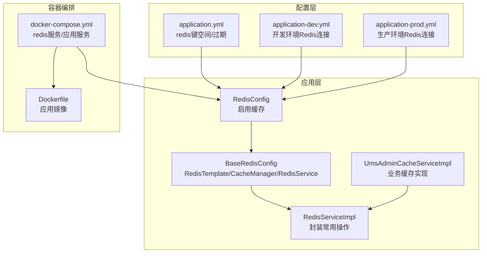
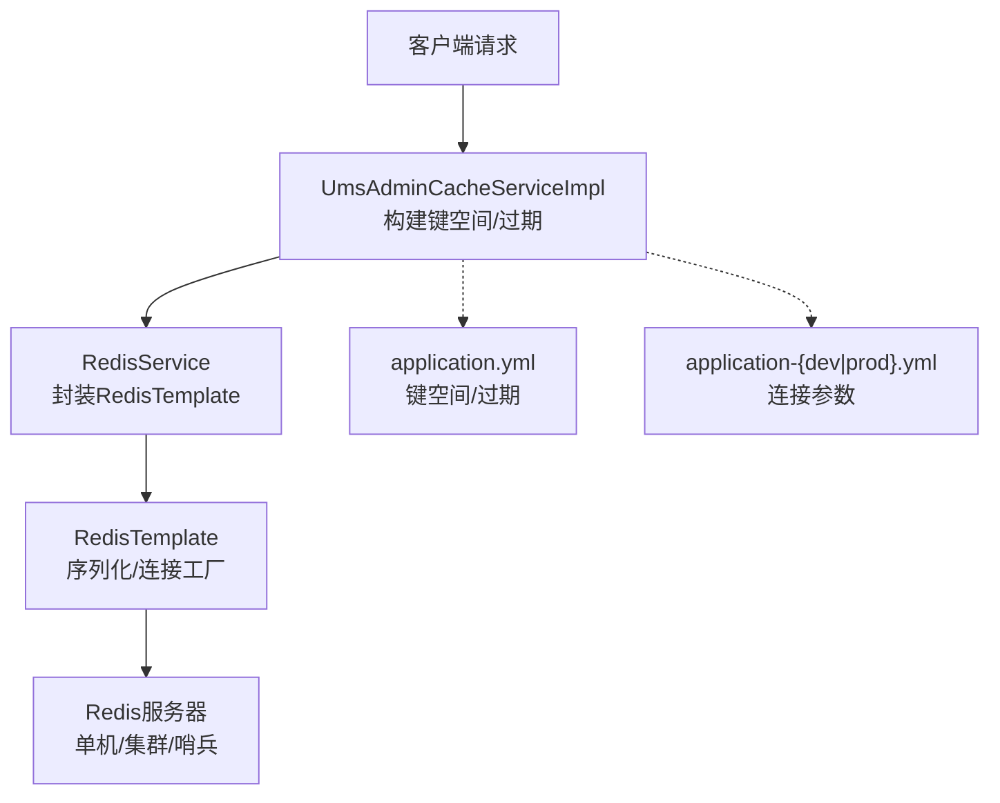
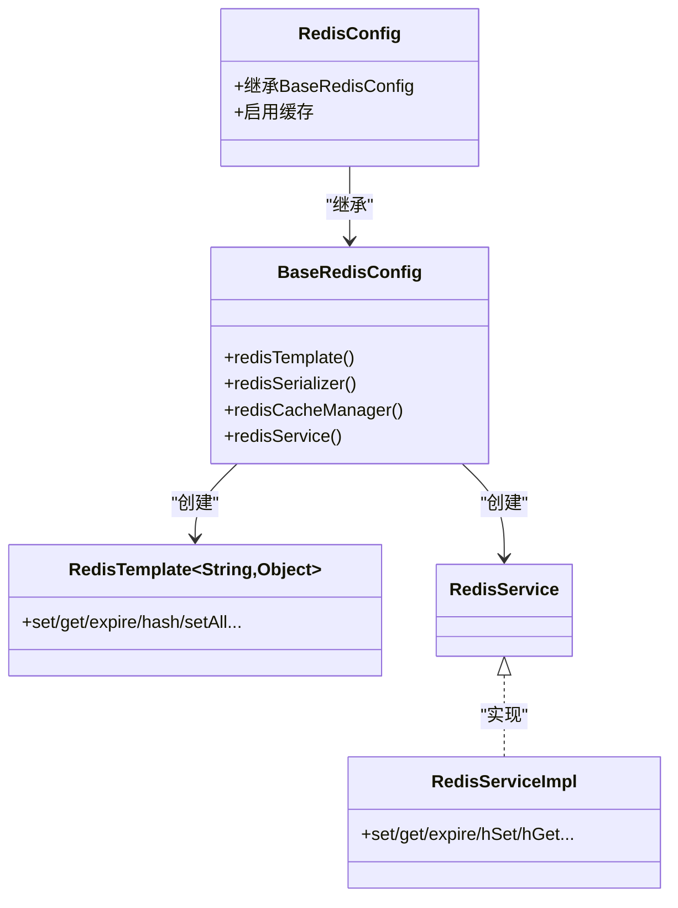
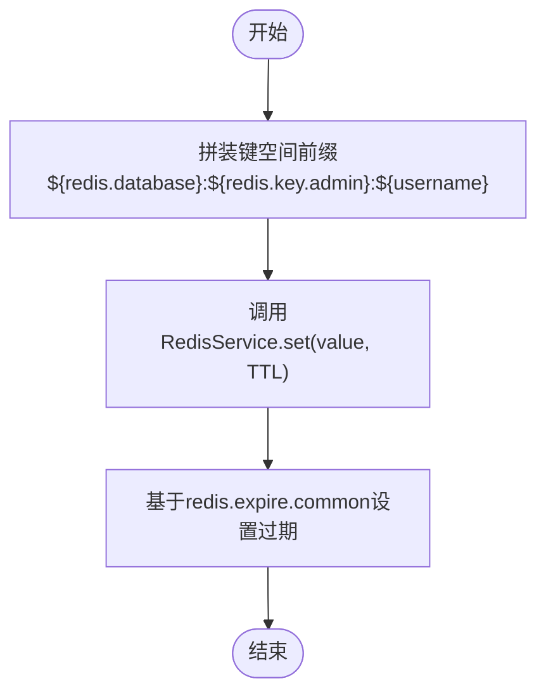
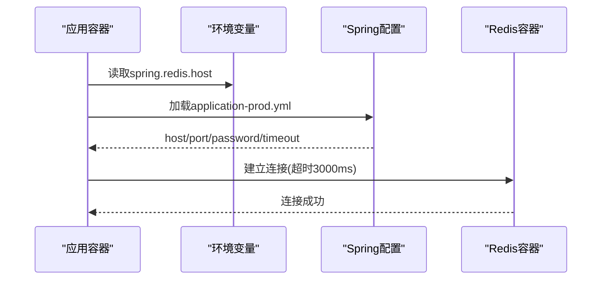
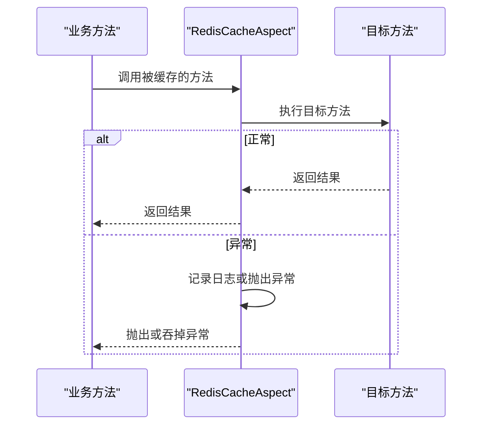
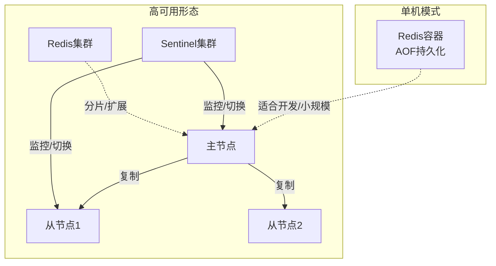
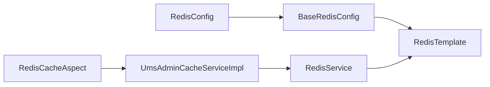

# Redis缓存部署

<cite>
**本文引用的文件**
- [RedisConfig.java](file://src/main/java/com/macro/mall/tiny/config/RedisConfig.java)
- [BaseRedisConfig.java](file://src/main/java/com/macro/mall/tiny/common/config/BaseRedisConfig.java)
- [application.yml](file://src/main/resources/application.yml)
- [application-dev.yml](file://src/main/resources/application-dev.yml)
- [application-prod.yml](file://src/main/resources/application-prod.yml)
- [docker-compose.yml](file://docker-compose.yml)
- [Dockerfile](file://Dockerfile)
- [RedisCacheAspect.java](file://src/main/java/com/macro/mall/tiny/security/aspect/RedisCacheAspect.java)
- [CacheException.java](file://src/main/java/com/macro/mall/tiny/security/annotation/CacheException.java)
- [RedisServiceImpl.java](file://src/main/java/com/macro/mall/tiny/common/service/impl/RedisServiceImpl.java)
- [UmsAdminCacheService.java](file://src/main/java/com/macro/mall/tiny/modules/ums/service/UmsAdminCacheService.java)
- [UmsAdminCacheServiceImpl.java](file://src/main/java/com/macro/mall/tiny/modules/ums/service/impl/UmsAdminCacheServiceImpl.java)
</cite>

## 目录
1. [简介](#简介)
2. [项目结构](#项目结构)
3. [核心组件](#核心组件)
4. [架构总览](#架构总览)
5. [详细组件分析](#详细组件分析)
6. [依赖关系分析](#依赖关系分析)
7. [性能与运维建议](#性能与运维建议)
8. [故障排查指南](#故障排查指南)
9. [结论](#结论)
10. [附录](#附录)

## 简介
本文件面向Redis缓存服务在Mall-Tiny项目中的部署与使用，覆盖安装与版本要求、单机/集群/哨兵部署形态、配置参数说明（内存、持久化、网络、安全）、连接配置（连接池、超时、认证）、在项目中的具体配置（BaseRedisConfig与RedisConfig）、缓存策略（键空间过期、内存淘汰、更新机制）、监控与运维建议以及高可用部署方案（主从、哨兵、集群）。

## 项目结构
Mall-Tiny通过Spring Boot集成Redis，核心配置位于配置类与YAML文件中，并通过Docker Compose进行容器化部署。关键位置如下：
- 配置类：RedisConfig继承BaseRedisConfig，启用Spring Cache。
- 基础配置：BaseRedisConfig定义RedisTemplate、序列化器、RedisCacheManager与RedisService Bean。
- 应用配置：application.yml集中定义redis键空间、过期时间；application-dev.yml与application-prod.yml分别定义开发与生产环境的Redis连接参数。
- 容器编排：docker-compose.yml定义redis与应用服务，应用通过环境变量指向redis主机名。

**图表来源**
- [RedisConfig.java:11-15](file://src/main/java/com/macro/mall/tiny/config/RedisConfig.java#L11-L15)
- [BaseRedisConfig.java:28-66](file://src/main/java/com/macro/mall/tiny/common/config/BaseRedisConfig.java#L28-L66)
- [application.yml:30-37](file://src/main/resources/application.yml#L30-L37)
- [application-dev.yml:6-11](file://src/main/resources/application-dev.yml#L6-L11)
- [application-prod.yml:6-11](file://src/main/resources/application-prod.yml#L6-L11)
- [docker-compose.yml:3-10](file://docker-compose.yml#L3-L10)
- [Dockerfile:1-10](file://Dockerfile#L1-L10)

**章节来源**
- [RedisConfig.java:11-15](file://src/main/java/com/macro/mall/tiny/config/RedisConfig.java#L11-L15)
- [BaseRedisConfig.java:28-66](file://src/main/java/com/macro/mall/tiny/common/config/BaseRedisConfig.java#L28-L66)
- [application.yml:30-37](file://src/main/resources/application.yml#L30-L37)
- [application-dev.yml:6-11](file://src/main/resources/application-dev.yml#L6-L11)
- [application-prod.yml:6-11](file://src/main/resources/application-prod.yml#L6-L11)
- [docker-compose.yml:3-10](file://docker-compose.yml#L3-L10)
- [Dockerfile:1-10](file://Dockerfile#L1-L10)

## 核心组件
- RedisConfig：启用Spring缓存并继承BaseRedisConfig，作为应用级Redis配置入口。
- BaseRedisConfig：定义RedisTemplate（字符串键/JSON值序列化）、RedisCacheManager（默认TTL 1天）、RedisService Bean。
- RedisServiceImpl：对RedisTemplate进行封装，提供通用KV、Hash、Set、List等操作及过期控制。
- UmsAdminCacheServiceImpl：基于配置的键空间与过期时间，实现管理员与资源列表的缓存读写与失效。
- 配置文件：application.yml定义键空间前缀与通用过期时间；application-dev.yml与application-prod.yml定义host/port/password/timeout等连接参数。

**章节来源**
- [RedisConfig.java:11-15](file://src/main/java/com/macro/mall/tiny/config/RedisConfig.java#L11-L15)
- [BaseRedisConfig.java:28-66](file://src/main/java/com/macro/mall/tiny/common/config/BaseRedisConfig.java#L28-L66)
- [RedisServiceImpl.java:20-196](file://src/main/java/com/macro/mall/tiny/common/service/impl/RedisServiceImpl.java#L20-L196)
- [UmsAdminCacheServiceImpl.java:92-114](file://src/main/java/com/macro/mall/tiny/modules/ums/service/impl/UmsAdminCacheServiceImpl.java#L92-L114)
- [application.yml:30-37](file://src/main/resources/application.yml#L30-L37)
- [application-dev.yml:6-11](file://src/main/resources/application-dev.yml#L6-L11)
- [application-prod.yml:6-11](file://src/main/resources/application-prod.yml#L6-L11)

## 架构总览
Mall-Tiny通过Spring Cache与RedisTemplate实现统一缓存抽象，业务层通过UmsAdminCacheServiceImpl读写缓存，配置层通过application.yml与profile配置决定键空间与连接参数。容器编排通过docker-compose将Redis与应用服务联动。

**图表来源**
- [UmsAdminCacheServiceImpl.java:92-114](file://src/main/java/com/macro/mall/tiny/modules/ums/service/impl/UmsAdminCacheServiceImpl.java#L92-L114)
- [RedisServiceImpl.java:20-196](file://src/main/java/com/macro/mall/tiny/common/service/impl/RedisServiceImpl.java#L20-L196)
- [BaseRedisConfig.java:28-60](file://src/main/java/com/macro/mall/tiny/common/config/BaseRedisConfig.java#L28-L60)
- [application.yml:30-37](file://src/main/resources/application.yml#L30-L37)
- [application-dev.yml:6-11](file://src/main/resources/application-dev.yml#L6-L11)
- [application-prod.yml:6-11](file://src/main/resources/application-prod.yml#L6-L11)

## 详细组件分析

### Redis配置类与序列化
- RedisConfig继承BaseRedisConfig并启用@EnableCaching，使Spring Cache生效。
- BaseRedisConfig定义：
  - RedisTemplate：键使用String序列化，值使用Jackson JSON序列化，支持复杂对象类型。
  - RedisCacheManager：默认TTL为1天，使用非阻塞写入。
  - RedisService Bean：提供统一的Redis操作接口实现。

**图表来源**
- [RedisConfig.java:11-15](file://src/main/java/com/macro/mall/tiny/config/RedisConfig.java#L11-L15)
- [BaseRedisConfig.java:28-66](file://src/main/java/com/macro/mall/tiny/common/config/BaseRedisConfig.java#L28-L66)
- [RedisServiceImpl.java:16-197](file://src/main/java/com/macro/mall/tiny/common/service/impl/RedisServiceImpl.java#L16-L197)

**章节来源**
- [RedisConfig.java:11-15](file://src/main/java/com/macro/mall/tiny/config/RedisConfig.java#L11-L15)
- [BaseRedisConfig.java:28-66](file://src/main/java/com/macro/mall/tiny/common/config/BaseRedisConfig.java#L28-L66)
- [RedisServiceImpl.java:20-196](file://src/main/java/com/macro/mall/tiny/common/service/impl/RedisServiceImpl.java#L20-L196)

### 缓存键空间与过期策略
- 键空间前缀与通用过期时间在application.yml中定义：
  - redis.key.admin 与 redis.key.resourceList 定义业务键前缀。
  - redis.expire.common 定义通用过期秒数（例如24小时）。
- UmsAdminCacheServiceImpl根据配置拼装最终键并设置过期时间，确保缓存生命周期可控。

**图表来源**
- [application.yml:30-37](file://src/main/resources/application.yml#L30-L37)
- [UmsAdminCacheServiceImpl.java:92-114](file://src/main/java/com/macro/mall/tiny/modules/ums/service/impl/UmsAdminCacheServiceImpl.java#L92-L114)

**章节来源**
- [application.yml:30-37](file://src/main/resources/application.yml#L30-L37)
- [UmsAdminCacheServiceImpl.java:92-114](file://src/main/java/com/macro/mall/tiny/modules/ums/service/impl/UmsAdminCacheServiceImpl.java#L92-L114)

### 连接配置与环境差异
- 开发环境（application-dev.yml）：
  - host: localhost
  - database: 0
  - port: 6379
  - password: 空
  - timeout: 3000ms
- 生产环境（application-prod.yml）：
  - host: redis（容器别名）
  - database: 0
  - port: 6379
  - password: 空
  - timeout: 3000ms
- 应用通过spring.profiles.active=prod加载生产配置，并通过环境变量spring.redis.host指向redis服务。

**图表来源**
- [docker-compose.yml:20-23](file://docker-compose.yml#L20-L23)
- [application-prod.yml:6-11](file://src/main/resources/application-prod.yml#L6-L11)
- [application-dev.yml:6-11](file://src/main/resources/application-dev.yml#L6-L11)

**章节来源**
- [docker-compose.yml:20-23](file://docker-compose.yml#L20-L23)
- [application-prod.yml:6-11](file://src/main/resources/application-prod.yml#L6-L11)
- [application-dev.yml:6-11](file://src/main/resources/application-dev.yml#L6-L11)

### 缓存切面与容错
- RedisCacheAspect对匹配的缓存方法进行环绕增强，捕获异常并按需抛出或记录日志，避免Redis故障影响主业务流程。
- CacheException注解用于标记需要抛出异常的方法，便于上层感知缓存失败。

**图表来源**
- [RedisCacheAspect.java:31-48](file://src/main/java/com/macro/mall/tiny/security/aspect/RedisCacheAspect.java#L31-L48)
- [CacheException.java:8-12](file://src/main/java/com/macro/mall/tiny/security/annotation/CacheException.java#L8-L12)

**章节来源**
- [RedisCacheAspect.java:31-48](file://src/main/java/com/macro/mall/tiny/security/aspect/RedisCacheAspect.java#L31-L48)
- [CacheException.java:8-12](file://src/main/java/com/macro/mall/tiny/security/annotation/CacheException.java#L8-L12)

### 容器化部署与高可用形态
- 单机部署：docker-compose使用redis:5镜像，开启AOF持久化，挂载数据卷，映射端口。
- 高可用形态（概念性说明）：
  - 主从复制：一主多从，读扩展，配合Sentinel实现故障转移。
  - Sentinel哨兵：监控主从健康，自动切换，提供高可用访问端点。
  - 集群模式：分片存储，水平扩展，适用于大规模数据与高并发场景。

**图表来源**
- [docker-compose.yml:3-10](file://docker-compose.yml#L3-L10)

**章节来源**
- [docker-compose.yml:3-10](file://docker-compose.yml#L3-L10)

## 依赖关系分析
- 组件耦合：
  - RedisConfig依赖BaseRedisConfig。
  - RedisServiceImpl依赖RedisTemplate。
  - UmsAdminCacheServiceImpl依赖RedisService与配置项。
  - RedisCacheAspect作用于缓存相关方法，提供容错能力。
- 外部依赖：
  - Spring Data Redis、Jackson序列化。
  - Docker Compose用于容器编排。

**图表来源**
- [RedisConfig.java:11-15](file://src/main/java/com/macro/mall/tiny/config/RedisConfig.java#L11-L15)
- [BaseRedisConfig.java:28-60](file://src/main/java/com/macro/mall/tiny/common/config/BaseRedisConfig.java#L28-L60)
- [RedisServiceImpl.java:16-197](file://src/main/java/com/macro/mall/tiny/common/service/impl/RedisServiceImpl.java#L16-L197)
- [UmsAdminCacheServiceImpl.java:24-34](file://src/main/java/com/macro/mall/tiny/modules/ums/service/impl/UmsAdminCacheServiceImpl.java#L24-L34)
- [RedisCacheAspect.java:27-48](file://src/main/java/com/macro/mall/tiny/security/aspect/RedisCacheAspect.java#L27-L48)

**章节来源**
- [RedisConfig.java:11-15](file://src/main/java/com/macro/mall/tiny/config/RedisConfig.java#L11-L15)
- [BaseRedisConfig.java:28-60](file://src/main/java/com/macro/mall/tiny/common/config/BaseRedisConfig.java#L28-L60)
- [RedisServiceImpl.java:16-197](file://src/main/java/com/macro/mall/tiny/common/service/impl/RedisServiceImpl.java#L16-L197)
- [UmsAdminCacheServiceImpl.java:24-34](file://src/main/java/com/macro/mall/tiny/modules/ums/service/impl/UmsAdminCacheServiceImpl.java#L24-L34)
- [RedisCacheAspect.java:27-48](file://src/main/java/com/macro/mall/tiny/security/aspect/RedisCacheAspect.java#L27-L48)

## 性能与运维建议
- 内存与持久化
  - 单机模式建议开启AOF持久化（docker-compose已启用），结合RDB可满足不同恢复需求。
  - 根据业务峰值合理设置maxmemory与淘汰策略，避免内存压力导致性能抖动。
- 网络与安全
  - 在生产环境启用密码认证与防火墙限制，仅开放必要端口。
  - 使用Sentinel或Cluster提升可用性，避免单点故障。
- 连接与超时
  - 合理设置连接超时与命令超时，避免长尾请求拖垮线程池。
  - 使用连接池复用连接，降低握手开销。
- 监控指标
  - 关注命中率、内存使用、连接数、慢查询、过期键比例等指标。
  - 结合Prometheus/Grafana或云监控平台建立告警。
- 缓存策略
  - 对热点数据设置合理TTL，采用“写后过期”或“惰性过期”策略。
  - 对频繁变更的数据采用“写穿/写回”策略，减少脏读。

[本节为通用建议，不直接分析具体文件]

## 故障排查指南
- 连接失败
  - 检查spring.redis.host是否正确解析（容器内使用服务名）。
  - 校验端口映射与防火墙策略。
- 认证失败
  - 确认未启用密码或配置了正确的密码。
- 缓存不可用
  - 查看RedisCacheAspect日志，确认异常是否被吞掉或抛出。
  - 检查Redis服务状态与磁盘空间。
- 数据不一致
  - 核对键空间前缀与过期时间配置，确保业务侧与配置一致。

**章节来源**
- [RedisCacheAspect.java:31-48](file://src/main/java/com/macro/mall/tiny/security/aspect/RedisCacheAspect.java#L31-L48)
- [application.yml:30-37](file://src/main/resources/application.yml#L30-L37)

## 结论
Mall-Tiny通过简洁的配置与封装实现了稳定的Redis缓存能力：统一的序列化、可配置的TTL、完善的业务键空间与过期策略，以及容器化的单机部署。若业务增长，可平滑迁移到Sentinel或Cluster形态，进一步提升可用性与扩展性。

[本节为总结性内容，不直接分析具体文件]

## 附录

### Redis安装与版本要求
- 推荐版本：Redis 5.x 或更高版本，具备稳定AOF与RDB能力。
- 单机模式：适合开发与小规模生产，docker-compose已演示。
- 集群模式：适合大规模数据与高并发，需分片与槽位规划。
- 哨兵模式：提供高可用与自动故障转移，适合生产关键链路。

[本节为通用说明，不直接分析具体文件]

### 配置参数速览（来自项目配置）
- 键空间与过期
  - redis.database：数据库标识（用于拼接键空间）
  - redis.key.admin：管理员缓存键前缀
  - redis.key.resourceList：资源列表缓存键前缀
  - redis.expire.common：通用过期秒数（如24小时）
- 连接参数（开发/生产）
  - spring.redis.host：Redis主机
  - spring.redis.port：Redis端口
  - spring.redis.password：Redis密码
  - spring.redis.timeout：连接超时

**章节来源**
- [application.yml:30-37](file://src/main/resources/application.yml#L30-L37)
- [application-dev.yml:6-11](file://src/main/resources/application-dev.yml#L6-L11)
- [application-prod.yml:6-11](file://src/main/resources/application-prod.yml#L6-L11)