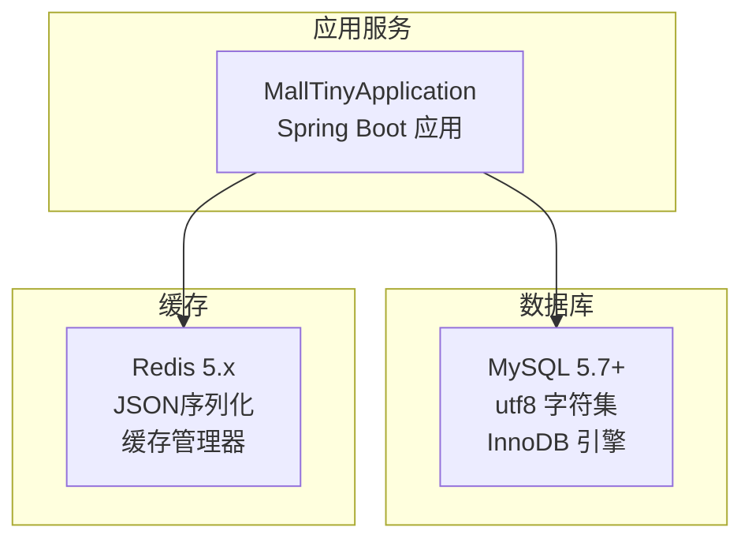
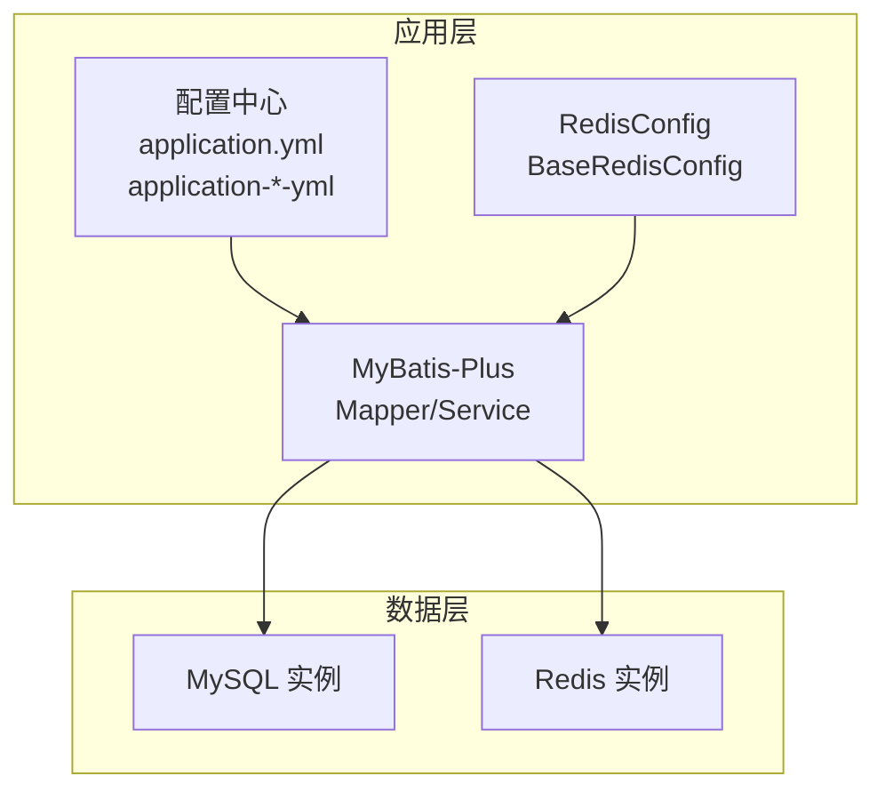
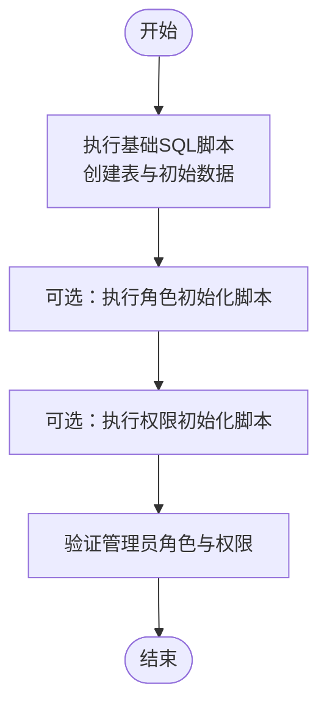
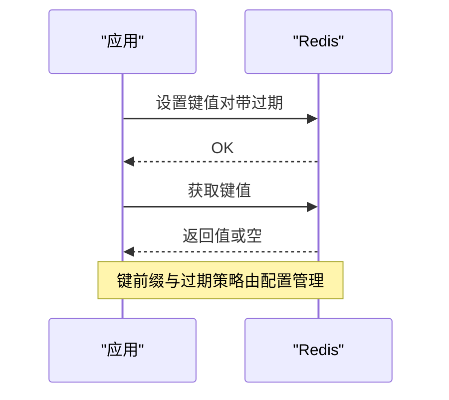
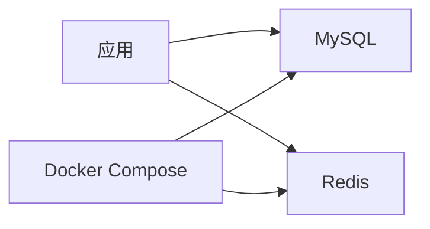

# 数据库与缓存部署

<cite>
**本文引用的文件**
- [README.md](file://README.md)
- [docker-compose.yml](file://docker-compose.yml)
- [application.yml](file://src/main/resources/application.yml)
- [application-dev.yml](file://src/main/resources/application-dev.yml)
- [application-prod.yml](file://src/main/resources/application-prod.yml)
- [RedisConfig.java](file://src/main/java/com/macro/mall/tiny/config/RedisConfig.java)
- [BaseRedisConfig.java](file://src/main/java/com/macro/mall/tiny/common/config/BaseRedisConfig.java)
- [mall_tiny.sql](file://sql/mall_tiny.sql)
- [init_role.sql](file://sql/init_role.sql)
- [init_import_permission.sql](file://sql/init_import_permission.sql)
- [ensure_admin_role.sql](file://sql/ensure_admin_role.sql)
</cite>

## 目录
1. [简介](#简介)
2. [项目结构](#项目结构)
3. [核心组件](#核心组件)
4. [架构总览](#架构总览)
5. [详细组件分析](#详细组件分析)
6. [依赖关系分析](#依赖关系分析)
7. [性能考虑](#性能考虑)
8. [故障排查指南](#故障排查指南)
9. [结论](#结论)
10. [附录](#附录)

## 简介
本文件面向Mall-Tiny项目的数据库与缓存服务部署，围绕以下目标展开：
- MySQL数据库部署要求与初始化流程（版本、字符集、存储引擎、权限等）
- Redis缓存服务部署与配置（单机、集群、哨兵模式选择与要点）
- 主从复制配置方法（主库、从库、同步机制）
- 备份与恢复策略（全量、增量、恢复测试）
- 性能优化（连接池、索引、查询优化）
- 缓存策略与失效机制

## 项目结构
Mall-Tiny采用Spring Boot + MyBatis-Plus + Redis的轻量架构，数据库与缓存通过配置文件与Compose进行统一管理。

图表来源
- [application-dev.yml:1-16](file://src/main/resources/application-dev.yml#L1-L16)
- [application-prod.yml:1-18](file://src/main/resources/application-prod.yml#L1-L18)
- [docker-compose.yml:1-26](file://docker-compose.yml#L1-L26)

章节来源
- [README.md:55-57](file://README.md#L55-L57)
- [application-dev.yml:1-16](file://src/main/resources/application-dev.yml#L1-L16)
- [application-prod.yml:1-18](file://src/main/resources/application-prod.yml#L1-L18)
- [docker-compose.yml:1-26](file://docker-compose.yml#L1-L26)

## 核心组件
- 数据库连接与配置
  - 开发环境：本地MySQL，字符集与时区配置见配置文件
  - 生产环境：通过Compose链接到外部MySQL实例
- 缓存配置
  - JSON序列化、键前缀、过期策略、缓存管理器
- 初始化脚本
  - 基础表结构与初始数据
  - 角色与权限初始化脚本

章节来源
- [application-dev.yml:1-16](file://src/main/resources/application-dev.yml#L1-L16)
- [application-prod.yml:1-18](file://src/main/resources/application-prod.yml#L1-L18)
- [BaseRedisConfig.java:26-68](file://src/main/java/com/macro/mall/tiny/common/config/BaseRedisConfig.java#L26-L68)
- [mall_tiny.sql:18-362](file://sql/mall_tiny.sql#L18-L362)
- [init_role.sql:1-31](file://sql/init_role.sql#L1-L31)
- [init_import_permission.sql:1-34](file://sql/init_import_permission.sql#L1-L34)
- [ensure_admin_role.sql:1-21](file://sql/ensure_admin_role.sql#L1-L21)

## 架构总览
应用通过Spring Boot连接MySQL与Redis，使用MyBatis-Plus进行数据访问，Redis用于权限与用户信息缓存。

图表来源
- [application.yml:1-57](file://src/main/resources/application.yml#L1-L57)
- [RedisConfig.java:1-16](file://src/main/java/com/macro/mall/tiny/config/RedisConfig.java#L1-L16)
- [BaseRedisConfig.java:1-69](file://src/main/java/com/macro/mall/tiny/common/config/BaseRedisConfig.java#L1-L69)

## 详细组件分析

### MySQL数据库部署与初始化
- 版本与字符集
  - 项目使用MySQL 5.7+，字符集为utf8，时区为Asia/Shanghai
  - 建议在生产环境使用MySQL 8.x以获得更好的性能与安全特性
- 存储引擎
  - 脚本中表均使用InnoDB引擎，具备事务与外键能力
- 初始化流程
  - 执行基础脚本创建表结构与初始数据
  - 可选执行角色与权限初始化脚本，确保管理员角色与导入权限存在
- 权限配置
  - 应用通过配置文件指定数据库用户名与密码
  - 建议为应用创建专用数据库用户并限制权限范围

图表来源
- [mall_tiny.sql:18-362](file://sql/mall_tiny.sql#L18-L362)
- [init_role.sql:1-31](file://sql/init_role.sql#L1-L31)
- [init_import_permission.sql:1-34](file://sql/init_import_permission.sql#L1-L34)
- [ensure_admin_role.sql:1-21](file://sql/ensure_admin_role.sql#L1-L21)

章节来源
- [application-dev.yml:1-16](file://src/main/resources/application-dev.yml#L1-L16)
- [application-prod.yml:1-18](file://src/main/resources/application-prod.yml#L1-L18)
- [mall_tiny.sql:18-362](file://sql/mall_tiny.sql#L18-L362)
- [init_role.sql:1-31](file://sql/init_role.sql#L1-L31)
- [init_import_permission.sql:1-34](file://sql/init_import_permission.sql#L1-L34)
- [ensure_admin_role.sql:1-21](file://sql/ensure_admin_role.sql#L1-L21)

### Redis缓存服务部署与配置
- 单机模式
  - 使用官方Redis镜像，开启AOF持久化
  - 通过Compose挂载数据卷，暴露6379端口
- 集群模式与哨兵模式
  - 项目未提供集群/哨兵配置，建议在高可用场景下按需扩展
- 序列化与键空间
  - 使用JSON序列化，键前缀用于区分业务域（如ums:admin、ums:resourceList）
  - 缓存默认过期时间为24小时，全局缓存管理器默认1天
- 连接配置
  - 开发环境直连本地Redis，生产环境通过服务名连接

图表来源
- [application.yml:30-37](file://src/main/resources/application.yml#L30-L37)
- [BaseRedisConfig.java:28-60](file://src/main/java/com/macro/mall/tiny/common/config/BaseRedisConfig.java#L28-L60)
- [docker-compose.yml:3-10](file://docker-compose.yml#L3-L10)

章节来源
- [docker-compose.yml:3-10](file://docker-compose.yml#L3-L10)
- [application.yml:30-37](file://src/main/resources/application.yml#L30-L37)
- [BaseRedisConfig.java:26-68](file://src/main/java/com/macro/mall/tiny/common/config/BaseRedisConfig.java#L26-L68)

### 主从复制配置
- 主库配置要点
  - 开启二进制日志（binlog），设置server-id唯一标识
  - 配置字符集与存储引擎一致性
- 从库配置要点
  - 设置server-id与主库不同
  - 使用CHANGE MASTER TO配置主库地址、凭据与二进制日志位置
  - 启动复制线程并监控复制延迟
- 同步机制
  - 建议使用半同步复制降低数据丢失风险
  - 定期检查复制状态与延迟指标

[本节为通用实践说明，不直接分析具体文件，故无“章节来源”]

### 备份与恢复策略
- 全量备份
  - 使用mysqldump导出数据库结构与数据，结合压缩与归档
- 增量备份
  - 基于binlog的增量备份，定期归档binlog文件
- 恢复测试
  - 在隔离环境中还原备份，验证完整性与业务可用性
  - 验证Redis数据是否可重建（基于应用逻辑）

[本节为通用实践说明，不直接分析具体文件，故无“章节来源”]

### 缓存策略与失效机制
- 键空间设计
  - 使用业务域前缀（如ums:admin、ums:resourceList）隔离键空间
- 过期策略
  - 通用键默认24小时，全局缓存管理器默认1天
  - 针对热点数据可设置更短过期时间，降低陈旧数据影响
- 失效机制
  - 写操作后主动更新/删除相关缓存键
  - 定期清理过期键，保持内存健康

章节来源
- [application.yml:30-37](file://src/main/resources/application.yml#L30-L37)
- [BaseRedisConfig.java:54-60](file://src/main/java/com/macro/mall/tiny/common/config/BaseRedisConfig.java#L54-L60)

## 依赖关系分析
- 应用依赖
  - MySQL驱动与连接池（Druid）
  - MyBatis-Plus用于ORM与分页
  - Redis客户端与缓存管理器
- 部署依赖
  - Compose编排MySQL与Redis服务
  - 环境变量控制数据源与Redis主机

图表来源
- [docker-compose.yml:1-26](file://docker-compose.yml#L1-L26)
- [application-dev.yml:1-16](file://src/main/resources/application-dev.yml#L1-L16)
- [application-prod.yml:1-18](file://src/main/resources/application-prod.yml#L1-L18)

章节来源
- [docker-compose.yml:1-26](file://docker-compose.yml#L1-L26)
- [application-dev.yml:1-16](file://src/main/resources/application-dev.yml#L1-L16)
- [application-prod.yml:1-18](file://src/main/resources/application-prod.yml#L1-L18)

## 性能考虑
- 连接池
  - 使用Druid连接池，合理配置最大连接数、空闲连接与超时时间
- 索引优化
  - 为高频查询字段建立合适索引，避免全表扫描
  - 定期分析慢查询日志，识别并优化低效SQL
- 查询优化
  - 使用分页查询避免一次性加载大量数据
  - 减少N+1查询，优先使用批量查询或联表查询
- 缓存命中率
  - 提升热点数据缓存命中率，缩短数据库压力
  - 合理设置过期时间，平衡一致性与性能

[本节为通用实践说明，不直接分析具体文件，故无“章节来源”]

## 故障排查指南
- 数据库连接失败
  - 检查MySQL服务状态与网络连通性
  - 核对配置文件中的URL、用户名、密码与时区设置
- Redis连接失败
  - 检查Redis服务状态与端口映射
  - 确认应用配置中的host与port
- 缓存异常
  - 检查键前缀与序列化配置
  - 关注过期时间与内存占用情况
- 初始化失败
  - 确认基础脚本执行顺序与权限
  - 角色与权限脚本需在基础表存在后执行

章节来源
- [application-dev.yml:1-16](file://src/main/resources/application-dev.yml#L1-L16)
- [application-prod.yml:1-18](file://src/main/resources/application-prod.yml#L1-L18)
- [BaseRedisConfig.java:28-60](file://src/main/java/com/macro/mall/tiny/common/config/BaseRedisConfig.java#L28-L60)

## 结论
本文基于仓库中的配置与脚本，给出了Mall-Tiny数据库与缓存的部署与运维要点。生产环境建议：
- 使用MySQL 8.x并完善主从复制与备份策略
- 明确Redis单机/集群/哨兵部署方案与监控告警
- 建立规范的初始化流程与权限管理
- 持续优化索引与查询，提升整体性能

[本节为总结性内容，不直接分析具体文件，故无“章节来源”]

## 附录
- 快速部署要点
  - 安装MySQL与Redis后，先执行基础SQL脚本
  - 可选执行角色与权限初始化脚本
  - 通过Compose启动应用，确认端口映射与日志输出

章节来源
- [README.md:55-57](file://README.md#L55-L57)
- [docker-compose.yml:1-26](file://docker-compose.yml#L1-L26)