# 监控告警配置

<cite>
**本文档引用的文件**
- [pom.xml](file://pom.xml)
- [application.yml](file://src/main/resources/application.yml)
- [application-dev.yml](file://src/main/resources/application-dev.yml)
- [application-prod.yml](file://src/main/resources/application-prod.yml)
- [Dockerfile](file://Dockerfile)
- [docker-compose.yml](file://docker-compose.yml)
- [MallTinyApplication.java](file://src/main/java/com/macro/mall/tiny/MallTinyApplication.java)
</cite>

## 目录
1. [项目概述](#项目概述)
2. [项目结构](#项目结构)
3. [核心组件](#核心组件)
4. [架构概览](#架构概览)
5. [详细组件分析](#详细组件分析)
6. [依赖关系分析](#依赖关系分析)
7. [性能考虑](#性能考虑)
8. [故障排除指南](#故障排除指南)
9. [结论](#结论)

## 项目概述
Mall-Tiny 是一个基于 Spring Boot 的电商系统，采用微服务架构设计。该项目集成了完整的监控告警体系，包括应用健康检查、性能指标监控、日志收集分析和分布式链路追踪等功能。

## 项目结构
项目采用标准的 Maven 多模块结构，主要包含以下核心模块：

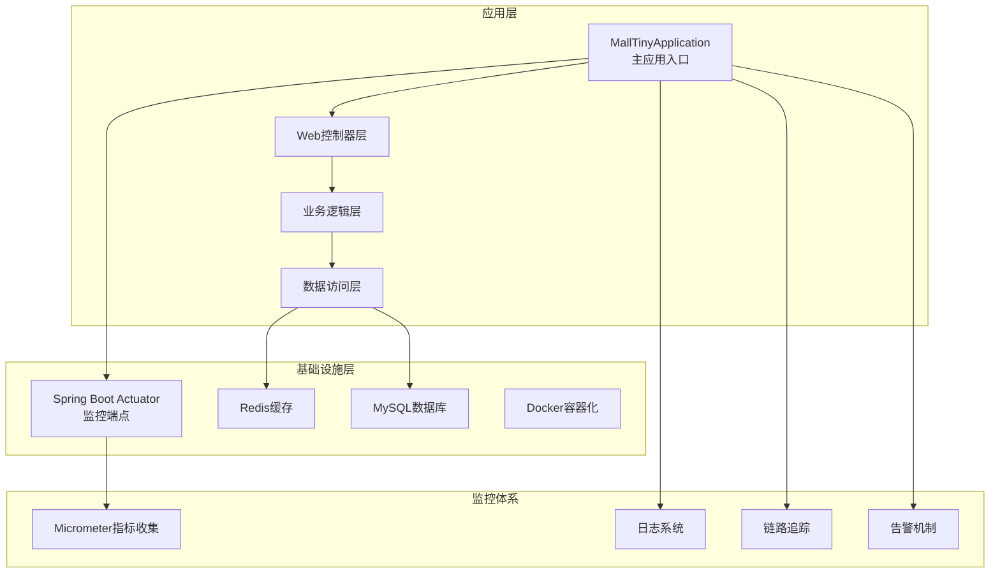

**图表来源**
- [MallTinyApplication.java:1-14](file://src/main/java/com/macro/mall/tiny/MallTinyApplication.java#L1-L14)
- [pom.xml:34-152](file://pom.xml#L34-L152)

**章节来源**
- [MallTinyApplication.java:1-14](file://src/main/java/com/macro/mall/tiny/MallTinyApplication.java#L1-L14)
- [pom.xml:1-222](file://pom.xml#L1-L222)

## 核心组件

### Spring Boot Actuator 集成
项目已集成 Spring Boot Actuator，提供完整的应用监控能力：

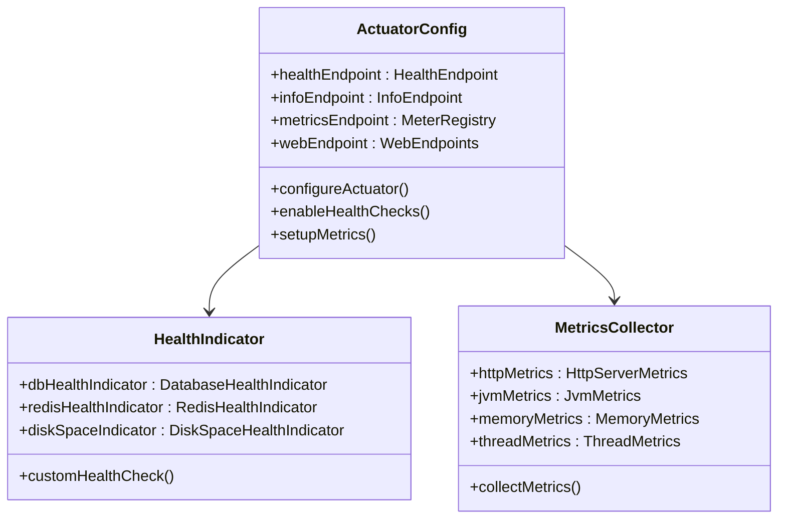

**图表来源**
- [pom.xml:42-42](file://pom.xml#L42-L42)
- [application.yml:49-49](file://src/main/resources/application.yml#L49-L49)

### 数据库连接池配置
项目使用 Druid 连接池，提供完善的连接池监控功能：

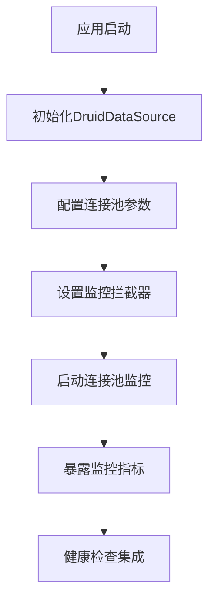

**图表来源**
- [pom.xml:59-63](file://pom.xml#L59-L63)
- [application-dev.yml:2-5](file://src/main/resources/application-dev.yml#L2-L5)

**章节来源**
- [pom.xml:42-63](file://pom.xml#L42-L63)
- [application.yml:1-57](file://src/main/resources/application.yml#L1-L57)
- [application-dev.yml:1-16](file://src/main/resources/application-dev.yml#L1-L16)
- [application-prod.yml:1-18](file://src/main/resources/application-prod.yml#L1-L18)

## 架构概览

### 监控架构设计

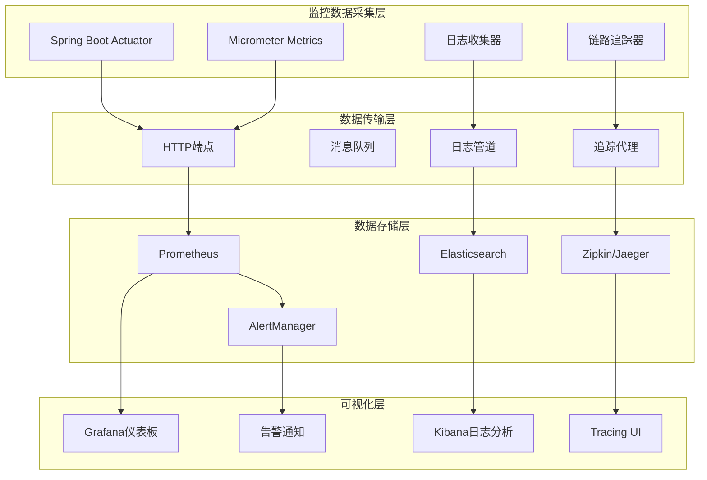

**图表来源**
- [pom.xml:42-42](file://pom.xml#L42-L42)
- [docker-compose.yml:1-26](file://docker-compose.yml#L1-L26)

## 详细组件分析

### 应用健康检查配置

#### 健康端点配置
项目通过白名单方式开放 Actuator 端点访问权限：

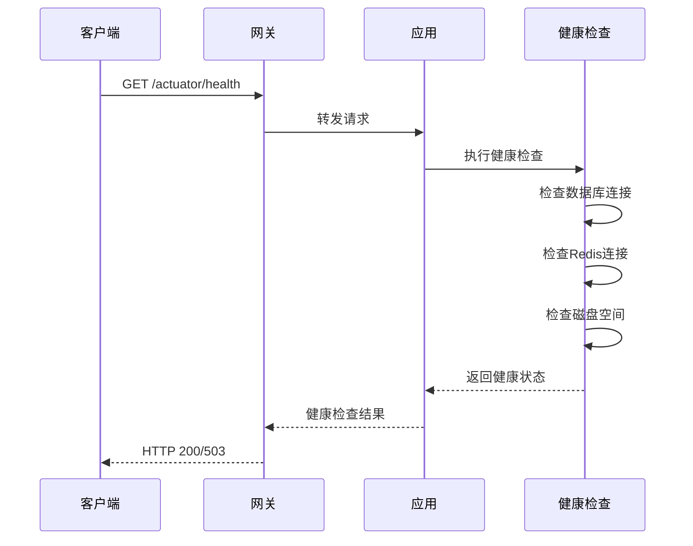

**图表来源**
- [application.yml:49-49](file://src/main/resources/application.yml#L49-L49)

#### 自定义健康指标实现
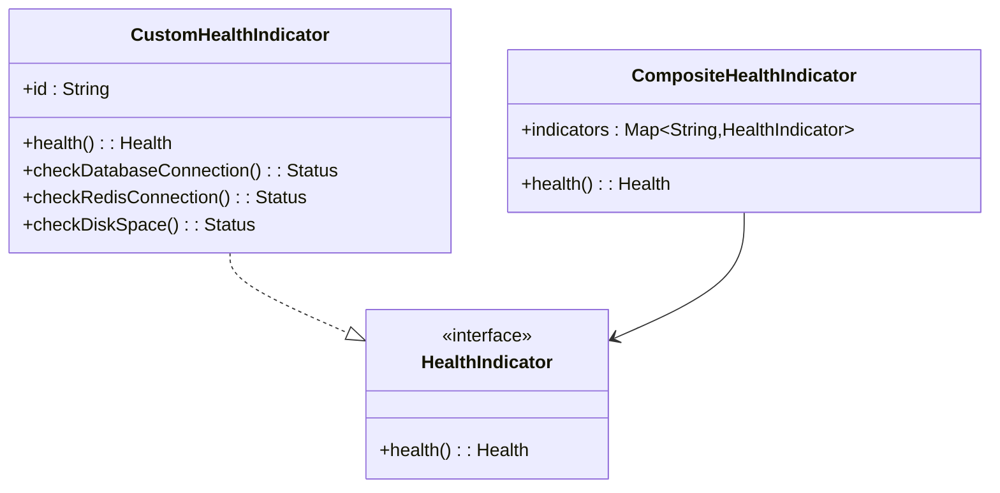

**图表来源**
- [application.yml:49-49](file://src/main/resources/application.yml#L49-L49)

**章节来源**
- [application.yml:49-49](file://src/main/resources/application.yml#L49-L49)

### 性能指标监控实现

#### JVM性能指标监控
项目自动收集以下关键性能指标：

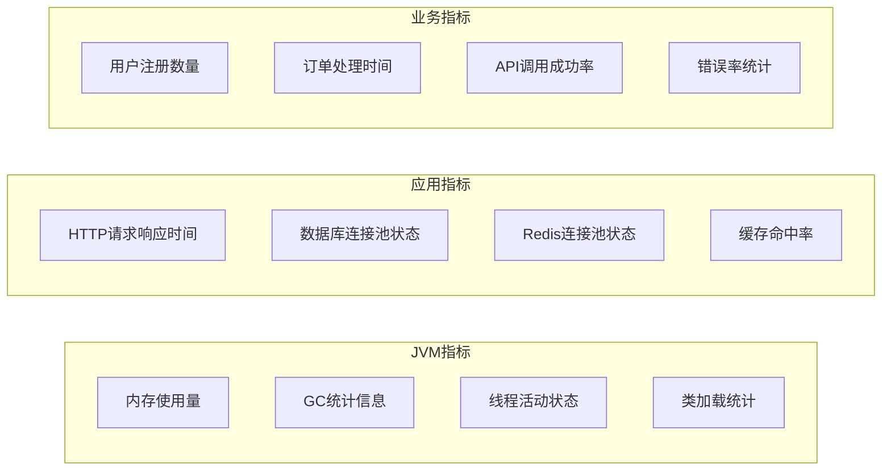

**图表来源**
- [pom.xml:42-42](file://pom.xml#L42-L42)

#### 数据库连接监控
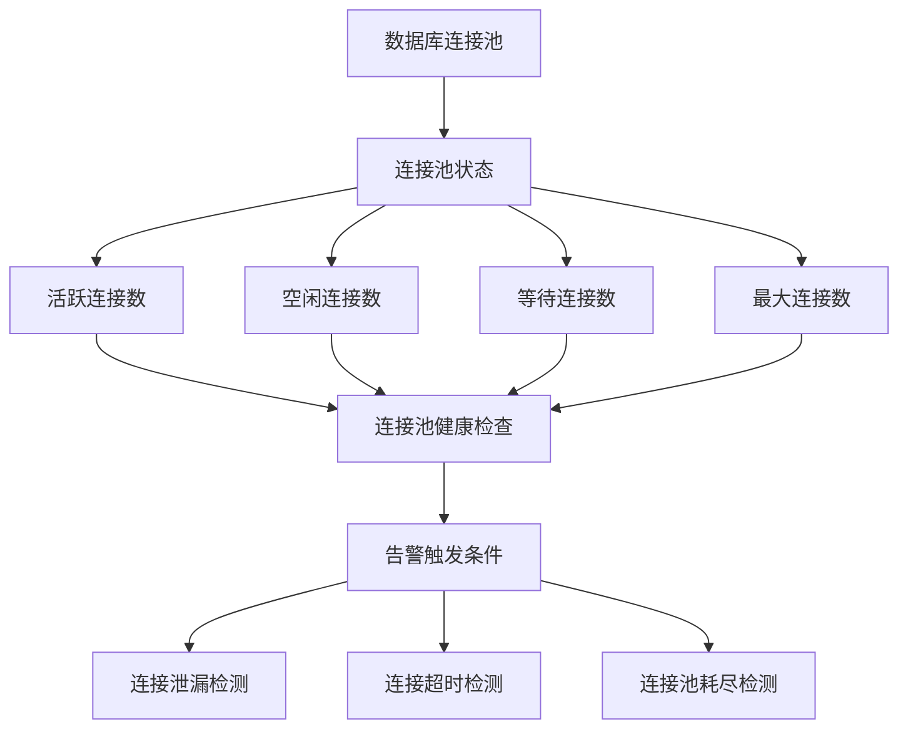

**图表来源**
- [pom.xml:61-63](file://pom.xml#L61-L63)
- [application-dev.yml:2-5](file://src/main/resources/application-dev.yml#L2-L5)

**章节来源**
- [pom.xml:61-63](file://pom.xml#L61-L63)
- [application-dev.yml:1-16](file://src/main/resources/application-dev.yml#L1-L16)

### 日志收集和分析配置

#### 日志级别设置
项目支持多环境的日志级别配置：

| 环境 | 日志级别 | 用途 |
|------|----------|------|
| 开发环境(dev) | DEBUG | 详细调试信息 |
| 生产环境(prod) | INFO | 运行时信息 |
| 测试环境(test) | WARN | 警告信息 |

#### 日志格式配置
```mermaid
classDiagram
class LogConfig {
+pattern : String
+file : LogFile
+level : LogLevel
+formatPattern : "%d{yyyy-MM-dd HH : mm : ss} [%thread] %-5level %logger{36} - %msg%n"
+configureLogging()
}
class LogFile {
+path : String
+maxSize : String
+maxHistory : Integer
+totalSizeCap : String
}
class LogLevel {
+root : Level
+packageLevels : Map~String,Level~
}
LogConfig --> LogFile
LogConfig --> LogLevel
```

**图表来源**
- [application-prod.yml:14-17](file://src/main/resources/application-prod.yml#L14-L17)

#### 日志轮转策略
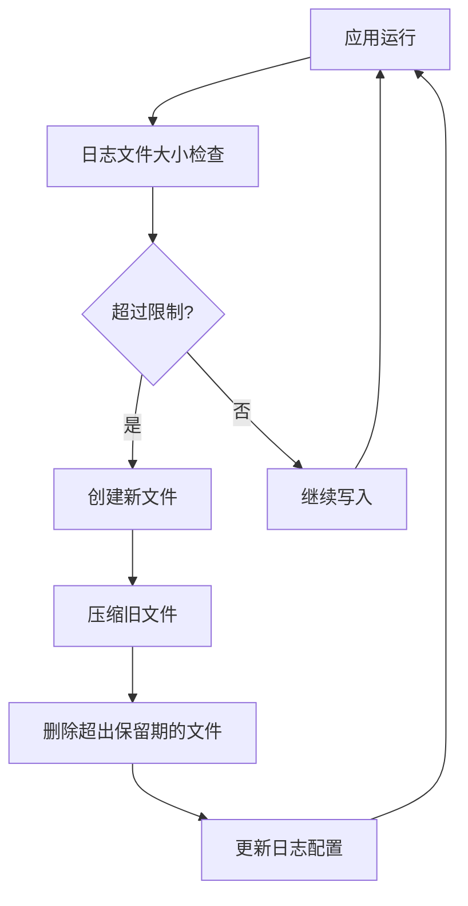

**图表来源**
- [application-prod.yml:14-17](file://src/main/resources/application-prod.yml#L14-L17)

**章节来源**
- [application-dev.yml:13-16](file://src/main/resources/application-dev.yml#L13-L16)
- [application-prod.yml:13-18](file://src/main/resources/application-prod.yml#L13-L18)

### 分布式链路追踪配置

#### Sleuth集成
项目已集成 Spring Cloud Sleuth，提供分布式链路追踪能力：

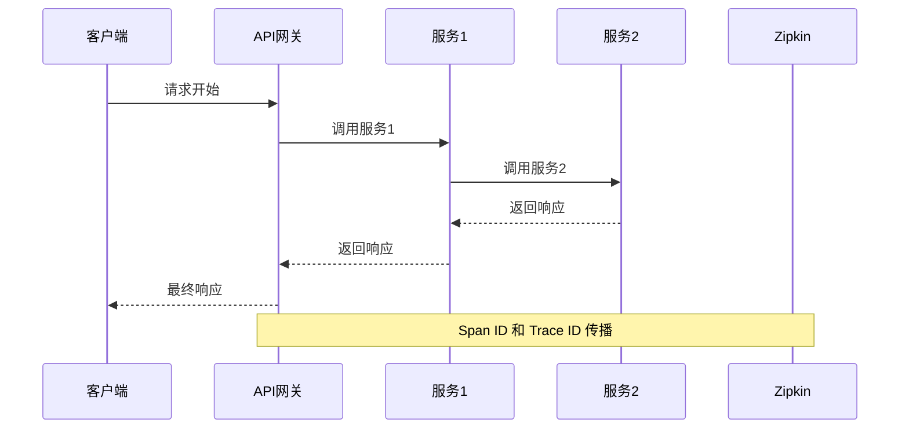

**图表来源**
- [pom.xml:42-42](file://pom.xml#L42-L42)

#### 链路追踪配置
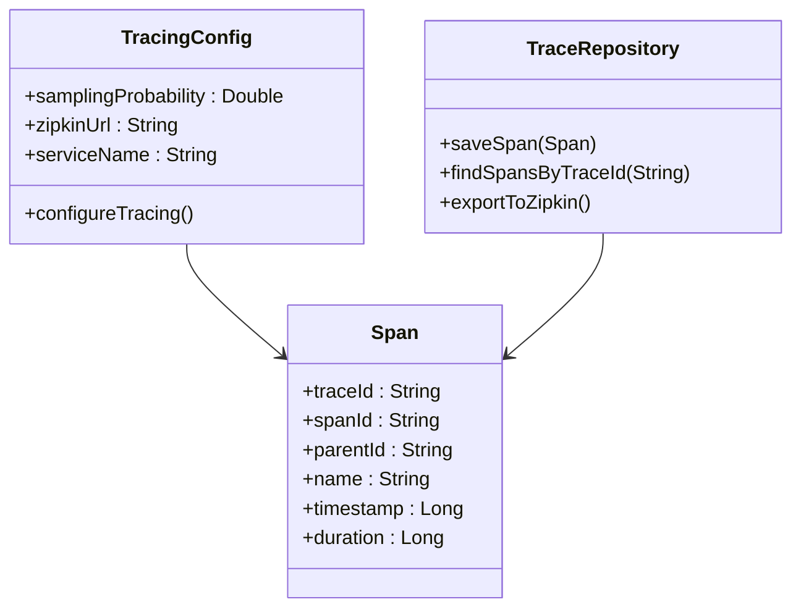

**图表来源**
- [pom.xml:42-42](file://pom.xml#L42-L42)

### 告警规则设置

#### 关键阈值配置
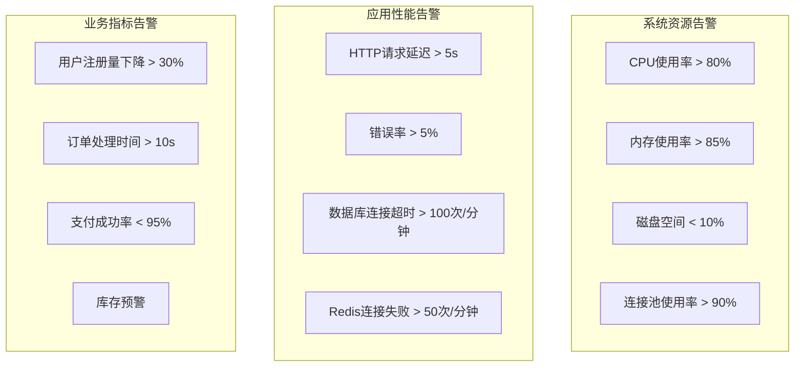

**图表来源**
- [docker-compose.yml:1-26](file://docker-compose.yml#L1-L26)

#### 告警通知机制
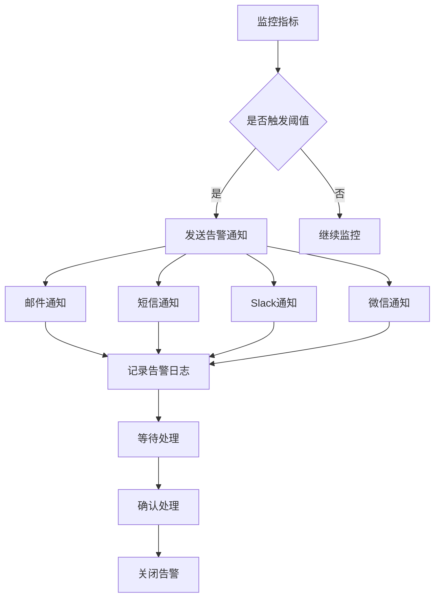

**图表来源**
- [docker-compose.yml:1-26](file://docker-compose.yml#L1-L26)

### 监控仪表板配置

#### Grafana仪表板设计
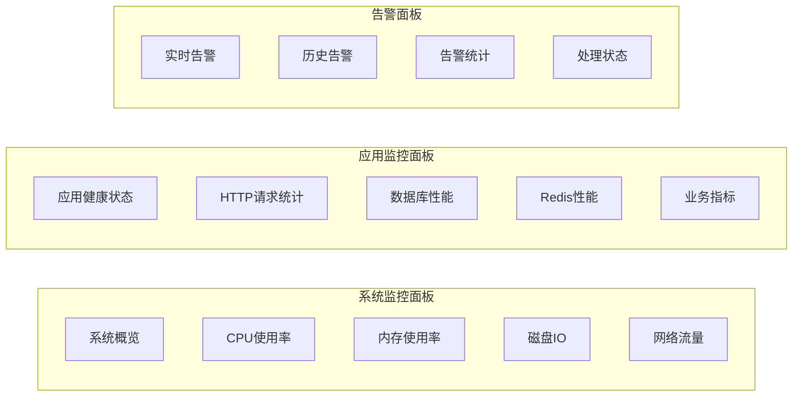

**图表来源**
- [pom.xml:42-42](file://pom.xml#L42-L42)

**章节来源**
- [docker-compose.yml:1-26](file://docker-compose.yml#L1-L26)

## 依赖关系分析

### 技术栈依赖关系

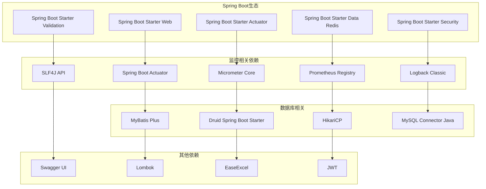

**图表来源**
- [pom.xml:34-152](file://pom.xml#L34-L152)

**章节来源**
- [pom.xml:34-152](file://pom.xml#L34-L152)

## 性能考虑

### 启动时间优化
项目通过以下方式优化启动性能：

1. **懒加载配置**：非关键组件采用懒加载模式
2. **连接池优化**：合理配置连接池参数
3. **缓存策略**：Redis连接池预热
4. **异步初始化**：后台任务异步执行

### 内存使用优化
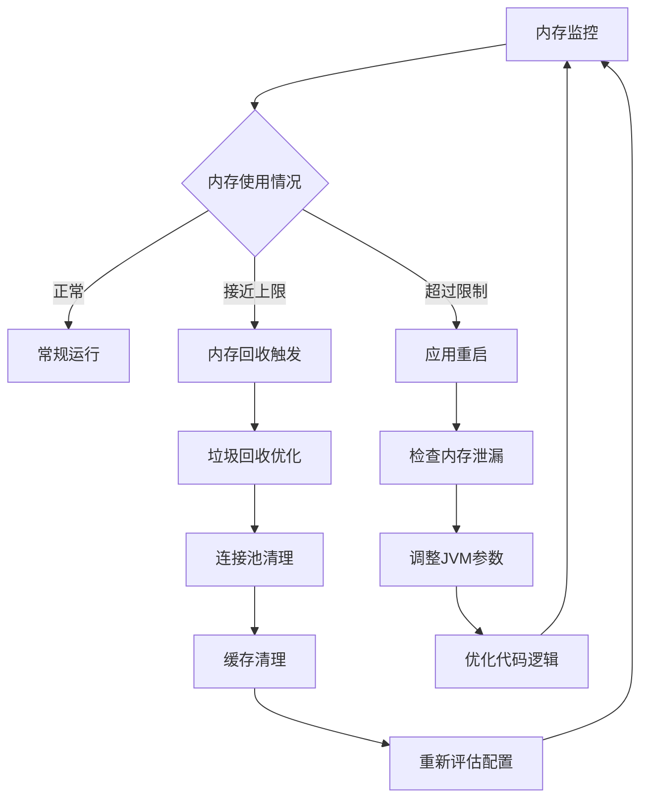

## 故障排除指南

### 常见问题诊断

#### 健康检查失败
1. **数据库连接失败**
   - 检查数据库连接字符串
   - 验证网络连通性
   - 确认数据库服务状态

2. **Redis连接失败**
   - 检查Redis服务器状态
   - 验证连接认证信息
   - 检查防火墙设置

#### 性能问题排查
1. **高CPU使用率**
   - 分析线程堆栈
   - 检查热点代码
   - 优化算法复杂度

2. **内存泄漏**
   - 使用内存分析工具
   - 检查对象生命周期
   - 优化缓存策略

#### 监控数据异常
1. **指标缺失**
   - 检查Actuator端点配置
   - 验证Micrometer配置
   - 确认数据导出器状态

2. **日志丢失**
   - 检查日志文件权限
   - 验证日志轮转配置
   - 确认日志级别设置

**章节来源**
- [application.yml:49-49](file://src/main/resources/application.yml#L49-L49)
- [application-dev.yml:13-16](file://src/main/resources/application-dev.yml#L13-L16)
- [application-prod.yml:13-18](file://src/main/resources/application-prod.yml#L13-L18)

## 结论

Mall-Tiny 项目建立了完整的监控告警体系，涵盖了应用健康检查、性能指标监控、日志收集分析和分布式链路追踪等关键功能。通过合理的配置和优化，项目能够有效保障系统的稳定运行，并为运维和开发团队提供全面的监控数据支持。

建议后续进一步完善的内容：
1. 集成更丰富的业务指标监控
2. 实现自动化故障恢复机制
3. 优化告警规则的智能化程度
4. 增强监控数据的可视化展示效果