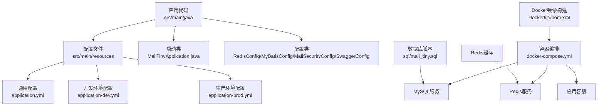
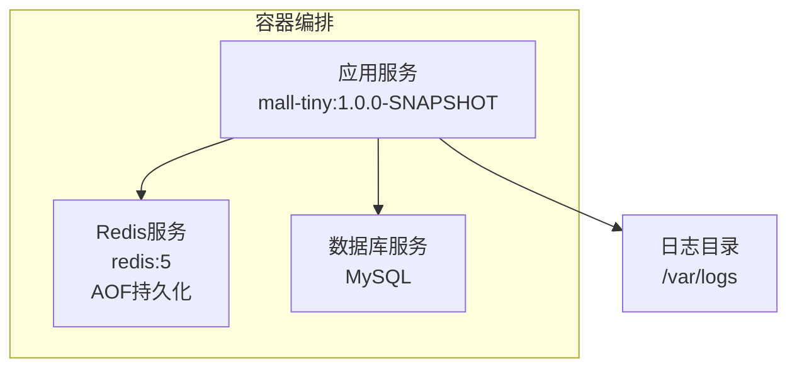
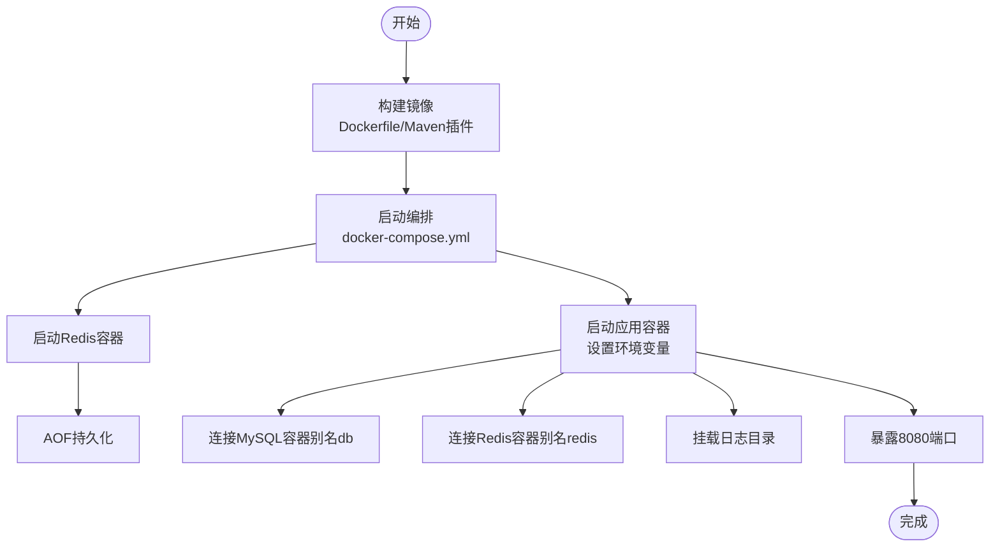
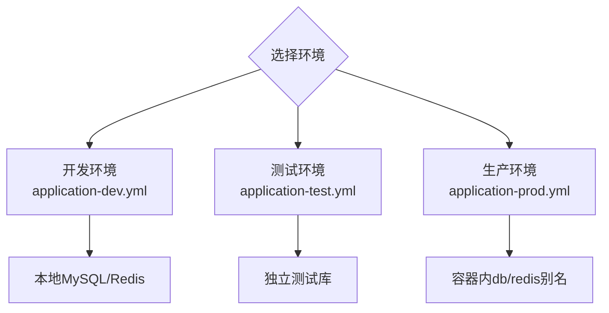
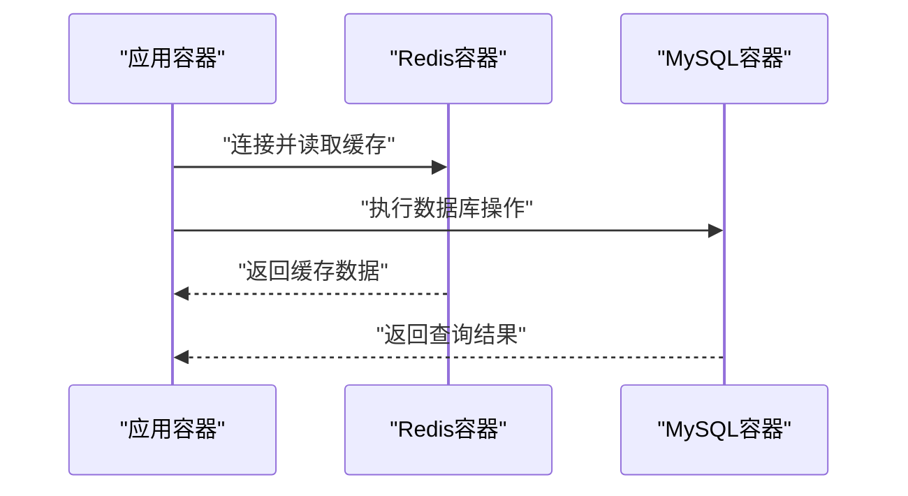
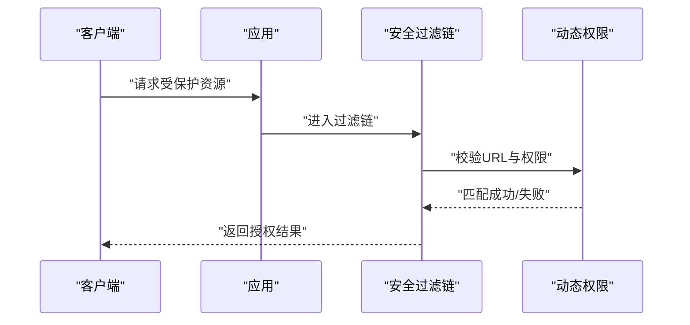
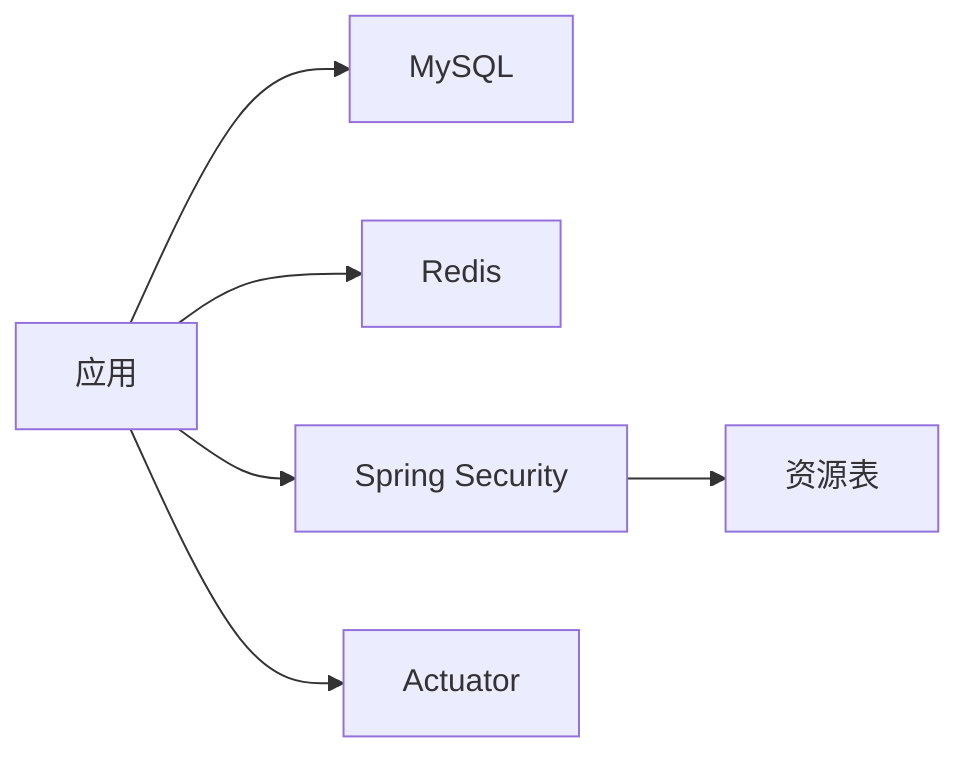

# 部署运维

<cite>
**本文引用的文件**
- [Dockerfile](file://Dockerfile)
- [docker-compose.yml](file://docker-compose.yml)
- [pom.xml](file://pom.xml)
- [application.yml](file://src/main/resources/application.yml)
- [application-dev.yml](file://src/main/resources/application-dev.yml)
- [application-prod.yml](file://src/main/resources/application-prod.yml)
- [README.md](file://README.md)
- [mall_tiny.sql](file://sql/mall_tiny.sql)
- [MallTinyApplication.java](file://src/main/java/com/macro/mall/tiny/MallTinyApplication.java)
- [RedisConfig.java](file://src/main/java/com/macro/mall/tiny/config/RedisConfig.java)
- [BaseRedisConfig.java](file://src/main/java/com/macro/mall/tiny/common/config/BaseRedisConfig.java)
- [MyBatisConfig.java](file://src/main/java/com/macro/mall/tiny/config/MyBatisConfig.java)
- [MallSecurityConfig.java](file://src/main/java/com/macro/mall/tiny/config/MallSecurityConfig.java)
- [SecurityConfig.java](file://src/main/java/com/macro/mall/tiny/security/config/SecurityConfig.java)
- [SwaggerConfig.java](file://src/main/java/com/macro/mall/tiny/config/SwaggerConfig.java)
</cite>

## 目录
1. [简介](#简介)
2. [项目结构](#项目结构)
3. [核心组件](#核心组件)
4. [架构总览](#架构总览)
5. [详细组件分析](#详细组件分析)
6. [依赖关系分析](#依赖关系分析)
7. [性能与容量规划](#性能与容量规划)
8. [故障排查指南](#故障排查指南)
9. [自动化与CI/CD](#自动化与cicd)
10. [结论](#结论)
11. [附录](#附录)

## 简介
本文件面向运维工程师与DevOps人员，提供Mall-Tiny项目的完整部署运维指导。内容覆盖Docker容器化部署、镜像构建、容器编排、多环境配置、数据库与缓存服务部署、监控告警、故障排查、自动化流水线与版本发布策略等。

## 项目结构
- 应用为Spring Boot 2.7.5 + MyBatis-Plus工程，采用模块化目录组织，核心模块集中在ums权限管理。
- 提供Dockerfile与docker-compose.yml，支持一键容器化部署。
- 配置文件按profile分离，支持dev/test/prod等环境差异化配置。
- 提供初始化SQL脚本，包含权限管理相关表结构与示例数据。

图表来源
- [Dockerfile:1-10](file://Dockerfile#L1-L10)
- [docker-compose.yml:1-26](file://docker-compose.yml#L1-L26)
- [pom.xml:154-205](file://pom.xml#L154-L205)
- [application.yml:1-57](file://src/main/resources/application.yml#L1-L57)
- [application-dev.yml:1-16](file://src/main/resources/application-dev.yml#L1-L16)
- [application-prod.yml:1-18](file://src/main/resources/application-prod.yml#L1-L18)
- [MallTinyApplication.java:1-14](file://src/main/java/com/macro/mall/tiny/MallTinyApplication.java#L1-L14)

章节来源
- [Dockerfile:1-10](file://Dockerfile#L1-L10)
- [docker-compose.yml:1-26](file://docker-compose.yml#L1-L26)
- [pom.xml:154-205](file://pom.xml#L154-L205)
- [application.yml:1-57](file://src/main/resources/application.yml#L1-L57)
- [application-dev.yml:1-16](file://src/main/resources/application-dev.yml#L1-L16)
- [application-prod.yml:1-18](file://src/main/resources/application-prod.yml#L1-L18)
- [MallTinyApplication.java:1-14](file://src/main/java/com/macro/mall/tiny/MallTinyApplication.java#L1-L14)

## 核心组件
- 应用容器：基于OpenJDK 8，暴露8080端口，入口为java -jar启动。
- 缓存服务：Redis 5，持久化开启，挂载数据卷。
- 数据库：MySQL，提供初始化脚本，包含权限相关表与示例数据。
- 配置体系：application.yml为主配置，application-{env}.yml覆盖差异化项。
- 安全与网关：Spring Security + JWT + Swagger UI，白名单路径免鉴权。
- 监控与可观测性：集成Actuator，便于健康检查与指标暴露。

章节来源
- [Dockerfile:1-10](file://Dockerfile#L1-L10)
- [docker-compose.yml:1-26](file://docker-compose.yml#L1-L26)
- [application.yml:1-57](file://src/main/resources/application.yml#L1-L57)
- [application-dev.yml:1-16](file://src/main/resources/application-dev.yml#L1-L16)
- [application-prod.yml:1-18](file://src/main/resources/application-prod.yml#L1-L18)
- [MallSecurityConfig.java:1-54](file://src/main/java/com/macro/mall/tiny/config/MallSecurityConfig.java#L1-L54)
- [SecurityConfig.java:1-86](file://src/main/java/com/macro/mall/tiny/security/config/SecurityConfig.java#L1-L86)
- [SwaggerConfig.java:1-72](file://src/main/java/com/macro/mall/tiny/config/SwaggerConfig.java#L1-L72)

## 架构总览
Mall-Tiny采用“应用容器 + MySQL + Redis”的三段式架构。容器通过docker-compose编排，应用通过环境变量切换生产配置，并挂载日志目录以便集中采集。

图表来源
- [docker-compose.yml:1-26](file://docker-compose.yml#L1-L26)
- [application-prod.yml:1-18](file://src/main/resources/application-prod.yml#L1-L18)

章节来源
- [docker-compose.yml:1-26](file://docker-compose.yml#L1-L26)
- [application-prod.yml:1-18](file://src/main/resources/application-prod.yml#L1-L18)

## 详细组件分析

### Docker镜像与容器编排
- 镜像构建
  - Dockerfile：基于openjdk:8，复制应用jar，暴露8080端口，ENTRYPOINT为java -jar。
  - Maven插件：fabric8 docker-maven-plugin，支持远程Docker主机，定义镜像名、基础镜像、构建产物与入口命令。
- 容器编排
  - docker-compose定义redis与应用服务，应用依赖redis，映射8080端口，设置spring.profiles.active=prod，挂载日志目录。
  - 环境变量覆盖数据库连接信息，指向db容器别名。
- 日志与时间
  - 挂载/etc/localtime保证时区一致。
  - 挂载/var/logs到宿主机，便于统一采集。

图表来源
- [Dockerfile:1-10](file://Dockerfile#L1-L10)
- [pom.xml:174-202](file://pom.xml#L174-L202)
- [docker-compose.yml:1-26](file://docker-compose.yml#L1-L26)

章节来源
- [Dockerfile:1-10](file://Dockerfile#L1-L10)
- [pom.xml:174-202](file://pom.xml#L174-L202)
- [docker-compose.yml:1-26](file://docker-compose.yml#L1-L26)

### 多环境部署策略
- 开发环境
  - application-dev.yml：本地MySQL与Redis，日志级别调试，便于开发定位问题。
- 生产环境
  - application-prod.yml：通过容器别名连接db与redis，日志输出到/var/logs，适合容器化部署。
- 测试环境
  - application-test.yml：仓库中存在，建议与开发环境类似但隔离数据库实例，便于回归测试。

图表来源
- [application-dev.yml:1-16](file://src/main/resources/application-dev.yml#L1-L16)
- [application-prod.yml:1-18](file://src/main/resources/application-prod.yml#L1-L18)

章节来源
- [application-dev.yml:1-16](file://src/main/resources/application-dev.yml#L1-L16)
- [application-prod.yml:1-18](file://src/main/resources/application-prod.yml#L1-L18)

### 数据库与缓存服务部署
- MySQL
  - 初始化脚本包含权限相关表结构与示例数据，首次部署需执行。
  - docker-compose中应用通过db别名连接数据库，生产环境建议使用独立数据库实例或主从复制。
- Redis
  - docker-compose使用redis:5，开启AOF持久化，挂载数据卷，建议生产环境升级为哨兵或集群模式。
  - 应用侧使用RedisTemplate与Jackson序列化，注意键空间与过期策略。

图表来源
- [docker-compose.yml:1-26](file://docker-compose.yml#L1-L26)
- [BaseRedisConfig.java:28-60](file://src/main/java/com/macro/mall/tiny/common/config/BaseRedisConfig.java#L28-L60)
- [mall_tiny.sql:18-200](file://sql/mall_tiny.sql#L18-L200)

章节来源
- [BaseRedisConfig.java:28-60](file://src/main/java/com/macro/mall/tiny/common/config/BaseRedisConfig.java#L28-L60)
- [mall_tiny.sql:18-200](file://sql/mall_tiny.sql#L18-L200)

### 监控与健康检查
- Actuator
  - pom依赖spring-boot-starter-actuator，可用于健康检查、指标暴露与管理端点。
- 健康检查建议
  - 在编排中加入healthcheck，探测应用8080端口与/actuator/health。
  - 结合日志采集与APM工具，建立告警阈值（CPU、内存、GC、数据库连接池、Redis延迟）。

章节来源
- [pom.xml:42-43](file://pom.xml#L42-L43)

### 安全与鉴权
- Spring Security + JWT
  - 白名单路径免鉴权，其余请求需携带JWT。
  - 动态权限数据源从资源表加载，支持运行时权限变更。
- 建议
  - 生产环境启用HTTPS、限制CORS范围、定期轮换JWT密钥。

图表来源
- [MallSecurityConfig.java:33-52](file://src/main/java/com/macro/mall/tiny/config/MallSecurityConfig.java#L33-L52)
- [SecurityConfig.java:46-84](file://src/main/java/com/macro/mall/tiny/security/config/SecurityConfig.java#L46-L84)

章节来源
- [MallSecurityConfig.java:33-52](file://src/main/java/com/macro/mall/tiny/config/MallSecurityConfig.java#L33-L52)
- [SecurityConfig.java:46-84](file://src/main/java/com/macro/mall/tiny/security/config/SecurityConfig.java#L46-L84)

### API文档与调试
- Swagger-UI
  - pom引入springfox-boot-starter，SwaggerConfig配置扫描包与安全开关。
  - 开发环境可通过http://host:8080/swagger-ui/访问。

章节来源
- [SwaggerConfig.java:1-72](file://src/main/java/com/macro/mall/tiny/config/SwaggerConfig.java#L1-L72)
- [pom.xml:70-75](file://pom.xml#L70-L75)

## 依赖关系分析
- 组件耦合
  - 应用对MySQL与Redis存在强依赖；Redis用于缓存与会话无状态化。
  - 安全模块与资源表耦合，动态权限依赖数据库资源数据。
- 外部依赖
  - MySQL驱动、Redis Starter、MyBatis-Plus、Swagger、Actuator等。

图表来源
- [pom.xml:34-151](file://pom.xml#L34-L151)
- [MallSecurityConfig.java:28-52](file://src/main/java/com/macro/mall/tiny/config/MallSecurityConfig.java#L28-L52)

章节来源
- [pom.xml:34-151](file://pom.xml#L34-L151)
- [MallSecurityConfig.java:28-52](file://src/main/java/com/macro/mall/tiny/config/MallSecurityConfig.java#L28-L52)

## 性能与容量规划
- JVM与容器资源
  - 基于JDK 8，建议容器设置合理的CPU与内存限制，结合GC日志与JVM指标优化。
- 数据库
  - 生产建议MySQL主从复制，读写分离；连接池使用Druid，监控慢查询与连接泄漏。
- 缓存
  - Redis建议哨兵或集群，配合持久化与备份；合理设置TTL与键空间清理策略。
- 网络与安全
  - 启用TLS、限制入站流量、合理设置超时与重试。

[本节为通用指导，无需列出章节来源]

## 故障排查指南
- 启动失败
  - 检查容器日志与挂载的日志目录，确认数据库与Redis连通性。
  - 确认spring.profiles.active与环境变量是否正确。
- 数据库连接异常
  - 核对application-{env}.yml中的数据库URL、账号与密码；确保容器网络可达db别名。
- 缓存异常
  - 检查Redis容器状态与AOF持久化；确认应用Redis配置与序列化器。
- 权限与鉴权
  - 核对白名单路径与JWT头格式；检查资源表数据与动态权限加载。
- 性能瓶颈
  - 使用Actuator指标、数据库慢查询日志、Redis慢日志定位热点；评估连接池与线程池配置。

章节来源
- [application-prod.yml:1-18](file://src/main/resources/application-prod.yml#L1-L18)
- [application-dev.yml:1-16](file://src/main/resources/application-dev.yml#L1-L16)
- [SecurityConfig.java:46-84](file://src/main/java/com/macro/mall/tiny/security/config/SecurityConfig.java#L46-L84)

## 自动化与CI/CD
- 镜像构建
  - 使用Maven插件在CI中构建镜像，设定docker.host指向远程Docker守护进程。
- 容器编排
  - 使用docker-compose进行多环境编排，通过环境变量切换配置。
- 发布策略
  - 建议采用蓝绿/滚动发布，结合健康检查与回滚策略。
- 备份与恢复
  - MySQL：逻辑备份与增量备份结合；Redis：RDB快照与AOF持久化。
- 监控与告警
  - 集成Prometheus/Grafana与日志平台，设置CPU、内存、数据库连接数、Redis延迟等阈值告警。

章节来源
- [pom.xml:160-203](file://pom.xml#L160-L203)
- [docker-compose.yml:1-26](file://docker-compose.yml#L1-L26)

## 结论
Mall-Tiny提供了清晰的容器化部署基线与多环境配置。生产部署建议完善数据库主从、Redis高可用、完善的监控与备份策略，并在CI/CD中固化镜像构建与编排发布流程，以保障稳定性与可运维性。

[本节为总结，无需列出章节来源]

## 附录

### 关键配置要点
- 应用端口与健康检查
  - 端口：8080；Actuator端点：/actuator/health。
- 数据库与缓存
  - 数据库：application-prod.yml中db别名；缓存：redis别名。
- 安全白名单
  - application.yml中secure.ignored.urls配置免鉴权路径。

章节来源
- [application.yml:1-57](file://src/main/resources/application.yml#L1-L57)
- [application-prod.yml:1-18](file://src/main/resources/application-prod.yml#L1-L18)