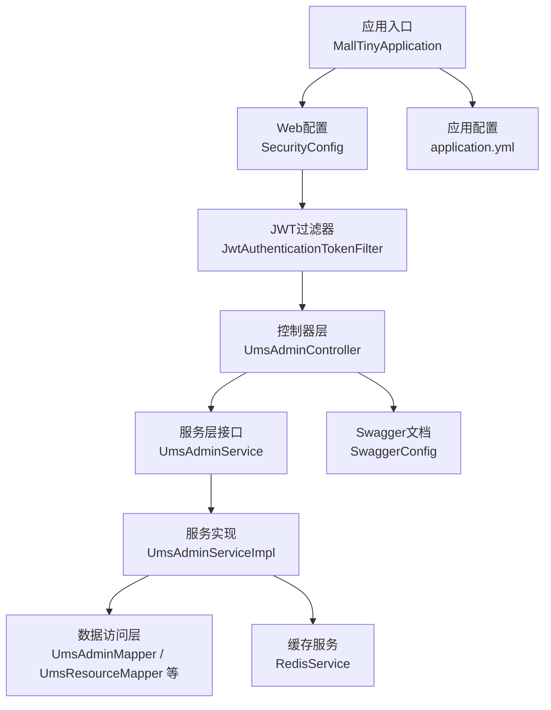
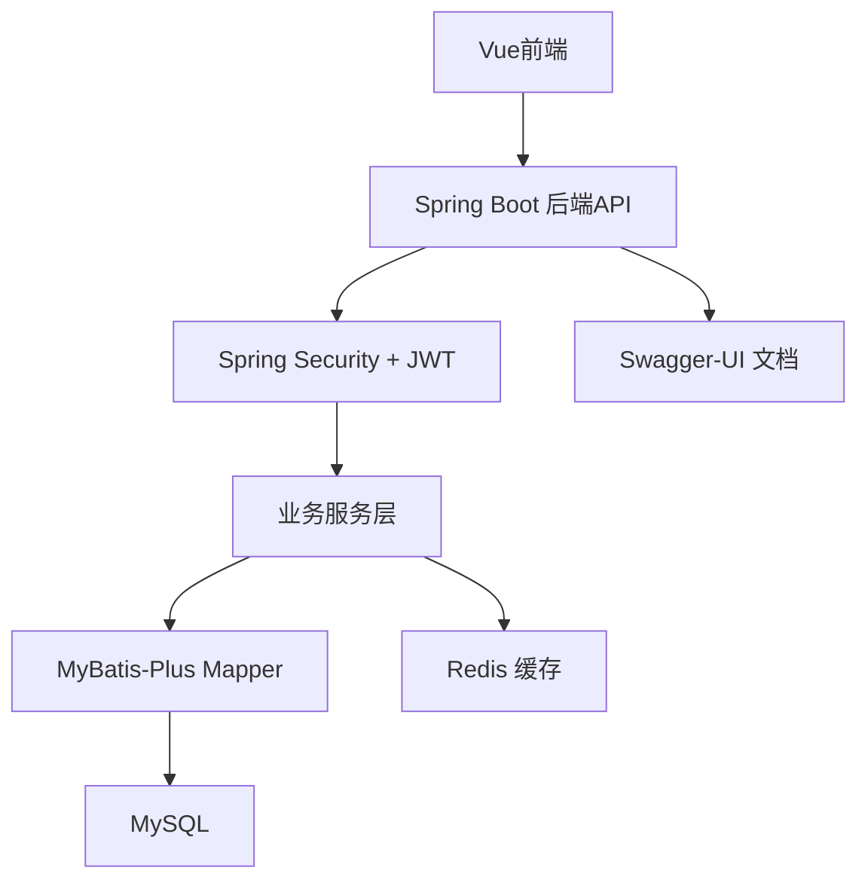
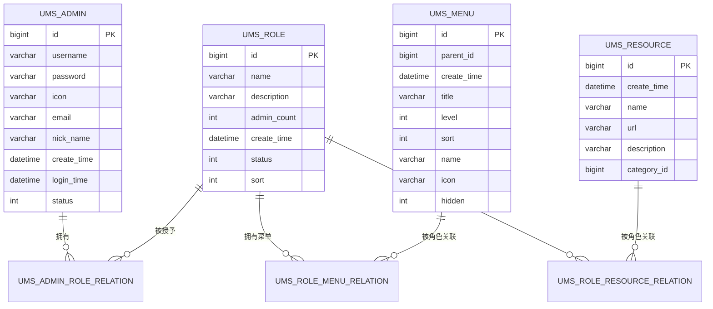
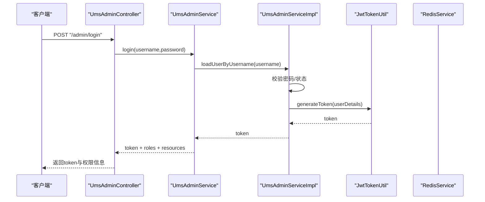
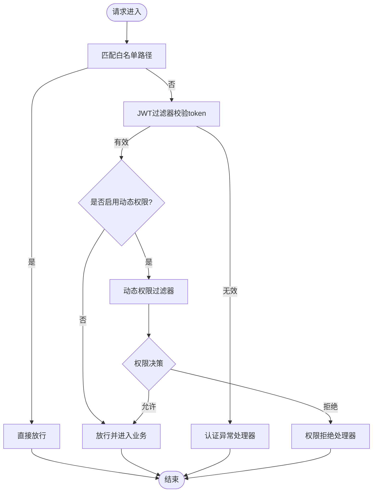
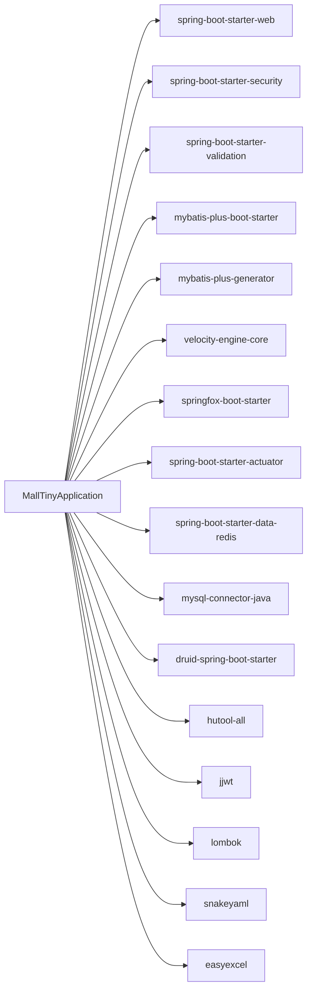

# 项目概述

<cite>
**本文引用的文件**
- [README.md](file://README.md)
- [pom.xml](file://pom.xml)
- [MallTinyApplication.java](file://src/main/java/com/macro/mall/tiny/MallTinyApplication.java)
- [application.yml](file://src/main/resources/application.yml)
- [SecurityConfig.java](file://src/main/java/com/macro/mall/tiny/security/config/SecurityConfig.java)
- [JwtTokenUtil.java](file://src/main/java/com/macro/mall/tiny/security/util/JwtTokenUtil.java)
- [UmsAdminController.java](file://src/main/java/com/macro/mall/tiny/modules/ums/controller/UmsAdminController.java)
- [UmsAdminService.java](file://src/main/java/com/macro/mall/tiny/modules/ums/service/UmsAdminService.java)
- [UmsAdminServiceImpl.java](file://src/main/java/com/macro/mall/tiny/modules/ums/service/impl/UmsAdminServiceImpl.java)
- [UmsAdmin.java](file://src/main/java/com/macro/mall/tiny/modules/ums/model/UmsAdmin.java)
- [UmsRole.java](file://src/main/java/com/macro/mall/tiny/modules/ums/model/UmsRole.java)
- [UmsResource.java](file://src/main/java/com/macro/mall/tiny/modules/ums/model/UmsResource.java)
- [mall_tiny.sql](file://sql/mall_tiny.sql)
</cite>

## 目录
1. [简介](#简介)
2. [项目结构](#项目结构)
3. [核心组件](#核心组件)
4. [架构总览](#架构总览)
5. [详细组件分析](#详细组件分析)
6. [依赖分析](#依赖分析)
7. [性能考虑](#性能考虑)
8. [故障排查指南](#故障排查指南)
9. [结论](#结论)
10. [附录](#附录)

## 简介
Mall-Tiny 是一款基于 Spring Boot + MyBatis-Plus 的快速开发脚手架，专注于“轻量、开箱即用”的权限管理能力与前后端分离架构。它提供完整的后台用户、角色、菜单与资源权限体系，并通过 JWT 实现无状态认证，配合 Swagger-UI 提供交互式接口文档。项目强调：
- 快速落地：仅保留权限管理相关核心表，便于二次定制与扩展
- 易用性强：内置代码生成器、统一响应封装、全局异常处理、Bean 校验等
- 前后端分离：后端提供 RESTful 接口，可无缝对接 Vue 前端项目
- 可运维：集成 Actuator、Druid、Redis、Docker 等，便于本地与生产部署

官方演示与配套教程见 README 中的在线地址与学习资源。

**章节来源**
- [README.md:18-276](file://README.md#L18-L276)

## 项目结构
项目采用按领域分层与模块化的组织方式，核心目录与职责如下：
- common：通用结果封装、全局异常、配置、工具服务
- config：Spring Boot 配置类（Web、MyBatis、Redis、Swagger、CORS）
- security：Spring Security + JWT + 动态权限过滤链路
- modules/ums：权限管理模块（用户、角色、菜单、资源、导入导出等）
- resources：配置文件、MyBatis Mapper XML、代码生成器模板
- sql：初始化数据库脚本（权限相关表）

**图表来源**
- [MallTinyApplication.java:1-14](file://src/main/java/com/macro/mall/tiny/MallTinyApplication.java#L1-L14)
- [SecurityConfig.java:1-86](file://src/main/java/com/macro/mall/tiny/security/config/SecurityConfig.java#L1-L86)
- [UmsAdminController.java:1-350](file://src/main/java/com/macro/mall/tiny/modules/ums/controller/UmsAdminController.java#L1-L350)
- [UmsAdminService.java:1-90](file://src/main/java/com/macro/mall/tiny/modules/ums/service/UmsAdminService.java#L1-L90)
- [UmsAdminServiceImpl.java:1-272](file://src/main/java/com/macro/mall/tiny/modules/ums/service/impl/UmsAdminServiceImpl.java#L1-L272)
- [application.yml:1-57](file://src/main/resources/application.yml#L1-L57)

**章节来源**
- [README.md:59-114](file://README.md#L59-L114)

## 核心组件
- 应用入口与启动
  - 通过标准 Spring Boot 启动类加载自动配置，暴露 Web、Security、MyBatis、Redis、Swagger 等能力
- 安全与认证
  - 基于 Spring Security 的无状态过滤链，结合 JWT 实现登录签发、刷新与接口鉴权
  - 白名单路径免鉴权，动态权限过滤器支持运行时权限变更
- 权限模型
  - 用户-角色-资源（URL 模式）三层映射，支持菜单树形展示与资源权限控制
- 统一响应与异常
  - 统一结果包装、分页封装、全局异常处理，降低前端适配成本
- 开发效率
  - MyBatis-Plus 代码生成器一键生成 CRUD 代码，减少样板代码
  - Bean 校验注解与 Swagger 文档自动生成，提升开发体验

**章节来源**
- [SecurityConfig.java:1-86](file://src/main/java/com/macro/mall/tiny/security/config/SecurityConfig.java#L1-L86)
- [JwtTokenUtil.java:1-171](file://src/main/java/com/macro/mall/tiny/security/util/JwtTokenUtil.java#L1-L171)
- [UmsAdminController.java:1-350](file://src/main/java/com/macro/mall/tiny/modules/ums/controller/UmsAdminController.java#L1-L350)
- [UmsAdminService.java:1-90](file://src/main/java/com/macro/mall/tiny/modules/ums/service/UmsAdminService.java#L1-L90)
- [UmsAdminServiceImpl.java:1-272](file://src/main/java/com/macro/mall/tiny/modules/ums/service/impl/UmsAdminServiceImpl.java#L1-L272)
- [application.yml:1-57](file://src/main/resources/application.yml#L1-L57)

## 架构总览
Mall-Tiny 采用经典的分层架构与前后端分离设计：
- 前端：Vue 前端项目（mall-admin-web），通过 REST 接口与后端交互
- 后端：Spring Boot + Spring Security + JWT + MyBatis-Plus + Redis
- 数据层：MySQL + Redis（用户与资源权限缓存）
- 运维：Docker 容器化部署，Actuator 健康监控，Druid 数据源监控

**图表来源**
- [README.md:22-276](file://README.md#L22-L276)
- [SecurityConfig.java:1-86](file://src/main/java/com/macro/mall/tiny/security/config/SecurityConfig.java#L1-L86)
- [application.yml:1-57](file://src/main/resources/application.yml#L1-L57)

## 详细组件分析

### 权限模型与数据流
Mall-Tiny 的权限模型围绕用户、角色、资源三元组展开，配合菜单树与资源 URL 模式实现细粒度控制。登录成功后，后端返回 token 与用户可访问资源列表，前端据此决定菜单与按钮可见性。

**图表来源**
- [mall_tiny.sql:19-362](file://sql/mall_tiny.sql#L19-L362)

**章节来源**
- [mall_tiny.sql:19-362](file://sql/mall_tiny.sql#L19-L362)

### 登录与令牌发放流程
用户登录成功后，后端生成 JWT 并返回 token 与用户角色、资源权限列表，前端将 token 写入请求头以访问受保护接口。

**图表来源**
- [UmsAdminController.java:166-196](file://src/main/java/com/macro/mall/tiny/modules/ums/controller/UmsAdminController.java#L166-L196)
- [UmsAdminServiceImpl.java:98-119](file://src/main/java/com/macro/mall/tiny/modules/ums/service/impl/UmsAdminServiceImpl.java#L98-L119)
- [JwtTokenUtil.java:117-122](file://src/main/java/com/macro/mall/tiny/security/util/JwtTokenUtil.java#L117-L122)

**章节来源**
- [UmsAdminController.java:166-196](file://src/main/java/com/macro/mall/tiny/modules/ums/controller/UmsAdminController.java#L166-L196)
- [UmsAdminServiceImpl.java:98-119](file://src/main/java/com/macro/mall/tiny/modules/ums/service/impl/UmsAdminServiceImpl.java#L98-L119)
- [JwtTokenUtil.java:117-122](file://src/main/java/com/macro/mall/tiny/security/util/JwtTokenUtil.java#L117-L122)

### 动态权限与过滤链
后端通过 Spring Security 的过滤链实现无状态认证与动态权限决策。白名单路径免鉴权，其余请求需携带 JWT；若启用动态权限，会在授权阶段加入动态权限过滤器。

**图表来源**
- [SecurityConfig.java:46-84](file://src/main/java/com/macro/mall/tiny/security/config/SecurityConfig.java#L46-L84)
- [application.yml:38-57](file://src/main/resources/application.yml#L38-L57)

**章节来源**
- [SecurityConfig.java:46-84](file://src/main/java/com/macro/mall/tiny/security/config/SecurityConfig.java#L46-L84)
- [application.yml:38-57](file://src/main/resources/application.yml#L38-L57)

### 代码生成器与开发规范
- 通过 MyBatis-Plus Generator 一键生成 controller、service、mapper、model、mapper.xml
- 支持单表与模块批量生成，生成后的代码遵循统一命名与注释规范，便于维护
- 业务开发遵循“单表查询用 MP 增强、多表查询手写 XML”的原则，兼顾简洁与灵活性

**章节来源**
- [README.md:120-143](file://README.md#L120-L143)

## 依赖分析
Mall-Tiny 的核心依赖包括：
- Web 与安全：spring-boot-starter-web、spring-boot-starter-security、spring-boot-starter-validation
- ORM 与代码生成：mybatis-plus-boot-starter、mybatis-plus-generator、velocity-engine-core
- 文档与监控：springfox-boot-starter、spring-boot-starter-actuator
- 缓存与数据库：spring-boot-starter-data-redis、mysql-connector-java、druid-spring-boot-starter
- 工具与 JWT：hutool、jjwt、lombok、snakeyaml、easyexcel

**图表来源**
- [pom.xml:34-152](file://pom.xml#L34-L152)

**章节来源**
- [pom.xml:34-152](file://pom.xml#L34-L152)

## 性能考虑
- 无状态认证：JWT 使服务端无需维护会话，降低横向扩展复杂度
- 缓存策略：用户与资源权限列表缓存至 Redis，减少数据库压力
- 分页与懒加载：MyBatis-Plus 原生分页，避免一次性加载大结果集
- 资源最小化：仅保留权限相关表，降低初始化与迁移成本
- Docker 化：容器化部署便于弹性伸缩与资源隔离

[本节为通用建议，不直接分析具体文件]

## 故障排查指南
- 登录失败
  - 检查用户名是否存在、密码是否正确、账户是否启用
  - 查看登录日志与异常处理返回信息
- 403/401 认证失败
  - 确认请求头是否携带正确的 token（含前缀）
  - 检查白名单配置与动态权限过滤器是否生效
- 跨域与静态资源
  - 确认 CORS 与静态资源放行路径配置
- Swagger 文档
  - 访问 /swagger-ui/ 查看接口定义与调试
- 缓存一致性
  - 更换角色或权限后，清理相关缓存键，确保权限即时生效

**章节来源**
- [UmsAdminController.java:166-196](file://src/main/java/com/macro/mall/tiny/modules/ums/controller/UmsAdminController.java#L166-L196)
- [application.yml:38-57](file://src/main/resources/application.yml#L38-L57)

## 结论
Mall-Tiny 将 Spring Boot、MyBatis-Plus、Spring Security、JWT、Redis 等技术栈有机整合，形成一套“轻量、易用、可扩展”的权限管理脚手架。它既适合初学者快速上手，也满足经验开发者对定制化与运维的要求。配合 Vue 前端项目，可实现“后端接口 + 前端页面”的一体化交付。

[本节为总结性内容，不直接分析具体文件]

## 附录
- 在线演示与教程
  - 在线访问地址：https://www.macrozheng.com/admin/index.html
  - 学习教程：《mall学习教程》
  - 视频教程：《mall视频教程》
  - 微服务版本：mall-swarm（Spring Cloud + Alibaba）
  - SpringBoot 3.x 分支：支持 SpringBoot 3.x + JDK 17
- 快速开始
  - 环境：安装 MySQL 与 Redis，导入 mall_tiny.sql
  - 运行：启动 MallTinyApplication.main
  - 文档：访问 http://localhost:8080/swagger-ui/
  - Docker：参考 README 的部署命令与说明

**章节来源**
- [README.md:10-16](file://README.md#L10-L16)
- [README.md:55-58](file://README.md#L55-L58)
- [README.md:116-119](file://README.md#L116-L119)
- [README.md:282-296](file://README.md#L282-L296)